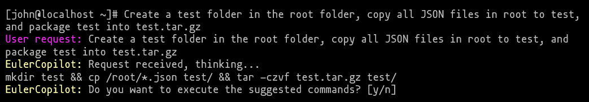
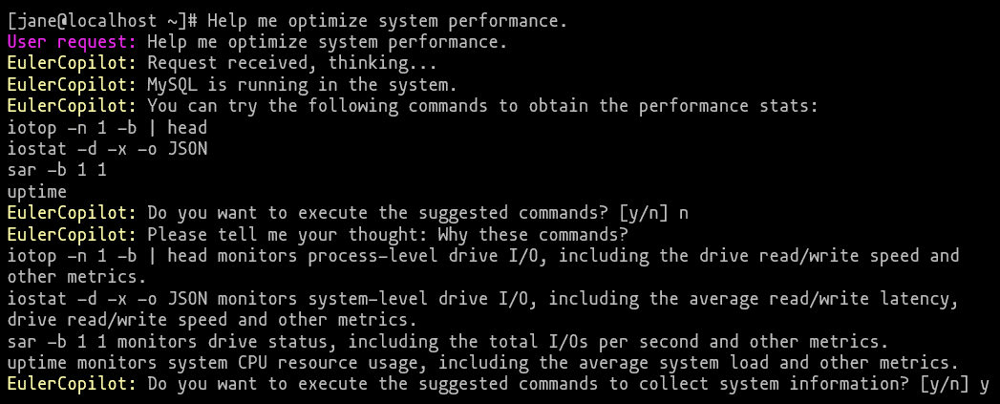

The journey into the world of open source operating systems (OSs) can be daunting for both beginners and seasoned veterans alike. However, the integration of large language models (LLMs) opens new avenues for efficient learning and problem solving.
EulerCopilot is such an AI tool that leverages LLMs to make openEuler an AI-powered OS and offers a wealth of capabilities that can revolutionize how you interact with and manage your openEuler environment.

If you are new to Linux, you can use EulerCopilot as a knowledge repository to obtain explanations and tutorials on various Linux concepts, commands, and utilities. Ask questions in natural language, and then you will receive clear, understandable responses. This accessibility fosters a conducive learning environment, helping you grasp fundamental concepts and build a solid foundation.

EulerCopilot also aids in troubleshooting common issues encountered by Linux beginners. Whether it's resolving package installation errors, navigating file system permissions, or exploring advanced commands, you can seek guidance from EulerCopilot to diagnose and address issues. This real-time assistance alleviates frustration and empowers beginners to overcome obstacles independently.

For system administrators, EulerCopilot is an invaluable asset for operation and maintenance (O&M). Here's how EulerCopilot can assist in your O&M duties:

-	Troubleshooting and issue resolution: EulerCopilot excels at providing explanations and solutions to technical issues. You can leverage EulerCopilot to diagnose problems, interpret error messages, and identify root causes quickly. By inputting relevant details, you can receive guidance on resolving issues, minimizing downtime, and maintaining system reliability.

-	Configuration management: EulerCopilot streamlines configuration tasks by offering insights and recommendations on system settings, optimizations, and best practices. Whether it's fine-tuning network configurations, optimizing performance parameters, or securing system permissions, you can consult EulerCopilot to ensure proper configuration management, for enhanced system stability and security.

-	Automation and scripting: EulerCopilot empowers you to automate routine tasks and streamlines workflows through natural language scripting. You can generate complex scripts, automate backup schedules, schedule maintenance tasks, and orchestrate deployment processes with ease. This not only saves time but also reduces manual errors, improving the overall operational efficiency.

-	Performance monitoring and optimization: EulerCopilot offers guidance on performance monitoring tools, techniques, and optimization strategies. You can utilize EulerCopilot to interpret performance metrics, identify performance bottlenecks, and implement optimization measures to enhance system performance and scalability.

In essence, EulerCopilot plays a pivotal role in supporting both beginners and veterans in navigating the complexities of the Linux environment. Whether it's learning the ropes or managing complex infrastructures, EulerCopilot serves as a versatile tool that augments your capabilities. As the EulerCopilot project evolves, the integration of EulerCopilot will undoubtedly continue to shape the future of openEuler, empowering users of all skill levels to achieve their goals with efficiency and proficiency.

EulerCopilot is planned to be released with openEuler 24.03 LTS. Stay tuned!

[https://www.openeuler.org/](https://www.openeuler.org/)
