## 1. Preparations

Download the ISO image from the openEuler official website at [https://repo.openeuler.org/openEuler-22.03-LTS/ISO/x86_64/](https://repo.openeuler.org/openEuler-22.03-LTS/ISO/x86_64/). To quickly download and install the software, select the 3.4 GB `openEuler-22.03-LTS-x86_64-dvd.iso`. After the download is complete, use the UltraISO tool to make a bootable USB flash drive. After the drive is created, view and record its label name, which will be used during the installation. Before the installation, click and download `openEuler-22.03-LTS-everything-x86_64-dvd.iso`, which will be used when you set up the local yum source after the system is installed.

The two different ISO files have been both strictly tested by the openEuler community. The difference is that the **everything** ISO file contains all software packages released by the openEuler community, while the basic ISO file contains only common software packages and the software packages required by the OS. The **everything** package is too large. As a result, it takes a long time and requires more disk space to create and install the installation package. However, you do not need to install all software packages in the **everything** package. Therefore, you only need to install the basic package and make the **everything** package as a local yum source for installation.

## 2. Installation and Configuration

### 2.1 Local Installation

After the preparations are complete, start the installation. Insert the USB flash drive to your PC and press the power button to power on the PC. During the startup, press **F10** to enter the BIOS program if you use an HP laptop (the key may vary for computers of other brands). Change the boot option of the system to the USB flash drive. Save the settings and continue the installation. The GRUB installation wizard page is displayed, as shown in the following figure.

  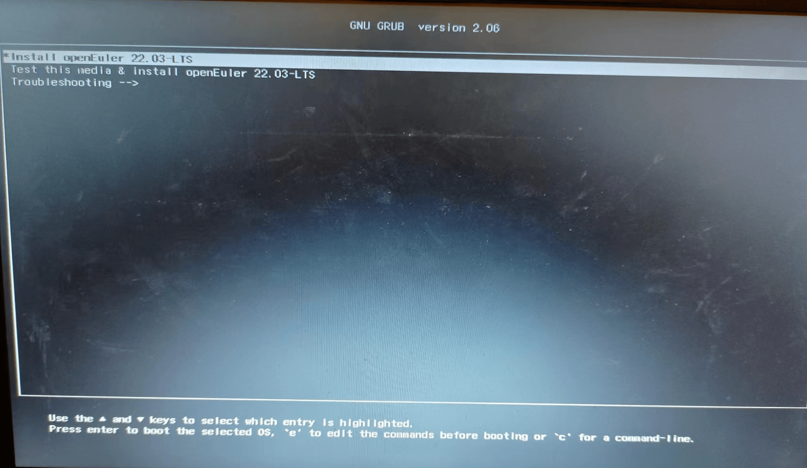

As shown in the following figure, you can press **Enter** to start the self-check program or press **e** to edit the boot command. Due to the problem described in section 3.1, press **e** to edit the boot command.

  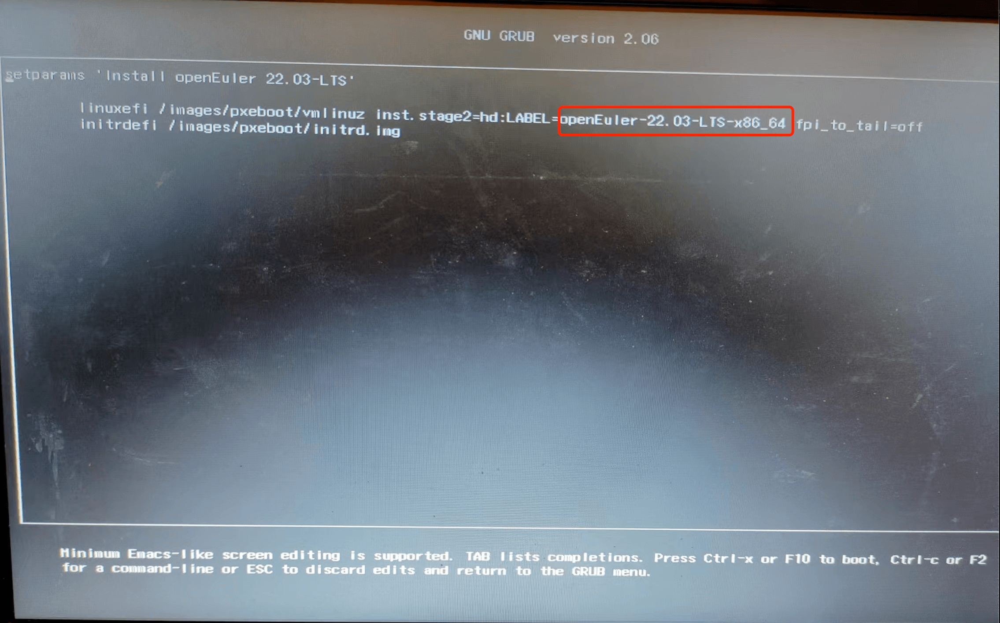
  Change the name in the red box to the name of the USB flash drive. After the modification, press **F10** to start the installation program. After the program is started successfully, the installation interface is displayed.

  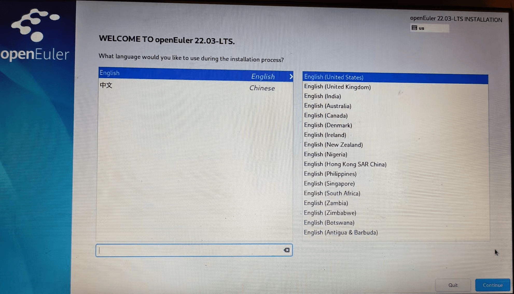

Click **Continue**. The **INSTALLATION SUMMARY** page is displayed.

  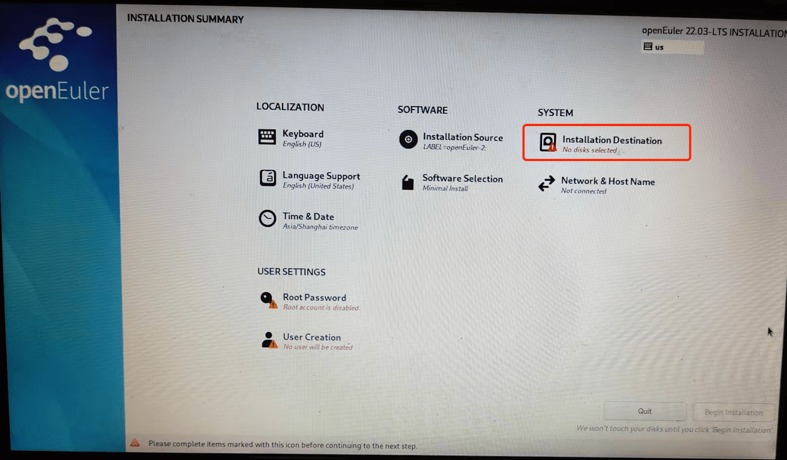

Click **Installation Destination** with a red exclamation mark to partition the system disk.

 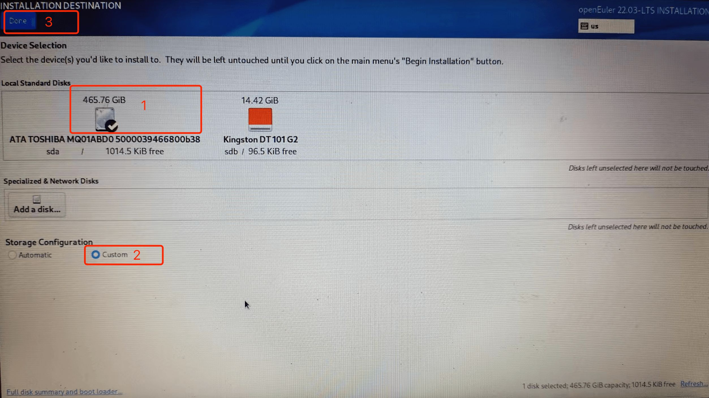

The disk circled in red box 1 is the computer disk, and the bootable USB flash drive is on the right. Select the computer disk, select **Custom**, and click **Done** in the upper left corner to enter the custom configuration page.

  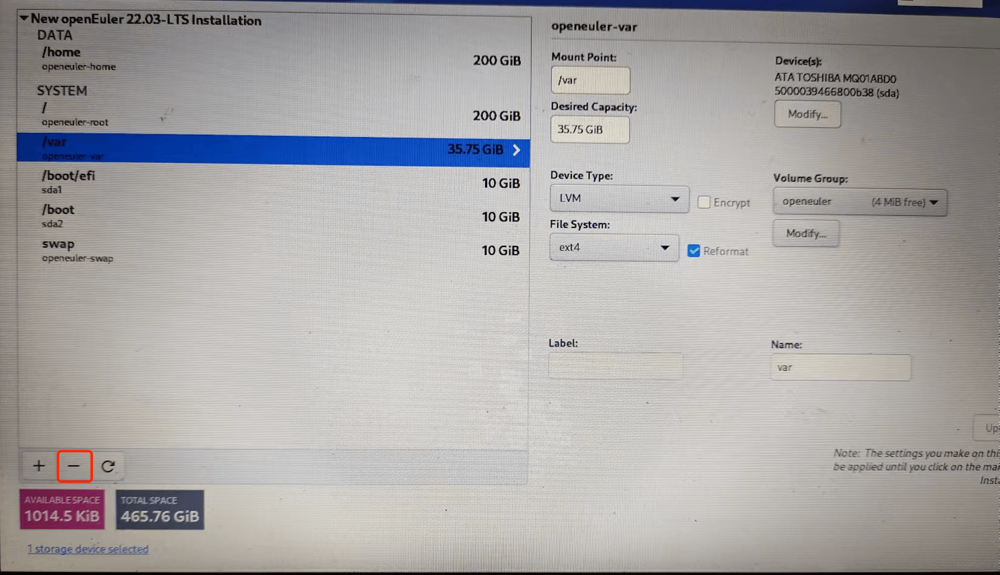  

 Because the computer disk has no free space and there is no useful data on the disk, delete all partitions and format the disk. To delete all existing disks, click **-**. The following figure is displayed after all partitions are deleted.

  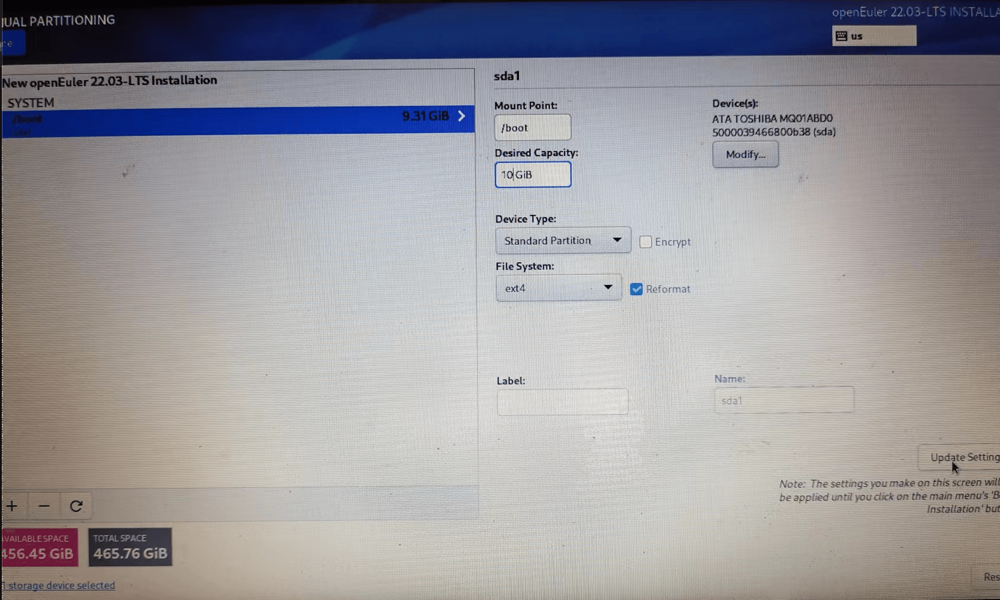

To create a disk partition click **+**.

  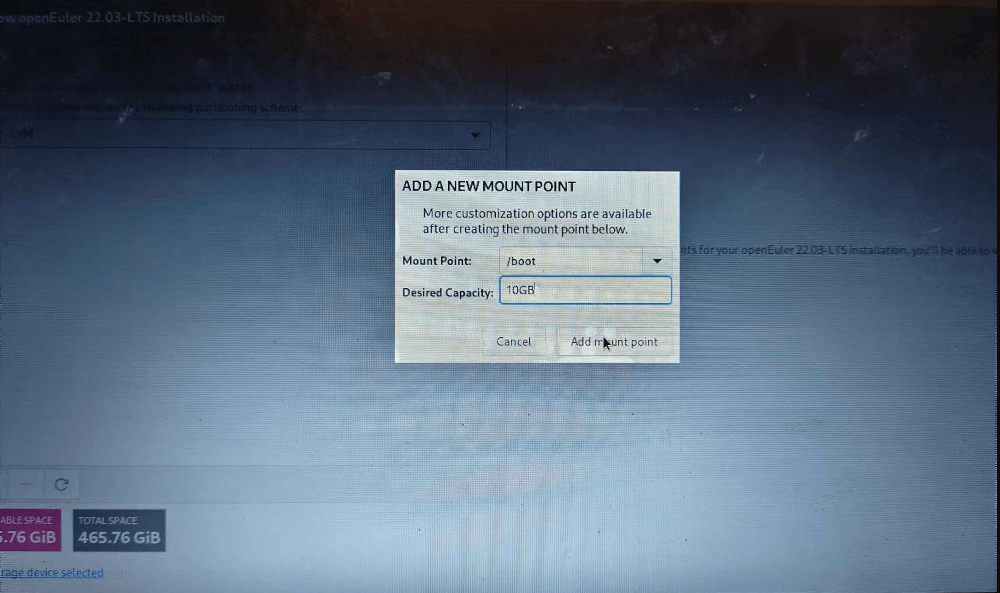

Set the capacity of the partition and select the mount point. Note that the mount points of the **/boot** and **/boot/efi** partitions must be set, and the device type must be set to the default value **Standard Partition**. Otherwise, the installation and boot will fail. You are advised to set mount points for all options provided in the selection box.

  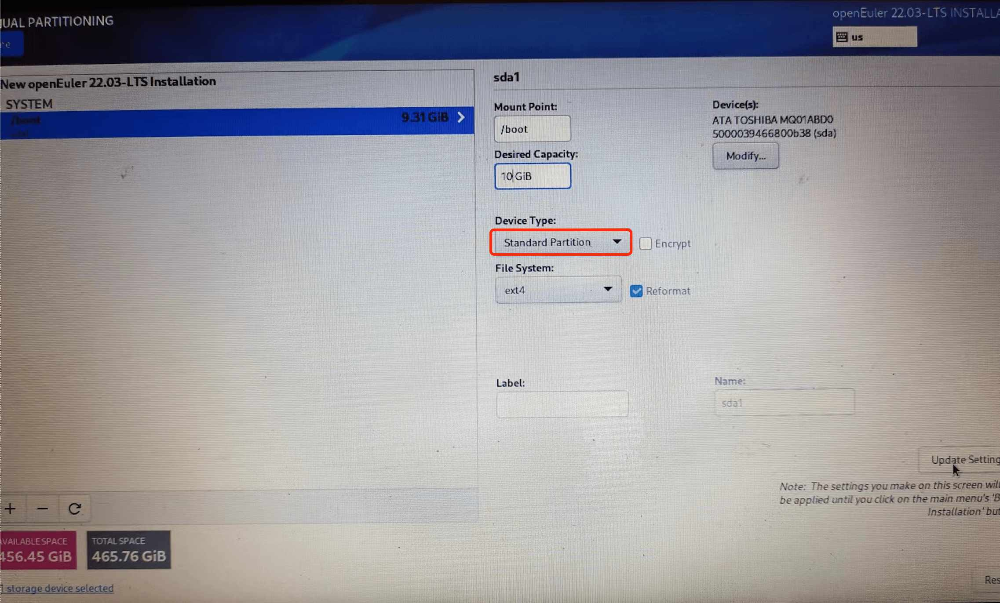  

  After all partition mount points are set, click **Done** in the upper left corner. The partition statistics list is displayed, as shown in the following figure. Click **Accept Changes**.

  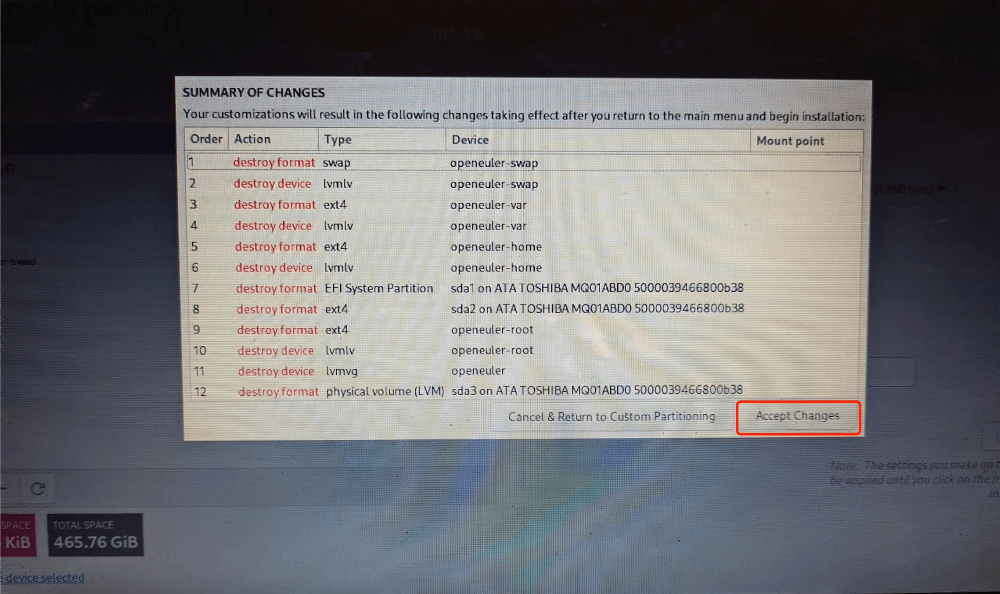

The **INSTALLATION SUMMARY** page is displayed. Click **Root Password** in the **User Settings** area to set the password of the **root** user.

  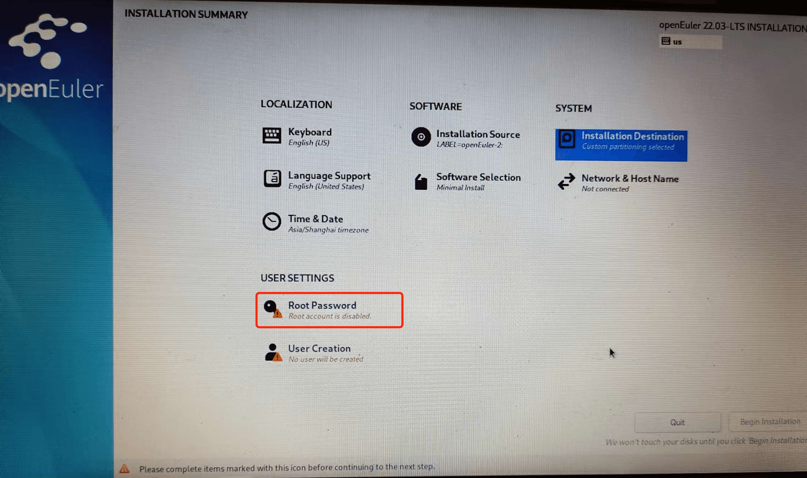

  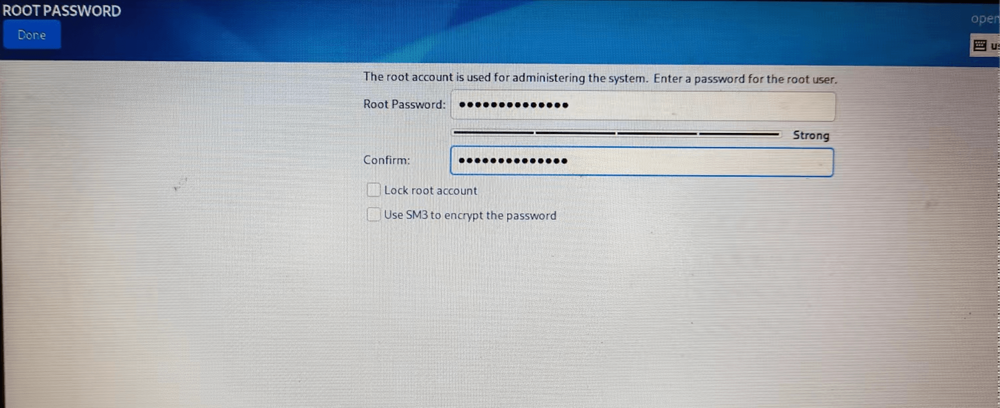

After setting the password, click **Done** in the upper left corner to return to the **INSTALLATION SUMMARY** page. Click **Begin Installation** in the lower right corner to start the installation.

  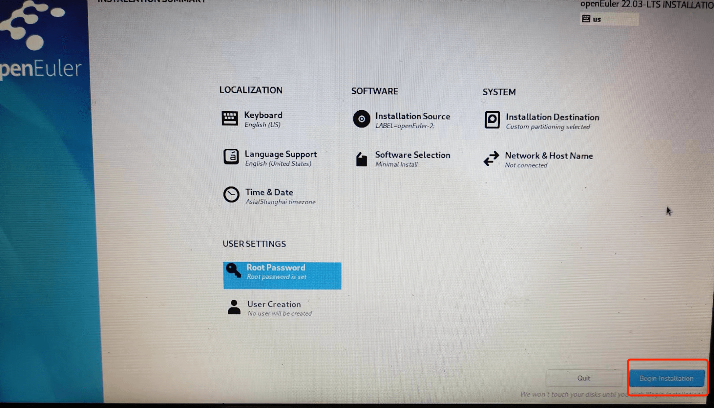

After the installation is complete. Click **Reboot System** in the lower right corner to reboot the system.

  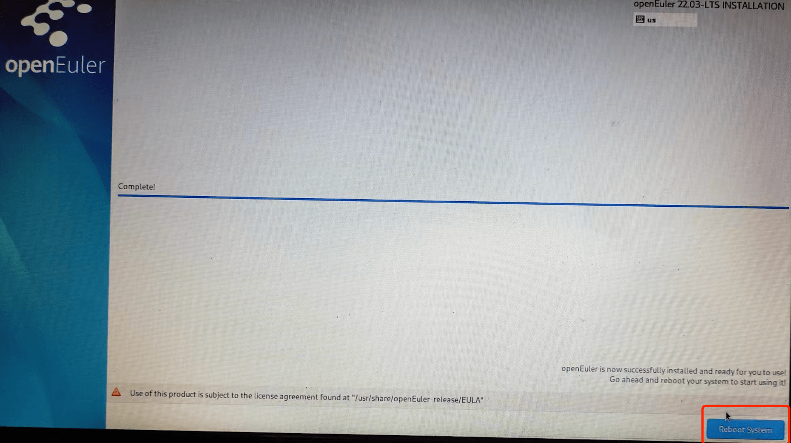

Note: Remove the USB flash drive before the reboot, or press **F10** to enter the BIOS and change the boot sequence during the reboot. Otherwise, the installation program will be displayed again after the reboot.

### 2. Local Yum Source Configuration

(1) Copy the `openEuler-22.03-LTS-everything-x86_64-dvd.iso` file to the **/root** directory and run the following command to mount the file:

```shell
  mount /root/openEuler-22.03-LTS-everything-x86_64-dvd.iso /mnt
```

(2) Go to the `/etc/yum.repos.d` directory, back up the `openEuler.repo` file, and modify the file as follows:

```shell
  [base]
  name=openEuler
  baseurl=file:///mnt
  enabled=1
  gpgcheck=0
```

  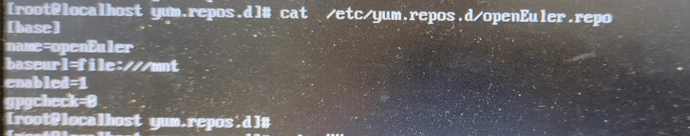

The local source of yum is configured. You can run the `dnf install` command to install the software package.

### 2.3 Installation GUI

The official repository of openEuler provides the Gnome desktop environment. After configuring the local yum by referring to section 2.2, run the following command to install the Gnome desktop environment:

```shell
  dnf install gnome-shell gdm gnome-session
```

Configure the GDM to automatically start upon system startup.

```shell
  systemctl enable gdm.service
  systemctl set-default graphical.target

```

After the installation and configuration are complete, restart the system to enter the desktop environment. The following figure shows the login window of the Gnome desktop environment.

  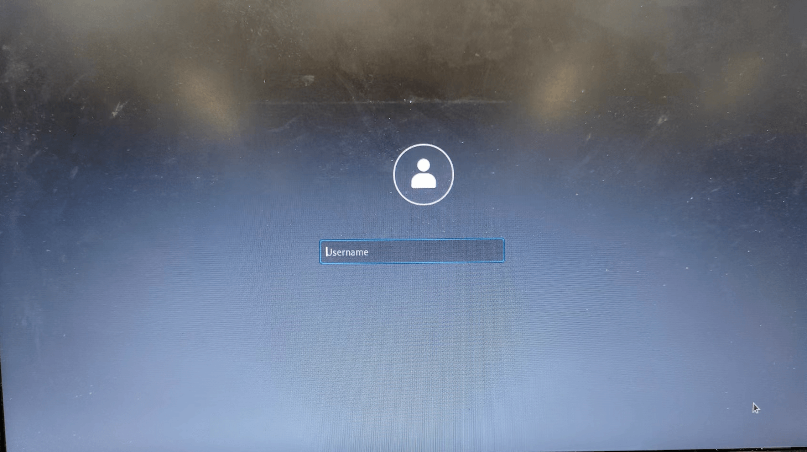  

  Enter the user name and password. The Gnome desktop is displayed, as shown in the following figure. 

  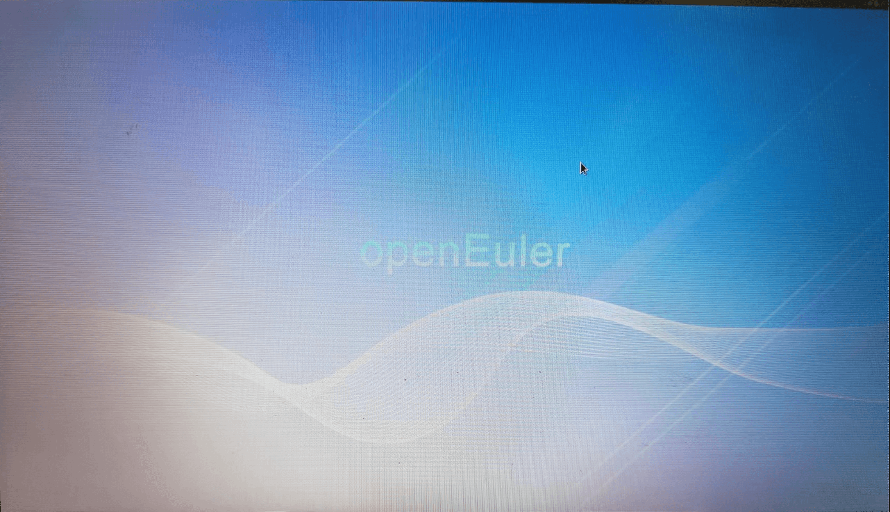

## 3. Issues

**Issue 1: The installation program fails to be started, and the error message "Failed to start Switch Root. /dev/root does not exist." is displayed.**

  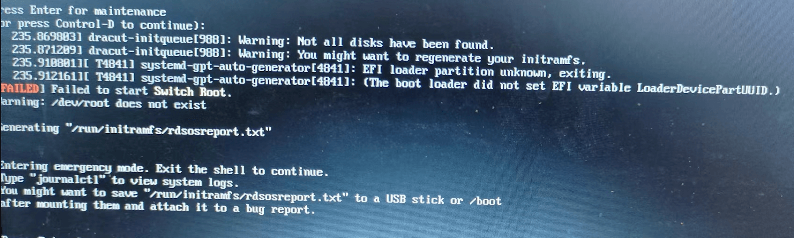

The Windows OS restricts the label length of the USB flash drive. If the label name of the USB flash drive is different from the label name in the boot command, resources cannot be found during the installation from the USB flash drive. 
 Before the installation, modify the installation command and change the boot label to the label name of the USB flash drive. For details, see the beginning of the installation procedure.

**Issue 2: The Wi-Fi driver is missing. As a result, the Wi-Fi connection fails.** 
 After the installation is complete, the Wi-Fi cannot be connected. After the **nmcli dev wifi list** command is executed, the command output shows no Wi-Fi. After the **nmcli dev show** command is executed, the command output shows that the wlo1 status is unavailable, as shown in the following figure. According to the output of the **lscpi** command, the wireless network adapter is Ralink 5390. It is suspected that the driver of the wireless network adapter is missing.
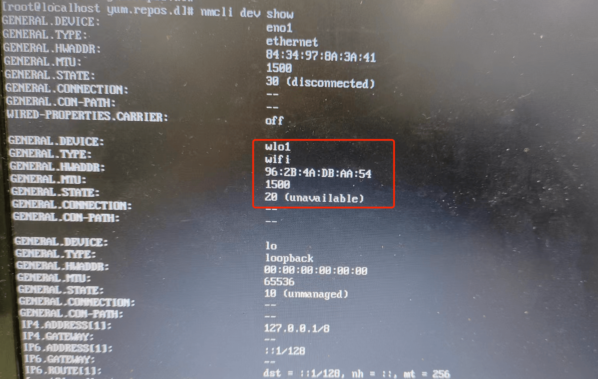

## References

[https://zhuanlan.zhihu.com/p/438277685](https://zhuanlan.zhihu.com/p/438277685)