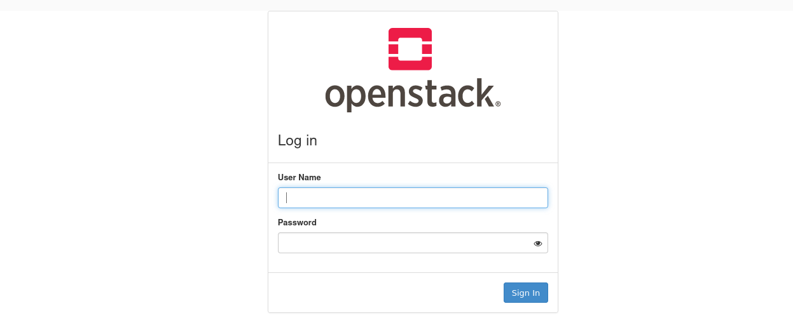
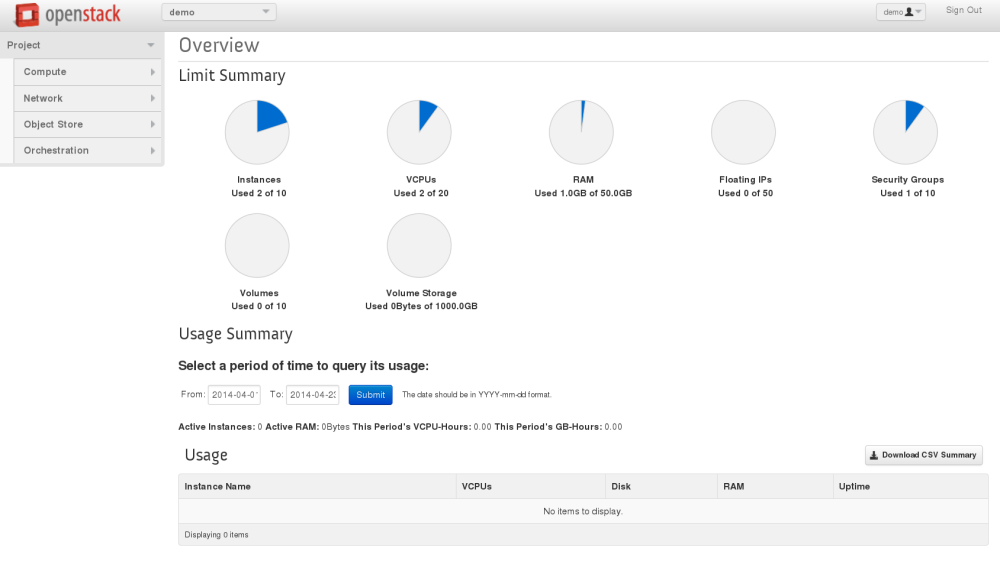

## Overview

In March 2022, with the joint efforts of Kylinsoft and the openEuler community, NestOS, the cloud-based OS that supports both the x86_64 and AArch64 architectures, was first officially released. This article takes the containerized deployment of OpenStack as an example to elucidate the utilization of NestOS and its similarities and differences with commonly used general-purpose operating systems.

## Overall Solution

This solution uses libvirt to create a cluster consisting of NestOS virtualization instances, and Kolla Ansible to complete the containerized deployment of OpenStack. Any host that can run Kolla Ansible can be used as the deployment node. But you are not advised to use NestOS as the deployment node. In this solution, openEuler 21.09 is the deployment node, while NestOS serves as the control, compute, and storage node and  the operating environment of the OpenStack cluster. To simplify the description, the following configures a NestOS instance as an example. You can configure more NestOS instances as needed.

To learn more information about NestOS, see [NestOS User Guide](https://docs.openeuler.org/en/docs/22.03_LTS/docs/KubeOS/kubeos-user-guide.html).

Deployment environment

- Deployment node OS: openEuler 21.09

- NestOS: nestos-22.03.20220329-qemu.x86_64.qcow2

- OpenStack: Wallaby

- Kolla Ansible: 12.0.0

Precautions

- The CPU, memory, and drive capacity must be as large as possible. The recommended configurations are 4 cores, 8 GB, and 40 GB. If the local storage scheme (such as LVM) is used, two drives are recommended.

- You are advised to use two NICs. NIC 1 is used for SSH connection and access to external network. NIC 2 is used for the Neutron external (or public) network, which can be VLAN or flat, depending on the network creation mode. NICs must be active when there is no IP address. Otherwise, the instance cannot access external networks.

## Creating and Configuring a NestOS Instance

### Preparing the ignition file

To deploy NestOS, you need an ignition file that mainly contains two parts: OS basic configuration and initialized OpenStack deployment environment.

| Part                                         | Configuration        | Description                                                  |
| -------------------------------------------- | -------------------- | ------------------------------------------------------------ |
|                                              | passwd               | Configures the NestOS login user and access authentication information. |
| OS configuration                             | Host name            | Names the host of the NestOS instance.                       |
|                                              | NIC 1                | This NIC is used to deploy, operate, and maintain the NestOS instance and provide the basic network environment. |
|                                              | Time zone            | Configures the default time zone for the NestOS instance.    |
|                                              | Kernel parameters    | Enables required kernel parameters for the OpenStack deployment. |
|                                              | NIC 2                | This NIC is dedicated to Neutron.                            |
| Initialized OpenStack deployment environment | Python               | OpenStack deployment requires support from the Python environment. |
|                                              | SELinux              | SELinux must be disabled for the OpenStack deployment.       |
|                                              | Time synchronization | The OpenStack deployment environment needs to synchronize the cluster time using the chronyd service. |
|                                              | Storage              | Used by OpenStack clusters. Mandatory for the local storage solution. |

The ignition file (in JSON format) is readable but difficult to write. Therefore, you can write a user-friendly .bu file (in YAML format) and then use the Butane tool to convert the file into an ignition file.

If you want to use password authentication to access the NestOS instance when configuring **passwd**, run the following command to generate  **${PASSWORD_HASH}** for the .bu file:

```
openssl passwd -1 -salt yoursalt
```

Add the configurations required for deploying OpenStack to the .bu file based on the information in the preceding table. To obtain the file, visit [NestOS project repository](https://gitee.com/openeuler/NestOS) and obtain the file from **docs/use_sample/OpenStack/**. 

**Note:**

In this configuration file example, the **${VALUE}** field needs to be configured based on the actual deployment.

```

# Valid options are ['centos', 'debian', 'rhel', 'ubuntu']
kolla_base_distro: "centos"
# Valid options are [ binary, source ]
kolla_install_type: "binary"
openstack_release: "wallaby"
kolla_internal_vip_address: "{kolla_internal_vip_address}"
network_interface: "ens2"
api_interface: "{{ network_interface }}"
storage_interface: "{{ network_interface }}"
tunnel_interface: "{{ network_interface }}"
neutron_external_interface: "ens3"
neutron_plugin_agent: "openvswitch"
keepalived_virtual_router_id: "51"
openstack_logging_debug: "True"
enable_glance: "yes"
enable_haproxy: "yes"
enable_keepalived: "{{ enable_haproxy | bool }}"
enable_keystone: "yes"
enable_mariadb: "yes"
enable_memcached: "yes"
enable_neutron: "{{ enable_openstack_core | bool }}"
enable_nova: "{{ enable_openstack_core | bool }}"
enable_rabbitmq: "{{ 'yes' if om_rpc_transport == 'rabbit' or om_notify_transport == 'rabbit' else 'no' }}"
enable_chrony: "yes"
enable_cinder: "yes"
enable_cinder_backup: "yes"
enable_cinder_backend_lvm: "yes"
enable_cloudkitty: "no"
enable_gnocchi: "no"
enable_heat: "{{ enable_openstack_core | bool }}"
enable_horizon: "yes"
enable_horizon: "{{ enable_openstack_core | bool }}"
enable_horizon_blazar: "{{ enable_blazar | bool }}"
enable_horizon_cloudkitty: "{{ enable_cloudkitty | bool }}"
enable_horizon_murano: "{{ enable_murano | bool }}"
enable_horizon_neutron_lbaas: "{{ enable_neutron_lbaas | bool }}"
enable_horizon_sahara: "{{ enable_sahara | bool }}"
enable_horizon_senlin: "{{ enable_senlin | bool }}"
enable_horizon_watcher: "{{ enable_watcher | bool }}"
enable_ironic: "no"
enable_ironic_ipxe: "no"
enable_ironic_neutron_agent: "no"
enable_kafka: "no"
enable_murano: "no"
enable_neutron_lbaas: "yes"
enable_neutron_sriov: "yes"
enable_neutron_qos: "yes"
enable_nova_ssh: "yes"
enable_openvswitch: "{{ enable_neutron | bool and neutron_plugin_agent != 'linuxbridge' }}"
enable_placement: "{{ enable_nova | bool or enable_zun | bool }}"
enable_sahara: "no"
enable_senlin: "no"
enable_swift: "no"
enable_tempest: "no"
enable_watcher: "no"
keystone_token_provider: 'fernet'
keystone_admin_user: "admin"
keystone_admin_project: "admin"
fernet_token_expiry: 86400
glance_backend_file: "yes"
glance_enable_rolling_upgrade: "no"
cinder_volume_group: "cinder-volumes"
cinder_backup_driver: "lvm"
cinder_backup_share: "lvm"
cinder_backup_mount_options_nfs: "lvm"
nova_compute_virt_type: "qemu"
nova_safety_upgrade: "no"
horizon_backend_database: "{{ enable_murano | bool }}"
```

If the initial configuration is complex, compile it into a systemd-hosted service. For example, write kernel parameters into the configuration file and then use the systemd service to apply the parameters.

```

systemd:
  units:
    ## kernel parameters
    - name: set-kernel-para-for-openstack.service
      enabled: true
      contents: |
        [Unit]
        Description= for openstack

        [Service]
        Type=oneshot
        RemainAfterExit=yes
        ExecStart=modprobe br_netfilter
        ExecStart=sysctl -p

        [Install]
        WantedBy=multi-user.target
After the configuration file is compiled, run the following command to convert the .bu file to the ignition file using the Butane tool:

docker run --interactive --rm quay.io/coreos/butane:latest --pretty --strict < nestos.bu > nestos.ign
```

In addition to local use, the ignition file can be provided in HTTP format for remote access during NestOS instance deployment, implementing centralized batch deployment and configuration.

### Using libvirt to create a NestOS instance

After the ignition file is prepared, run the **virt-install** command to create a NestOS instance. In the following command example, the **vcpus**, **ram**, and **disk** parameters are mandatory. For additional requirements, add parameters by referring to the **virt-install** manual. `${IGNITION_FILE_PATH}` is the path of the ignition file, which can be a local path or a remote URL.

**Note:**
The **${VALUE}** field needs to be configured based on the actual deployment.

```
virt-install --name=${NAME} --vcpus=4 --ram=8192 --import --network=bridge=virbr0 --graphics=none --qemu-commandline="-fw_cfg name=opt/com.coreos/config,file=${IGNITION_FILE_PATH}" --disk=size=40,backing_store=${NESTOS_RELEASE_QCOW2_PATH} --network=bridge=virbr1 --disk=size=40
```

You can create more NestOS instances by following the preceding process or deploy NestOS instances on a bare metal server in PXE boot mode.

## Configuring and Deploying OpenStack

The NestOS-based containerized deployment of OpenStack uses the mainstream Kolla Ansible solution. The NestOS instance created based on the preceding steps can be directly used for the Kolla Ansible deployment without additional operations. All commands involved in this section are executed on the deployment node.

### Configuring the basic environment

#### Adding an OpenStack source

The OpenStack is adapted in the openEuler release version. If openEuler serves as the deployment node, install the OpenStack source before installing the OpenStack-related software packages.

```
yum install openstack-release-wallaby
```

#### Installing Kolla and Kolla Ansible

```
Install Kolla and Kolla-ansible
```

### Configuring Ansible

#### Adding an OpenStack source

The OpenStack is compatible with the openEuler release version. If openEuler serves as a deployment node, install the OpenStack source before installing the OpenStack-related software packages.

```
yum install openstack-release-wallaby
```

#### Installing Kolla and Kolla Ansible

```
yum install openstack-kolla openstack-kolla-ansible
```

### Configuring Ansible

Add the following options to the `/etc/ansible/ansible.cfg` Ansible configuration file: 

```
[defaults]
host_key_checking=False
pipelining=True
forks=100
```

### Configuring Kolla Ansible

#### Inventory

Use **Inventory**, an Ansible file, to specify the host and the group to which the host belongs and define the node role and access credential.

Kolla Ansible provides the all-in-one and multinode sample list files. The difference is that the former deploys single-node OpenStack while the latter deploys multiple nodes. The following describes the multinode deployment mode.

1. Edit the node information in the multinode file.

```

[control]
nestos ansible_ssh_user=${USERNAME} ansible_ssh_password=${USERPASSWARD} ansible_become=true

[network]
nestos

[compute]
nestos ansible_ssh_user=${USERNAME} ansible_ssh_password=${USERPASSWARD} ansible_become=true

[monitoring]
nestos

[storage]
nestos

[deployment]
localhost       ansible_connection=local become=true
```

2. Check whether the configuration is correct.

```
ansible -i ./multinode all -m ping
```

#### Kolla passwords

The passwords used during deployment are stored in the **/etc/kolla/passwords.yml** file. Initially, all passwords in the file are blank and must be filled manually or by running a random password generator.

```
kolla-genpwd
```

#### Kolla globals.yml

**globals.yml** is the main configuration file of Kolla Ansible. Currently, the official OpenStack container image does not support openEuler. Therefore, the CentOS container image is used during deployment.

1. Select the image.

```
# Valid options are ['centos', 'debian', 'rhel', 'ubuntu']
kolla_base_distro: "centos"
# Valid options are [ binary, source ]
kolla_install_type: "binary"
# Do not override this unless you know what you are doing.
openstack_release: "wallaby"
```

2. Set the network.

Some network options need to be set for Kolla Ansible.

```
network_interface: "eth0"
neutron_external_interface: "eth1"
kolla_internal_vip_address: "10.1.0.250"
```

3. Enable other services.

By default, Kolla Ansible provides a large number of additional services, which can be enabled as required. For example, to enable the Cinder service, run the following command:

```
enable_cinder: "yes"
```

#### Deploying OpenStack

Kolla Ansible provides a playbook that can be used to install all necessary services of specified versions.

The following uses multinode configuration as an example. To use all-in-one configuration, replace relevant parameters as needed. You can also add the **-vvv** parameter to view the detailed execution logs.

1. Boot services.

```
kolla-ansible -i ./multinode bootstrap-servers
```

2. Check the environment.

```
kolla-ansible -i ./multinode prechecks
```

3. Pull the image.

```
kolla-ansible -i ./multinode pull
```

4. Perform the deployment.

```
kolla-ansible -i ./multinode deploy
```

If the deployment fails, run the following command:

```
kolla-ansible destroy -i ./multinode --yes-i-really-really-mean-it
```

#### Running OpenStack

1. Install the OpenStack CLI client.

```
yum install python3-openstackclient
```

2. Generate the **openrc** file in which the administrator credentials are set.

```
kolla-ansible post-deploy
. /etc/kolla/admin-openrc.sh
```

3. Create an example network and image based on the method of installing Kolla Ansible.

```
kolla-ansible post-deploy
. /etc/kolla/admin-openrc.sh
```

Use the IP address and the horizon account and password provided in the **admin-openrc.sh** file to log in



After the login is successful, the OpenStack WebUI is displayed.



For more details, see the official OpenStack deployment document: <https://docs.openstack.org/kolla-ansible/wallaby/user/quickstart.html>

## Summary

NestOS is a cloud-based OS developed by the CloudNative Sig of the openEuler community. NestOS is designed to run containerized workloads and function as a secure and reliable host for computing clusters. During the first boot, NestOS uses the ignition file to configure the system. NestOS always boots from the same place, regardless of whether it is on the cloud or bare metal, or it is a virtualized instance. The ignition file can also be saved on a server for remote access by NestOS to implement centralized configuration management, which facilitates large-scale cluster deployment.

NestOS is managed as an immutable infrastructure. To update the configuration of an existing machine, replace the machine with a new ignition file instead of modifying **/etc** or using other means. This is similar to the way we manage containers, where container images are not updated in place, but are rebuilt from scratch and redeployed. This approach makes it easy to scale up as the load increases, and simply start other machines with the same ignition configuration.

NestOS is a lightweight and customized OS that can adapt to various infrastructure environments. It integrates the configuration tool ignition with the rpm-ostree, OCI support, and Selinux enhancement technologies, uses the dual-system partition, container technology, and cluster architecture, and equips with mainstream container platforms, such as iSulad, docker, and podman. It overcomes various unreliabilities, such as system content modification by users, dependency of user services on system components, and unstable intermediate states during system software upgrades.

### Future plan

The OpenStack ecosystem of the openEuler community is gradually being enhanced. The Sig-OpenStack is expected to launch OpenStack container images that can be maintained by the openEuler community as soon as possible. In the future, NestOS will work closely with Sig-OpenStack to launch a deployment tool that is more suitable for the NestOS deployment. We will also introduce a customized NestOS version specific to OpenStack scenarios to reduce redundant software packages, the noise of the OS base, and attack surfaces, implementing more convenient and efficient deployment.

### Contact us

You can visit the official repository of the NestOS project at <https://gitee.com/openeuler/NestOS>.

Or contact us through sig-cloudnative and sig-K8sDistro in the openEuler community.
