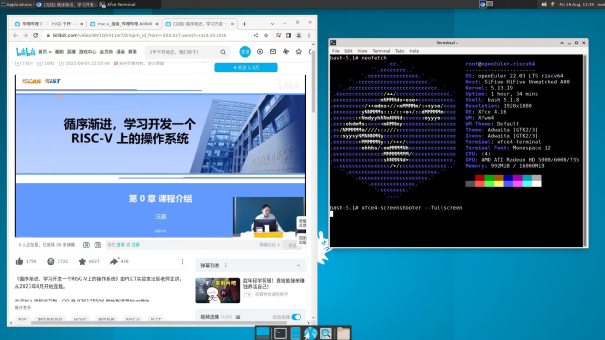
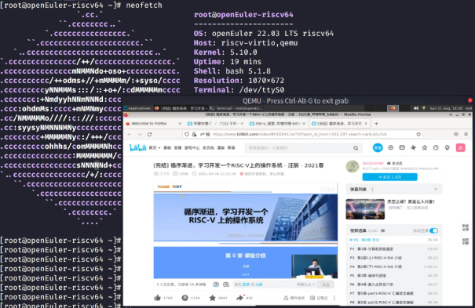
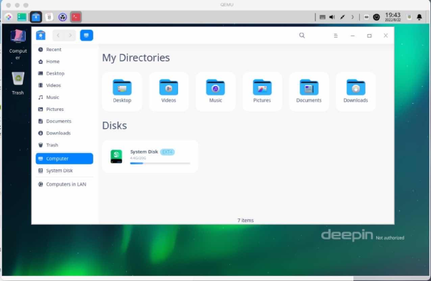
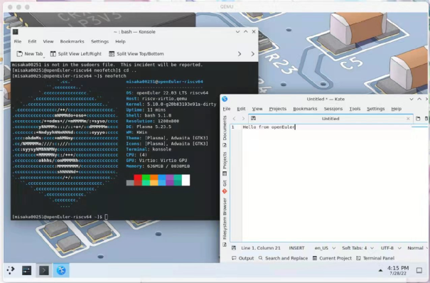
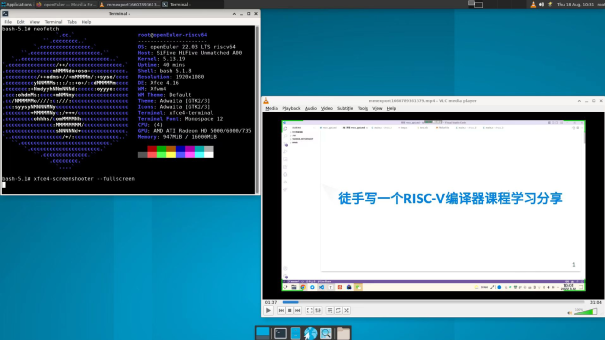
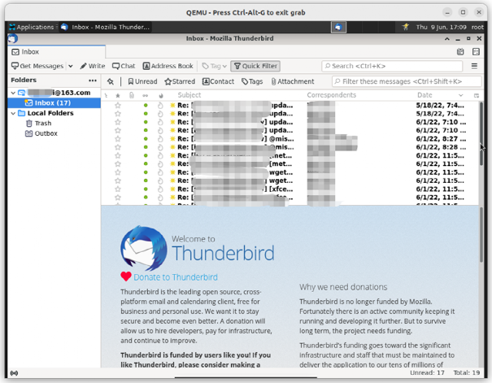

## Overview

RISC-V SIG recently adapted the desktop software Chromium to openEuler RISC-V, marking the second RISC-V distribution to run Chromium after openSUSE. Currently, RISC-V SIG has adapted Chromium and Firefox open source browsers for openEuler RISC-V.  

Additionally, KDE and DDE desktop environments, along with common desktop software like multimedia players and email clients, have been adapted, enhancing the user experience of operating systems.

## Adaptation of Chromium and Firefox

RISC-V SIG adapted Firefox and Chromium browsers in June and August respectively. These browsers now support basic functions like web browsing, login verification, email handling, and video playback, fulfilling essential user needs.  

The openEuler RISC-V supports Chromium 100/103. The current version is Chromium 103, which has been successfully tested on the unmatched XFCE desktop. The cross-version upgrade is made based on the mainline version 87 of openEuler. RISC-V SIG also made optimization and adjustments based on the work of other communities, such as openSUSE and StarFive, and openEuler RISC-V system environment.  

To support openEuler RISC-V, the current version of Chromium optimizes the basic build system and introduces RISC-V implementations in ANGLE, breakpad, dav1d, and FFmpeg modules to ensure stable GUI performance on the RISC-V architecture.

The openEuler RISC-V supports Firefox 97/100. The current version is Firefox 100. RISC-V SIG introduces Arch Linux and Zentinal Firefox packaging and building, enables VA-API A card hardware decoding, and optimizes the level 3 compilation enabled by Rust. Currently, Firefox can run smoothly in main test environments.

## Adaptation of Desktop Environments and Components

In 2021, RISC-V SIG has adapted XFCE desktops. To provide more desktop environment options, DDE and KDE desktops have been adapted recently.  

The DDE is the Uniontech desktop environment. The adaptation of the DDE becomes one of the objectives of RISC-V SIG to complete the personal desktop software. Currently, DDE, QEMU, and VisionFive V1 have been successfully tested in the openEuler RISC-V architecture.

The KDE, maintained by openSUSE, is a feature-rich desktop environment. It has been successfully run on the RISC-V architecture using QEMU, and KDE software like Kate and Konsole has also been tested successfully. However, due to hardware limitations, KDE’s adaptation to Unmatched and VisionFive V1 takes time.

## Adaptation of Desktop Applications

RISC-V SIG has successfully adapted desktop applications like VLC and Thunderbird. For VLC, they enhanced it with packaging and decoding libraries such as libdvbpsi, libmatroska, lirc, and live555, and and added support for opencv4, ensuring stable performance on the openEuler OS.
Thunderbird, based on Firefox adaptation, currently runs in version 97.

RISC-V SIG is adapting more desktop applications. LibreOffice and Eclipse will soon be available. Improvements to the personal desktop software environment are underway, with the RISC-V laptop application environment expected to be ready by year-end.

To ensure the stable running of software such as Chromium and boost openEuler desktop software ecosystem, we invite partners to participate in crowdtesting. Feel free to download and explore the openEuler for RISC-V image, install and verify more common software that is not adapted (not verified) on openEuler. If you’re interested, join Samuel Yuan: <https://gitee.com/samuel_yuan/riscv-openeuler-visionfive&gt.

## Contact Us

 As an important means to improve data center resource utilization, hybrid deployment of online and offline services has attracted attention from academia and industry and has become a hot research field. Meanwhile, it also faces many technical challenges that need to be resolved urgently, such as hybrid deployment of black-box services and heterogeneous resources, and breakthroughs need to be made in fields such as job-aware scheduling, performance interference modeling, and resource isolation and preemption. To achieve the goal of generic hybrid deployment and converged deployment, the node management layer performs performance interference modeling for key services and provides accurate QoS quantitative models to guide real-time interference detection and location, based on interference detection and positioning, more accurate dynamic resource ratio control is implemented, and more accurate and universal dynamic monitoring indicator data is explored to guide application profiling and perception scheduling. These aspects play an important role and are also the focus of subsequent research of Rubik.

 This article briefly describes the vision, objectives, design principles, and features of Rubik. The performance optimization, resource isolation and preemption, and interference detection and control technologies will be described in other articles.

## Join Us

If you are interested in RISC-V, welcome to join the RISC-V SIG communication group to discuss more about RISC-V and contribute to the openEuler & RISC-V ecosystem.

WeChat account of Wu Wei, Institute of Software, Chinese Academy of Sciences. Please add the note "oerv".

## **About the Author**

Yang Yanling, an intern in the PLCT lab of the Institute of Software, Chinese Academy of Sciences, and a member of RISC-V SIG in the openEuler community, is responsible for assisting in the daily operation of RISC-V SIG.

