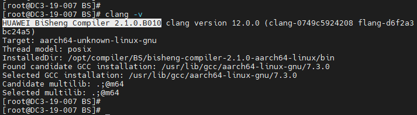

# 1. Introducing to the Software

AutoDock Vina is an open source program for molecular docking. It was designed and implemented by Dr. Oleg Trott at the Molecular Graphics Lab of the Scripps Research Institute. Compared with AutoDock, AutoDock Vina significantly improves accuracy. In addition, AutoDock Vina can use multiple CPUs or CPU cores on a system to significantly reduce running time.

For more information about AutoDock Vina, visit https://vina.scripps.edu/

Programming language: C++

Brief description: an open source molecular simulation software

Open source license: Apache License 2.0

# 2. Introducing to Environment Requirements

## 2.1. Hardware

| Item  | Description               |
| ---- | ----------------- |
| CPU  | Kunpeng 920       |
| Memory| 32 GB 2666 MHz x 16 |
| NIC  | 1 x 10GE           |

## 2.2. Software

| Item           | Version   | Download URL                                                                                |
| ------------- | ----- | ------------------------------------------------------------------------------------ |
| AutoDock Vina | 1.2.3 | https://github.com/ccsb-scripps/AutoDock-Vina/archive/refs/tags/v1.2.3.tar.gz        |
| BiSheng Compiler        | 2.1.0 | https://www.hikunpeng.com/en/developer/devkit/compiler/bisheng |
| Boost         | 1.78  | https://boostorg.jfrog.io/artifactory/main/release/1.78.0/source/boost_1_78_0.tar.gz |

## 2.3. Operating System

| Item       | Version                 | Download URL                                               |
| --------- | ------------------- | --------------------------------------------------- |
| openEuler | openEuler 20.03 SP3 | https://repo.openeuler.org/openEuler-20.03-LTS-SP3/ |
| Kernel    | 4.19.90             | https://gitee.com/openeuler/kernel                  |

# 3. Planning the Porting 

The following table describes the functions and details of the software installation paths involved in the AutoDock Vina porting process.

| No. | **Planned Software Installation Path**                                                                  | Function                  | Remarks                                                                                 |
| --- | -------------------------------------------------------------------------- | -------------------- | ----------------------------------------------------------------------------------- |
| 1   | /usr/local/bisheng                                                         | Planned installation path of the BiSheng Compiler.       | The installation paths listed in this table are only examples. Shared paths are recommended. All the paths used in the commands in this document are examples only. Use the actual paths planned during the installation process.|
| 2   | /usr/local/boost1.78                                                       | Planned installation path of the Boost.       |                                                                                     |
| 3   | /usr/local/AutoDockVina/                                                   | Planned installation path of the AutoDock Vina.|                                                                                     |
| 4   | /usr/local/AutoDockvina/AutoDock-Vina-1.2.3/example/basic_docking/solution | AutoDock Vina test path.|                                                                                     |

# 4. Configuring the Compilation Environment

Prerequisites: Use the SFTP tool to upload the installation packages to the corresponding directories on the server.

Configuration procedure:

| No. | Configuration Procedure | Remarks              |
| --- | ---------- | ---------------- |
| 1   | Setting up the Kunpeng foundation software | For details, see section "4.1 Setting Up the Kunpeng Foundation Software" |
| 2   | Installing dependencies | For details, see section "4.2 Installing Dependencies" |
| 3   | Installing the Boost | For details, see section "4.3 Installing the Boost" |

## 4.1 Setting Up the Kunpeng Foundation Software

### 4.1.1 **Yum Installation Mode**

**Step 1** Add the configuration file **bisheng-compiler.repo** to the **/etc/yum.repos.d/** directory.

    cat > /etc/yum.repos.d/bisheng-compiler.repo << EOF
    
    [bisheng-compiler]
    
    name=bisheng-compiler
    
    baseurl=https://repo.oepkgs.net/bisheng/aarch64/
    
    enabled=1
    
    gpgcheck=0
    
    priority=100
    
    EOF

**Step 2** Download and install the RPM package of the BiSheng Compiler from the yum repository.

    yum update
    yum install bisheng-compiler -y

**Step 3** (Optional) Clear the hash table in the current window.

If an LLVM compiler of another version is available in the system, run the following command immediately after installing BiSheng Compiler:

    hash -r

This prevents the Clang command from being captured by the hash table. If the Clang command is captured by the hash table, BiSheng Compiler or the open source LLVM compiler cannot be used.

**Step 4** Check whether the installation is successful.

After the installation is complete, run the following command to verify the BiSheng Compiler version:

    clang -v

If the command output contains the BiSheng Compiler version information, the installation is successful.

### **4.1.2** Software Package Installation Mode

**Step 1** Make preparations.

On the BiSheng Compiler product page, click “[BiSheng Compiler Software Package](https://mirrors.huaweicloud.com/kunpeng/archive/compiler/bisheng_compiler/BiSheng-compiler-2.5.0-aarch64-linux.tar.gz)” to obtain the BiSheng Compiler software package and upload it to the server.

Software package download page: https://www.hikunpeng.com/en/developer/devkit/compiler/bisheng

**Step 2** Install the environment dependencies of the BiSheng Compiler.

    yum install -y gcc glibc libatomic bc tar

**Step 3** Create the installation directory of the BiSheng Compiler.

    mkdir -p /usr/local/bisheng

**Note**: In the preceding command, **/usr/local/** is an example. Replace it with an actual path.

**Step 4** Download the BiSheng Compiler package and decompress it.

    cd /usr/local/bisheng
    wget https://mirrors.huaweicloud.com/kunpeng/archive/compiler/bisheng_compiler/bisheng-compiler-2.1.0-aarch64-linux.tar.gz --no-check-certificate
    tar -zxvf bisheng-compiler-2.1.0-aarch64-linux.tar.gz

After the decompression, the **bisheng-compiler-2.1.0-aarch64-linux** directory is generated in the current directory.

**Step 5** Install the environment-modules tool.

    yum install environment-modules -y
    source /etc/profile

**Step 6** Create an environment variable configuration file.

    vi /usr/local/bisheng/bisheng_modulefiles

Add the following content:

    #%Module1.0
    conflict bisheng
    prepend-path PATH /usr/local/bisheng/bisheng-compiler-2.1.0-aarch64-linux/bin
    prepend-path LD_LIBRARY_PATH /usr/local/bisheng/bisheng-compiler-2.1.0-aarch64-linux/lib

**Step 7** Load environment variables in the current shell.

    module use /usr/local/bisheng/
    module load /usr/local/bisheng/bisheng_modulefiles

**Note**: To prevent variables from being imported each time a shell is opened, you are advised to write the environment variables to the system configuration file. This operation is optional.

    vi /etc/profile

Add the following content:

    module use /usr/local/bisheng/
    module load /usr/local/bisheng/bisheng_modulefiles

**Step 8** Make the environment variables take effect.

    source /etc/profile

**Step 9** (Optional) Clear the hash table in the current window.

If an LLVM compiler of another version is available in the system, run the following command immediately after installing BiSheng Compiler:

    hash -r

This prevents the Clang command from being captured by the hash table. If the Clang command is captured by the hash table, BiSheng Compiler or the open source LLVM compiler cannot be used.

**Step 10** Verify the installation.

After the installation is complete, run the following command to verify the BiSheng Compiler version:

    clang -v

If the command output contains the BiSheng Compiler version information, the installation is successful.

----End

## 4.2 Installing Dependencies

**Step 1** Install the dependency packages using yum.

    yum install -y libstdc++-static

## 4.3 Installing the Boost

**Step 1** Use PuTTY to log in to the server as user root.
**Step 2** Create the installation package download directory and installation directory.

    mkdir -p /hpc/boost/
    mkdir -p /usr/local/boost1.78

**Step 3** Go to the installation directory.

    cd /hpc/boost/

**Step 4** Download the source package.

    wget https://boostorg.jfrog.io/artifactory/main/release/1.78.0/source/boost_1_78_0.tar.gz

**Step 5** Decompress the installation package.

    tar -zxvf boost_1_78_0.tar.gz

**Step 6** Go to the decompressed directory and install libicu and libicu-devel.

    cd boost_1_78_0
    yum install -y libicu libicu-devel

**Step 7** Compile the Boost.

    ./bootstrap.sh --with-toolset=clang
    ./b2 toolset=clang cxxflags="-std=c++11"
    ./b2 --prefix=/usr/local/boost1.78 install

**Note**: In the preceding command, **/usr/local/boost1.78** is an example. Replace it with an actual path.

**Step 8** Create the environment variable configuration file.

    vi /usr/local/boost1.78/boost_modulefiles

Add the following content:

    #%Module1.0
    conflict boost
    prepend-path PATH /usr/local/boost1.78/bin.v2
    prepend-path LD_LIBRARY_PATH /usr/local/boost1.78/libs

**Step 9** Load environment variables in the current shell.

    module use /usr/local/boost1.78/
    module load /usr/local/boost1.78/boost_modulefiles

**Step 10** To prevent variables from being imported each time a shell is opened, you are advised to write the configuration to the system configuration file.

    vi /etc/profile

Add the following content:

    module use /usr/local/boost1.78/
    module load /usr/local/boost1.78/boost_modulefiles

Make the configuration take effect.

    source /etc/profile

# 5. Obtaining the Source Code

**Step 1** Download the AutoDock Vina installation package **v1.2.3.tar.gz**.

Download address: https://github.com/shenwei356/seqkit/archive/refs/tags/v2.2.0.tar.gz

---End

# 6. Performing Compilation and Installation

**Step 1** Use PuTTY to log in to the server as user root.
**Step 2** Install the dependency packages.

    yum install gcc-c++ swig -y

**Step 3** Create a directory for downloading and installing the software package.

    mkdir -p /usr/local/AutoDockVina

**Step 4** Go to the download directory.

    cd /usr/local/AutoDockVina

**Step 5** Download the software package.

    wget https://github.com/ccsb-scripps/AutoDock-Vina/archive/refs/tags/v1.2.3.tar.gz

**Step 6** Decompress the software package.

**Note**: The actual name of the software package may vary.

    tar -zxvf v1.2.3.tar.gz

**Step 7** Go to the AutoDock Vina installation path.

    cd /usr/local/AutoDockVina/AutoDock-Vina-1.2.3/build/linux/release/

**Step 8** Modify the **makefile**.

    vi Makefile

Modified content:

    BASE=/usr/local/boost1.78
    BOOST_VERSION=1.78
    GPP= /usr/local/bisheng/bisheng-compiler-2.1.0-aarch64-linux/bin/clang++

**Step 9** Perform compilation.

    make -j

**Step 10 **Create an environment variable configuration file.

    vi /usr/local/AutoDockVina/AutoDock-Vina-1.2.3/AutoDock-Vina-1.2.3_modulefiles

Add the following content:

    #%Module1.0
    conflict AutoDockvina
    prepend-path PATH /usr/local/AutoDockVina/AutoDock-Vina-1.2.3/build/linux/release
    prepend-path LD_LIBRARY_PATH /usr/local/AutoDockVina/AutoDock-Vina-1.2.3/src/lib

Load environment variables in the current shell.

    module use /usr/local/AutoDockVina/AutoDock-Vina-1.2.3/build/linux/release
    module load /usr/local/AutoDockVina/AutoDock-Vina-1.2.3/AutoDock-Vina-1.2.3_modulefiles

Add the following content:

    module use /usr/local/seqkit/seqkit
    module load /usr/local/seqkit/seqkit/seqkit_modulefiles

**Step 11** To prevent variables from being imported each time a shell is opened, you are advised to write the configuration to the system configuration file.

    vi /etc/profile

Add the following content:

    module use /usr/local/AutoDockVina/AutoDock-Vina-1.2.3/build/linux/release
    module load /usr/local/AutoDockVina/AutoDock-Vina-1.2.3/AutoDock-Vina-1.2.3_modulefiles

Make the configuration take effect.

    source /etc/profile

----End

# 7. Verifying the Running

**Step 1** Use PuTTY to log in to the server as user root.

**Step 2** Modify the test configuration file **1iep_receptor_vina_box.txt**.

    cd /usr/local/AutoDockvina/AutoDock-Vina-1.2.3/example/basic_docking/solution
    vi 1iep_receptor_vina_box.txt

Add the following four lines:

    exhanstiveness = 32
    cpu = 0
    energy_range = 4
    num_modes =9

The parameters are described as follows:

**Step 3** Check whether the files used for interconnection are stored in the running path.

**Step 4** Run the following command:

    vina --receptor 1iep_receptor.pdbqt --ligand 1iep_ligand.pdbqt  \--config 1iep_receptor_vina_box.txt \--exhaustiveness=32 --out 1iep_ligand_vina_out.pdbqt

If the execution result is displayed and the **1iep_ligand_vina_out.pdbqt** file is output, the interconnection with the Vina is complete.

Execution result:

Output file:

----End

# 8. Change History

| Released On      | **Change History**    |
| ---------- | -------- |
| 2023-02-09 | This issue is the first official release.|
