# 1. Software Introduction

SeqKit is an efficient, comprehensive cross-platform tool for fasta/q processing. SeqKit provides an executable binary file covering all mainstream OSs, including Windows, Linux, and MacOS X, and can be directly used without any configuration or pre-configuration.

For more information about SeqKit, visit the official website at [https://bioinf.shenwei.me/seqkit/](https://bioinf.shenwei.me/seqkit/).

Language: Go

One-sentence description: fasta/q processing tool

Open source license: MIT license

Recommended version: SeqKit v2.2.0

# 2. Environment Requirements

## 2.1. Hardware Requirements

| Item    | Description             |
| -------- | ----------------- |
| CPU      | Kunpeng 920       |
| Memory size| 32 GB 2666 MHz x 16|
| NIC    | 1 x 10GE           |

## 2.2. Software Requirements

| Item      | Version  | Download URL                                                                                                |
| ---------- | ------ | -------------------------------------------------------------------------------------------------------- |
| SeqKit     | 2.2.0  | https://github.com/shenwei356/seqkit/archive/refs/tags/v2.2.0.tar.gz                                     |
| BiSheng compiler| 2.1.0  | https://www.hikunpeng.com/en/developer/devkit/compiler/bisheng                                          |
| Go        | Go 1.18| [https://dl.google.com/go/go1.18.linux-arm64.tar.gz](https://dl.google.com/go/go1.17.linux-arm64.tar.gz) |

## 2.3. Operating Systems

| Item     | Version               | Download URL                                           |
| --------- | ------------------- | --------------------------------------------------- |
| openEuler | openEuler 20.03 SP3 | https://repo.openeuler.org/openEuler-20.03-LTS-SP3/ |
| Kernel    | 4.19.90             | https://gitee.com/openeuler/kernel                  |

# 3. Porting Planning

This chapter lists the software installation paths involved in the SeqKit software porting.

Porting planning:

| No.| Software Installation Path        | Usage                      | Description                                                                                                                                                                  |
| ---- | ------------------------ | -------------------------- | ---------------------------------------------------------------------------------------------------------------------------------------------------------------------- |
| 1    | /usr/local/bisheng       | Planned installation path of the BiSheng compiler.| The installation paths provided here are only examples. Shared paths are recommended. The actual installation paths may be different, and you need to change the installation paths in subsequent commands in this blog based on your requirements.|
| 2    | /usr/local/seqkit/go     | Planned installation path of the Go environment.      |                                                                                                                                                                        |
| 3    | /usr/local/seqkit/seqkit | Planned installation path of SeqKit.    |                                                                                                                                                                        |

# 4. Compilation Environment Configuration

Prerequisites: The installation packages have been uploaded to the corresponding directories on the server using the SFTP tool.

Configuration procedure:

| No.| Item          | Description                    |
| ---- | ---------------- | ------------------------ |
| 1    | Setting up the Kunpeng base software| Set up the Kunpeng base software. For details, see section 4.1.|
| 2    | Installing dependencies        | Install the Yum dependency. For details, see section 4.2.     |
| 3    | Deploying the Go environment      | Deploy the Go environment. For details, see section 4.3.      |

## 4.1 Kunpeng Base Software Setup

### 4.1.1 Installing from a Yum Source

**Step 1** Add the configuration file **bisheng-compiler.repo** to the **/etc/yum.repos.d/** directory.

    cat > /etc/yum.repos.d/bisheng-compiler.repo << EOF
    
    [bisheng-compiler]
    
    name=bisheng-compiler
    
    baseurl=https://repo.oepkgs.net/bisheng/aarch64/
    
    enabled=1
    
    gpgcheck=0
    
    priority=100
    
    EOF

**Step 2** Download and install the RPM package of the BiSheng compiler from the Yum repository.

    yum update
    yum install bisheng-compiler -y

**Step 3** (Optional) Clear the hash table in the current window.

If an LLVM compiler of another version is available in the system, run the following command immediately after installing the BiSheng compiler:

    hash -r

This prevents the Clang command from being captured by the hash table. Otherwise, the BiSheng compiler or the open source LLVM compiler cannot be used.

**Step 4** Check whether the installation is successful.

After the installation is complete, run the following command to verify the BiSheng compiler's version:

    clang -v

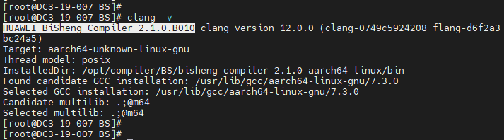

If the command output contains the BiSheng compiler version information, the installation is successful.

### **4.1.2** Software Package Installation Mode

**Step 1** Make preparations.

Download the BiSheng compiler on the [BiSheng compiler page](https://mirrors.huaweicloud.com/kunpeng/archive/compiler/bisheng_compiler/BiSheng-compiler-2.5.0-aarch64-linux.tar.gz) and upload it to the server.

Software package download: [https://www.hikunpeng.com/en/developer/devkit/compiler/bisheng](https://www.hikunpeng.com/en/developer/devkit/compiler/bisheng)

**Step 2** Install the environment dependency items of the BiSheng compiler.

    yum install -y gcc glibc libatomic bc tar

**Step 3** Create the installation directory of the BiSheng compiler.

    mkdir -p /usr/local/bisheng

**Note**: In the preceding command, **/usr/local/** is an example. Replace it with an actual path.

**Step 4** Download the BiSheng compiler package and decompress it.

    cd /usr/local/bisheng
    wget https://mirrors.huaweicloud.com/kunpeng/archive/compiler/bisheng_compiler/bisheng-compiler-2.1.0-aarch64-linux.tar.gz --no-check-certificate
    tar -zxvf bisheng-compiler-2.1.0-aarch64-linux.tar.gz

After the decompression, the **bisheng-compiler-2.1.0-aarch64-linux** directory is generated in the current directory.

**Step 5** Install the environment-modules tool.

    yum install environment-modules -y
    source /etc/profile

**Step 6** Create an environment variable configuration file.

    vi /usr/local/bisheng/bisheng_modulefiles

The following content is added:

    #%Module1.0
    conflict bisheng
    prepend-path PATH /usr/local/bisheng/bisheng-compiler-2.1.0-aarch64-linux/bin
    prepend-path LD_LIBRARY_PATH /usr/local/bisheng/bisheng-compiler-2.1.0-aarch64-linux/lib

**Step 7** Load environment variables in the current shell.

    module use /usr/local/bisheng/
    module load /usr/local/bisheng/bisheng_modulefiles

**Note**: (Optional) To prevent variables from being imported every time a shell is opened, you are advised to write the environment variables to the system configuration file.

    vi /etc/profile

The following content is added:

    module use /usr/local/bisheng/
    module load /usr/local/bisheng/bisheng_modulefiles

**Step 8** Make the environment variables take effect.

    source /etc/profile

**Step 9** (Optional) Clear the hash table in the current window.

If an LLVM compiler of another version is available in the system, run the following command immediately after installing the BiSheng compiler:

    hash -r

This prevents the Clang command from being captured by the hash table. Otherwise, the BiSheng compiler or the open source LLVM compiler cannot be used.

**Step 10** Check whether the installation is successful.

After the installation is complete, run the following command to verify the BiSheng compiler's version:

    clang -v

If the command output contains the BiSheng compiler version information, the installation is successful.

----End

## 4.2 Dependency Installation

**Step 1** Install the dependency package from a Yum source.

     yum -y install git gcc gcc-c++ vim
     source /etc/profile

## 4.3 Go Environment Deployment

**Step 1** Use PuTTY to log in to the server as user **root**.
**Step 2** Go to the **/home** directory.

    cd /home

**Step 3** Obtain the Go package.

    wget https://dl.google.com/go/go1.18.linux-arm64.tar.gz

**Step 4** Create an installation path.

    mkdir -p /usr/local/seqkit/

**Step 5** Decompress the Go installation package.

    tar -zxvf go1.18.linux-arm64.tar.gz -C /usr/local/seqkit/

Note: Decompress the package based on the actual package name.
**Step 6** Configure environment variables.

    vi /usr/local/seqkit/go/go_modulefiles

The following content is added:

    #%Module1.0
    conflict go
    set GO /usr/local/seqkit/go
    setenv GO $GO
    prepend-path PATH $GO/bin

**Step 7** Load environment variables.

    module use /usr/local/seqkit/go
    module load /usr/local/seqkit/go/go_modulefiles

**Step 8** (Optional) To prevent variables from being imported every time a shell is opened, write the environment variables to the system configuration file.

    vi /etc/profile

The following content is added:

    module use /usr/local/seqkit/go
    module load /usr/local/seqkit/go/go_modulefiles

**Step 9** Make the environment variables take effect.

    source /etc/profile

**Step 10** Run the following command to check the installation path:

    ls /usr/local/seqkit/go/

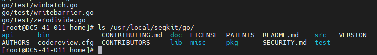

**Step 11** Check the version number.

    go version

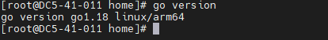

**Step 12** Replace the Go source with the source from China.

    go env -w GOPROXY=https://goproxy.cn

# 5. Source Code Obtaining

**Step 1** Download the SeqKit installation package **v2.2.0.tar.gz**.

Download address: [https://github.com/shenwei356/seqkit/archive/refs/tags/v2.2.0.tar.gz](https://github.com/shenwei356/seqkit/archive/refs/tags/v2.2.0.tar.gz)

# 6. Compilation and Installation

**Step 1** Use PuTTY to log in to the server as user **root**.
**Step 2** Go to the **/home** directory.

    cd /home

**Step 3** Obtain the source package.

    wget https://github.com/shenwei356/seqkit/archive/refs/tags/v2.2.0.tar.gz

**Step 4** Decompress the package.

    mv v2.2.0.tar.gz seqkit-2.2.0.tar.gz && tar -xvf seqkit-2.2.0.tar.gz

**Step 5** Configure the compilation.

    go env -w CXX=clang++
    go env -w CC=clang
    go env

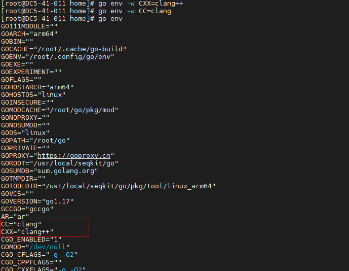

**Step 6** Perform the compilation.

    cd seqkit-2.2.0/seqkit/
    go build

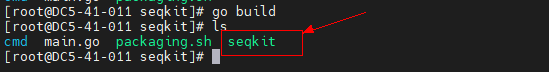

**Step 7** Perform the installation.

    mkdir -p /usr/local/seqkit/seqkit/bin
    cp ./seqkit /usr/local/seqkit/seqkit/bin
    ls /usr/local/seqkit/seqkit/bin

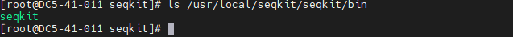

**Step 8** Set environment variables.

    vi /usr/local/seqkit/seqkit/seqkit_modulefiles

The following content is added:

    #%Module1.0
    conflict seqkit 
    set SEQKIT /usr/local/seqkit/seqkit
    setenv SEQKIT $SEQKIT
    prepend-path PATH $SEQKIT/bin

**Step 9** Load environment variables.

    module use /usr/local/seqkit/seqkit
    module load /usr/local/seqkit/seqkit/seqkit_modulefiles

**Step 10** (Optional) To prevent variables from being imported every time a shell is opened, write the environment variables to the system configuration file.

    vi /etc/profile

The following content is added:

    module use /usr/local/seqkit/seqkit
    module load /usr/local/seqkit/seqkit/seqkit_modulefiles

**Step 11** Make the environment variables take effect.

    source /etc/profile

----End

# 7. Running and Verification

Data source:
The test verification data and scripts are obtained from the SeqKit source package. For details about how to download the source package, see section 5. The data and scripts are stored in:

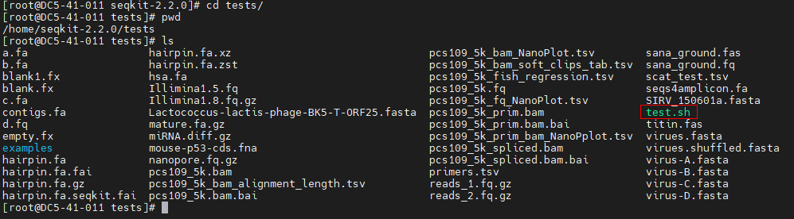

**Step 1** Use PuTTY to log in to the server as user **root**.
**Step 2** Go to the source package directory.

    cd /home/seqkit-2.2.0/

**Step 3** Copy the test verification script to the current directory.

    cp tests/test.sh ./

**Step 4** Edit the script, delete the SeqKit generation command, and change the SeqKit path in the script to the installation path.

    vi test.sh

**Note**: The installation path varies according to the actual situation.
Before the change:

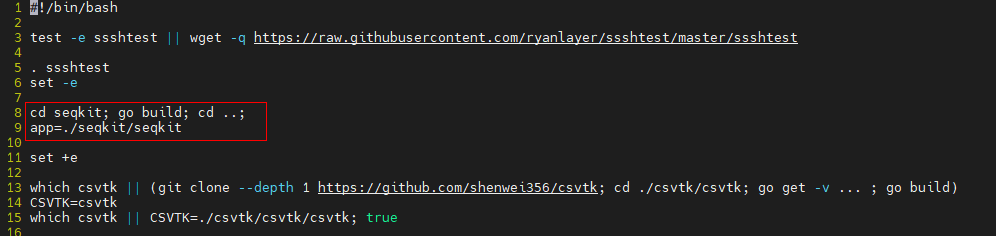

After the change:

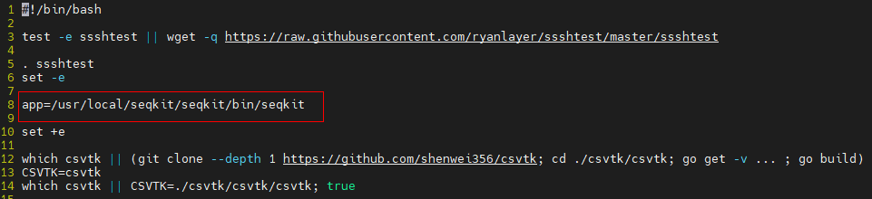

**Step 5** Run the following command to check the running of SeqKit:

    bash test.sh

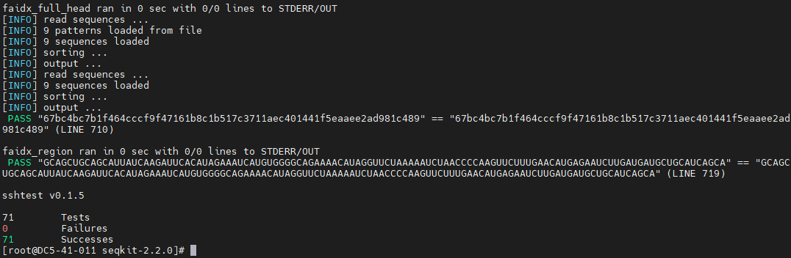

**Step 6** View SeqKit details.
seqkit --help

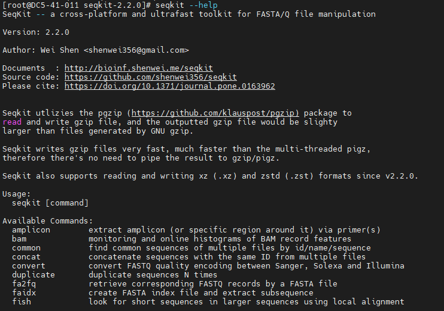

----End

# 8. Change History

| Date      | Description                                |
| ---------- | ------------------------------------ |
| 2023-02-08 | This issue is the first official release.                            |
| 2023-02-10 | This issue is the second official release.|
