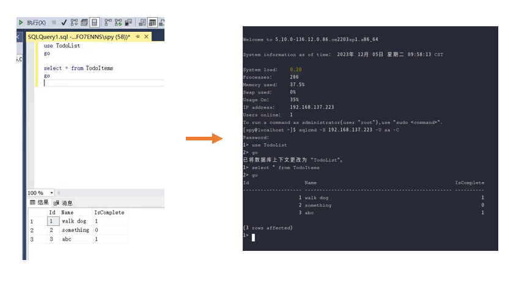

---

title: '[Windows Migration] Migrating SQL Server to openEuler'

date: '2023-12-21'

category: blog

tags:

  - openEuler

  - Windows migration

archives: '2023-12'

author:

  - futao

Summary: SQL Server is a relational database management system developed by Microsoft. It is widely used in enterprise-level application development. This blog describes how to migrate SQL Server to openEuler.

---


## Overview
Many enterprises and individuals have switched from Windows to Linux in recent years, and more are following suit. Linux has long dominated the network server market with its superior stability, reliability, cost-efficiency, and security. It can handle challenging workloads with high availability and high performance, offer a better user experience, and provide a diverse tool set. These are the reasons why people prefer Linux.

Microsoft rebuilt SQL Server in 2016 to make most of its functions OS-independent. This project enables more users to move their application services from the Windows platform to the Linux platform. This blog describes how to migrate SQL Server 2019 to openEuler to help users migrate data on the Windows platform.

## Installing SQL Server and Creating a Database on openEuler

### Preparations

For details, see https://www.cnblogs.com/linuxjava/p/17456089.html.

#### Installing Python 2

Installing SQL Server 2019 requires Python 2 dependencies. However, Python 2 is not provided in the default Yum source. Therefore, you need to manually download and install Python 2.

1. Use wget to obtain the Python package.
```shell
wget https://www.python.org/ftp/python/2.7.9/Python-2.7.9.tgz
```
2. Install the basic libraries required by Python 2.
```shell
sudo yum install zlib-devel bzip2-devel openssl-devel ncurses-devel sqlite-devel readline-devel tk-devel gcc make libffi-devel
```
3. If tar is not installed, install it first.
```shell
sudo yum install tar -y
```
4. Decompress and install Python 2.
```shell
# Run the tar command to decompress the package.
tar xzf Python-2.7.9.tgz
# Go to the extracted directory.
cd Python-2.7.9
# Generate MakeFile.
sudo ./configure --prefix=/usr/local
# Install Python 2.
sudo make altinstall
```
5. Create a soft link for the Python software in the `/usr/local/bin/` directory to the `/usr/bin/` directory.
```shell
sudo ln -s /usr/local/bin/python2.7 /usr/bin/python
sudo ln -s /usr/local/bin/python2.7 /usr/bin/python2
```

#### Creating a Soft Link for the .so File

The `liblber-2.4.so.2` and `libldap-2.4.so.2` files do not exist in the system, but the `liblber.so.2` and `libldap.so.2` files exist (the file names do not contain the version number). You can create a soft link to replace them.
```shell
sudo ln -s /usr/lib64/liblber.so.2 /usr/lib64/liblber-2.4.so.2
sudo ln -s /usr/lib64/liblber.so.2 /usr/lib/liblber-2.4.so.2
sudo ln -s /usr/lib64/libldap.so.2 /usr/lib/libldap-2.4.so.2
sudo ln -s /usr/lib64/libldap.so.2 /usr/lib64/libldap-2.4.so.2
```

### Installing SQL Server

For details, see https://learn.microsoft.com/en-us/sql/linux/quickstart-install-connect-red-hat?view=sql-server-ver15&tabs=rhel8.


#### Installing the SQL Server Service

1. openEuler does not have an SQL Server source and is similar to Red Hat. Therefore, the Red Hat repository is used as the download source. Download the SQL Server 2019 (15.x) Red Hat repository configuration file.
```shell
sudo curl -o /etc/yum.repos.d/mssql-server.repo https://packages.microsoft.com/config/rhel/8/mssql-server-2019.repo
```
2. Install SQL Server.
```shell
sudo yum install -y mssql-server
```
3. Run mssql-conf setup, set the SA password as prompted, and select a version. Evaluation, Developer, and Express editions are free of charge.
```shell
sudo /opt/mssql/bin/mssql-conf setup
```
Complete the settings as prompted.
4. After the configuration is complete, check whether the service is running.
```shell
systemctl status mssql-server
```
5. Enable the SQL Server port on the firewall. The default SQL Server port is TCP 1433.
```shell
sudo firewall-cmd --zone=public --add-port=1433/tcp --permanent
sudo firewall-cmd --reload
```
For firewalls other than FirewallD, run the corresponding command.

#### Disabling the sa Account

According to the official document, the sa account must be disabled after the installation to ensure security. However, the sa account will be used in this tutorial. Therefore, skip this step. You can determine whether to disable the sa account based on security requirements.

For details, see https://learn.microsoft.com/en-us/sql/linux/quickstart-install-connect-red-hat?view=sql-server-ver15&tabs=rhel8#disable-the-sa-account-as-a-best-practice.

#### Installing the SQL Server Command Line Tool

1. In this step, you need to use the Red Hat repository as the download source again. Download the Microsoft Red Hat repository configuration file.
```shell
curl https://packages.microsoft.com/config/rhel/8/prod.repo | sudo tee /etc/yum.repos.d/mssql-release.repo
```
2. If an earlier version of mssql-tools is installed, delete all old unixODBC packages.
```shell
sudo yum remove mssql-tools unixODBC-utf16 unixODBC-utf16-devel
```
3. Install mssql-tools18 using the unixODBC developer package.
```shell
sudo yum install -y mssql-tools18 unixODBC-devel
```
4. Update mssql-tools to the latest version.
```shell
sudo yum check-update
sudo yum update mssql-tools18
```
5. Add `/opt/mssql-tools18/bin/` to the `PATH` environment variable in the bash shell:
To make sqlcmd and bcp accessible from the bash shell of the login session, run the following command to modify `PATH` in the `~/.bash_profile` file:
```shell
echo 'export PATH="$PATH:/opt/mssql-tools18/bin"' >> ~/.bash_profile
```
To make sqlcmd and bcp accessible from the bash shell of interactive/non-login sessions, run the following command to modify `PATH` in the `~/.bashrc` file:
```shell
echo 'export PATH="$PATH:/opt/mssql-tools18/bin"' >> ~/.bashrc
source ~/.bashrc
```

### Connecting to the Database

Run sqlcmd with parameters for the SQL Server name (`-S`), the user name (`-U`), and the password (`-P`).
```shell
sqlcmd -S localhost -U sa -P '<YourPassword>'
```
In the preceding command, the connection is made locally, the server name is **localhost**, the user name is **sa**, and the password is the one specified for **sa** during setup.

If you do not want to enter the password in explicit mode, you can omit the `-P` option and the corresponding parameter. After the command is executed, the system prompts you to enter the password.

If an SSL certificate authentication failure error occurs during login, add the `-C` option to solve the problem.

When the **sqlcmd** command prompt `1>` is displayed, the connection is successful.

For example, the following is a successful interaction case.
```shell
[spy@localhost ~]$ sqlcmd -S 192.168.137.223 -U sa -C
Password: # Enter the password. The password is not displayed.
1> # The login is successful. You can enter SQL statements.
```
In the preceding example, **192.168.137.223** is the local IP address. You can replace it with the remote IP address if needed.

To exit sqlcmd, enter **exit** or **quit**.

## Migrating SQL Server Data to openEuler

For details, see https://learn.microsoft.com/en-gb/sql/linux/sql-server-linux-migrate-restore-database?view=sql-server-ver15.

Replace `YourDB` with the actual database name.

### Backing Up Data

In the Microsoft official document, SQL Server Management Studio (SSMS) is used to create backup files in graphical interaction mode. Due to the diversity of database management systems, this method is not applicable if other database management systems are used or the graphical management system is not used. Therefore, this method is not described here. If you want to use this method, see https://learn.microsoft.com/en-gb/sql/linux/sql-server-linux-migrate-restore-database?view=sql-server-ver15#create-a-backup-on-windows.

You are advised to use SQL statements that are easy to operate and widely applicable.
```sql
BACKUP DATABASE [YourDB] TO DISK = N'C:\Program Files\Microsoft SQL Server\MSSQL13.MSSQLSERVER\MSSQL\Backup\YourDB.bak'
WITH NOFORMAT, NOINIT, NAME = N'YourDB-Full Database Backup',
SKIP, NOREWIND, NOUNLOAD, STATS = 10
GO
```
If user permission problems occur, perform the following operations:

Open the Windows service (press **Win+R** and enter **services.msc** or use other methods to open the service), find the corresponding database instance service (for example, `SQL Server (MSSQLSERVER)`, right-click the service, choose **Properties** from the shortcut menu, and click the **Login** tab, change the login user to a local system account or assign required permissions to a specified account.

After the backup file is generated, use the **scp** command to transfer the file to openEuler.

### Migrating Data

1. Enter the super user mode.
```shell
sudo su
```
2. Create a backup directory.
```shell
mkdir -p /var/opt/mssql/backup
```
3. Move the backup file to the directory. (Assume that the backup file is in the current directory. Change the file path or run the **cd** command to go to the correct directory.)
```shell
mv YourDB.bak /var/opt/mssql/backup/
```
The purpose of moving the backup file is as follows: The subdirectory of `/var/opt/mssql` belongs to user **mssql** and group **mssql**.
4. Exit the super user mode.
```shell
exit
```
5. Start sqlcmd.
```shell
sqlcmd -S 192.168.137.223 -U sa -C
```
6. Log in to sqlcmd and enter the following SQL statements:
```sql
RESTORE DATABASE YourDB
FROM DISK = '/var/opt/mssql/backup/YourDB.bak'
WITH MOVE 'YourDB' TO '/var/opt/mssql/data/YourDB.mdf',
MOVE 'YourDB_Log' TO '/var/opt/mssql/data/YourDB_Log.ldf'
GO
```
Multiple lines of commands cannot be copied and pasted at the same time in sqlcmd.

If the operation is successful, you should receive a message indicating that the database is successfully restored.

If an error similar to the following occurs:
```text
File 'YourDB_Product' cannot be restored to 'Z:\Microsoft SQL Server\MSSQL11.GLOBAL\MSSQL\Data\YourDB\YourDB_Product.ndf'. Use WITH MOVE to identify a valid location for the file.
Msg 5133, Level 16, State 1, Server servername, Line 1
Directory lookup for the file "Z:\Microsoft SQL Server\MSSQL11.GLOBAL\MSSQL\Data\YourDB\YourDB_Product.ndf" failed with the operating system error 2(The system cannot find the file specified.).
```
In this case, the database contains secondary files. If these files are not specified in the `MOVE` clause of `RESTORE DATABASE`, the restore procedure will try to create them in the same path as the original server.

You can list all the files contained in the backup.
```sql
RESTORE FILELISTONLY FROM DISK = '/var/opt/mssql/backup/YourDB.bak'
GO
```
You should see the following list (only the first two columns are listed):
```sql
LogicalName         PhysicalName                                                                 ..............
----------------------------------------------------------------------------------------------------------------------
YourDB              Z:\Microsoft SQL Server\MSSQL11.GLOBAL\MSSQL\Data\YourDB\YourDB.mdf          ..............
YourDB_Product      Z:\Microsoft SQL Server\MSSQL11.GLOBAL\MSSQL\Data\YourDB\YourDB_Product.ndf  ..............
YourDB_Customer     Z:\Microsoft SQL Server\MSSQL11.GLOBAL\MSSQL\Data\YourDB\YourDB_Customer.ndf ..............
YourDB_log          Z:\Microsoft SQL Server\MSSQL11.GLOBAL\MSSQL\Data\YourDB\YourDB_Log.ldf      ..............
```
You can use this list to create `MOVE` clauses for other files. In this example, `RESTORE DATABASE` is:
```sql
RESTORE DATABASE YourDB
FROM DISK = '/var/opt/mssql/backup/YourDB.bak'
WITH MOVE 'YourDB' TO '/var/opt/mssql/data/YourDB.mdf',
MOVE 'YourDB_Product' TO '/var/opt/mssql/data/YourDB_Product.ndf',
MOVE 'YourDB_Customer' TO '/var/opt/mssql/data/YourDB_Customer.ndf',
MOVE 'YourDB_Log' TO '/var/opt/mssql/data/YourDB_Log.ldf'
GO
```
7. Check whether the restoration is successful by listing all databases.
```sql
SELECT Name FROM sys.Databases
GO
```

8. Data migration is successful.


The Porting Platform WinApp SIG demonstrates the SQL Server migration solution described in this document. If you are interested in Windows migration technologies, you are welcome to join us by scanning the following QR code to join the SIG WeChat group.


