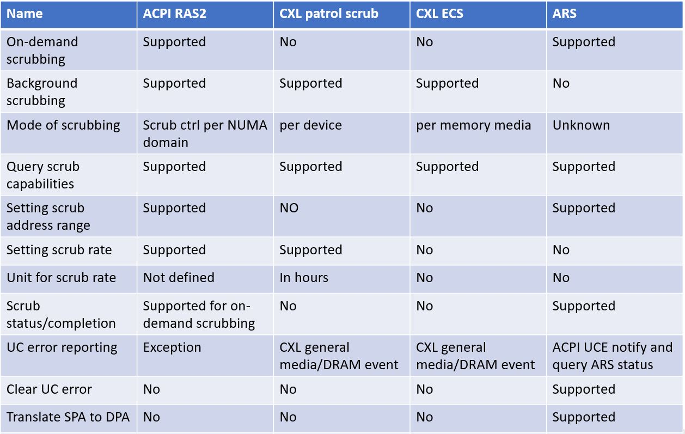
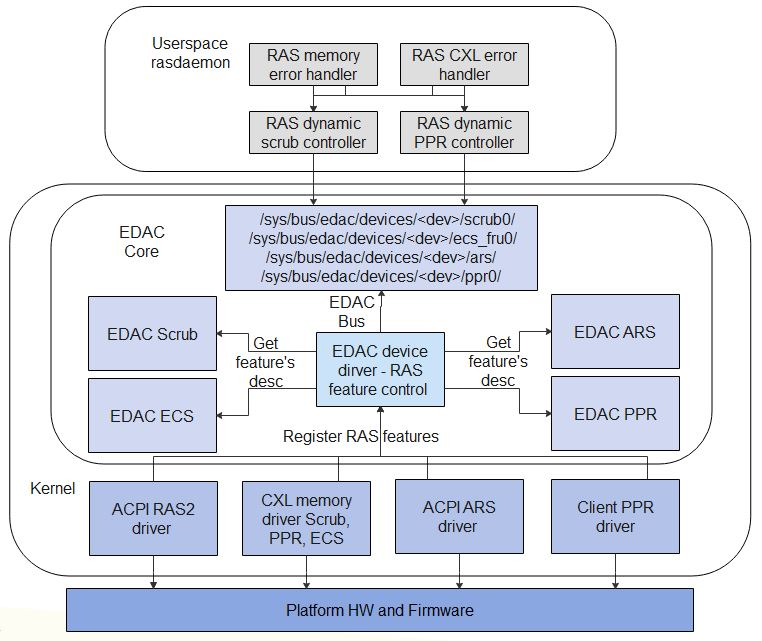
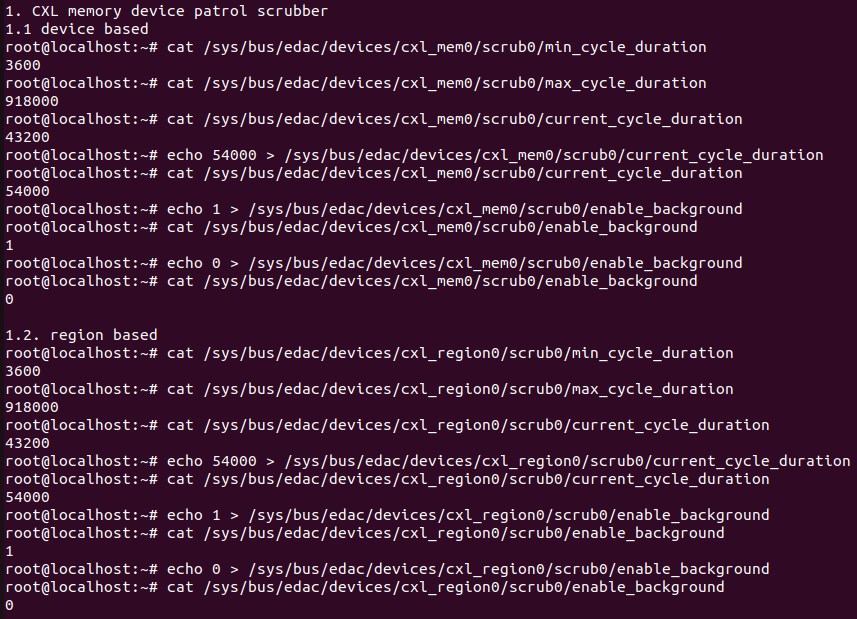
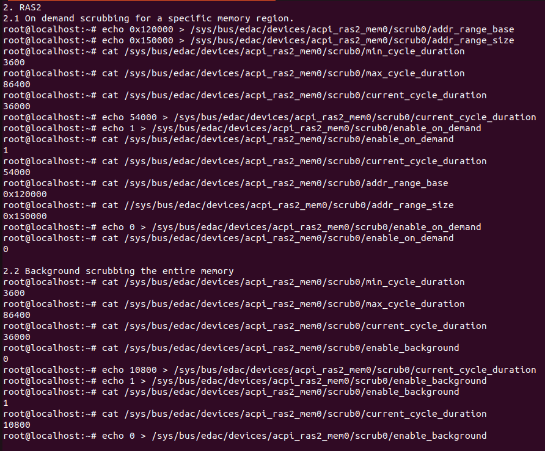

# Introduction

The enhancement to kernel EDAC subsystem for controlling RAS features and exposing feature's control attributes to userspace in sysfs.

# Background and Technical Details

Some Examples of the RAS features are:
 - Memory Scrubbing
 - Error Check Scrub (ECS)
 - ACPI RAS2 features
 - ACPI Address Range Scrubbing (ARS)
 - Post Package Repair (PPR) etc.

## Memory Scrubbing
Increasing DRAM size and cost has made memory subsystem reliability an important concern. These modules are used where potentially corrupted data could cause expensive or fatal issues. Memory errors are
one of the top hardware failures that cause server and workload crashes. 
Memory scrub is a feature where an ECC engine reads data from each memory media location, corrects with an ECC if necessary and writes the corrected data back to the same memory media location.

The memory DIMMs could be scrubbed at a configurable rate to detect uncorrected memory errors and attempts to recover from detected memory errors providing the following benefits.
- Proactively scrubbing memory DIMMs reduces the chance of a correctable error becoming uncorrectable.
- Once detected, uncorrected errors caught in unallocated memory pages are isolated and prevented from being allocated to an application or the OS.
- The probability of software / hardware encountering synchronous memory errors (at time of use) is reduced.

If an uncorrectable error is detected by scrub that happens to be in memory in use, then there is no way for the OS to know what the best thing to do is. These are reported as 'action recommended' and this information is passed to userspace application which may be able to resolve the error (drop caches, reread data from disk or just restart).

There are 2 types of memory scrubbing,
1. Background (patrol) scrubbing of the RAM whilst the RAM is otherwise idle.
2. On-demand scrubbing for a specific address range/region of memory.

### Use cases of common scrub control feature
1. There are several types of interfaces to HW memory scrubbers identified such as ACPI NVDIMM ARS(Address Range Scrub), CXL memory device patrol  scrub, CXL DDR5 ECS, ACPI RAS2 memory scrubbing features and software based memory scrubber. Also some scrubbers support controlling (background) patrol scrubbing (ACPI RAS2, CXL) and/or on-demand scrubbing(ACPI RAS2, ACPI ARS). However the scrub controls varies between memory scrubbers. Thus there is a requirement for a standard generic sysfs scrub controls exposed to userspace for the seamless control of the HW/SW scrubbers in the system by the admin/scripts/tools etc.
2. Scrub controls in user space allow the user to disable the scrubbing in case disabling of the background patrol scrubbing or changing the scrub rate are needed for other purposes such as performance-aware operations which requires the background operations to be turned off or reduced.
3. Allows to perform on-demand scrubbing for specific address range if supported by the scrubber.
4. User space tools start scrubbing the memory DIMMs when uncorrected memory error or excess corrected memory errors reported on that memory or start regular scrubbing at a configurable scrub rate using the sysfs scrub controls discussed, does help,
   - reduces the chance of a correctable error becoming uncorrectable.
   - to detect uncorrectable memory errors early before user accessing memory, which helps earlier recovery of the detected memory errors.
5. Likely multiple instances of scrub are present per memory device.
6. Policy control for hotplugged memory. There is not necessarily a system wide bios or similar in the loop to control the scrub settings on a CXL device that wasn't there at boot. What that setting should be is a policy decision as we are trading of reliability vs performance - hence it should be in control of userspace. As such, 'an' interface is needed. Seems more sensible to try and unify it with other similar interfaces than spin yet another one.

### Comparison of memory scrubbing features

*(1) - SPA - System Physical Address. See section 9.19.7.8 Function Index 5 - Translate SPA of ACPI spec r6.5.  
*(2) - DPA - Device Physical Address. See section 9.19.7.8 Function Index 5 - Translate SPA of ACPI spec r6.5.  

### CXL Patrol Scrubbing

CXL spec r3.1 section 8.2.9.9.11.1 describes the memory device patrol scrub control feature. The device patrol scrub proactively locates and makes corrections to errors in regular cycle. The patrol scrub control allows the request to configure patrol scrubber's input configurations.

The patrol scrub control allows the requester to specify the number of hours in which the patrol scrub cycles must be completed, provided that the requested number is not less than the minimum number of hours for the patrol scrub cycle that the device is capable of. In addition, the patrol scrub controls allow the host to disable and enable the feature in case disabling of the feature is needed for other purposes such as performance-aware operations which require the background operations to be turned off.

### Error Check Scrub (ECS)

The DRAM specific Error Check Scrub (ECS) feature defined in JEDEC DDR5 SDRAM Specification (JESD79-5) and allows the DRAM to internally read, correct single-bit errors, and write back corrected data bits to the DRAM array while providing transparency to error counts. The control allows requester to change the ECS threshold count, mode of operation and reset the ECS counter, while output the error count and row address with most errors. However unlike the patrol scrubbing, ECS does not have option for control scrub cycle and enable/disable scrub operation.
Patrol scrubbing handles both corrected errors and uncorrected errors, while ECS handles only corrected errors.

## ACPI RAS2 Features

ACPI spec 6.5 section 5.2.21 ACPI RAS2 describes ACPI RAS2 table provides interfaces for platform RAS features and supports independent RAS controls and capabilities for a given RAS feature for multiple
instances of the same component in a given system. RAS2 uses PCC (Platform Communication Channel, mailbox) for OSPM communicating with the ACPI complaint platform. RAS2 supports multiple PCC channels, filled in the RAS2 PCC descriptor list, where a channel is dedicated to a given component instance. OSPM will write PCC registers by filling in the register value in PCC sub channel space and issuing a PCC Execute command. ACPI spec 6.5 Table 5.83 describes RAS2 PCC shared memory region, with fields for PCC command, PCC status, bitmap for RAS features, bitmap for set RAS features, parameter blocks for RAS features.Memory RAS features apply to RAS capabilities, controls and operations that are specific to memory. RAS2 PCC descriptor for memory-specific RAS features has the feature type of 0x00 (Memory).

### Hardware-based Memory Scrubbing

The platform can use the hardware-based memory scrubbing feature to expose controls and capabilities associated with hardware-based memory scrub engines. The RAS2 memory scrubbing feature supports following as per spec,
 - Independent memory scrubbing controls for each NUMA domain, identified using its proximity domain.
 - Provision for background (patrol) scrubbing of the entire memory system, as well as on-demand scrubbing for a specific region of memory.

ACPI Table 5.87 Block structure for RAS2 HW memory patrol scrub feature, with fields for patrol scrub command, address range in/out, flags out, scrub parameters in/out etc.

## ACPI Address Range Scrubbing(ARS)

ARS allows the platform to communicate memory errors to system software. This capability allows system software to prevent accesses to addresses with uncorrectable errors in memory. ARS functions manage all NVDIMMs present in the system. Only one scrub can be in progress system wide at any given time.
Following functions are supported as per the specification.
1. Query ARS Capabilities for a given address range, indicates platform supports the ACPI NVDIMM Root Device Unconsumed Error Notification.
2. Start ARS triggers an Address Range Scrub for the given memory range. Address scrubbing can be done for volatile memory, persistent memory, or both.
3. Query ARS Status command allows software to get the status of ARS, including the progress of ARS and ARS error record.
4. Clear Uncorrectable Error.
5. Translate SPA
6. ARS Error Inject etc.

##
Following scrub components are present in the kernel.
 - NVDIMM ARS.
 - Simple EDAC scrub interface.

## Post Package Repair(PPR)

PPR (Post Package Repair) maintenance operation requests the memory device to perform a repair operation on its media if supported. A memory device may support two types of PPR: Hard PPR (hPPR), for a   permanent row repair, and Soft PPR (sPPR), for a temporary row repair. sPPR is much faster than hPPR, but the repair is lost with a power cycle. During the execution of a PPR maintenance operation, a memory device, may or may not retain data and may or may not be able to process memory requests correctly. sPPR maintenance operation may be executed at runtime, if data is retained and memory requests are correctly processed. hPPR maintenance operation may be executed only at boot because data would not be retained.

### Use cases of common PPR control feature
1. The Soft PPR (sPPR) and Hard PPR (hPPR) share similar control interfaces, thus there is a requirement for a standard generic sysfs PPR controls exposed to userspace for the seamless control of the PPR features in the system by the admin/scripts/tools etc.
2. When a CXL device identifies a failure on a memory component, the device may inform the host about the need for a PPR maintenance operation by using an event record, where the maintenance needed flag is set. The event record specifies the DPA that should be repaired. Kernel reports the corresponding cxl general media or DRAM trace event to userspace. The userspace tool, for eg. rasdaemon initiate a PPR maintenance operation in response to a device request using the sysfs PPR control.
3. User space tools, for eg. rasdaemon, do request PPR on a memory region when uncorrected memory error or excess corrected memory errors reported on that memory,
4. Likely multiple instances of PPR present per memory device.

# System Architecture

The following figure shows the technical architecture of the enhanced EDAC for controlling RAS features. 

1. EDAC feature specific components - Creates and return feature specific descriptors.
2. EDAC device driver enhancement for control RAS features  - Get feature's attr descriptors from the EDAC feature component and registers device's RAS features with EDAC bus and expose the feature's sysfs attributes under the sysfs EDAC bus.
3. RAS dynamic scrub controller - Userspace sample module added in the rasdaemon to start scrubbing when excess number of related errors are reported in a short span of time.

The added EDAC feature specific components (e.g. EDAC scrub, EDAC ECS, EDAC PPR etc) do callbacks to the parent driver (e.g. CXL driver, ACPI RAS driver etc) for the controls rather than just letting the caller deal with it because of the following reasons.
1. Enforces a common API across multiple implementations can do that via review, but that's not generally gone well in the long run for subsystems that have done it (several have later moved to callback
   and feature list based approaches).
2. Gives a path for 'intercepting' in the EDAC feature driver. An example for this is that we could intercept PPR repair calls and sanity check that the memory in question is offline before passing back to the underlying code.  Sure we could rely on doing that via some additional calls from the parent driver, but the ABI will get messier.
3. (Speculative) we may get in kernel users of some features in the long run.

# Examples

The edac feature specific driver exposes sysfs feature control attributes to the user.
For example scrub control, the control attributes of the registered scrubbers is available in the /sys/bus/edac/devices/\<dev-name>/scrubX/

The usage takes the form shown in these examples:

# Implementation

1. Linux kernel

Latest version of kernel implementation of RAS features control is available in,
https://github.com/shijujose4/linux/tree/edac-enhancement-ras-features

2. QEMU emulation

2.1.
The QEMU series to support the CXL specific scrub features is available in,
https://gitlab.com/qemu-project/qemu.git

2.2.
QEMU patch supports the CXL PPR feature is available in,
https://lore.kernel.org/all/20240730045722.71482-1-dave@stgolabs.net/

3. Userspace rasdaemon

The draft version of userspace code for dynamic scrub control, based on frequency of memory errors reported to userspace, is added in rasdaemon and enabled, tested for CXL device based patrol scrubbing feature and ACPI RAS2 based scrubbing feature.
https://github.com/shijujose4/rasdaemon/tree/ras_feature_control

For PPR, rasdaemon collates records and decides to replace a row if there are lots of corrected errors, or a single uncorrected error or error record received with maintenance request flag set as in CXL DRAM error record.

# References

1. CXL Specification: https://computeexpresslink.org/cxl-specification
2. ACPI Specification: https://uefi.org/specifications
3. CXL spec  r3.1 8.2.9.9.11.1 Device patrol scrub control feature
4. CXL spec  r3.1 8.2.9.9.11.2 DDR5 ECS feature
5. CXL spec  r3.1 8.2.9.7.1.1 PPR Maintenance Operations
6. CXL spec  r3.1 8.2.9.7.2.1 sPPR Feature Discovery and Configuration
7. CXL spec  r3.1 8.2.9.7.2.2 hPPR Feature Discovery and Configuration
8. ACPI spec r6.5 section 5.2.21 ACPI RAS2.
9. ACPI spec r6.5 section 9.19.7.2 ARS.
10. Background information about kernel support for memory scan, memory
   error detection and ACPI RASF.
   https://lore.kernel.org/all/20221103155029.2451105-1-jiaqiyan@google.com/
11. Discussions on RASF:
   https://lore.kernel.org/lkml/20230915172818.761-1-shiju.jose@huawei.com/#r 
