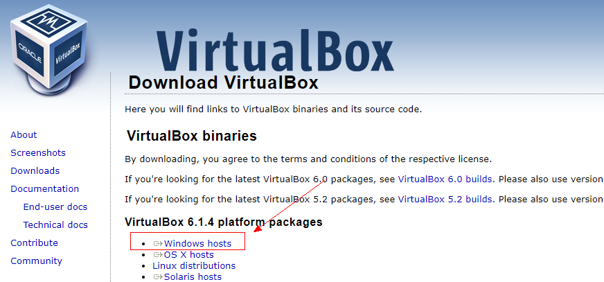
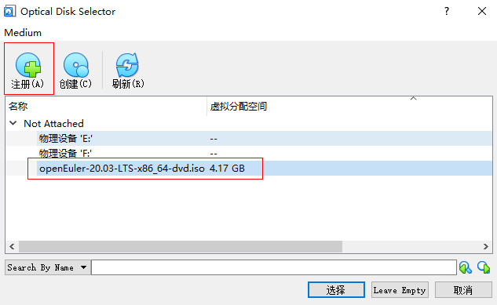
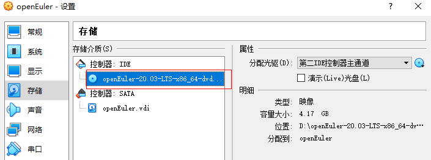

### 【Background】
The openEuler community has released the latest LTS version. If you have only one Windows PC, you can use VirtualBox to install the openEuler VM.

### 【Environment Preparation】

- Windows 10 64-bit
- Oracle VM VirtualBox 6.1.4
- download: [openEuler-20.03-LTS-x86_64-dvd.iso](https://repo.openeuler.org/openEuler-20.03-LTS/ISO/x86_64/openEuler-20.03-LTS-x86_64-dvd.iso)  （X86）

### 【Installation Procedure】

##### 一、Download and install Virtual Box

Download the installation program from the [VirtualBox official website](https://www.virtualbox.org/wiki/Downloads)

During the installation, you can customize the installation path (D:\software\Oracle\VirtualBox) and click `Next`.

After the installation is complete, press `Ctrl+G` to open the global settings and change the default virtual computer location (D:\myVM) to facilitate future search.

##### 二、Create a VM

Choose `Control` and `Create`, and enter the VM configuration information, for example:
Name: openEuler
Type: Linux
Since there is no openEuler, select Other Linux (64-bit) for the version and click `Next`.

Set the VM memory, which is the system memory occupied by the VM. In this example, set the virtual memory to 4 GB.

Select 【Create a virtual hard disk now (c)】

Select【VDI（VirtualBox Disk Image）】，Next

Select【Dynamic Allocation】，Next

The memory space allocated to the VM is large. When the memory space is used, the disk space is occupied gradually. When the memory space is idle, the memory space is automatically reduced.

In this example, the VM disk size is set to 64 GB.

The VM has been created, and hardware resources required by the openEuler have been prepared.

##### 三、Install openEuler

Start the VM created in the previous step. 

Click the folder icon on the right.

Click Register and select the **openEuler-20.03-LTS-x86_64-dvd.iso** downloaded in the preparation phase.

Select【Start】, to enter the installation interface.

Select 【Install openEuler 20.03-LTS】and press Enter. 

Select【Continue】

Select 【Installation Destination】

Select the disk to be installed, Done.

Select 【Begin Installation】

The installation status is as follows:

Select 【Root Password】 to set the password of the root user.
(Note: The password will be used for login later.)

After the installation is complete, click 【Reboot】 to restart the VM.

The installation page is displayed again.

Shut down the VM, choose 【Settings】, right-click **openEuler-20.03-LTS-x86_64-dvd.iso**, and delete the disk. Save the settings and exit.

Restart the VM. When the following page is displayed, press Enter.

Enter the password (configured during the installation) of user (root), log in to the openEuler VM.

The openEuler virtual machine is now installed.