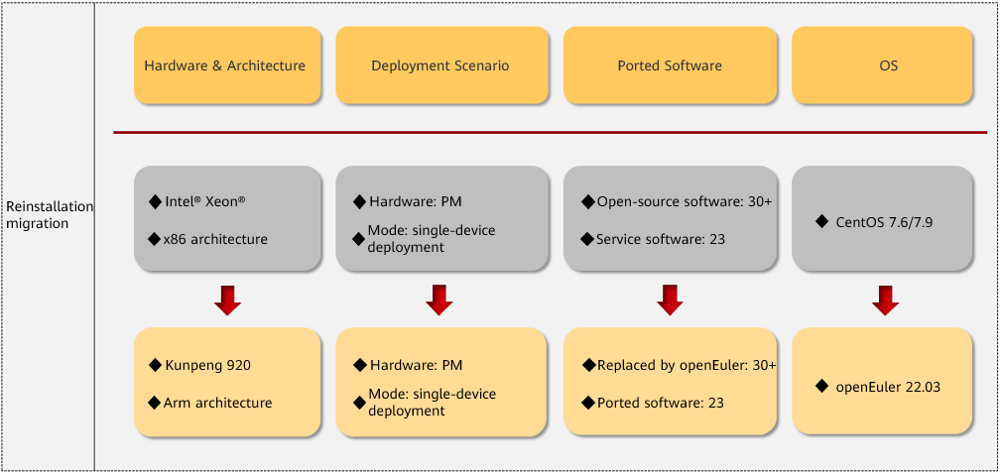
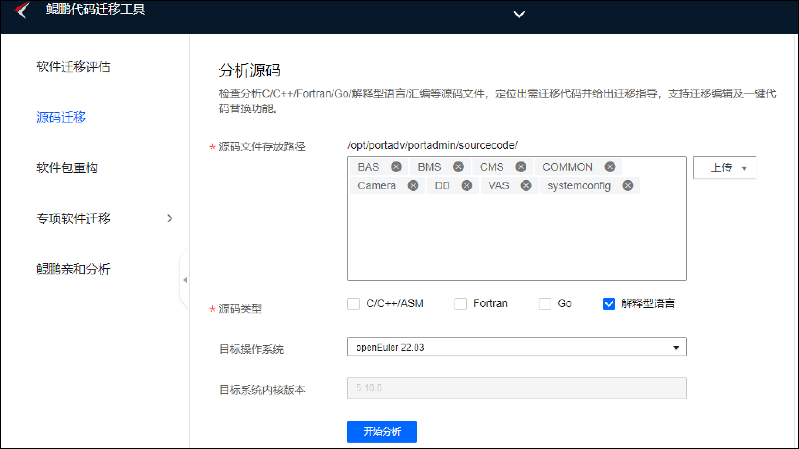
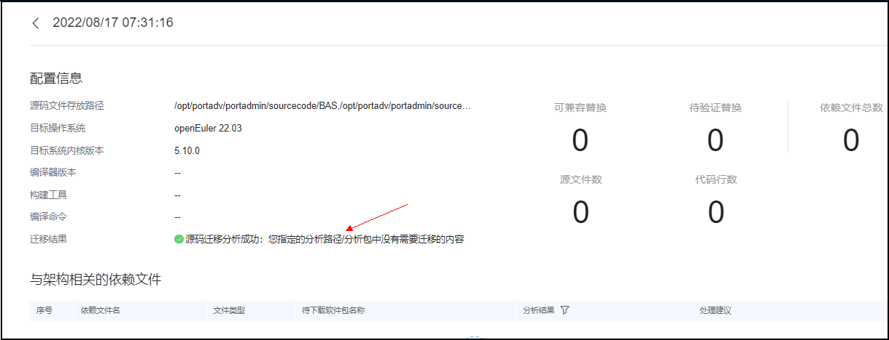
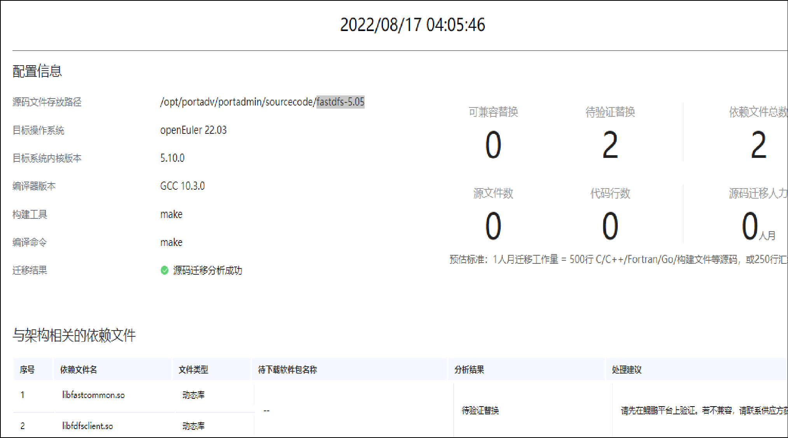
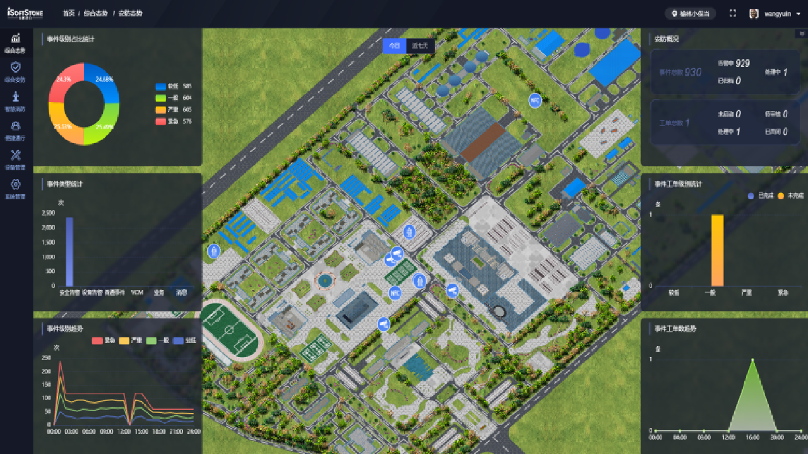
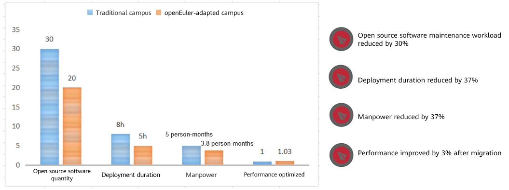

## Background
Since the CentOS 7 and 8 open source community OSs are going end of life, the OS security patches will no longer be updated, posing great security risks to the upper-layer applications and making it difficult to support services. Hence, the pressing need of the hour is to replace base software, encompassing both the OS and the applications that reside on top of it.

## Migration Description
iSoftStone helped a campus replace all server hardware, OSs, and upper-layer service software.

This project involved **server hardware, OS, and open-source component replacement**, and **service software adaptation**. With the help of the DevKit migration tool and service experience provided by openEuler, iSoftStone successfully migrated the campus' service system to the new server hardware. The service system runs stably and the performance of the original OS is improved by 3%.

## Migration Assurance
Before service system migration, iSoftStone set up an internal migration assurance team with two managers, five R&D engineers, five testing engineers, two operation engineers, and ISV vendors (peripheral systems) to provide technical support and manpower assurance for quick migration of operating and service systems.

## Migration Survey
Before the migration, iSoftStone surveyed the campus' existing service systems from the following aspects.

| Item      | Description                                    |
| ------------ | -------------------------------------------- |
| Requirements   | Detailed requirements and pain points. |
| Hardware    | Server model, CPU, memory, storage, and network.   |
| Software    | Main software packages, third-party commercial software, and open source software. |
| Deployment scenario | Deployment modes, such as single-node system, cluster, and distributed deployment. |
| Service form | Stateful and stateless services, and service process. |
| System configuration | OS and security configuration.    |

## Migration Policy
Start with the service system, progress from simple to complex, pilot to verification to large-scale rollout, while considering various aspects like development language, deployment, and service status. Service migration priorities and policies are determined based on the service impact scope and technical complexity from the survey. The overall migration roadmap is customized based on the service deployment mode, possibility of concurrent replacement, and service continuity.

### By OS
- Upgrade CentOS 7 series in-place.

-  Reinstall and replace CentOS 6 series.

### By Deployment Mode
-  Preferentially migrate active/standby and cluster service systems without interrupting services.

- Then migrate single-device system while services are  stopped.

### By Development Language
- First, interpreted languages, such as Java and Python.

- Then, compiled languages, such as C and C++.

**Note**: According to the compatibility evaluation, in the case of compatibility, migration is performed with a high priority, while migration is performed with a low priority if adaptation is required.

###  By Service Status
- First, stateless services

​		Stateless services don't store data locally, hence service migration is prioritized.

- Then, stateful services

​		Stateful services store data locally, and data migration is prioritized over service migration.

​              

## Migration Solution
The migration solution reinstalls and replaces services based on long-term requirements and survey data, adapting them to the new system while preserving the original service data.

## Evaluation Tool
| Migration Tool | Description                                                                                                           | Download URL                                                                                                                                                          |
| ---------- | -------------------------------------------------------------------------------------------------------------------- | ------------------------------------------------------------------------------------------------------------------------------------------------------------------ |
| DevKit | Provides a series of tools covering code porting, development and debugging, compilation, testing, tuning, and diagnosis, enabling you to quickly build high-performance Kunpeng-compatible software.| [DevKit](https://kunpeng-repo.obs.cn-north-4.myhuaweicloud.com/Porting%20Advisor/Porting%20Advisor%202.5.RC1/Porting-advisor_2.5.RC1_linux-Kunpeng.tar.gz) |

## Migration Adaptation

#### Software List

| Software Name | Original Version  | New Version           | Remarks          |
| --------- | ---------- | ----------------- | -------------- |
| mysql     | 5.7.25     | 5.7.38            | System replacement      |
| kafka     | 2.11-2.1.1 | 2.6.0             | System replacement      |
| jdk       | 1.8        | openjdk-1.8.0.342 | System replacement      |
| zookeeper | 3.4.11     | 3.6.2             | System replacement      |
| tomcat    | 8.0.3      | 9.0.10            | System replacement      |
| redis     | 4.0.6      | 4.0.14            | System replacement      |
| nginx     | 1.9.9      | 1.21.5            | System replacement      |
| ruby      | 2.4.3      | 3.0.3             | System replacement      |
| mongodb   | 3.4.2      | 5.0.5             | System replacement      |
| zlib      | 1.2.4      | 1.2.11            | System replacement      |
| FastDFS   | 5.05       | 5.05              | Recompilation and adaptation  |
| mapserver | 7.0.8      | 7.0.8             | Recompilation and adaptation  |
| gcc       | 4.8.5      | 10.3.1            | Built-in in the system|
| glibc     | 2.17       | 2.34              | Built-in in the system|
| ...   | ...    | ...           |                |

#### Compatibility Scan Report

## Migration Implementation
**Note**: Before the migration, you are advised to perform multiple pre-migration drills to ensure that all operations and data are normal.

| No. | Item | Description                                                                                                                                                            |
| :---: | -------------- | ---------------------------------------------------------------------------------------------------------------------------------------------------------------- |
|   1   | Migration plan table  | Prepare a detailed migration plan, including the time and operation items.                                                                                                              |
|   2   | Migration personnel assurance table | Output the list of migration implementation personnel (customers, third-party vendors, and service software R&D, operation, and testing personnel).                                                                     |
|   3   | Check before the migration    | Check the configuration of the existing service system and output a list or document.                                                                                               |
|   4   | Migration procedure     | Plan a series of operations step-by-step, such as full database backup, OS installation and inspection, service software installation, full database data restoration, backup of incremental service data when system is shutdown, recovery of incremental data, and service rollout, are planned, and rollback solutions. |
|   5   | Data check after migration | Check the function and data consistency of the service system on the new system.                                                                                                                  |
|   6   | Testing after migration | Perform function tests based on the OS and service system test cases to ensure that all services are running properly and stably.                                                                                      |
|   7   | Service rollout after migration| Bring the service system online after the testing is complete.                                                                                  |
|   8   | Acceptance after migration  | Collect project acceptance materials based on the project acceptance report and ensure that the acceptance report is signed.                                                                                    |
|   9   | Service assurance     | Provide 24/7 online service assurance for customers' service systems through online, offline, and onsite services.                                                                                              |

## Service Rollout

## Highlights
After the successful migration, while the stability of the service system remains unchanged, the performance is improved and deployment duration is reduced, fully meeting customer requirements. iSoftStone has gained valuable experience in core service migration from the success of this migration.

In the future, iSoftStone will prioritize customer service and deliver quality-focused digital infrastructure services to empower enterprises in their digital transformation and business expansion.
