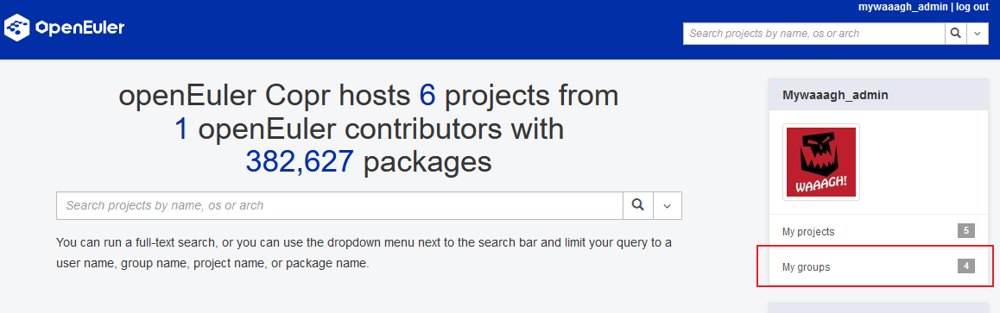
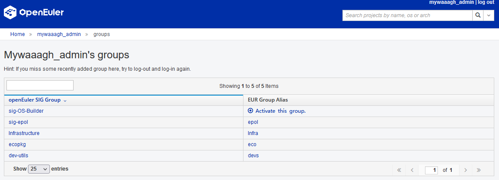
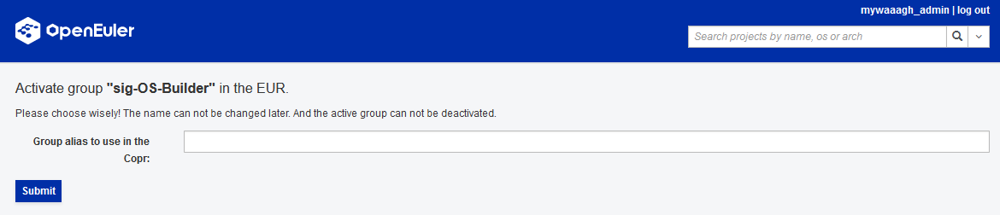
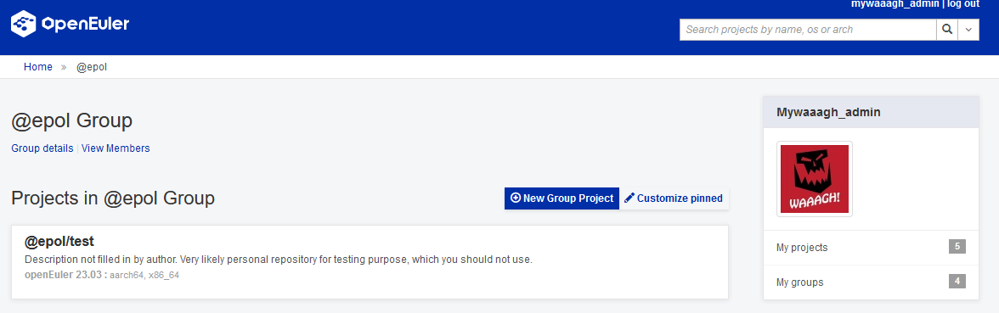
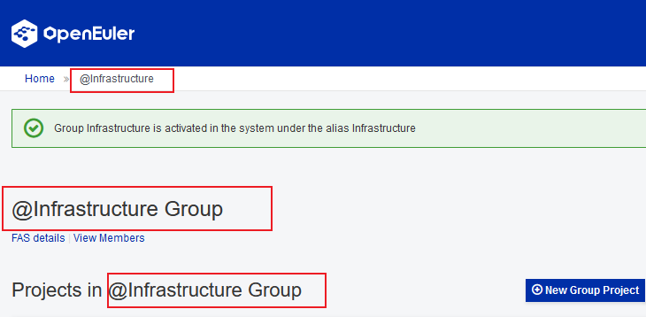

## Background
After a user logs in to EUR using the openEuler ID, the created projects are placed under the user's name. Some SIG users may expect to maintain software packages or projects in the name of SIGs.

To meet this requirement, the EUR development team recently updated the user group functions.

## How to Use EUR Groups
The updated EUR group function allows developers to create projects not only in their own namespaces but also in names of their participated SIGs.

The application scenarios are as follows:

1. Assume that you are the `foo` user, a member of the `sig-infrastructure` SIG in the openEuler community. Upon the first login, you may find the `My groups` button is displayed on the sidebar.
    

1. Click the button to access another page where the group to which the user belongs and the group alias in the EUR system are displayed.
    

1. If a group is not activated by other users, `Activate this group.` is displayed. Click `+` to enter the activation page.

1. On the activation page, you can assign an alias to the current group. Note that a SIG can have only one alias and cannot be modified.
    

1. If a group has been activated by other users, its alias is displayed on the right. You can click the alias to go to the user group management page, and then create projects in the user group.
    

## FAQs
Q: Where can information about the EUR group be obtained?
A: You can obtain the member information of each SIG through `https://gitee.com/openeuler/community`. The members of a SIG include `maintainer` and `committer`.

Q: If a user's SIG information is changed, when will the change take effect in the EUR?
A: The change takes effect when the user re-logs in to the system.

Q: What are the differences between the software packages of projects under a group and those of projects under an individual?
A: There is no difference in usage. To distinguish from individual users, an at sign (@) is added before the group name on the frontend page.

