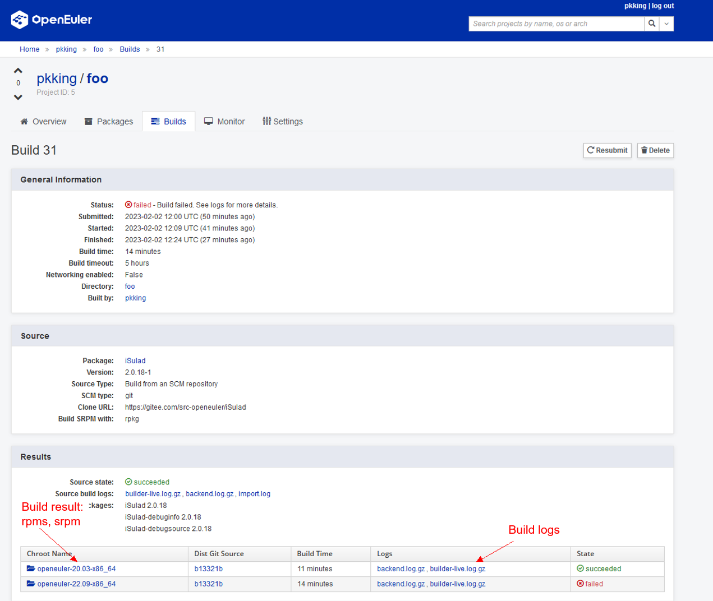

## TL;DR
The openEuler user repository is built based on the [copr](https://github.com/fedora-copr/copr) project. If you are familiar with copr, you can directly start your journey with the [openEuler user repository](https://eur.openeuler.openatom.cn/).


## Overview
This document describes how to use the openEuler user repository. Feedback channels are as follows:
- Submit an issue on [Gitee](https://gitee.com/openeuler/infrastructure/issues/new?title=[About%20EUR]&issue%5Bissue_type_id%5D=382993).
- Leave your questions on the [openEuler forum](https://forum.openeuler.org/).

## Basic Concepts

Before using the openEuler user repository, you need to know the following concepts:  
1. User: A user is the entity that uses the system and initiates all operations.  
1. Project: Each user can create multiple projects to organize one or more software packages by creating a software package repository for each openEuler release.  
1. Software package: source package  
1. Build: context of a build of an RPM package, including the srpm package and some RPM packages generated during the build process.  
1. Repository: software package repository built for a openEuler release  
```
└── User
    ├── Project
    │   └── package 1
    │       ├── build 1
    │       │   └── log
    │       ├── build 2
    │       │   └── log
    │       ├── build 3
    │       │   └── log
    │       │   └── rpms
    │       │   └── src.rpm
    │   └── package 2
    │   └── repo for 22.03-x86_64
    │       ├── pkg1.noarch.rpm
    │       ├── pkg1-debuginfo.rpm
    │       ├── pkg2.x86_64.rpm
    │       ├── pkg2-debuginfo.rpm
    │   └── repo for 22.03-aarch64
```

## How to Use
### Preparations
An openEuler account is required. If you do not have an account, register one in the [openEuler account center](https://id.openeuler.org/en/profile).<br>

<br>

Register or log in to your openEuler account.<br>

<br>

Go to the home page of the [openEuler user repository](https://eur.openeuler.openatom.cn/).<br>

<br>

Use your openEuler ID to log in. After the login, your profile is displayed.<br>

<br>

### Building a Project
Click **New Project** to create a project.  
- **Project Name**: This parameter cannot be modified after the project is created.  
- **Description**, **Instructions**, **Homepage**, and **Contact**: These parameters are optional and can be modified after the project is created.  
- **Chroots**: This parameter is mandatory and can be modified after the project is created. Select a required software package build environment.  
- **External Repositories**: This parameter is optional. Input software repositories on which the build process depends.<br>  

<br>

Click **Create**.

<br>

After the project is created, you can download the repository configuration file of a required version under **Repo Download**. (No software package is available in the current repository.)

Then, let's build a simple software package!  
Click the **Packages** tab and then click **Create a New Package**.<br>

<br>

We can directly add the isulad software package of openEuler because it contains the SPEC file and source package required for the build.<br>

<br>

After the software package is created, click **Rebuild** to trigger a build.<br>

<br>


Click **Build**. The background build system starts to build your software package.
You can click the task ID to view task logs in real time.<br>

<br>

In the task details, you can view the compilation logs and generated RPM packages.<br>

<br>

Content in chroot<br>

<br>

### Building a Software Package on PyPI
The user repository provides the capability of quickly packaging software packages on PyPI. When adding a software package, you can directly add the name of the software package on PyPI.<br>

<br>
### Building a Software Package on RubyGems
You can build a software package on RubyGems following `Project > Builds > New Build`.

<br>

## Using the User Repository
Go to the project homepage and obtain the repository configuration file of the corresponding version.<br>

<br>

Run `cd /etc/yum.repos.d/ && curl -OL <your repo url>` to download the corresponding repository configuration.
Run `dnf in <package name>` to install the software package in the corresponding repository. Each project has an independent GPG key to sign the RPM packages.<br>

<br>

## Related Resources
1. The user repository uses [pyporter](https://gitee.com/openeuler/pyporter) of the openEuler community to automatically pack packages on [PyPI](https://pypi.org). If you have any questions, please submit a [quick issue](https://quickissue.openeuler.org/en/issues/) or [issue](https://gitee.com/openeuler/pyporter/issues).
1. The user repository uses [rubyporter](https://gitee.com/openeuler/rubyporter) of the openEuler community to automatically pack packages on [RubyGems](https://rubygems.org/). If you have any questions, please submit a [quick issue](https://quickissue.openeuler.org/en/issues/) or [issue](https://gitee.com/openeuler/rubyporter/issues).
