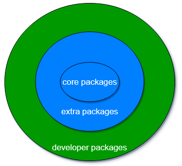

# What Is EUR?
[openEuler User Repo (EUR)](https://eur.openeuler.openatom.cn/) is an individual software package hosting platform developed by the openEuler community. It aims to provide an easy-to-use software package distribution platform for developers.

# Why EUR?

In the world of operating systems, a software package is privileged because its richness in content and handiness in distribution determine the user and developer experience to a great extent. Assume that the following scenarios may occur:
- Developers expect to continuously integrate software under development with the openEuler community as soon as possible and release the software to their own users for testing.
- A new package is introduced, but multiple dependent software packages do not exist in the community, which greatly increases the workload of developers.
- Users expect to use or integrate the nightly or unstable build of a software package on openEuler 20.03 LTS.

There is no ideal out-of-the-box solution in the infrastructure of the openEuler community.

After careful analysis of the preceding scenarios, it is found that the community has a problem of balancing software package richness and quality. After discussion with the TC members of the community, software packages are further classified as follows.

- Core packages: software packages maintained by SIGs and developers of the openEuler community.
- Extra packages: software packages that do not meet the quality requirements of the community, such as EPOL or oepkgs, but are still available.
- Developer packages (hosted on EUR): software packages that are completely maintained by developers or individuals. Those packages hosted on EUR do not need to comply with most constraints and quality requirements for software packages in the openEuler community.

# What Kind of EUR Do We Need?
Based on the preceding software package classification model, developer packages require a simple and lightweight software package distribution platform that is:
- Friendly to developers and upstream ecosystems;
- Able to build software packages for different openEuler versions.
- Open to users to release software packages independently.
- Independent from the community version.

Since the objectives and requirements for EUR are similar to those for [Copr](https://github.com/fedora-copr/copr), according to communication with the Copr development team, the openEuler community decided to use Copr to build the first version of EUR.

# What Can EUR Do?
EUR is positioned as a personal repository for developers, similar to PPA of Ubuntu and Copr of Fedora. EUR supports automatic packaging of software from PyPI and RubyGems (more methods will be extended in the future). Continuous build can be automatically triggered through webhooks. In the future, software packages in the personal repository can be introduced to the community by one click.

# Who Is EUR Intended For?
If you:
1. Want to quickly package software from PyPI and RubyGems.
1. Want to add the latest software package or variant version to a released openEuler version (for example, the [i3wm repository for openEuler](https://eur.openeuler.openatom.cn/coprs/mywaaagh_admin/i3wm/) recently provided on EUR).
1. Want to provide a repository for continuous integration with openEuler for software still under development.
1. Want to package a piece of software into an RPM package for your own use.
1. Want to test whether the spec file is correct before contributing a software package to the community.

You are advised to use [EUR](https://eur.openeuler.openatom.cn/) to quickly build an individual repository and distribute your software packages.
