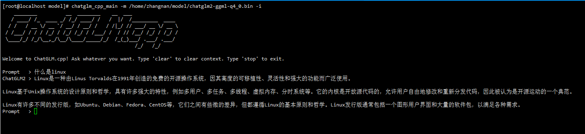
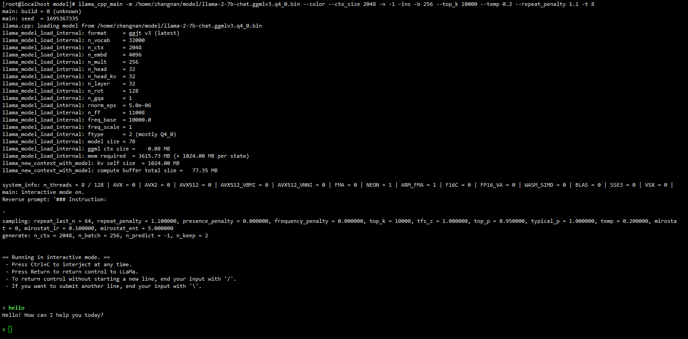

# Introduction to LLM

This blog describes how to install and develop a Large Language Model (LLM) on openEuler. LLMs are artificial intelligence models designed to understand and generate human languages. They are trained on a large amount of text data and can perform a wide range of tasks, including text summary, translation, sentiment analysis, and so on.

This article is intended for community developers, open source enthusiasts, and partners who use the openEuler OS and want to learn and use LLM. Users must have basic knowledge of the Linux OS.

# chatglm-cpp Usage Guide

## Introduction
chatglm-cpp is a ChatGLM model interface based on C/C++. It allows users to deploy and use open source models on CPU machines.

It supports the deployment of multiple open source Chinese LLMs, such as ChatGLM-6B, ChatGLM2-6B, and Baichuan-13B.

## Software Architecture
The chatglm-cpp core architecture consists of two layers:
- Quantization layer: quantifies open source models to reduce the model size.
- Startup layer: starts a quantized model.

Features:
- Implemented in GGML-based C/C++.
- Accelerated CPU inference with int4/int8 quantization, optimized KV cache and parallel computing.
- Streaming generation with typewriter effect.
- No GPU is required. Only the CPU can be used.

## Installation Guide
### Software and Hardware Requirements 
Processor architecture: AArch64 and X86_64

OS: openEuler 23.09

Memory: at least 4 GB, depending on the size of different open source models.

### Installing Components
Before using chatglm-cpp to deploy an LLM, install the chatglm-cpp software package. Before the installation, ensure that the openEuler yum source has been configured.

1.  Install the package.
```
yum install chatglm-cpp
```
2.  Check whether the package is installed.
```
chatglm_cpp_main -h
```
If the help information is displayed, the installation is successful.

## Instructions
### No Containers
1.  Install the chatglm-cpp software package.
```
yum install chatglm-cpp
```
2.  Download open source LLMs, such as ChatGLM-6B and ChatGLM2-6B. Use **chatglm_convert.py** to quantify the downloaded open source LLM.
```
python3 /usr/bin/chatglm_convert.py -i model_path/ -t q4_0 -o chatglm-ggml_1.bin
```
*model_path* indicates the path for storing the open source LLM, *q4_0* indicates the quantization precision, and **chatglm-ggml_1.bin** indicates the name of the output model.

3.  Start the model and start a dialog.
```
chatglm_cpp_main -m model_path  -i
```
*model_path* indicates the path for storing the quantized model.

You can run the following command to view the usage of command line options:
```
chatglm_cpp_main -h
```
### Using a Container
1. Pull a container image.
```
docker pull hub.oepkgs.net/openeuler/chatglm_image
```
2. Run the container image and start a dialog.
```
docker run -it --security-opt seccomp=unconfined hub.oepkgs.net/openeuler/chatglm_image
```
### Normal Startup Page
Figure 1 shows the interface after the ChatGLM2-6B model is started.

Figure 1 ChatGLM2-6B model startup interface

## Specifications
This project allows you to deploy and infer LLMs on CPU-level machines. However, the model inference speed is hardware-dependent. If the hardware is set to the lowest settings, the inference speed may be slow, which can lower usage efficiency.

Table 1 lists reference inference speed in different machine configurations.

The table shows that Q4_0, Q4_1, Q5_0, and Q5_1 represent the quantization precision, while ms/token indicates the duration in milliseconds spent by each token inference, which is a measure of inference speed. A smaller value for ms/token indicates a higher inference speed.

Table 1 Test data of the ChatGLM-6B model inference speed

| ChatGLM-6B            | Q4_0 | Q4_1 | Q5_0 | Q5_1 |
|--------------------------------|------|------|------|------|
| ms/token (CPU @ Platinum 8260) | 74   | 77   | 86   | 89   |
| Model size                     | 3.3 GB| 3.7 GB| 4.0 GB| 4.4 GB|
| Memory usage                     | 4.0 GB| 4.4 GB| 4.7 GB| 5.1 GB|

# llama.cpp Usage Guide

## Introduction
llama.cpp is a LLaMa model interface based on C/C++. It allows users to deploy and run open source models on CPUs.

llama.cpp supports the deployment of multiple open source English LLMs, such as LLaMa, LLaMa2, and Vicuna.

## Software Architecture
The llama.cpp core architecture consists of two layers:
- Quantization layer: quantifies open source models to reduce the model size.
- Startup layer: starts a quantized model.

Features:
- Implemented in GGML-based C/C++.
- Accelerated CPU inference with int4/int8 quantization, optimized KV cache and parallel computing.
- Streaming generation with typewriter effect.
- No GPU is required. Only the CPU can be used.

## Installation Guide
### Software and Hardware Requirements
Processor architecture: AArch64 and X86_64

OS: openEuler 23.09

Memory: at least 4 GB, depending on the size of different open source models.

### Installing Components
Before using llama.cpp to deploy an LLM, install the llama.cpp software package. Before the installation, ensure that the openEuler yum source has been configured.
1.  Install the package.
```
yum install llama.cpp
```
2.  Check whether the package is installed.
```
llama_cpp_main -h
```
If the help information is displayed, the installation is successful.


## Instructions
### No Containers
1.  Install the llama.cpp software package.
```
yum install llama.cpp
```
2.  Download open source LLMs, such as LLaMa and LLaMa2. Use **llama_convert.py** to quantify the downloaded open source LLM.
```
python3 /usr/bin/llama_convert.py  model_path/
```
*model_path* indicates the path for storing the open source LLM.

3.  Start the model and start a dialog.
```
llama_cpp_main -m model_path --color --ctx_size 2048 -n -1 -ins -b 256 --top_k 10000 --temp 0.2 --repeat_penalty 1.1 -t 8
```
*model_path* indicates the path for storing the quantized model.

You can run the following command to view the usage of command line options:
```
llama_cpp_main -h
```
### Using a Container
1.  Pull a container image.
```
docker pull hub.oepkgs.net/openeuler/llama_image
```
2. Run the container image and start a dialog.
```
docker run -it --security-opt seccomp=unconfined hub.oepkgs.net/openeuler/llama_image
```
### Normal Startup Page
Figure 2 shows the GUI after the LLaMa2-7B model is started.

Figure 2 LLaMa2-7B model startup interface

## Specifications
This project allows you to deploy and infer LLMs on CPU-level machines. However, the model inference speed is hardware-dependent. If the hardware is set to the lowest settings, the inference speed may be slow, which can lower usage efficiency.

Table 2 lists reference inference speed in different machine configurations.

The table shows that Q4_0, Q4_1, Q5_0, and Q5_1 represent the quantization precision, while ms/token indicates the duration in milliseconds spent by each token inference, which is a measure of inference speed. A smaller value for ms/token indicates a higher inference speed.

Table 2 Test data of the LLaMa-7B model inference speed

| LLaMa-7B            | Q4_0 | Q4_1 | Q5_0 | Q5_1 |
|--------------------------------|------|------|------|------|
| ms/token (CPU @ Platinum 8260) | 55   | 54   | 76   | 83   |
| Model size                     | 3.5 GB| 3.9 GB| 4.3 GB| 6.7 GB|
| Memory usage                     | 3.9 GB| 4.2 GB| 4.5 GB| 5.0 GB|
