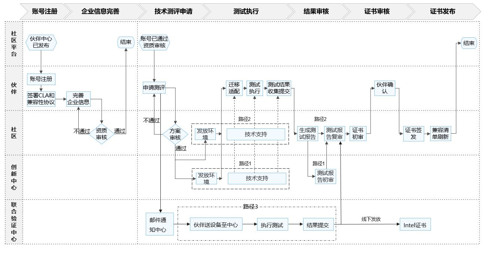

# Intel® Platform Advanced Technology Validation Specifications

### 1. Validation process

The Intel Advanced Technology Evaluation adopts the existing openEuler compatibility testing framework and introduces a test suite specific to Intel platforms.
<!-- // TODO:是否需要 -->

### 2 Checklist

#### 2.1 Hardware Platform

Currently, the test suite of the Intel Advanced Technology Validation supports the fourth generation and subsequent Xeon® processor platforms from Intel. It is necessary to check whether the CPU model of the tested platform is listed below:

- SPR (Sapphire Rapids): 4th Generation Intel® Xeon® Scalable Processor
- EMR (Emerald Rapids): 5th Generation Intel® Xeon® Scalable Processor
- SRF (Sierra Forest): 6th Generation Intel® Xeon® Scalable Processor
- GNR (Granite Rapids): 6th Generation Intel® Xeon® Scalable Processor

#### 2.2 Firmware Version

Ensure that the firmware has been updated to the latest version.

#### 2.3 Operating System

Currently supported openEuler version: openEuler 24.03 LTS

Note: Currently, openEuler 22.03 LTS SP4 includes full feature support for Sapphire Rapids and Emerald Rapids, while Sierra Forest and Granite Rapids include selective feature support.

### 3 Test Case

#### 3.1 List of Test Cases

| Platform Feature                            | Test Case                    |
| ------------------------------------------- | ---------------------------- |
| Intel Advanced Matrix Extensions (AMX)      | amx/tmul: tests-amx          |
| Intel Advanced Vector Extensions (AVX512)   | avx512vbmi: tests-avx512vbmi |
| C-State                                     | cstate: tests-cstate         |
| Intel Data Stream Accelerator (DSA)         | dsa: tests-dsa1              |
| Intel In-Memory Analytics Accelerator (IAA) | dsa: tests-iax               |
| Intel In-Field Scan (IFS)                   | ifs: tests-ifs               |
| Intel Performance Counter Monitor (PMU)     | pmu: tests-pmu               |
| P-State                                     | pstate: tests-pstate         |
| Intel Running Average Power Limit (RAPL)    | rapl: tests-rapl             |
| Telemetry                                   | telemetry: tests-telemetry   |
| Topology                                    | topology: tests-topology     |
| User-Mode Instruction Prevention (UMIP)     | umip: tests-umip             |
| XSAVE                                       | xsave: tests-xsave           |

Note: The test cases may vary based on the differences in platform features and will also be updated or added according to the integration of features in the openEuler system. Intel technologies may require the activation of hardware, software, or services; see [the legal notice and disclaimer © Intel Corporation](https://edc.intel.com/content/www/us/en/products/performance/benchmarks/overview/).

### 4 Contact Information

Evaluation Application Email: [intel-openeuler-certification@intel.com](mailto:intel-openeuler-certification@intel.com)

