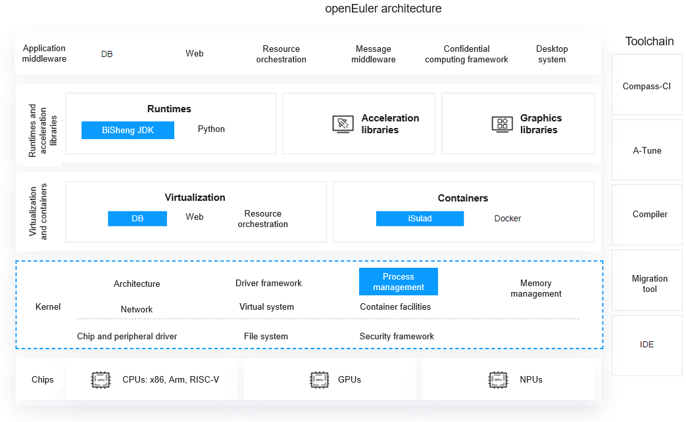

<SeoBox :seo-data="seoConfig[lang]?.migrationBackground" />

<h2 id='background' style="margin-top:0;">Background</h2>

As the EOM for the original OS approaches, migrating to a new OS becomes imperative to ensure service continuity and security. Digital transformation now requires OSs must adapt to new architectures and scenarios, requiring systematic migration solutions and tools to ensure seamless migration. Enterprises must adopt future-oriented strategies. Comprehensive support, reliability, and stability are needed for sustainable development and product innovation. openEuler provides an efficient and reliable platform on which to migrate and port your systems.

## Introduction to openEuler

### Open Source OS for Digital Infrastructure

openEuler is an open source OS oriented to digital infrastructure that fits any server, cloud computing, edge computing, and embedded deployment. It is secure, stable, and easy-to-use and can connect with multiple computing architectures.

### Focusing on Kernel Capabilities, Unleashing Diverse Computing Power, and Leading OS Innovation

openEuler is a native open source OS that evolves independently to meet needs for sustainable development. For the kernel, openEuler has made innovations in multi-core scheduling, diverse compute, and support for memory-centric architectures. What’s more, since 2012 openEuler has made countless contributions to the Linux Kernel community, ranking No.1 in kernel code contribution in Linux Kernel 5.10/5.14.

### openEuler Architecture

An innovative architecture is the foundation for full-stack optimization, helping unleash excellent compute and support digital. It consists of the acceleration libraries, virtualization, kernel, driver, compiler, OS tool, OpenJDK, and other components.

