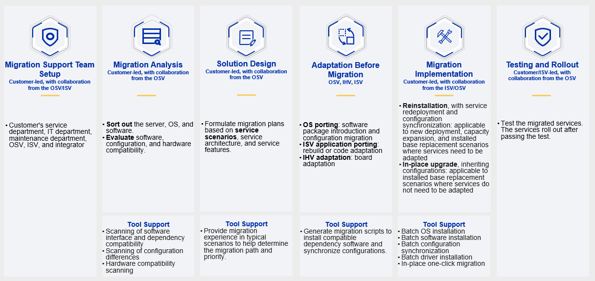
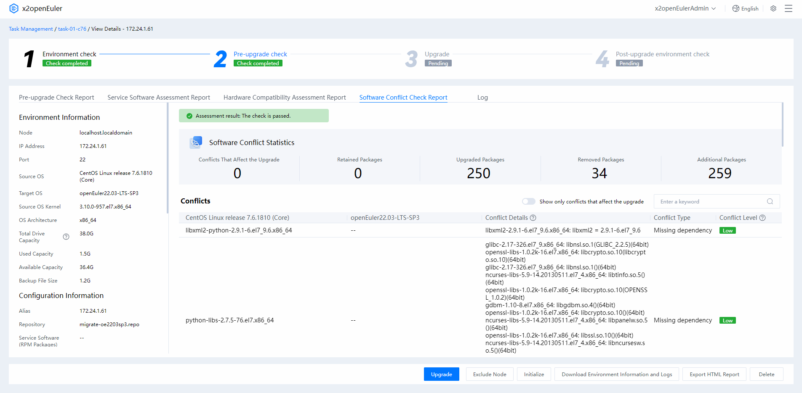
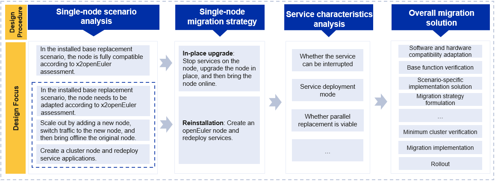
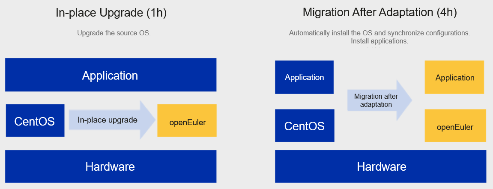
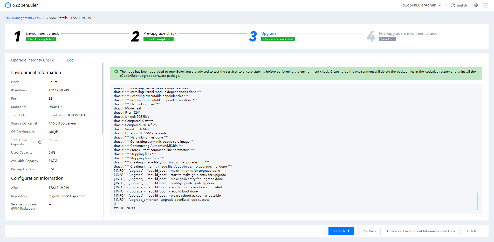

<SeoBox :seo-data="seoConfig[lang]?.migrationBackground" />

<h2 id='Migration-Overview' style="margin-top:0;">Migration Overview</h2>

openEuler provides an efficient, reliable solution for users and enterprises to streamline their OS migrations. Here, you can perform migration with subsequent analysis, design a migration plan, adapt software before migration, and conduct testing and service rollout. The x2openEuler tool is an openEuler offering used for migration assessment and in-place upgrades.

[x2openEuler](/en/migration/download/) is a migration tool designed to facilitate the transition from various source OSs to openEuler 20.03. To streamline issues arising from manual operations and batch operations (or the lack thereof), x2openEuler provides a streamlined interface to perform in-place upgrade of OSs in batches. You can batch add nodes to be upgraded for analysis, planning, and compatibility tests. Then batch upgrade the adapted nodes to achieve an end-to-end seamless migration.

## Migration Process

On openEuler, migration is completed in just six steps: create a migration support team, analyze migration needs, design a plan, adapt software, migrate the OS, and perform testing and rollout.

## Creating a Migration Support Team

When planning to migrate an OS, set up a migration support team comprising members from your company's service, IT, and maintenance departments, as well as from the OSV and ISV. The team will provide technical support and organizational assurance during the operation.

## Conducting Migration Analysis

After the support team is set up, your company needs to determine the project overview, which starts with collecting the names and requirements of services to be migrated, and the software stacks, deployment modes, and server hardware information. The information should be filtered by service provider, OS, and hardware environment, with specified service priority. Then, assess the compatibility in an assessment report of the OS hardware, software, and configurations with openEuler by referring to the [x2openEuler User Guide](https://docs.openeuler.org/en/docs/20.03_LTS_SP1/docs/x2openEuler/Introduce.html), and supplement or replace incompatible software packages.

x2openEuler can generate a pre-upgrade compatibility assessment report, which includes the following info:

- Software assessment

  Lists application software dependencies and scans and assesses application software.

* Configuration collection and assessment

  Collects user environment data and generates configuration files; collects information about the systemd service, kernel parameters, networks, and drive mounts; and analyzes and assesses configurations.

- Hardware assessment

  Checks whether the system (x86/AArch64) and boards (RAID/NIC/FC/IB/GPU/SSD/TPM/AI) in the operating environment are supported in the [openEuler compatibility list](https://www.openeuler.org/en/compatibility/).

## Designing a Migration Plan

Formulate a migration policy for each service node based on the compatibility assessment report and migration priority, then determine a plan on how to deploy services, whether parallel replacement is viable, and length of RPO.

    

      

        <o-icon><icon-book></icon-book></o-icon>
        
Note

      

      

        OS migration includes that between the same and across different architectures. For the latter, application software must be ported before migrating the OS.
      

    

### Migration Priorities

Priorities can be set for services based on their attributes. The following three service attributes are for reference only.

- Language

  - Java: Java applications are masked by the Java Development Kit (JDK) and have good compatibility. JDK 8 or later has high priority.

  - C: Services that pass the compatibility assessment have high priorities, whereas those that need to be ported have low priorities.

  - Python: Python 3 and Python 2 services have high priorities.

* Service deployment mode

  - Cluster services have high priorities.

  - Active/standby services have high priorities.

  - Single-node services have low priorities.

- Service status

  - Stateless services (not involving local storage or configuration data) have high priorities.

  - Stateful services (involving local data) have low priorities.

### Migration Scenarios

Determine the migration scenario based on the service system status, and formulate and implement the migration plan. The migration scenarios are as follows:

- New: A new OS is required for a new service.

- Scale-out: A new OS required for the newly added nodes and service nodes that have been running for a period of time.

- Installed base replacement: Replace the existing node OS that has been running for a period of time with a new OS.

## Adapting Software

x2openEuler generates a detailed compatibility assessment report that lists the software to be adapted. Based on the report, adapt your software pre-migration, and then post-migration deploy them on the new OS. For details about typical software porting and adaptation, see [Porting Guides](/en/migration/transplantation-cases/).

- Software adaptation

  a.&nbsp; Application software adaptation: Contact software vendors or proprietary software owners.

  b.&nbsp; OS software adaptation: Import the missing dependencies listed in the report. If you have any issues, submit them through [QuickIssue](https://quickissue.openeuler.org/en/new-issues/).
  
  (Optional) After the software is adapted, import the software packages to the community software repository and update the software compatibility list as required.

    

      

        <o-icon><icon-book></icon-book></o-icon>
        
Note

      

      

        Compatible software can be directly used.
      

    

- Configuration collection and adaptation

  x2openEuler offers the configuration migration function to automatically analyze four types of system configurations (service, network, kernel, and mount). Based on requirements and policies, analyze the configuration items to be synchronized and select the configuration items to be modified. Then, x2openEuler generates an automation script to implement one-click configuration synchronization.

* Hardware adaptation

  a.&nbsp; Check the hardware type that needs to be confirmed in the hardware compatibility assessment report.

  b.&nbsp; Guide hardware vendors or communities to perform adaptation. For details, see [Overall Introduction to the openEuler Hardware Compatibility Test](https://www.openeuler.org/en/compatibility/hardware/).

  c.&nbsp; After the software is adapted, release the adapted driver to [OEPKGS](https://repo.oepkgs.net/openEuler/rpm/) and update the compatibility list.

  d.&nbsp; When the value of **Compatible or Not** changes to **Yes**, the hardware has passed the compatibility test.

## Implementing Migration

#### Precautions

- Migration operations may affect service runtime. Consider a suitable migration time and required resources in advance.

- In installed base replacement operations, back up the system before migration. This is because software packages need to be upgraded or reinstalled after the migration.

- Currently, 32-bit OSs are not supported. If 32-bit applications are required, contact the community or OSVs.

- It is recommended that experienced perform live network migration. Contact the O&M personnel of the OS vendor for technical support.

#### Migration Paths

openEuler supports two migration paths:

- In-place upgrade. Upgrade the existing OS to the target OS. The system configurations and service data can be directly reused.

- Migration after adaptation. Reinstall the OS on the new hardware or the original hardware, and deploy services again to replace the old nodes.

You are advised to use x2openEuler to assess software compatibility and select a migration path that fits your requirements. After formulating the overall migration plan, you can start service migration. With the x2openEuler tool and compatibility assessment report, fully compatible services can be directly upgraded while retaining the original services and configurations. For details about the in-place upgrade, see the [x2openEuler User Guide](https://docs.openeuler.org/en/docs/20.03_LTS_SP1/docs/x2openEuler/Introduce.html). For migration after adaptation, operations include stopping service, isolating backups, deploying the system and applications, synchronizing configurations, and service cutover. Contact us for a detailed technical guide.

## Performing Testing and Rollout

You can use the test cases and methods of the original service system to perform unit and system integration tests. You can also perform quick tests for core functional modules, which brought online only after they pass the tests. After services are brought online, the running status needs to be continuously monitored for one to three months to ensure a healthy system runtime.

Analyze the performance data collected in the tests and determine whether to perform performance optimization. The openEuler open source community provides a performance optimization tool [A-Tune](https://www.openeuler.org/en/other/projects/atune/) to help optimize system and application performance.

Security vulnerability update and maintenance is one of the major issues and risks faced by the services after they are rolled out. openEuler has set up a security committee and developed a [vulnerability handling process](https://www.openeuler.org/en/security/vulnerability-reporting/) to help you cope with such issues.

