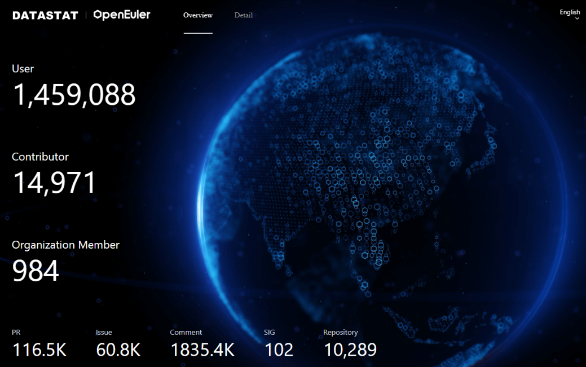

Dear Developers,

We are thrilled to present the inaugural edition of our openEuler Buzz
(community progress update)! As an essential part of our community, we
want to ensure you stay informed about the latest developments in the
openEuler ecosystem.

In this edition, we will highlight current community scale, activities,
and exciting tech progress that you don\'t want to miss. openEuler is an
open-source, community-driven operating system designed to empower
developers like you to collaborate, innovate, and build remarkable
solutions.

**Community Scale**

In June 2023, the number of openEuler community users exceeded 1.45
million. More than 148,00 developers have made continuous contributions
to the community, producing 113.9K PRs and 59.8K issues. So far, 967
organization members have joined the openEuler community, among which 84
organizations joined in June. Get to know the latest statistic via
<https://datastat.openeuler.org/en/overview>.

**openEuler RISC-V Release Won the First Prize of the Latest China
Open Source Innovation Competition**

openEuler RISC-V Release, jointly developed by the Institute of
Software, Chinese Academy of Sciences and openEuler RISC-V SIG aims to
improve the openEuler software ecosystem based on the RISC-V
architecture, so that openEuler has sufficient software packages to meet
the application requirements of various industries and scenarios, and to
ensure the software availability, stability, performance, and system
security.

Currently, the openEuler RISC-V Release natively supports seven
development boards:

Nezha/D1

LicheeRV

SiFive Unmatched

VisionFive 1

VisionFive 2

SG2042(EVB)

LicheePi 4A

It also adapts to multiple desktop environments such as XFCE, DDE, UKUI,
GNOME, Kiran, and Cinnamon.

**openEuler x Kuasar Container Runtime Meetup Held**

In May, the openEuler Container Runtime Meetup took place online,
bringing together experts in the field to explore the latest advances in
container runtime and sandbox technologies. The event was jointly
sponsored by openEuler and Kuasar, and featured a lineup of impressive
speakers, including Michael Yuan, founder of WasmEdge, Yulin Sun, CEO of
QuarkSoft, and developers of openEuler iSulad and Kuasar.

**Watch replay**: <https://youtu.be/oR-J7VcnMqs>

**openEuler SDS Meetup Successfully Held at Beijing**

On May 20, the openEuler SDS Meetup was held at Beijing. This Meetup is
jointly sponsored by XSKY & openEuler SDS SIG. More than 30 developers
from 19 enterprises attended onsite. During the Meetup, SDS experts and
developers discussed the latest progress and innovative applications of
SDS technologies in openEuler.

The openEuler community welcomes more community meetups, apply here:
<https://www.openeuler.org/zh/interaction/event-list/collect/>

If you need a platform to discuss cutting-edge technologies and open
source trends, don\'t hesitate to join us.

**openEuler Tutorials Now on YouTube**

Recently, openEuler G11N SIG and Kernel SIG jointly launched a series of
mini courses. Each course takes no more than 10 minutes to share
technical knowledge of operating systems in easy-to-understand
languages. The courses are now on YouTube, subscribe to our official
YouTube channels for new episodes.

Watch tutorials:
<https://www.youtube.com/playlist?list=PLtDfk9jvMAziPyVaA-DOkXx0GgIUjXc0_>

**2,000+ Pieces of Bioinformatics Open Source Software Natively
Support Kunpeng+openEuler**

Recently, the Bioconductor community, one of the largest communities in
the field of bioinformatics, announced that Kunpeng hardware+openEuler
OS has been selected as one of the [official verification
platforms](https://bioconductor.org/checkResults/3.18/bioc-LATEST/long-report.html).
The addition of support for Kunpeng hardware and openEuler open source
operating system for over 2,000 pieces of open source software means
that universities, research institutes, and enterprises can directly use
these software pieces on Kunpeng.

Make sure to keep an eye on your inbox as we continue to deliver regular
openEuler Buzz directly to you. We aim to keep you inspired and
well-informed, enabling you to make the most of your openEuler journey.
**openEuler 22.03 LTS SP2 Released**

On June 30th, openEuler 22.03 LTS SP2 was released. This version is
aimed at application scenarios such as servers, cloud-native, edge, and
embedded, and is built on Linux Kernel 5.10, with external interfaces
following the POSIX standard. At the same time, openEuler 22.03 LTS SP2
integrates distributed software bus, KubeEdge+ edge-cloud collaborative
framework, and other capabilities, further enhancing the collaborative
ability of digital infrastructure.

**Download to try:**
<https://www.openeuler.org/en/download/?version=openEuler%2022.03%20LTS%20SP2>

**OEPKGS Officially Launched**

The [Open External Packages Service(OEPKGS)](https://docs.openeuler.org/en/docs/22.03_LTS_SP1/docs/oepkgs/overview.html)
is officially launched, providing more than 30,000 compatible software
packages for openEuler. It supports one-stop compatibility software
packages for developers and OSVs who want to port CentOS and Fedora to
openEuler.

In addition, OEPKGS launches multiple services for the openEuler
ecosystem, such as RPM software package retrieval, metadata analysis,
SBOM and supply chain analysis, and security and compliance risk
analysis.

**openEuler Successfully Adapts to the LeapFive InFive Poros Development Board**

Recently, the innovative version of openEuler RISC-V 23.03 was
successfully run on the Poros development board from LeapFive. The XFCE
desktop booted up smoothly, and related GUI applications such as file
systems, terminal emulators, and input methods also ran smoothly.
Applications such as Chromium browser and LibreOffice were also
supported. Currently, the graphics interface relies on LLVMpipe
rendering, and LeapFive will strengthen GPU driver optimization in the
future.

**Musl libc Library Successfully Adapted to openEuler Embedded**

The adaptation of musl libc library has been achieved on the openEuler
embedded operating system, replacing the glibc library to build images.
Currently, images compiled with musl libc as the base library are
available on the Raspberry Pi4 development boards.

**ROS SIG Will Introduce ROS2-humble in openEuler 22.03 SP2**

As the application of ROS becomes increasingly diverse, ROS2 was
developed to meet the growing needs of robot applications. Humble is a
long-term support (LTS) version of ROS2 with a mature ecosystem. ROS SIG
plans to introduce ROS2-humble in the openEuler sp2 version, involving
more than 450 software packages. After successful porting, users will be
able to use ROS2 through openEuler and develop robot algorithms and
software based on ROS2, supporting algorithms such as robot mapping,
localization, navigation, and more.

**sysMaster Project Released**

\"sysMaster\" is an improvement and exploration by openEuler, addressing
issues and characteristics encountered in Linux system initialization
and service management across different scenarios. It aims to enhance
the traditional init daemon by providing a unified solution for system
initialization and service management, supporting process, container,
and virtual machine management in embedded, server, and cloud
environments. Implemented in Rust, it incorporates various techniques
such as fault monitoring and sub-second self-healing to enhance OS
stability and business availability.

**Learn more:**
<https://www.openeuler.org/en/blog/20230512-sysMaster/20230512-sysMaster.html>

{width="5.768055555555556in"
height="2.7487281277340334in"}

**- OrbStack Supports openEuler Distribution**

[OrbStack](https://orbstack.dev/), a lightweight virtual machine
platform for Mac, now supports the openEuler distribution. Developers
can easily download OrbStack from their official website and create a
virtual machine by simply clicking on the appropriate openEuler version.
Once the creation process is complete, they can use openEuler through
the command line.

**RocketMQ on openEuler Provides A Stable Solution for High-Performance Message Queues**

RocketMQ on openEuler is a way to deploy the RocketMQ message middleware
on the openEuler operating system through containerization. With the
enhanced kernel features of openEuler for OS cache recycling efficiency,
it improves the stability and reliability of the message middleware in
scenarios with ultra-large-scale high-concurrency, high-throughput, and
low-latency, making it a reliable software solution.

This is a brief wrap-up for the openEuler community in May and June.
Thanks for your support.

If you have any questions, suggestions, or would like to contribute to
the openEuler community, feel free to reach out to us at
<public@openeuler.org>. Your input and engagement are greatly
appreciated!

**Engage with us:**

Twitter: <https://twitter.com/openEuler>

LinkedIn: <https://www.linkedin.com/company/86315548>

YouTube: <https://www.youtube.com/@openeuler>

Slack:
<https://join.slack.com/t/openeulerhq/shared_invite/zt-1z1kgmtw4-AiBozBdxi1IC8wf6Rgx1tQ>

Reddit: <https://www.reddit.com/r/openEuler/>

Best regards,

openEuler Community Team
