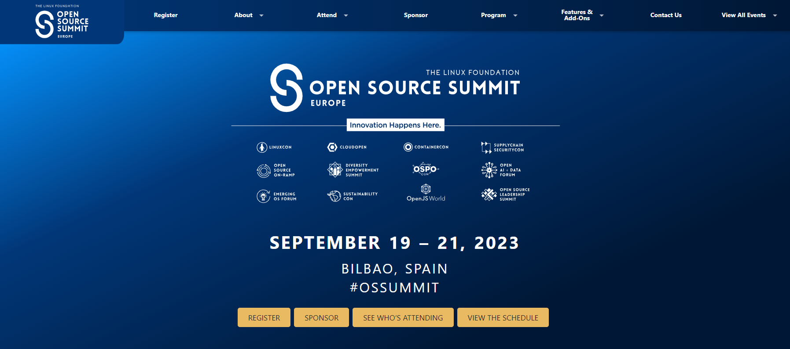
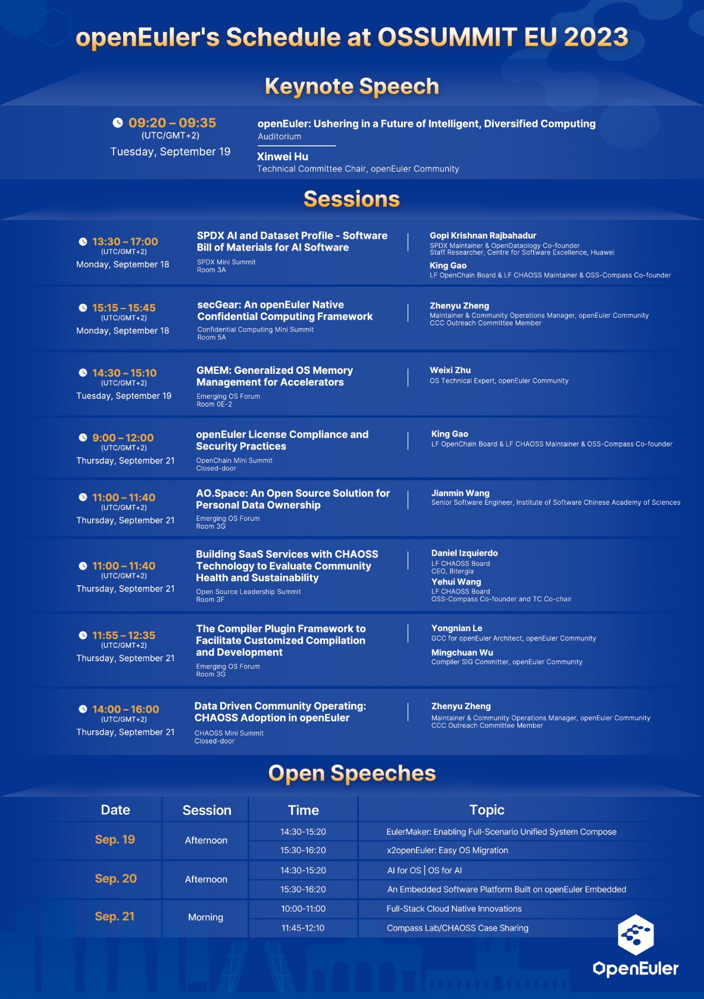
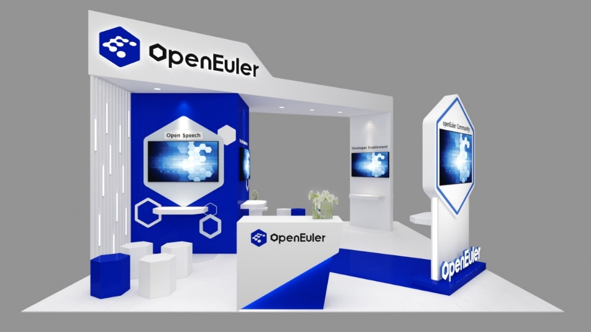
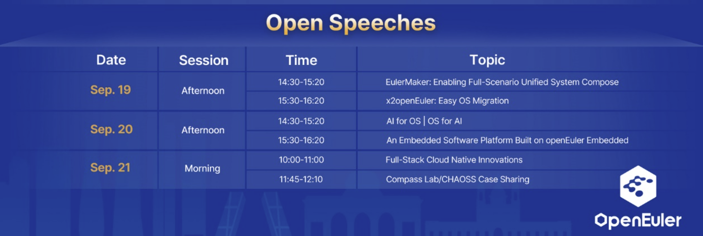
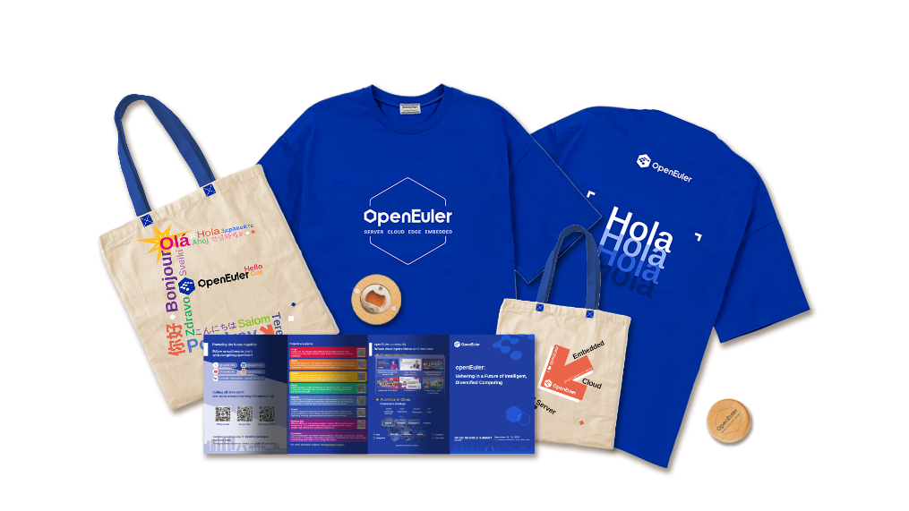
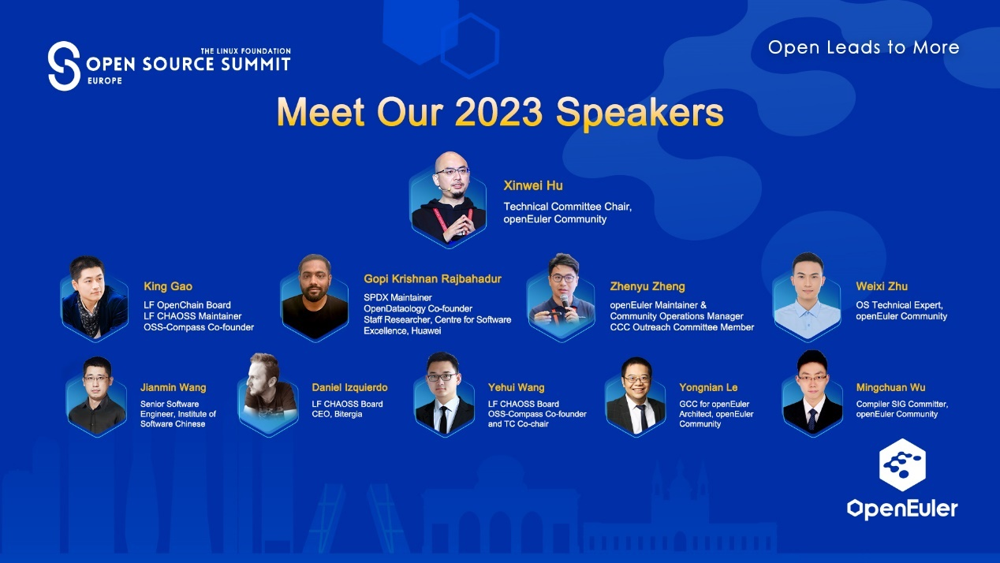

openEuler is ready to dazzle the world again at the Open Source Summit
Europe (OSSUMMIT EU) 2023, which will take place from September 19 to 21
in Bilbao, Spain. This is the second time that openEuler attends this
prestigious event, after making its official debut last year. #OSSUMMIT
is the premier event for open source #developers, #technologists and
#community leaders to collaborate, share information, solve problems and
gain knowledge.

**What will openEuler bring**

At the summit, openEuler will bring you:

-   **Keynote speech**: Xinwei Hu, openEuler Technical Committee Chair,
    will give a keynote speech sharing how openEuler is ushering in a
    future of intelligent, diversified #computing. In our rapidly
    evolving world, #AI has become an integral part of our daily lives,
    permeating every aspect of society, it prompts us to consider: what
    potential lies ahead of #OS in the future? The answer lies in the
    optimization of foundational software to accommodate multiple
    computing architectures, simplifying #programming and ensuring
    future #compatibility. Furthermore, AI-powered OSs can ensure that
    our digital experiences are secure and tailored to our individual
    needs. It is essential that this kind of OSs is created by
    communities and for communities. This is where openEuler, an open
    source OS community, comes into play.

-   **Diverse sessions**: The openEuler team will participate in
    discussions and presentations on various topics, covering areas such
    as AI, #cloudcomputing, future trends and emerging technologies,
    partnerships among the leading projects. You will be able to learn
    from the experts and exchange ideas with the peers on how to advance
    the development and innovation of open source OSs.

-   **Open exhibition area**: The openEuler community will showcase its
    latest achievements, innovative projects, and business progress at
    booth D1, where you can:

-   **OS for AI \| AI for OS:** See how openEuler leverages AI
    technology to optimize OS performance and how openEuler empowers AI
    #applications for a future of diversified, #intelligent computing.

-   **Versatile innovations:** Explore the innovation projects of
    openEuler, such as #iSulad, a lightweight #container engine,
    #StratoVirt, a lightweight #virtualization solution, etc, ignite
    your curiosity, and experience the forefront of technologies.

-   **Multi-architecture support:** See how openEuler supports multiple
    #architectures (x86, Arm, RISC-V, etc.) and multiple scenarios
    (servers, edge, cloud, #embedded), and how it provides
    high-performance, high-reliability and high-security OS services.

-   **Developer enablement:** Experience various developer enablement
    tools provided by openEuler, such as EulerMaker, openEuler DevKit,
    etc., and learn how to participate in community contributions.

-   **OSV distros & services**: Network with OSVs and other partners,
    like \@xFusion and \@Institute of Software, Chinese Academy of
    Sciences, to learn how openEuler builds an open, diversified
    software ecosystem through open community collaboration, and how it
    cooperates with other communities and organizations to jointly
    promote the development of open source.

-   **Open speeches:** Hear from experts and contributors of openEuler.

-   **More surprises:** We also have various openEuler-themed
    #merchandises waiting for you at booth D1. Come and get your
    favorite ones and show your support for openEuler!

**Meet our 2023 speakers**

**What else besides openEuler**

OSSUMMIT EU 2023 will also bring you a wonderful open source feast,
where you can hear from the leaders and experts, learn about the hottest
topics of open source, explore the amazing projects and solutions of
various communities and enterprises, and participate in various fun and
interactive activities. You will have a great opportunity to network
with open source enthusiasts from around the world.

**Call for registration and participation**

Don\'t miss this chance to be part of the global #opensource movement.
Let us witness and promote the development and innovation of open source
#operatingsystems together. Register now! If you want to know more about
openEuler, please keep an eye on our social media or visit the official
website. We look forward to seeing you at OSSUMMIT EU 2023!
