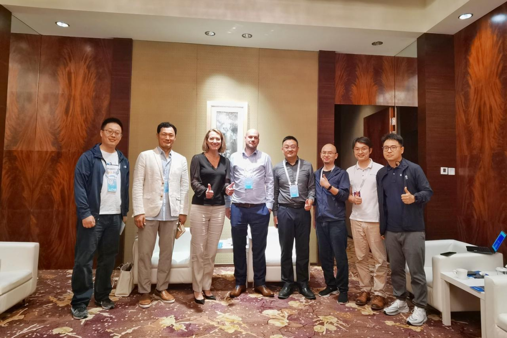
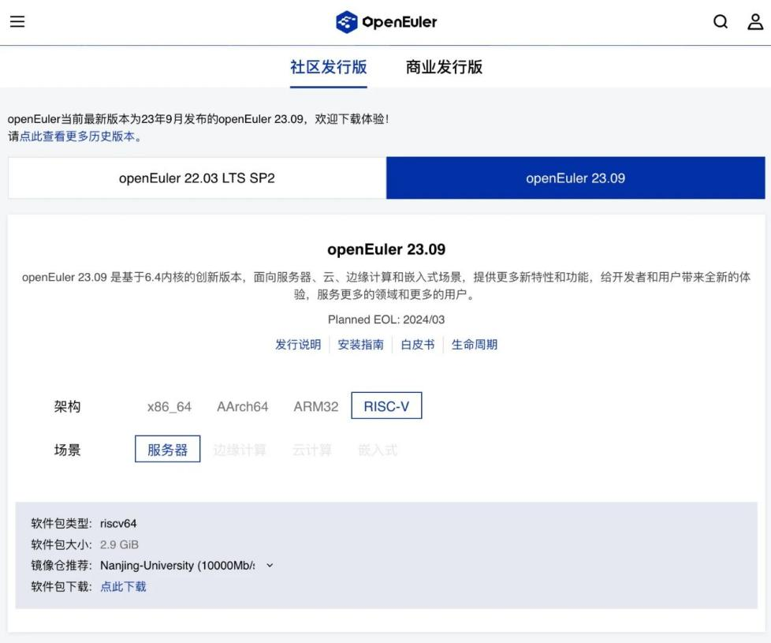

openEuler Summit is the annual flagship open source OS summit initiated by the openEuler community of the OpenAtom Foundation. This year, it will be held in China National Convention Center, Beijing on December 16.

We're glad to have RISC-V International this year. During the summit, there will be a RISC-V International booth and a RISC-V SIG Meeting for developers to discuss topics related to RISC-V. To this end, Calista Redmond, CEO of RISC-V International, sent a video message.

<video width="100%" controls>
    <source type="video/mp4"  
    src="https://openeuler-website-beijing.obs.cn-north-4.myhuaweicloud.com/4207acfd189b2288c71d1a2a593914b1.mp4">
</video>

RISC-V International is a non-profit organization that manages the open standard RISC-V instruction set architecture (ISA), related specifications, and stakeholder communities, and is committed to promoting the open source ecosystem of the RISC-V architecture. Based on its influence in the international open source communities, RISC-V International has worked closely with openEuler to expand openEuler's reach and acceptance worldwide.

## Ecosystem cooperation progress between openEuler and RISC-V

On March 8, 2023, openEuler joined the RISC-V Landscape, which is the first open source operating system from China to debut in the RISC-V Landscape OS field. This means that openEuler's ecological adaptation to the RISC-V architecture has been recognized by the RISC-V Foundation, and the related technologies have been adapted to the RISC-V ecosystem.

The third RISC-V China Summit was successfully held in Beijing from August 23 to 25, 2023, where openEuler presented its insights and had fruitful discussions with RISC-V International CEO Calista Redmond, Board & Software Committee Chair Philipp Tomsich, TSC Peter Chun, and other key figures. The two communities shared their views on the current and future cooperation between openEuler and RISC-V ecosystem, and agreed to strengthen their partnership in various aspects, such as technology, ecosystem, developers, and users, to jointly foster the rapid development of the RISC-V ecosystem.

In October 2023, openEuler joined RISC-V International as a Community Organization Member, and RISC-V became an official openEuler architecture. The RISC-V SIG successfully completed the mainline integration of openEuler 23.09 built on RISC-V, which included the mainline code merge, official engineering integration, and official image release. Since openEuler 23.09, RISC-V has been listed as one of the tier-1 architectures of openEuler, which marks an important milestone in the development of openEuler and RISC-V ecosystem.

## Join hands with openEuler to build a vibrant RISC-V ecosystem

openEuler attaches great importance to the adaptation and optimization on the RISC-V architecture. In April 2020, the openEuler community established the RISC-V SIG, aiming to offer RISC-V architecture-based openEuler releases and support its software package and system development, as well as encourage developers who are interested in RISC-V to join the open source community. As of now, openEuler has launched several RISC-V distributions based on openEuler. In the future, openEuler will continue to explore more possibilities on RISC-V processors.

