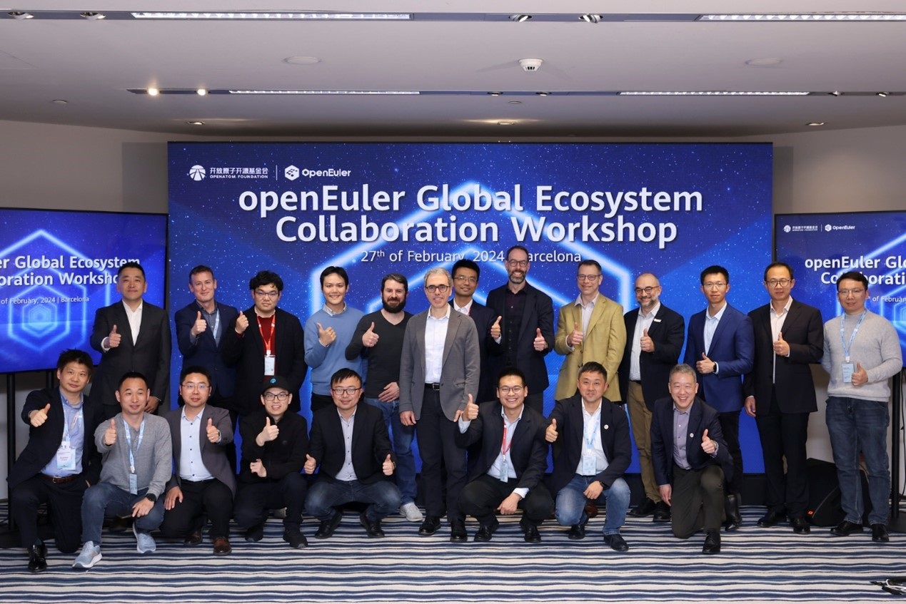

Welcome to the February edition of the openEuler Monthly Bulletin, your go-source for the latest updates, developments, and community activities. As we step into the second month of 2024, the openEuler community continues to thrive, pushing the boundaries of open source innovation and collaboration.

## Community Scale
As of February 29, 2024, the openEuler community has grown to over 2.26 million users, with more than 17,700 developers actively contributing to the community, as well as 155,700+ PRs and 85,800+ issues generated. Currently, there are 1,463 organization members in the openEuler community, with 25 new additions in February.

## Community Highlights

### The full edition of the openEuler Annual Report 2023 is about to be released
openEuler has achieved a leapfrog development since its open source, with a total of 6.1 million installations. We will continue to explore cutting-edge technologies and enhance the integration of openEuler with AI, to better serve diverse computing needs. For more details, stay tuned with us for the release of the full edition.

### The openEuler Global Ecosystem Collaboration Workshop is held in Barcelona
The [openEuler Global Ecosystem Collaboration Workshop](https://www.linkedin.com/pulse/openeuler-global-ecosystem-collaboration-workshop-ushering-new-lfrec/?trackingId=XDvuRQ0GQQKih9Nhyjno9Q%3D%3D), a pivotal gathering of industry luminaries, was held both online and in-person on February 27 in Barcelona. The workshop provided a glimpse into the forthcoming joint endeavors between openEuler and its industry partners in driving open source innovation.

### The OpenAtom Open Source Competition – openEuler AI Application Challenge is ongoing
The [OpenAtom Open Source Competition – openEuler AI Application Challenge](https://competition.atomgit.com/competitionInfo?id=1ea056d0418e11eeb9c0eb26c552c0c4) is designed for developers who are interested in operating systems but lack prior experience. It provides various access and usage options for participants, enabling them to deepen their understanding of openEuler. This monthly competition also offers special gifts from the OpenAtom Foundation and the openEuler community. Experience openEuler and kickstart your open source journey.

## Community Governance

### The openEuler Technical Committee monthly meeting is held
In the February meeting, the openEuler Technical Committee (TC) approved the establishment of the [SBC SIG](https://www.openeuler.org/en/sig/sig-detail/?name=sig-SBC), which is originally known as the Raspberry Pi SIG initiated by the Institute of Software, Chinese Academy of Sciences (ISCAS) at the community's inception. It has consistently contributed to enhancing openEuler's compatibility and functionality on mainstream development boards like Raspberry Pi, Allwinner, and Rockchip. The new SBC SIG, jointly developed by the original Raspberry Pi SIG and the maintainers of the Embedded SIG, aims to further advocate for openEuler's adaptation to various single-board computers.

The SBC SIG's responsibilities include adapting openEuler to different types of single-board computers, maintaining kernel source code for internal test images and basic adaptations, maintaining a list of SBC devices compatible with openEuler and their adaptation status, promoting stable kernel patch enhancement and merge, and ensuring the inclusion of well-adapted images in official openEuler releases.

## Technical Progress

### The LKVS project is introduced to the openEuler community
The [Linux Kernel Validation Suite (LKVS)](https://gitee.com/openeuler/intel-lkvs) is a comprehensive test suite developed by the Intel Core Linux Kernel Val Team. Drawing upon years of accumulated expertise from the team, LKVS boasts three key attributes: super lightweight, low coupling, and high coverage, making it widely applicable to various Linux system development and validation scenarios. This project has been introduced to the openEuler community and is now part of the EulerPipeLine system. Moving forward, the project aims to:
- Adapt to new platform features.
- Adapt to new kernel features.
- Further improve the framework to enhance the scalability and portability of test cases.
- Improve virtual machine test scenarios, including multi-VM test scenarios.

### openEuler UniProton RTOS is adapted to the RISC-V architecture
Recently, RISC-V SIG Contributor Luo Jun (Gitee ID: @Jer6y) has completed the initial adaptation work for UniProton on the RISC-V architecture, enabling the running of demo programs on QEMU.

UniProton is a real-time operating system released by the openEuler community, known for its extremely low latency and flexible mixed-criticality deployment features, suitable for industrial control scenarios. It supports both microcontrollers (MCUs) and high-performance multi-core CPUs.

The [RISC-V SIG](https://www.openeuler.org/en/sig/sig-detail/?name=sig-RISC-V) is continuously improving the capabilities of the openEuler RISC-V ecosystem while exploring a wide range of application scenarios in the embedded field, gradually covering RTOS, heterogeneous multi-core systems, board support package (BSP) support.

### The devkit-pipeline repo is created
The Kunpeng DevKit Pipeline Solution ([devkit-pipeline](https://gitee.com/openeuler/devkit-pipeline)) helps users quickly set up software engineering pipelines for continuous release of Kunpeng commercial versions. It supports the build and test of the x86 and Kunpeng architectures, enhancing the R&D efficiency. This project is now included in openEuler and maintained by the [CICD SIG](https://www.openeuler.org/en/sig/sig-detail/?name=sig-CICD).

### openEuler collaborates with Linaro to establish the Arm CCA project
Arm Confidential Computing Architecture (Arm CCA) aims to provide a comprehensive view of the software needed for confidential computing solutions (including firmware, operating systems, virtualization management, confidential virtual machines, remote proofs, etc.) and simulation hardware. It offers a reference model to help users efficiently deploy confidential computing solutions, verify their solutions on the Arm simulation hardware, and seed the the software ecosystem. The project repo is now established in openEuler and maintained by the [Confidential Computing SIG](https://www.openeuler.org/en/sig/sig-detail/?name=sig-confidential-computing).

### ROS SIG's work progress
The [ROS SIG](https://www.openeuler.org/en/sig/sig-detail/?name=sig-ROS) continues its work on porting and adapting ROS software packages and third-party software packages. They have planned two LTS releases for ROS 1 and ROS 2:
- ROS 1 LTS: ROS Noetic, which has built up 300+ software packages on OBS. In February, their dedicated efforts have centered around the porting of visualization software and upper-layer algorithm packages. The release will be launched with openEuler 24.03 LTS.
- ROS 2 LTS: ROS Humble, which was officially released in 2023. The ROS SIG continues the porting and adaptation work for other complex and critical ROS packages and third-party packages, with an impressive 1,055 ROS packages being built. More adaptations are planned to be released with openEuler 24.03 LTS

### Infrastructure SIG's work progress
The community's infrastructure team has enhanced developers' search experience on the official website by adding autocomplete and search history functions. This improvement helps developers better access relevant information.

## Software & Hardware Compatibility
As of February, a total of 1,506 hardware and software products were certified as compatible with openEuler. This includes 984 applications, 457 hardware components, and 131 OSs, among which, 10 applications, 8 hardware components, and 2 OSs were added to the [compatibility list](https://www.openeuler.org/en/compatibility/) in February.

## Security Bulletins

In February, the community issued 25 security announcements, addressing a total of 49 vulnerabilities, including 5 critical, 30 high, and 14 others.

The following vulnerabilities have significant impacts and require special attention:

pgjdbc, the PostgreSQL JDBC Driver, allows attacker to inject SQL if using PreferQueryMode=SIMPLE. Note this is not the default. In the default mode there is no vulnerability. A placeholder for a numeric value must be immediately preceded by a minus. There must be a second placeholder for a string value after the first placeholder; both must be on the same line. By constructing a matching string payload, the attacker can inject SQL to alter the query, bypassing the protections that parameterized queries bring against SQL Injection attacks. Versions before 42.7.2, 42.6.1, 42.5.5, 42.4.4, 42.3.9, and 42.2.8 are affected. ([CVE-2024-1597](https://www.openeuler.org/en/security/cve/detail/?cveId=CVE-2024-1597&packageName=postgresql-jdbc)) – CVSS 10.0
Affected release:
openEuler-20.03-LTS-SP1
openEuler-20.03-LTS-SP4
openEuler-22.03-LTS
openEuler-22.03-LTS-SP1
openEuler-22.03-LTS-SP2
openEuler-22.03-LTS-SP3

libuv is a multi-platform support library with a focus on asynchronous I/O. The \`uv\_getaddrinfo\` function in \`src/unix/getaddrinfo.c\` (and its windows counterpart \`src/win/getaddrinfo.c\`), truncates hostnames to 256 characters before calling \`getaddrinfo\`. This behavior can be exploited to create addresses like \`0x00007f000001\`, which are considered valid by \`getaddrinfo\` and could allow an attacker to craft payloads that resolve to unintended IP addresses, bypassing developer checks. The vulnerability arises due to how the \`hostname\_ascii\` variable (with a length of 256 bytes) is handled in \`uv\_getaddrinfo\` and subsequently in \`uv\_\_idna\_toascii\`. When the hostname exceeds 256 characters, it gets truncated without a terminating null byte. As a result attackers may be able to access internal APIs or for websites (similar to MySpace) that allows users to have \`username.example.com\` pages. Internal services that crawl or cache these user pages can be exposed to SSRF attacks if a malicious user chooses a long vulnerable username. This issue has been addressed in release version 1.48.0. Users are advised to upgrade. There are no known workarounds for this vulnerability. ([CVE-2024-24806](https://www.openeuler.org/en/security/cve/detail/?cveId=CVE-2024-24806&packageName=libuv)) – CVSS 9.8
Affected release:
openEuler-20.03-LTS-SP1
openEuler-20.03-LTS-SP4
openEuler-22.03-LTS
openEuler-22.03-LTS-SP1
openEuler-22.03-LTS-SP2
openEuler-22.03-LTS-SP3

libgit2 is a portable C implementation of the Git core methods provided as a linkable library with a solid API, allowing to build Git functionality into your application. Using well-crafted inputs to \`git\_index\_add\` can cause heap corruption that could be leveraged for arbitrary code execution. There is an issue in the \`has\_dir\_name\` function in \`src/libgit2/index.c\`, which frees an entry that should not be freed. The freed entry is later used and overwritten with potentially bad actor-controlled data leading to controlled heap corruption. Depending on the application that uses libgit2, this could lead to arbitrary code execution. This issue has been patched in version 1.6.5 and 1.7.2. ([CVE-2024-24577](https://www.openeuler.org/en/security/cve/detail/?cveId=CVE-2024-24577&packageName=rust)) – CVSS 9.8
Affected release:
openEuler-20.03-LTS-SP1
openEuler-20.03-LTS-SP4
openEuler-22.03-LTS
openEuler-22.03-LTS-SP1
openEuler-22.03-LTS-SP2
openEuler-22.03-LTS-SP3

An issue was discovered in the HTTP2 implementation in Qt before 5.15.17, 6.x before 6.2.11, 6.3.x through 6.5.x before 6.5.4, and 6.6.x before 6.6.2. network/access/http2/hpacktable.cpp has an incorrect HPack integer overflow check. ([CVE-2023-51714](https://www.openeuler.org/en/security/cve/detail/?cveId=CVE-2023-51714&packageName=qt5-qtbase)) – CVSS 9.8
Affected release:
openEuler-20.03-LTS-SP1
openEuler-20.03-LTS-SP4
openEuler-22.03-LTS
openEuler-22.03-LTS-SP1
openEuler-22.03-LTS-SP2
openEuler-22.03-LTS-SP3

Due to a failure in validating the number of scanline samples of a OpenEXR file containing deep scanline data, Academy Software Foundation OpenEX image parsing library version 3.2.1 and prior is susceptible to a heap-based buffer overflow vulnerability. This issue was resolved as of versions v3.2.2 and v3.1.12 of the affected library. ([CVE-2023-5841](https://www.openeuler.org/en/security/cve/detail/?cveId=CVE-2023-5841&packageName=OpenEXR)) – CVSS 9.1
Affected release:
openEuler-22.03-LTS
openEuler-22.03-LTS-SP1
openEuler-22.03-LTS-SP2
openEuler-22.03-LTS-SP3
openEuler-20.03-LTS-SP1 (2.2.0)
openEuler-20.03-LTS-SP4

You can find the [security bulletins](https://www.openeuler.org/en/security/security-bulletins/) on the openEuler official website and install the vulnerability patches in time.

## Thank You for Your Support
This is the end of the openEuler Monthly Bulletin for February. We would like to extend our gratitude to all members, developers, and contributors for their support and contributions. These advancements are a testament to your dedication.