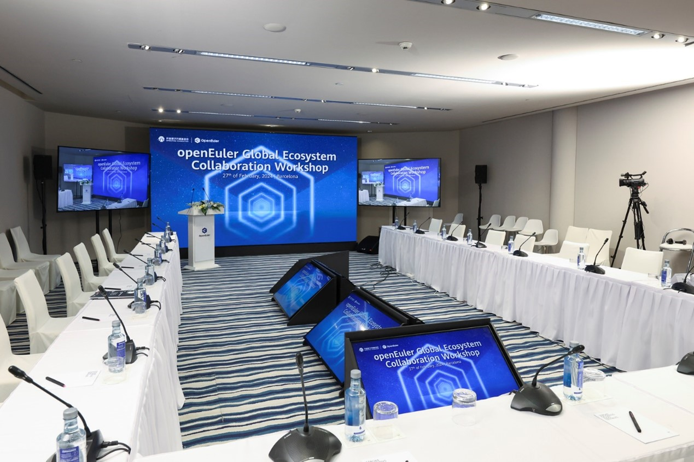
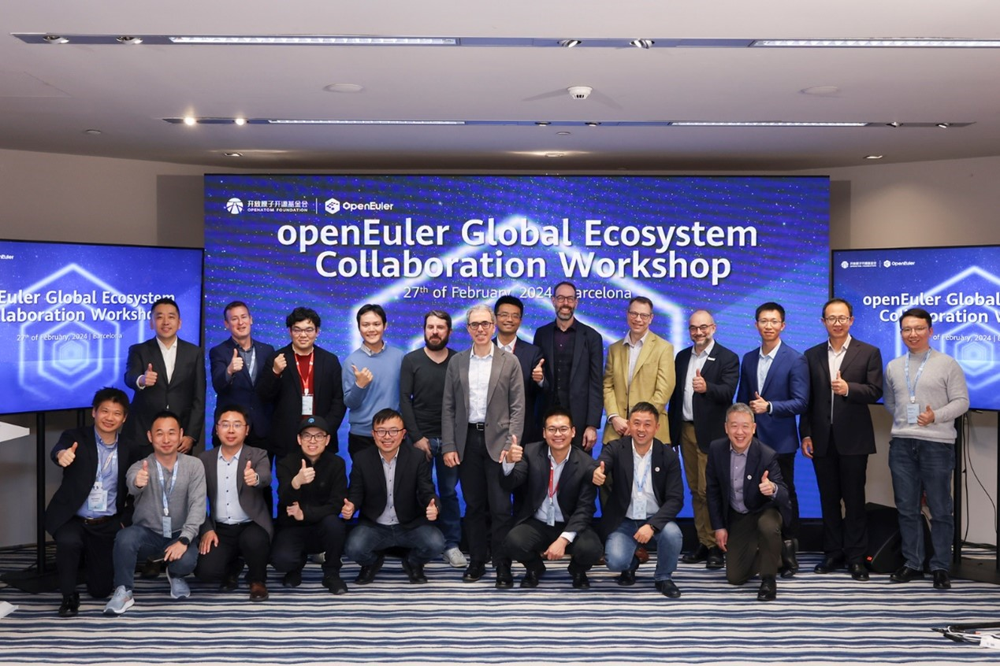
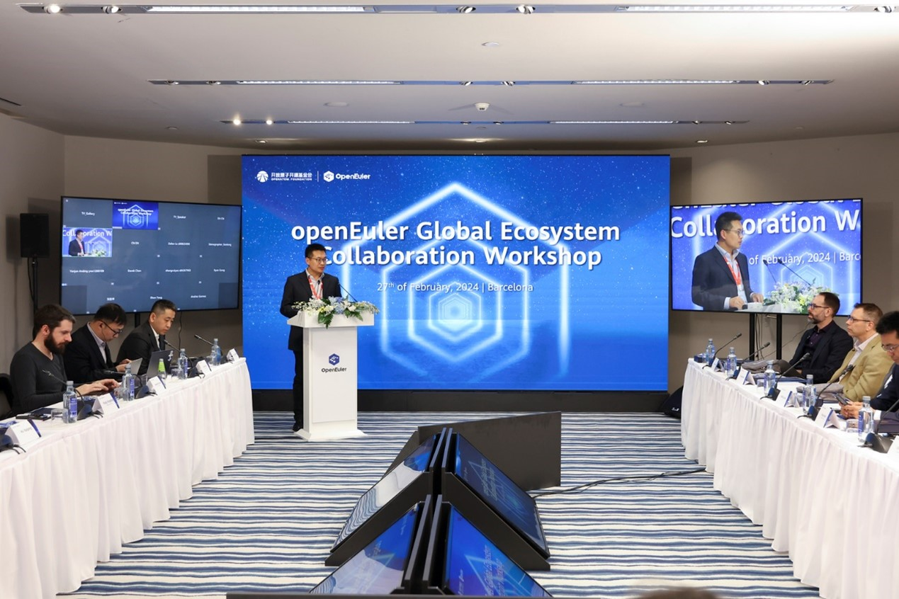
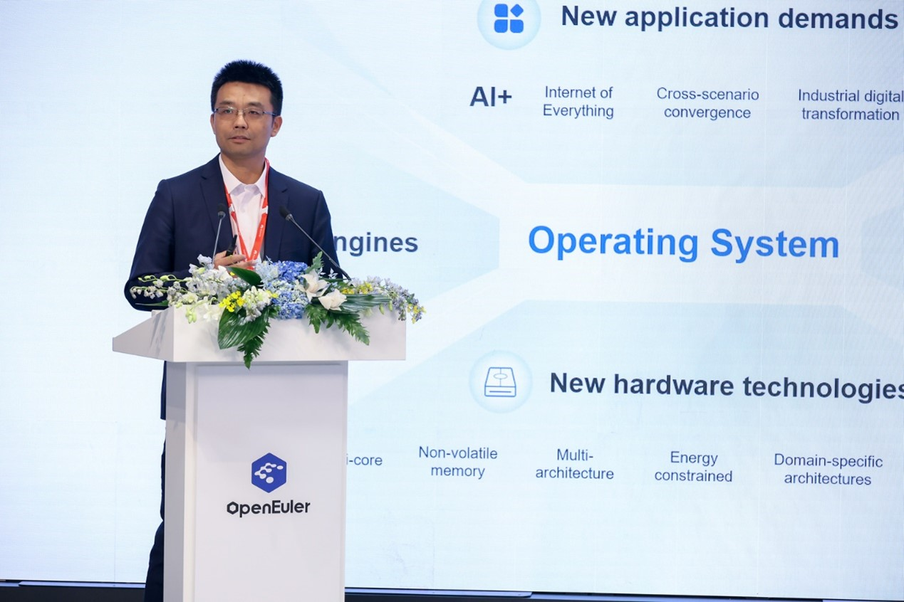
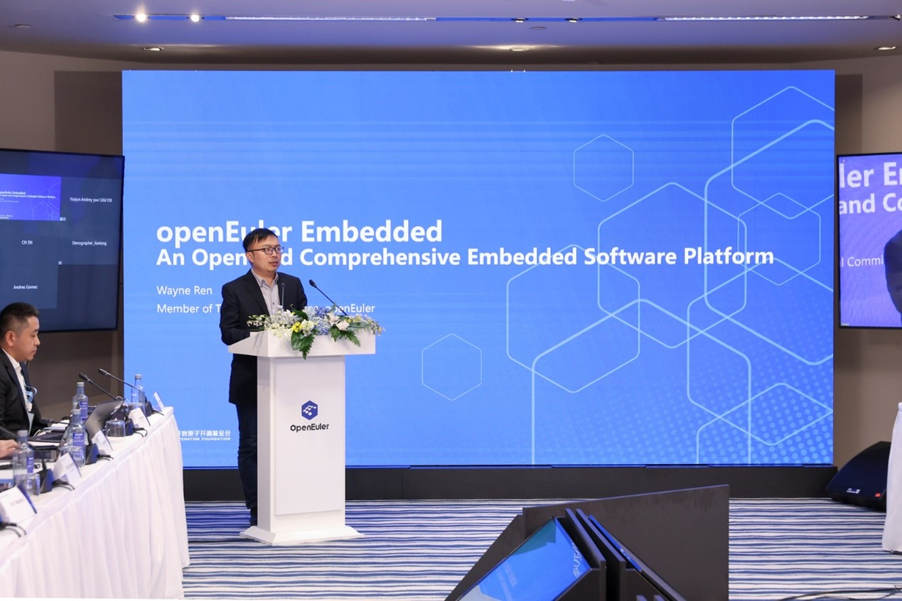
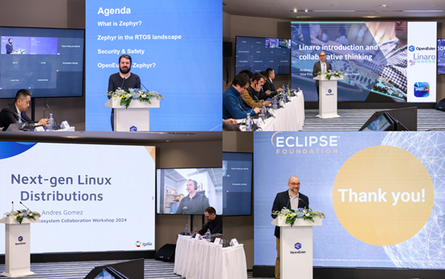
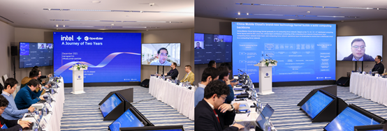

**Barcelona, February 27, 2024** – The openEuler Global Ecosystem Collaboration Workshop, an influential event for the rapidly expanding open source community OpenAtom openEuler, was held both online and in-person, drawing participants from around the world. 

The word "collaboration" echoed throughout the workshop, unveiling the future collaborative efforts between openEuler and all industry partners to forge open source innovation. Let's see who attended this joyful event and what these industry experts said about open source and potential collaboration in the future.

This distinguished gathering convened leaders from prominent open source foundations, including Xin Xiaohua, Deputy Secretary-General of the OpenAtom Foundation, Bill Ren, Vice Chairman of the Open Source Security Committee at OpenAtom Foundation, and Gaël Blondelle, Chief Membership Officer of Eclipse Foundation. The event also extended invitations to business magnates and tech insiders spanning the industry spectrum, such as Zhang Shengju from China Mobile, Elton Yang from Intel, Andrea Gallo from Linaro, Benjamin Cabé from Zephyr, and Andres Gomez from Igalia. Esteemed experts from the openEuler community, including Xiong Wei, Executive Director of the openEuler Community, Wayen Ren, Member of the openEuler Technical Committee, and Liu Yanfei, Executive Secretary of the openEuler Community, also graced the event.

Xin Xiaohua, on behalf of the OpenAtom Foundation, expressed confidence in the future of openEuler, citing the growing influence of the openEuler community, the expansion of the openEuler ecosystem, and openEuler's continued commitment to technological innovation. He also underscored openEuler's contributions to open source worldwide, including support for Apache, Spark, OpenHPC, and other mainstream open source projects.

Dr. Xiong Wei, the Executive Director of the openEuler Community, articulated his vision for openEuler as a multifaceted computing platform that caters to a variety of scenarios. He elaborated on the symbiotic strategy of 'openEuler for AI' and 'AI for openEuler'. He underscored the transformative impact of AI on the interaction dynamics between individuals and the operating system. Furthermore, he emphasized how openEuler, as an operating system, is poised to expedite the AI training process, bolster reliability, and curtail costs.

Subsequently, Dr. Wayen Ren, a member of the openEuler Technical Committee, unveiled openEuler Embedded - a comprehensive and open-source embedded software platform. He delved into the architecture, salient features, and application scenarios of the platform. In addition, he particularly spotlighted the mixed-criticality framework, colloquially known as MICA, of openEuler Embedded. He accentuated the versatility of openEuler and its potential as a springboard for innovation.

Representatives from China Mobile, Intel, Linaro, Zephyr project of the Linux Foundation, Eclipse Foundation, and Igalia shared their organizations' contributions to major web development and OS-related open source development. They also discussed potential areas of collaboration with openEuler.

- Zhang Shengju (China Mobile) introduced the joint innovations of China Mobile and the openEuler community, including energy-aware scheduling based on software-hardware collaboration, virtualization monitoring, analysis platform, and hardening system security.
- Elton Yang (Intel) reviewed Intel's collaboration and participation with openEuler in open source over the past two years, recalling the long-term integration and support of openEuler for Intel in the upstream since 2022. He also called on industry partners to work together in creating an open accelerated computing framework and looked forward to working more closely with openEuler in the future.
- Andrea Gallo (Linaro) described how Linaro, the software engine for the Arm ecosystem, accelerates the development, testing, and deployment of Arm-based innovations through collaborative engineering, services, and solutions, and applies this model to its work with openEuler.
- Benjamin Cabé (Zephyr) provided an overview of Zephyr's positioning in the RTOS, and expressed his desire to work with openEuler.
- Gaël Blondelle (Eclipse Foundation) elaborated on the Eclipse Foundation's values, and expressed his willingness to further collaborate with openEuler.
- Andres Gomez (Igalia) tried to answer how we should think about the future of operating systems and how we can manage and deploy them, by addressing two major trends in the next generation of Linux distributions: immutability and repeatability.

The workshop concluded with a panel discussion where participants discussed future collaborations and shared innovative ideas. The discussion offered new perspectives and possibilities for the future development of openEuler.

The openEuler Global Ecosystem Collaboration Workshop has provided us with a valuable opportunity to engage with experts and leaders across diverse fields. We've witnessed the dynamism and potential of the openEuler community, along with our mutual dedication to advancing open source innovation. Looking ahead, we anticipate more such events to facilitate knowledge sharing, idea exchange, and enhanced partnerships. Here's to a future marked by increased collaboration, exchange, and breakthroughs. Let's work together to make it a reality!

In case you missed it, watch the replays at: [https://youtube.com/playlist?list=PLtDfk9jvMAzgu0w75z2k2u-n9XkrWCDVC&si=n9hRJjcRsN0ky6z4](https://youtube.com/playlist?list=PLtDfk9jvMAzgu0w75z2k2u-n9XkrWCDVC&si=n9hRJjcRsN0ky6z4)