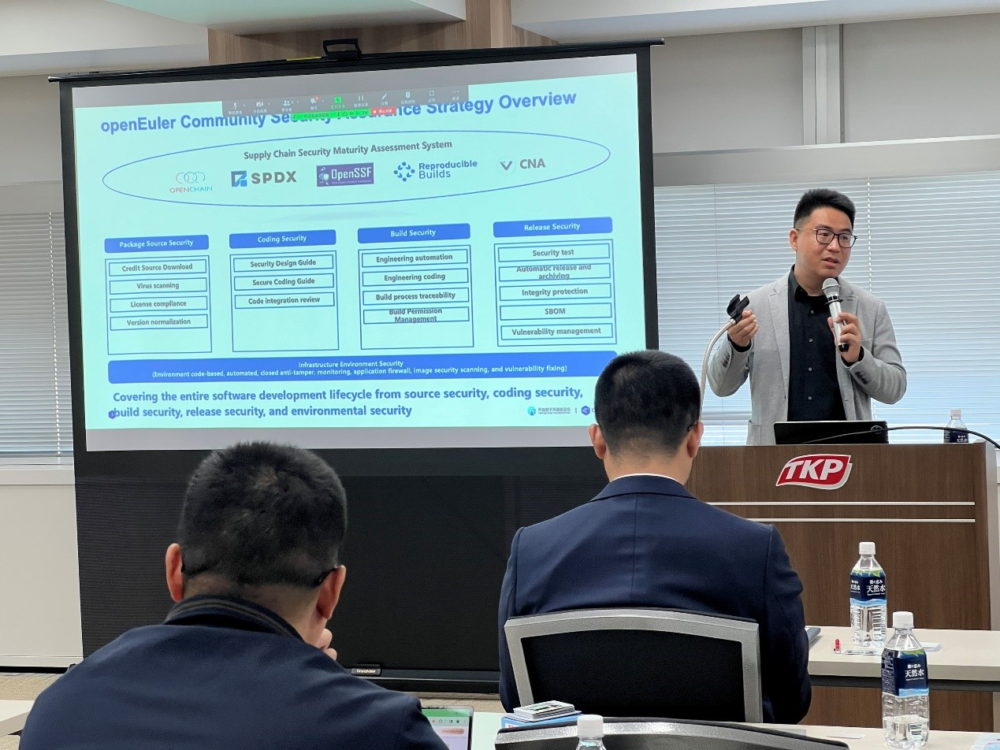

**Tokyo, March 18, 2024** – The OpenChain Workshop 2024, themed "Establishing and Maintaining Supply Chain Best Practices Across a Complete Operating System Ecosystem", marked the debut of OpenAtom openEuler in Japan. Held in Shinagawa, the workshop attracted industry experts from OpenChain and openEuler, representatives from prominent companies like Hitachi, Juniper, Panasonic, SONY, and Toshiba, as well as OS enthusiasts. Together, they explored and discussed ISO standards from upstream to the commercial ecosystem, the innovation and application of openEuler OS in AI, cloud-native, and embedded scenarios, boosting the understanding and collaboration of Japanese developers to openEuler.

Shane Coughlan (General Manager at OpenChain, The Linux Foundation), as the host speaker, commenced the workshop with a concise introduction to the openEuler operating system. During his opening remarks, Coughlan emphasized the significance of supply chain security to foundational software, the intricacies of supply chains, and the resultant complexities in managing an ecosystem with ISO standards. Consequently, openEuler, with its best practices in the supply chain, is worth investigating as a case study for other open source communities and projects.

Xiong Wei (Executive Director at OpenAtom openEuler Community) then took the stage to elaborate further on openEuler. He precisely explained what openEuler is and illustrated its extensive collaboration with ecosystem partners and international organizations for open source and standardization in terms of ecosystem expansion, technological innovation, as well as software security and governance. As the largest and fastest-growing OS community in China, openEuler commands over 36% of the market share of server OS in the country. This success can be attributed to the system's high quality, business model, and focus on innovation and computing diversification.

King Gao (Board Member at Software Transparency Foundation and OpenChain) provided an overview of openEuler' s supply chain security framework, detailing how the project and its ecosystem approach supply chain best practices in compliance and security using ISO standards. openEuler has developed a comprehensive supply chain framework covering security compliance, metadata management, and license compliance, aligning with ISO standards such as ISO 5230 for license compliance and ISO 18974 for security assurance.

Zheng Zhenyu (Maintainer and Community Operations Manager at OpenAtom openEuler Community), on behalf of openEuler Security Committee, presented on the security governance of the openEuler Community, highlighting how licensing policies and process management shape the supply chain of companies using openEuler. openEuler's approach to supply chain management, compliance, and security is comprehensive and industry-focused. By aligning with ISO standards and implementing robust governance rules and tools, openEuler ensures the delivery of high-quality, secure, and compliant software for diverse computing scenarios, including AI. The collaborative ecosystem, business model, and emphasis on innovation contribute to openEuler's rapid growth and success.

Wayne Ren (Member of the Technical Committee at OpenAtom openEuler Community) focused his speech on openEuler embedded. He discussed how openEuler provides a comprehensive and open software platform for embedded systems, catering to various scenarios like IoT, automotive, consumer electronics, and more. The platform prioritizes customization and flexibility to meet diverse embedded technology requirements, addressing challenges through sustainable embedded platforms and a focus on clear processes, record-keeping, compliance, security, and long-term support. He further elaborated on the mixed-criticality system (MCS) which he believes to be the future trend of embedded systems and the mixed-criticality deployment framework (MICA). openEuler's focus on MCS enables the integration of real-time and non-real-time tasks in embedded systems. It provides a framework for scheduling, isolation, and resource allocation, allowing developers to optimize the utilization and performance of hardware resources.

In the panel discussion, experts from openEuler community, Hitachi, Juniper, Panasonic, SONY, and Toshiba passionately talked over the future of open source technology. openEuler community will continue its dedication to promoting open source technology development, contributing to the prosperity and innovation of open source software supply chain security and ecosystem.

Missed the workshop? Don't worry! Catch the replay on our YouTube channel and experience the insightful discussions and engaging presentations firsthand:

Morning sessions:

[https://www.youtube.com/watch?v=-T-rryofyQY&t=548s](https://www.youtube.com/watch?v=-T-rryofyQY&t=548s)

Afternoon sessions:

[https://www.youtube.com/watch?v=SFxeBjIavr8](https://www.youtube.com/watch?v=SFxeBjIavr8)