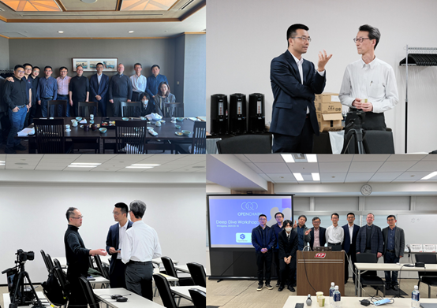
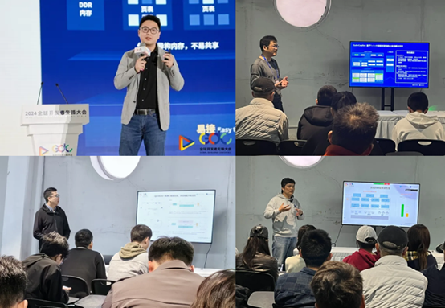
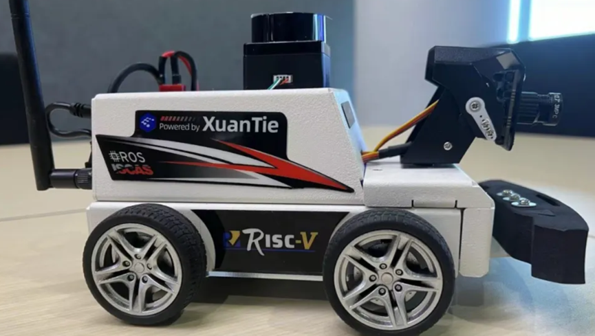
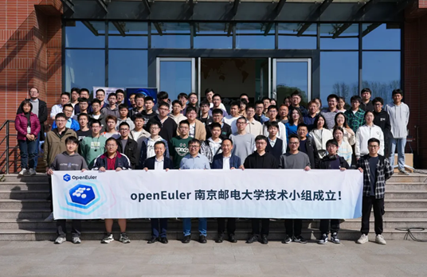
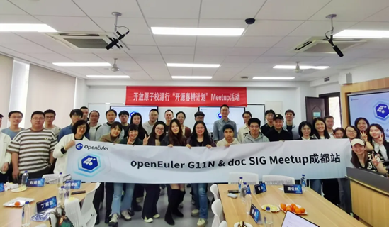
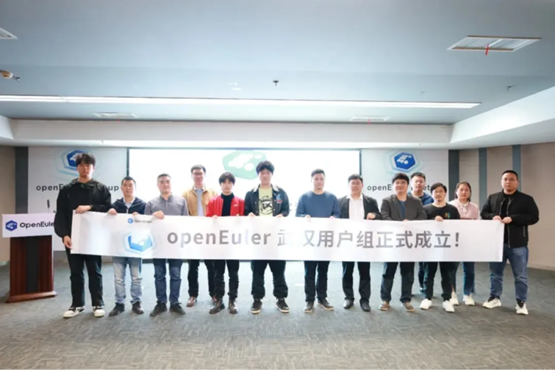
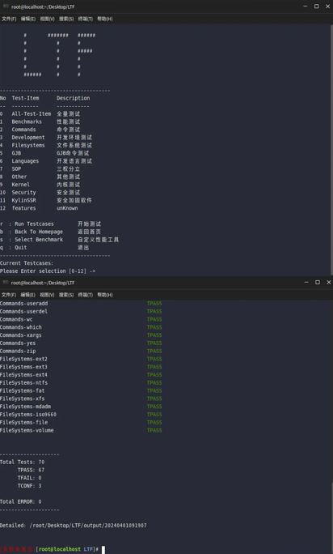

Greetings from OpenAtom openEuler! Welcome to the March bulletin of openEuler. In this edition, we are going through our latest advancements in technologies, community ecosystems, global collaborations, and SIG events.

## Community Scale
By March 30, the total number of users in the openEuler community exceeded 2.34 million, with more than 18,000 developers continuously contributing to the community. A total of 160,900 PRs and 90,300 issues are generated in the community. 1,500+ organization members joined the openEuler community, with 44 new ones joined in March.

## Community Highlights

### OpenChain Workshop 2024 – openEuler Case Studies is held in Tokyo
On March 18, the [OpenChain Workshop 2024](https://www.linkedin.com/pulse/openchain-workshop-2024-wrap-up-how-openatom-openeuler-operating-mi0kc/?trackingId=5vQ7AsOrQ8%2BCObGg6EaLSw%3D%3D) was held in Tokyo, marking the debut of openEuler in Japan. Held in Shinagawa, the workshop attracted industry experts from OpenChain and openEuler, representatives from prominent companies like Hitachi, Juniper, Panasonic, SONY, Toshiba, as well as OS enthusiasts. Together, they explored and discussed ISO standards from upstream to the commercial ecosystem, the innovation and application of openEuler OS in AI, cloud native, and embedded scenarios, boosting the understanding and collaboration of Japanese developers to openEuler.

### openEuler join the 2024 GDC
The 2024 Global Developer Conference (GDC) was held in Shanghai from March 23 to 24. Developers from the openEuler community, including Hu Feng, Zheng Zhenyu, Du Kaitian, Wang Junqi, Zhang Sibo, and Wang Shuai, participated in this activity and discussed "openEuler for AI, AI for openEuler", sharing with developers the innovative achievements and exploration of AI and OS integration.

### openEuler's partner ISCAS is invited to 2024 XuanTie RISC-V Partner Conference
On March 14, the [2024 XuanTie RISC-V Partner Conference](https://www.xrvm.com/overview/xtpc?spm=xrvm.27140568.0.0.73ed9b29sH7i9h&id=4285407454717612032), hosted by Damo Academy, was held in Shenzhen. Institute of Software, Chinese Academy of Sciences (ISCAS) was invited to the conference and demonstrated the latest developments in RISC-V at the application level:

- "Ruyi Book", a laptop based on RISC-V was released at the conference. This laptop is equipped with the [XuanTie C910](https://www.xrvm.com/product?spm=xrvm.27145573.0.0.76709b29pd4fcE&id=4224884581230252032) processor and can run large-scale office software such as DingTalk and Libre Office on the openEuler OS. It is the first time that RISC-V full links are streamlined from the bottom-layer processor to the operating system and commercial software. Ruyi Book offers a desktop with the option to run two operating systems – EulixOS 2.0-RV and PolyOS 2.0-RV. EulixOS 2.0-RV is a RISC-V-native distribution based on openEuler 23.09, primarily targeting ecological developers. Both operating systems feature self-developed UIs, built-in AO.space's personal data asset security system, and integrate RISC-V's native development toolkit, Ruyi SDK, helping developers achieve RISC-V-native development and compilation environments. This release not only improves the RISC-V ecosystem's support for general-purpose computing, but also enriches the full-stack offerings of processors and operating systems.

- RISC-V MicroROS, an ROS robot car jointly developed by Institute of Software, Chinese Academy of Sciences, Yahboom, and XuanTie, was unveiled at the conference. The robot is equipped with XuanTie C910 processor, openEuler RISC-V, and peripheral solutions provided by Yahboom, capable of realizing multiple functions such as robot motion control, AI visual interaction, SLAM, and multi-robot synchronous control. The [RISC-V SIG](https://www.openeuler.org/en/sig/sig-detail/?name=sig-RISC-V) led by ISCAS has made significant strides in supporting the system environment development for RISC-V MicroROS robot car, and provides the openEuler RISC-V hardware images and hardware drivers compatible with TH1520, improving the ecosystem adaptation of ROS2 in RISC-V hardware environments. The success in RISC-V MicroROS also serves as a testament to the achievements of the RISC-V SIG in openEuler's software ecosystem development.

### openEuler Embedded Meetup is held in Nanjing
On March 29, the openEuler Embedded Meetup was held in Nanjing University of Posts and Telecommunications. Technical experts from HiSilicon, HopeRun Information Technology, Lierda, Ebaina, and openEuler, as well as embedded OS enthusiasts attended the event and shared their views on openEuler's practices in the embedded field. At the same time, the openEuler technical team based in Nanjing University of Posts and Telecommunications was established at the meetup. The team not only focuses on technical cooperation, but also incorporates diverse talent development projects, boosting the spread and development of open source culture.

### openEuler G11N & Doc SIG Meetup is held in Chengdu
On March 23, the openEuler [G11N](https://www.openeuler.org/en/sig/sig-detail/?name=G11N) & [Doc](https://www.openeuler.org/en/sig/sig-detail/?name=doc) SIG Meetup was held in Chengdu. Technical experts from partners such as KylinSoft and JRLC, as well as openEuler contributors shared practical experience in ecological information, community documentation, and localization. The meetup aims to better provide developers with documentation and knowledge services and break language barriers, ultimately making openEuler accessible and understandable to everyone.

### openEuler Wuhan User Group is established
On March 22, the first openEuler User Group Meetup of 2024 was held in Wuhan. This meetup was jointly hosted by openEuler and the Yangtze Kunpeng & openEuler Eco-Innovation Center, and co-organized by Uniontech, KylinSoft, and xFusion, focusing on OS migration and kernel security. More than 60 developers, enterprise users, university teachers and students attended the meetup. At the same time, the openEuler Wuhan User Group was officially established at the meetup.

## Technical Progress

### MYC-LHi3093 core board and development board are released with openEuler Embedded operating system
Recently, MYIR released MYC-LHi3093 core board and development board based on HiSilicon Hi3093 high-performance MPU and openEuler Embedded operating system.

The MYC-LHi3093 core board and development board provide industrial control demos for customers to evaluate real-time control performance in application scenarios such as PLC, and provide reference for industrial control product development that pursues real-time performance. This adaptation not only expands the hardware ecosystem for openEuler, but also underscores the support of MYC-LHi3093 for operating system ecosystems, injecting new vitality into the industry's application landscape.

### Yocto SIG launched the Snowball Initiative to advance the openEuler Embedded ecosystem
The [Snowball Initiative](https://gitee.com/openeuler/yocto-meta-openeuler/issues/I90DOU?from=project-issue) is dedicated to enriching the openEuler Embedded application-layer ecosystem and plans to complete the migration of 30 BSP development board systems by the end of 2024. The project is divided into three phases. In the first phase, the development board is sponsored by [MYIR](https://www.myirtech.com/) who contributed seven development boards, covering well-known SOC manufacturers, such as TI, NXP, ST, Renesas, and Allwinner. Remi Pi, based on Renesas RZ/G2L, is expected to complete its migration soon.

### Multiple organizations embrace EulerMaker
Recently, several organizations, such as Kingsoft Cloud, China Mobile (Suzhou), xFusion, ISCAS, CM Financial Technology, and Sugon, started to deploy EulerMaker. Kingsoft Cloud has completed full-scale EulerMaker deployment, achieving RPM building (full/incremental), image customization, and software package customization. China Mobile (Suzhou), xFusion, and ISCAS have accomplished the RPM building (full/incremental). Currently, Kingsoft Cloud has seamlessly integrated EulerMaker into its operations for daily software package building and image customization.

EulerMaker is a software package build system, bridging the gap from source code to binary software packages. Developers can assemble and customize scenario-based OSs according to their needs. EulerMaker also provides developers with incremental/full-scale building, layered customization, and image customization.

### BiSheng Autotuner repo is created in openEuler
[BiSheng Autotuner](https://gitee.com/openeuler/BiSheng-Autotuner) + llvm automatic iterative optimization supports fine-grained and automatic compiler optimization in multiple scenarios, significantly reducing optimization time and providing more opportunities for performance and code size optimization. Currently, the project repository has been established in openEuler and is maintained and managed by the [Compiler SIG](https://www.openeuler.org/en/sig/sig-detail/?name=Compiler).

### Kylinsec LTF is open-sourced in openEuler
[The Linux Test Framework (LTF)](https://gitee.com/openeuler/LTF) is an automated testing framework designed specifically for Linux distributions. It features lightweight, low coupling, and high coverage, meeting test requirements across various scenarios.

The existing automated testing cases cover most of the testing items outlined in evaluation guidelines in China and common Linux modules, including commands, security, performance, and kernel. In addition, LTF provides rich APIs for developers to quickly develop automated testing cases.

In terms of compatibility and adaptation, LTF is developed using Shell, independent from specific Python versions. It can run on different Linux distributions and system architectures without any environment configuration, providing efficient testing methods for projects and routine version testing.

### The repo of poissonsearch-oss near real-time distributed search and analysis engine is created in openEuler
[poissonsearch-oss](https://gitee.com/openeuler/poissonsearch-oss) is a near real-time distributed search and analysis engine based on elasticsearch-oss 7.10.2 Apache License 2.0. It helps users quickly build data retrieval and analysis capabilities. Currently, it has been released to openEuler 22.03 LTS SP3 and is maintained and managed by the [DB SIG](https://www.openeuler.org/en/sig/sig-detail/?name=DB).

poissonsearch-oss modifies the Elasticsearch commercial license code, retains all Apache License 2.0 capabilities of elasticsearch-oss 7.10.2, ensures seamless compatibilities of elasticsearch-oss 7.10.2 ecosystem components while addressing known vulnerabilities in 7.10.2. Moving forward, the project aims to leverage community collaboration to enhance functionalities such as retrieval and analysis, performance, latency stability, scalability, security, and usability.

### The download page on the openEuler website is updated
openEuler images for different scenarios have been released on multiple mainstream platforms. Therefore, we optimized the [download page](https://www.openeuler.org/en/download/get-os/) on the official website to further enhance user experience.

## Community Governance

### openEuler Technical Committee**'**s monthly meeting is held
To better support AI infrastructure development, openEuler Technical Committee renamed AI SIG to AI-Infra SIG, with a shift in the group's focus on:

- Adapting to (machine learning and deep learning) software stacks and providing out-of-the-box AI capabilities.
- Accelerating general-purpose/heterogeneous computing AI stack, such as AI hardware access framework, heterogeneous convergence, computing power allocation, XPU virtualization, and acceleration framework.
- Integrating AI with cloud native to build AI training and inference infrastructure solutions.

### openEuler adds Branch Keepers for repositories
Among SIG roles in openEuler, Committers take care of the code quality of a single repository in SIGs, wielding authority over code review and merge permissions. According to feedback from SIG members, there are too many Committers in some large repositories, leading to overlapping permissions and inconsistencies in code merge and branch management requests.

Addressing this concern, discussions among Infrastructure and relevant SIG members have yielded a proposed solution: the introduction of Branch Keepers. This new role aims to cooperate with Committers and Maintainers in branch management.

## Software & Hardware Compatibility

By the end of March, a total of 1,634 hardware and software products were certified as compatible with openEuler. This includes 1,031 applications, 467 hardware components, and 136 OSs, among which, 47 applications, 10 hardware components, and 5 OSs were added to the [compatibility list](https://www.openeuler.org/en/compatibility/) in February.

## Security Bulletin
In March, we published 14 security notices, and patched 97 vulnerabilities (3 critical, 48 high, and 46 others). You can find the [security announcements](https://www.openeuler.org/en/security/security-bulletins/) on the openEuler official website and install the vulnerability patches in time.

## Thank You for Your Support
Thanks to everyone's hard work, good things happen every day in openEuler. Sincere gratitude to community friends and developers, and openEuler SIG members who have made contributions to the openEuler community.