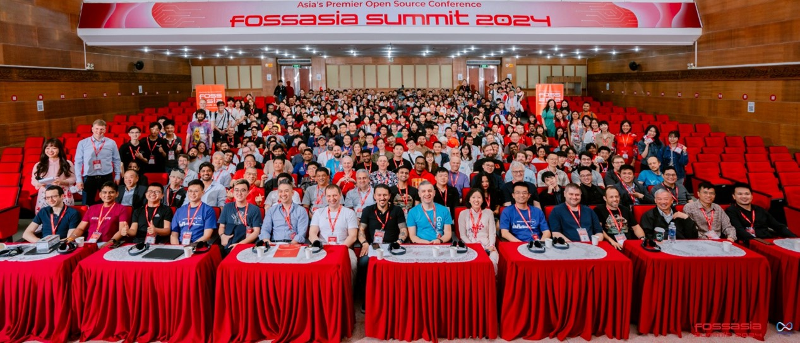
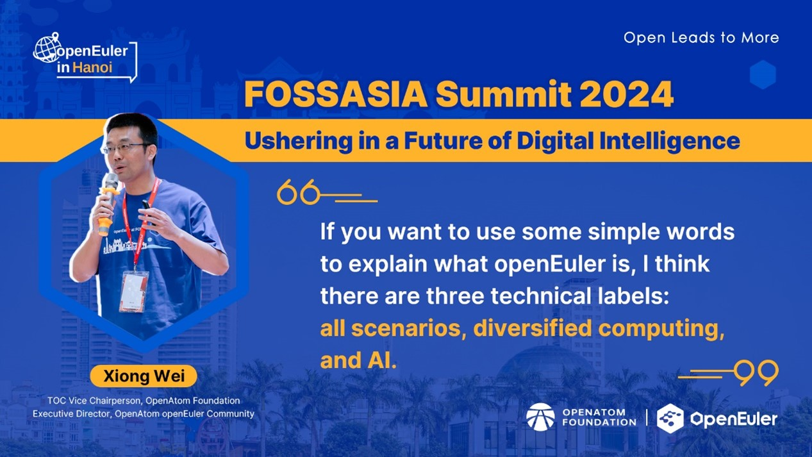
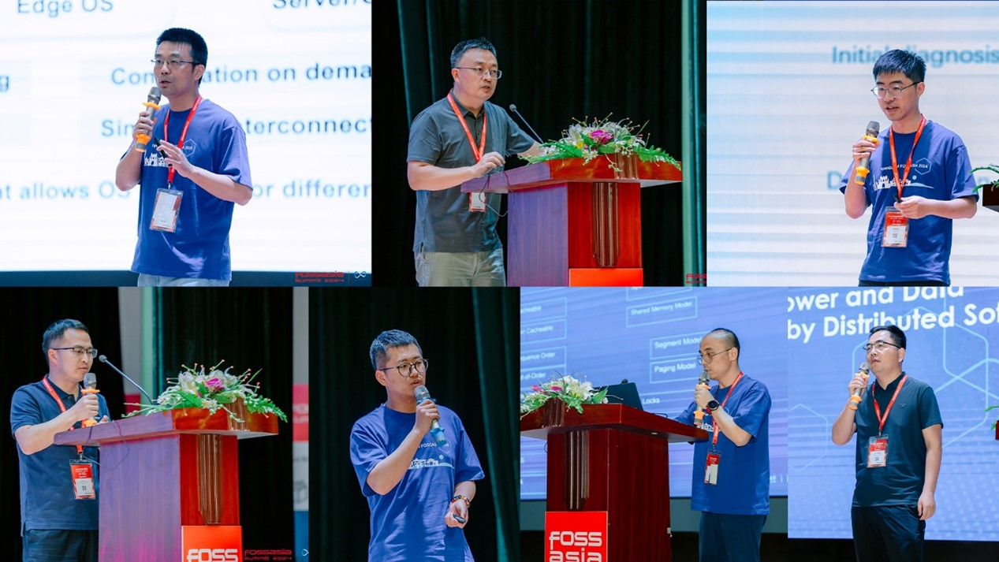
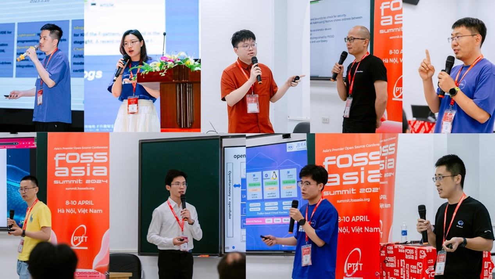
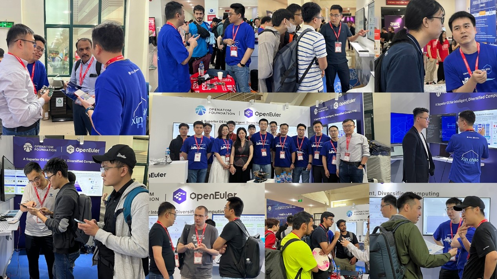

The global stage of FOSSASIA Summit 2024 unfolded in Hanoi, Vietnam on April 8. Among the vibrant participants was OpenAtom openEuler, a Linux-based OS platform championing diverse computing capabilities. Collaborating with esteemed partners such as the Institute of Software, Chinese Academy of Sciences (ISCAS), KylinSoft, Linaro, and EasyStack, openEuler drew in a diverse crowd of open source enthusiasts and professionals. Together, they showcased openEuler's prowess in supporting diverse computing needs, sparking interest among users from finance, Internet, and other industries across Southeast Asia. The event fostered deep exchanges with IT giants, software vendors, and service providers worldwide.

## Highlights Recap

During the Summit, Xiong Wei, the Executive Director of openEuler, delivered a keynote speech titled "[Ushering in a Future of Digital Intelligence](https://youtu.be/eKCy0AGUCFY?si=BrZWFh01BLqTGJ4u)." He highlighted the transformative impact of the AI era on various industries, including the field of operating systems. As an OS tailored for diversified computing scenarios, openEuler actively explores breakthroughs in AI technologies and has developed openEuler Copilot System and GMEM, which not only change the traditional usage and interaction modes of operating systems but also accelerate the transformation of operating systems, facilitating AI training and inference processes. He also mentioned the upcoming releases of openEuler in 2024 – 24.03 LTS and 22.03 SP4 – providing users with a more stable and reliable OS environment and offering developers more innovative and optimized features. Xiong urged developers to join the openEuler community, driving forward the development of open source tech and ushering in the era of digital intelligence.

At FOSSASIA Summit 2024, the [openEuler & Operating Systems Track](https://www.linkedin.com/feed/update/urn:li:activity:7185573612295225344) stood out as a major highlight, showcasing innovative projects in AI, cloud native, embedded systems, DevOps, and more. Attendees deeply experienced the rapid growth of the openEuler community through this track and expressed high expectations for its future.

In addition to the openEuler & Operating Systems Track, openEuler presented nine exciting speeches in other sub-tracks, providing developers with a deeper understanding of openEuler. After the speeches, many developers and users visited the openEuler booth for communications and technical exchanges.

## Igniting Buzz at the openEuler Booth

The openEuler booth was a hub of creativity at FOSSASIA, where developers from various communities engaged in technical dialogues with experts from the openEuler community. Representatives from renowned companies and organizations such as SoftSage, OnlyOffice, Microsoft Azure, SUSE, Linux Professional Institute, 3mdeb, VGGATE, VFOSSA, PTIT, Hanoi University of Industry, IMIP, Hyperlogy Project, and RizinOrg were present, fostering discussions on future collaborations and the global expansion of openEuler.

Amidst the bustling atmosphere of the openEuler booth, where technical dialogues flourished and collaborations ignited, several key partners showcased their innovative contributions, further enriching the exchange of ideas and expertise. Let's delve into the remarkable presentations and contributions from our esteemed partners:

[HopeRun Software](https://youtu.be/Lfq8yiQHh3I?si=hhufECOKyI8inoKp) captured attendees' interest with their demonstration of a distributed collaboration solution and computing project. This demonstration highlighted the effective scheduling of diverse computing tasks across platforms, utilizing mathematical expressions and seamlessly integrating features from both openEuler and OpenHarmony systems, resulting in synchronized computing outcomes.

[ISCAS](https://youtu.be/BO_QAvx6f7w?si=SeApmSvgsmkhWeC5) shared updates on the openEuler RISC-V version, including an upcoming long-term release and the recent development of a laptop. These insights showcased the rapid evolution of the RISC-V ecosystem and advancements in software adaptation. Additionally, ISCAS presented

[AO.space](https://youtu.be/BO_QAvx6f7w?si=SeApmSvgsmkhWeC5), an innovative project contributed to openEuler last year.

[Linaro](https://youtu.be/qoO86Xzcz90?si=rZ7HyacwpE6dhKS6) provided strategies for optimizing Arm multicore capabilities and hardware accelerators in big data scenarios. The company's representative, Xu Guodong, emphasized key Arm platform features, including multicore processing and hardware accelerator integration.

[KylinSoft](https://youtu.be/TcZyVPX23OI?si=EDs8wG6nRYAyZqJO) exhibited NestOS, a cloud-based operating system built on openEuler. NestOS integrates rpm-ostree support and ignition configuration, featuring a dual-root file system and atomic update design. Tailored for platforms like K8s and OpenStack, NestOS minimizes container runtime overhead, enabling convenient cluster component capabilities and secure operations of large-scale containerized workloads.

As an early adopter of the openEuler community, the [EasyStack Cloud Platform (ECP)](https://easystack.io/product/29.html) is deeply rooted in the openEuler ecosystem. Adrian, Director of International Business Expansion at EasyStack, shared insights with attendees on the platform's architecture, featuring a platform-service decoupled design. Equipped with a lightweight digital native engine EOS and combined with diverse cloud services, the EasyStack cloud platform seamlessly caters to private deployment needs, from small to ultra-large scale. It flexibly addresses various computing requirements, spanning virtualization, bare metal computing power, cloud-native, and AI computing needs, making it suitable for AI and video data processing applications, and delivering robust cloud infrastructure solutions to customers.

## Conclusion

openEuler has always adhered to the "upstream first" strategy, deeply integrating into the global ecosystems. A survey conducted at the FOSSASIA Summit showed that over 70% of attendees had heard of openEuler, and nearly half of them were willing to try it out. This indicates that openEuler's visibility and influence in the open source field continue to grow, garnering widespread recognition and support.

FOSSASIA founders, Hong Phuc Dang and Mario Behling, highly praised openEuler's achievements in internationalization over the past two years in an [interview](https://www.youtube.com/watch?v=fO2QRYQSyUQ) with the openEuler team, and wished the openEuler community a prosperous future.

Under the spotlight of FOSSASIA Summit 2024, openEuler, together with its partners, has made significant contributions to the development of open source technologies. In the future, openEuler will continue to uphold the spirit of open source, exploring endless possibilities for technological innovation with developers worldwide.

As we continue to forge ahead, we are excited to announce that all speeches from our conference have been uploaded to our [YouTube channel](https://www.youtube.com/watch?v=uweQwiWaEZY&list=PLtDfk9jvMAzjaWscsLJaO-jxRmAVwVGTh&pp=gAQBiAQB). We invite you to watch and engage with the content. Additionally, if you have any thoughts, feedback, or wish to continue the discussion, feel free to join our [Discord group](https://discord.gg/qjNYqbV2). Let's collaborate and innovate together!