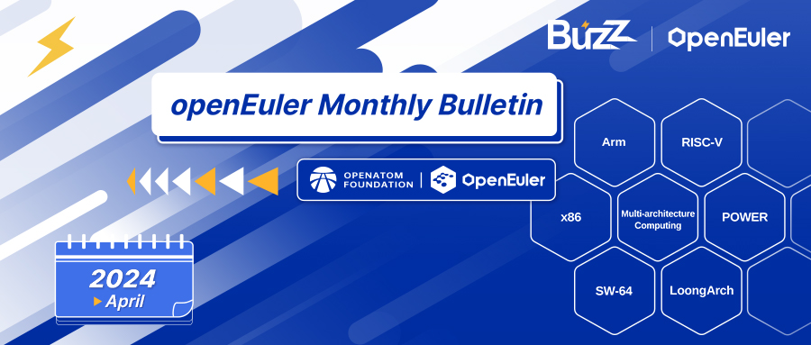
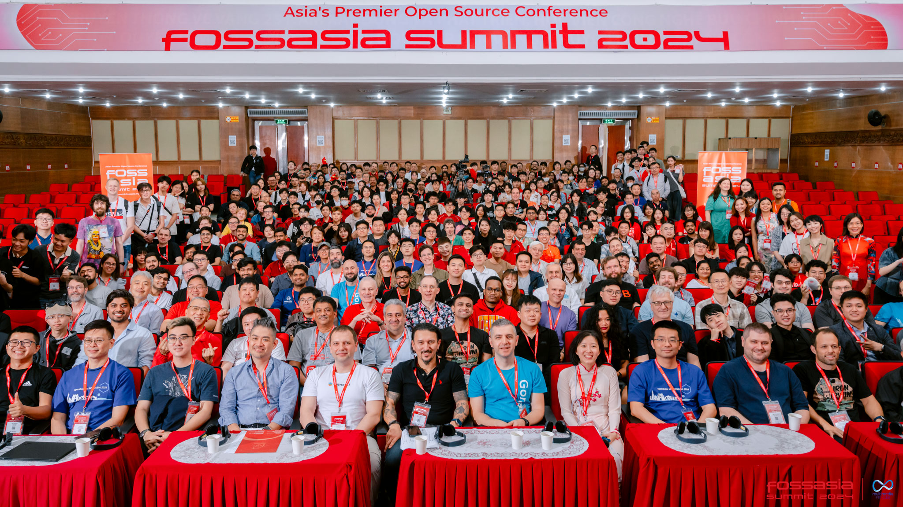
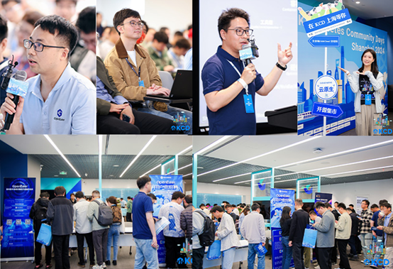
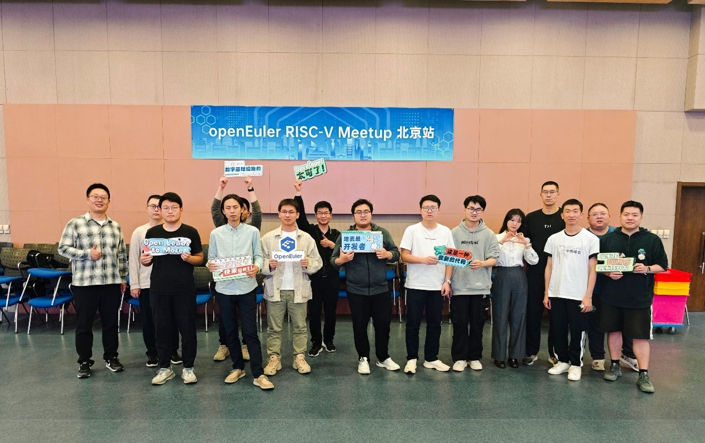
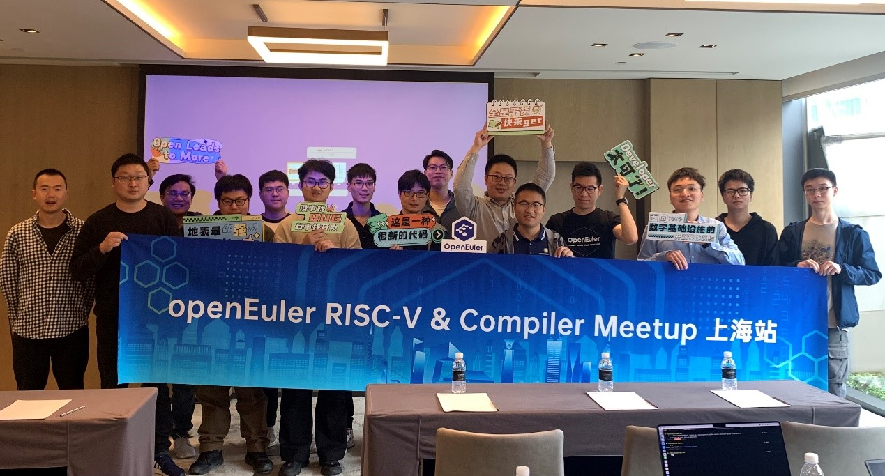
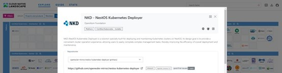

Welcome to the April edition of the openEuler Monthly Bulletin! April has been nothing short of remarkable, with contributions from members spanning the globe, pushing the boundaries of what's possible in the realm of open source development. Now, grab your favorite beverage, settle into your virtual seat, and join us to explore the latest happenings of our vibrant community.

## Community Scale
As of April 30, 2024, the openEuler community continues to thrive, with users exceeding 2.38 million. Over 18,000 developers have generated 166.5K PRs and 92.8K issues. In addition, the openEuler community now has 1,530+ organization members, with 27 new additions in April alone.

## Community Highlight

### openEuler shines alongside partners at FOSSASIA Summit 2024
The global stage of [FOSSASIA Summit 2024](https://www.linkedin.com/pulse/empowering-open-source-openeuler-shines-alongside-partners-fossasia-jxmpc/?trackingId=44yNjBksSHSQGQZEp4gwRg%3D%3D) unfolded in Hanoi, Vietnam on April 8. Collaborating with esteemed partners such as the Institute of Software, Chinese Academy of Sciences (ISCAS), KylinSoft, Linaro, and EasyStack, openEuler drew in a diverse crowd of open source enthusiasts and professionals. Together, they showcased openEuler's prowess in supporting diverse computing needs, sparking interest among users from finance, Internet, and other industries across Southeast Asia. The event fostered deep exchanges with IT giants, software vendors, and service providers worldwide.

### openEuler joins KCD Shanghai
On April 20, the [Kubernetes Community Day (KCD)](https://community.cncf.io/events/details/cncf-kcd-shanghai-presents-kcd-shanghai-2024/) was held in Shanghai, where openEuler made its mark. Zheng Zhenyu, Maintainer & Community Operations Manager of openEuler, together with openEuler's technical experts, including Wang Yueliang and Jiang Pengfei, took the stage to share insights into openEuler's innovative practices and experiences in the cloud-native technologies. Their engaging presentations captivated the audience of developers, fostering dialogue and collaboration within the ever-evolving Kubernetes ecosystem.

### openEuler RISC-V Meetup takes place in Beijing
On April 27, the [openEuler RISC-V Meetup](https://gitee.com/openeuler/presentations/tree/master/meetup/20240427-RISC-V%20Meetup) was held in Beijing, organized jointly by the RISC-V SIG and the [Open Source Promotion Plan (OSPP)](https://summer-ospp.ac.cn/). Over 30 open-source experts and enthusiasts participated in the meetup and discussed openEuler's latest development in broadening the RISC-V ecosystem, new release planning, and RISC-V-related topics in OSPP.

### openEuler RISC-V & Compiler SIG Meetup is held in Shanghai
On April 21, the openEuler RISC-V & Compiler SIG Meetup was jointly held by the RISC-V SIG and Compiler SIG in Shanghai. Over 30 experts and enthusiasts from different institutions, universities, and companies attended the event. The meetup focused on openEuler's tech innovations, advancements in RISC-V architecture, compilers, and VMs, as well as the progress of the [LLVM plan](https://bit.ly/49O1C6U).

### openEuler joins the second eBPF Conference
On April 13, the [second eBPF Conference](https://github.com/linuxkerneltravel/ebpf-conference/tree/master/ebpf-conference-second) took place at Xi'an University of Posts & Telecommunications. oEVP (openEuler Valuable Professional) Ren Yuxin, along with the eBPF SIG Maintainers Wu Changzhi and Chen Zhen, shared insights into openEuler's applications and practices in the eBPF domain. Their presentations sparked engaging discussions and friendly exchanges with developers present at the event.

### openEuler attends OpenInfra Foundation's PTG
On April 8, the [OpenInfra Project Teams Gathering (PTG)](https://openinfra.dev/ptg/) was held online. Technical experts and developers from openEuler actively participated in discussions, focusing on the integration between openEuler and OpenStack. Together with global open-source developers, they aim to drive technical innovation and development, enriching openEuler's OpenStack ecosystem.

### openEuler brings 95 projects to OSPP 2024
The registration portal for [Open Source Promotion Plan (OSPP) 2024](https://summer-ospp.ac.cn/) was officially opened to students in April. OSPP 2024 presents an exciting chance for students to immerse themselves in open-source projects and collaborate with mentors to make meaningful contributions to the open-source development. With a total of [95 project tasks](https://summer-ospp.ac.cn/org/orgdetail/b9770f4d-f586-4373-bdac-ce6389065946?lang=en) spanning various technical domains such as RISC-V, embedded systems, and compiler development, the openEuler community offers a wide array of opportunities for students to engage.

## Community Governance

### 2023–2024 openEuler Technical Committee Meeting is held in Nanjing
On April 19, the 2023–2024 openEuler Technical Committee Meeting was held in Nanjing. During the meeting, the committee members agreed to establish the OceanBase SIG to foster technical cooperation with the OceanBase team. Additionally, plans were made to form an SBOM SIG to help the openEuler community and OSVs enhance SBOM capabilities, ensuring supply chain security.

The committee also reviewed and provided improvement suggestions for several community initiatives, including the future release plan and the 2024 annual plan for openEuler infrastructure.

## Technical Progress

### openEuler's NKD joins CNCF landscape
openEuler's NestOS Kubernetes Deployer (NKD) has attained the Kubernetes Conformance Certification and is now officially part of the [CNCF Landscape](https://bit.ly/3QlTymR) under the Certified Kubernetes - Installer category.

### openEuler advances support for next-generation Intel Xeon platforms
The [Intel Arch SIG](https://www.openeuler.org/en/sig/sig-detail/?name=sig-Intel-Arch) is actively advancing openEuler's support for Intel's next-generation Xeon platforms. Specifically, they are focusing on ensuring compatibility and optimization for both the high-density Sierra Forest and performance-centric Granite Rapids platforms.

The SIG has completed adaptation work within the kernel and virtualization domains. Key aspects of their adaptation endeavors include but are not limited to enhancing performance monitoring units (PMU), updating and improving IOMMU functionality, and supporting advanced features like DSA 2.0 and DLB 2.0. Furthermore, the Intel Arch SIG is actively involved in integrating and validating QAT 2.0 in-tree drivers within openEuler.

To better cater to the diverse needs of users across different openEuler releases, the Intel Arch SIG proposes a dual-kernel adaptation strategy. Additionally, the SIG is enhancing compatibility testing and validation for Intel platforms and working on further adapting openEuler to the Intel oneAPI software stack.

### openEuler's RISC-V SIG introduces Penglai TEE to the community
Penglai, developed by Shanghai Jiao Tong University, is China's first open-source trusted execution environment (TEE) solution supporting RISC-V. It is expected to be released as a security feature with the next-generation openEuler RISC-V. The RISC-V SIG will package [Penglai TEE](https://github.com/Penglai-Enclave/Penglai-Enclave-sPMP) as an SDK, allowing users to experience or develop simple TEE applications. Additionally, the SDK will enable users to compile and explore the secGear confidential computing framework on the RISC-V architecture.

### High-performance network QoS manager BWM is open-sourced in the openEuler community
[Bandwidth Management (BWM)](https://gitee.com/openeuler/oncn-bwm) is a high-performance network QoS management program based on eBPF. Leveraging technologies like packet marking and EDT bandwidth adjustment, BWM ensures that network QoS remains unaffected for hybrid deployments of different applications on the cloud, keeping bandwidth preemption latency under 100 ms. Additionally, BWM has been integrated and deployed in the [Volcano](https://volcano.sh/en/) scheduling system.

### SecureGuardian's repository has been created in the openEuler community
[SecureGuardian](https://gitee.com/openeuler/secureguardian/blob/master/README.en.md) is a Linux system security check tool developed based on the [*openEuler Security Configuration Benchmark*](https://gitee.com/openeuler/security-committee/blob/master/secure-configuration-benchmark/release/openEuler安全配置基线.md), aiming to help system administrators evaluate and enhance the security of their systems. This project is initiated by KylinSoft and maintained by the [Security Facility SIG](https://www.openeuler.org/zh/sig/sig-detail/?name=sig-security-facility).

The architecture of SecureGuardian is designed to systematically assess the security of Linux system configurations. It operates through a modular script approach, allowing for extensive customization and expansion.

## Software & Hardware Compatibility
By the end of April 2024, a total of 1,667 software and hardware products were certified as compatible with openEuler. This includes 1,058 applications, 468 hardware components, and 141 OSs, among which, 25 applications, 7 hardware components, and 5 OSs were added to the [compatibility list](https://www.openeuler.org/en/compatibility/) in April.

## Security Bulletins
In April, we published 168 security notices, and patched 194 vulnerabilities (7 critical, 43 high, and 144 others).

The following vulnerabilities have a significant impact and require special attention:

FreeRDP is a free implementation of the Remote Desktop Protocol. FreeRDP based clients prior to version 3.5.1 are vulnerable to out-of-bounds read if \`((nWidth == 0) and (nHeight == 0))\`. Version 3.5.1 contains a patch for the issue. No known workarounds are available. ([CVE-2024-32659](https://www.openeuler.org/en/security/cve/detail/?cveId=CVE-2024-32659&packageName=freerdp)) – CVSS 9.8
Affected release:
openEuler 20.03 LTS SP1
openEuler 20.03 LTS SP4
openEuler 22.03 LTS
openEuler 22.03 LTS SP1
openEuler 22.03 LTS SP2
openEuler 22.03 LTS SP3

FreeRDP is a free implementation of the Remote Desktop Protocol. FreeRDP based clients prior to version 3.5.1 are vulnerable to out-of-bounds read. Version 3.5.1 contains a patch for the issue. No known workarounds are available. ([CVE-2024-32658](https://www.openeuler.org/en/security/cve/detail/?cveId=CVE-2024-32658&packageName=freerdp)) – CVSS 9.8
Affected release:
openEuler 20.03 LTS SP1
openEuler 20.03 LTS SP4
openEuler 22.03 LTS
openEuler 22.03 LTS SP1
openEuler 22.03 LTS SP2
openEuler 22.03 LTS SP3

FreeRDP is a free implementation of the Remote Desktop Protocol. FreeRDP based clients using a version of FreeRDP prior to 3.5.0 or 2.11.6 are vulnerable to integer overflow and out-of-bounds write. Versions 3.5.0 and 2.11.6 patch the issue. As a workaround, do not use \`/gfx\` options (e.g. deactivate with \`/bpp:32\` or \`/rfx\` as it is on by default). ([CVE-2024-32039](https://www.openeuler.org/en/security/cve/detail/?cveId=CVE-2024-32039&packageName=freerdp)) – CVSS 9.8
Affected release:
openEuler 20.03 LTS SP1
openEuler 20.03 LTS SP4
openEuler 22.03 LTS
openEuler 22.03 LTS SP1
openEuler 22.03 LTS SP2
openEuler 22.03 LTS SP3

FreeRDP is a free implementation of the Remote Desktop Protocol. FreeRDP based clients and servers that use a version of FreeRDP prior to 3.5.0 or 2.11.6 are vulnerable to out-of-bounds read. Versions 3.5.0 and 2.11.6 patch the issue. No known workarounds are available. ([CVE-2024-32459](https://www.openeuler.org/en/security/cve/detail/?cveId=CVE-2024-32459&packageName=freerdp)) – CVSS 9.8
Affected release:
openEuler 20.03 LTS SP1
openEuler 20.03 LTS SP4
openEuler 22.03 LTS
openEuler 22.03 LTS SP1
openEuler 22.03 LTS SP2
openEuler 22.03 LTS SP3

FreeRDP is a free implementation of the Remote Desktop Protocol. FreeRDP based clients that use a version of FreeRDP prior to 3.5.0 or 2.11.6 are vulnerable to out-of-bounds read. Versions 3.5.0 and 2.11.6 patch the issue. As a workaround, deactivate \`/gfx\` (on by default, set \`/bpp\` or \`/rfx\` options instead. ([CVE-2024-32041](https://www.openeuler.org/en/security/cve/detail/?cveId=CVE-2024-32041&packageName=freerdp)) – CVSS 9.8
Affected release:
openEuler 20.03 LTS SP1
openEuler 20.03 LTS SP4
openEuler 22.03 LTS
openEuler 22.03 LTS SP1
openEuler 22.03 LTS SP2
openEuler 22.03 LTS SP3

FreeRDP is a free implementation of the Remote Desktop Protocol. FreeRDP based clients that use a version of FreeRDP prior to 3.5.0 or 2.11.6 are vulnerable to out-of-bounds read. Versions 3.5.0 and 2.11.6 patch the issue. As a workaround, use \`/gfx\` or \`/rfx\` modes (on by default, require server side support). ([CVE-2024-32458](https://www.openeuler.org/en/security/cve/detail/?cveId=CVE-2024-32458&packageName=freerdp)) – CVSS 9.8
Affected release:
openEuler 20.03 LTS SP1
openEuler 20.03 LTS SP4
openEuler 22.03 LTS
openEuler 22.03 LTS SP1
openEuler 22.03 LTS SP2
openEuler 22.03 LTS SP3

Artifex Ghostscript before 9.53.0 has an out-of-bounds write and use-after-free in devices/vector/gdevtxtw.c (for txtwrite) because a single character code in a PDF document can map to more than one Unicode code point (e.g., for a ligature). ([CVE-2020-36773](https://www.openeuler.org/en/security/cve/detail/?cveId=CVE-2020-36773&packageName=ghostscript)) – CVSS 9.8
Affected release:
openEuler 20.03 LTS SP1
openEuler 20.03 LTS SP4

You can find the [security announcements](https://www.openeuler.org/zh/security/security-bulletins/) on the openEuler official website and install the vulnerability patches in time.

## Thank You for Your Support
As we wrap up April's bulletin, we extend our heartfelt thanks to everyone for your continuous support and contributions. Your dedication and collaboration are what drive our progress and innovation. We look forward to achieving even greater milestones together in the coming months. Thank you for being a vital part of the openEuler journey.