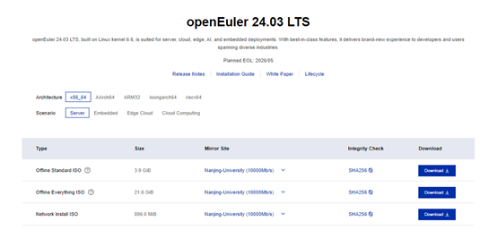
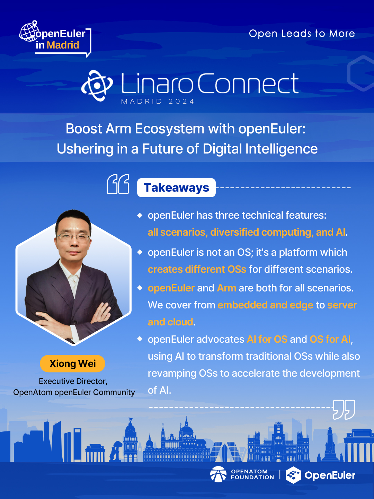
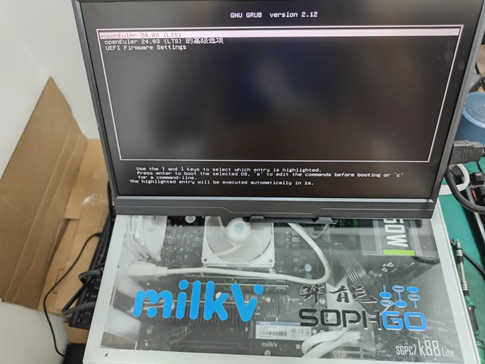

Welcome to the May edition of the openEuler Monthly Bulletin! As we continue to drive innovation and expand our community, we are excited to share the latest developments and achievements within the openEuler ecosystem. This month has been particularly noteworthy with significant milestones, new version release, and major contributions from our community members.

## Community Scale
As of May 31, 2024, the openEuler community has reached an impressive milestone, amassing over 2.42 million users globally, 172k PRs, and 96k issues, showcasing the dynamic and proactive engagement within the ecosystem. The vibrant community thrives with the continuous contributions from more than 18,000 developers. In May alone, 41 new organization members joined the openEuler community, bringing the total to 1,575.

## Community Highlight

### openEuler 24.03 LTS, the first AI-native open source operating system, is officially released
After two years of preparation, [openEuler 24.03 LTS has been officially released](https://www.youtube.com/watch?v=Nn4IZ0hUoUg). This version features comprehensive upgrades in infrastructure, Linux kernel 6.6, intelligent solutions, and versatile applications. These enhancements provide developers and users with a high-performance, reliable, and flexible development experience.

Currently, openEuler 24.03 LTS for all four scenarios (server, embedded, edge, and cloud scenarios) is available on the community's [official website](https://www.openeuler.org/en/download/?version=openEuler%2024.03%20LTS), with images available simultaneously at 37 global mirror sites and through major cloud service providers, such as [AWS](https://aws.amazon.com/marketplace/search/results?prevFilters=%7B%22sr%22%3A%220-4%22%2C%22ref_%22%3A%22beagle%22%2C%22applicationId%22%3A%22AWSMPContessa%22%7D&searchTerms=openEuler+24.03), [Tencent Cloud](https://market.cloud.tencent.com/products/40910?keyword=openEuler%2024.03), [Huawei Cloud](https://repo.huaweicloud.com/openeuler/openEuler-24.03-LTS/), and [Docker Hub](https://hub.docker.com/r/openeuler/openeuler/tags).

### openEuler participates in Linaro Connect 2024
On May 17, Dr. Xiong Wei, Executive Director of the openEuler Community, was invited to Linaro Connect 2024. During the event, Dr. Xiong delivered a [keynote speech](https://www.youtube.com/watch?v=1bRrCsrPKbk&list=PLtDfk9jvMAzjfit0Mc9o2FGw8JO_9MCOS&index=44) showcasing openEuler's capabilities in digital intelligence and its efforts to promote the prosperity of the Arm ecosystem.

### openEuler Technical Committee Chairperson Hu Xinwei spoke at the Chip Technology Forum

On May 29, Hu Xinwei, Chairperson of the openEuler Community Technical Committee, visited the Beijing Institute of Open Source Chip (BOSC) to deliver a keynote on "Building openEuler Distributions Within the Open Source Community."

Hu shared insights from a practical perspective on the planning and investments in the development of the openEuler open source OS. He highlighted the critical "bottlenecks" in its growth and underscored the significance of software ecosystems in broadening hardware usage scenarios and driving technological innovation.

The discussion also covered the importance of cloud technology and computing power optimization. Participants explored how community collaboration and technological innovation can foster a healthy and vibrant software ecosystem.

## Community Governance

### SBOM and Intelligence SIGs are approved to be established at the openEuler Technical Committee Monthly Meeting
The openEuler Technical Committee members approved the establishment of two new special interest groups (SIGs), SBOM SIG and Intelligence SIG, during the monthly meeting in May.

[SBOM SIG](https://www.openeuler.org/en/sig/sig-detail/?name=sig-sbom) focuses on developing tools and technologies related to software bill of materials (SBOM). Its mission is to enhance the security of the openEuler community's software supply chain, build an open-source-compliant community, and enable partners to quickly develop SBOM disclosure capabilities. Its responsibilities include maintaining the tools and source code for SBOM generation, conversion, and consumption, and building SBOM-based application services. Additionally, SBOM SIG aims to implement both home and abroad SBOM standards within the openEuler community.

[Intelligence SIG](https://www.openeuler.org/en/sig/sig-detail/?name=sig-intelligence) aims to leverage intelligent operating systems to accelerate AI adoption and foster innovation. It provides the community with native AI capabilities such as intelligent Q&A, tuning, and diagnostics. By leveraging AI-powered toolchains, the SIG also aims to imbue traditional applications with intelligent interaction capabilities.

### openEuler announces adoption of OpenChain ISO/IEC 18974
At the openEuler 24.03 LTS release event, openEuler announced its [adoption of OpenChain ISO/IEC 18974](https://www.linkedin.com/pulse/openeuler-achieves-iso-18974-conformance-first-open-source-communities-leblc/?trackingId=i8U%2FYzeQSQ%2BLynavOzbpew%3D%3D), making it the first open-source community to achieve this certification. This milestone highlights the community's commitment to secure and trustworthy open-source software supply chains.

The development of openEuler 24.03 LTS has been carefully aligned with this standard, enhancing the operating system's security and compliance capabilities. It is a testament to the hard work and dedication of the entire community and its partners.

openEuler has also released a [case study](https://github.com/OpenChain-Project/Reference-Material/blob/master/Case-Studies/openEuler-Case-Study-ISO-18974-Conformance.pdf) explaining the benefit and impact of OpenChain ISO/IEC 18974 adoption.

## Technical Progress

### RISC-V becomes the tier-1 architecture supported by openEuler 24.03 LTS
For the first time, RISC-V is supported as a tier-1 architecture in the openEuler 24.03 LTS. The testing and documentation for RISC-V images are nearing completion. This release supports the full scope of Everything and EPOL and new feature enhancements like UEFI, hot patches, hard real-time kernels, and trusted execution environment (TEE).

By adapting to and optimizing EDK II, we successfully boost UEFI on RISC-V devices. The latest 24.03 LTS defaults to UEFI boot, which is the de facto standard for servers.

### Partner-driven innovations shine in the openEuler 24.03 LTS release
- KylinSoft tops the contributions to openEuler 24.03 LTS
KylinSoft has made a substantial contribution of 440 PRs (data as of May 31, 2024) to the latest openEuler 24.03 LTS, ranking [No.1](https://datastat.openeuler.org/en/detail). Engaging 67 developers, KylinSoft has not only fixed over 60 CVEs and 200+ software bugs but also upgraded over 60 software packages. Furthermore, their contributions span a wide range of domains including kernel, security, AI, intelligent O&M, cloud native, virtualization, desktop, distributed storage, databases, big data, and high availability.
 
  In addition to inheriting existing features such as UKUI, NestOS, NKD, and PilotGo, KylinSoft has introduced new features to the OS software ecosystem. Notably, KylinSoft introduces two new plugins to PilotGo, the Topo plugin for visualizing service clusters in a customizable topology map and the A-Tune plugin, which incorporates the A-Tune intelligent tuning tool, providing one-click service tuning and task management. For UKUI, beyond integrating key components like the control panel, taskbar, and file manager, KylinSoft has fixed display issues with weather, date, and CPU information, optimized the UI of Kylin-Video, and improved the stability of UKUI components, enhancing the overall user experience.

- UnionTech has made substantial contributions to openEuler 24.03 LTS
UnionTech introduced several key features to the openEuler 24.03 LTS, including the DDE desktop, utsudo, utshell, and migration tools. They led the selection, development, testing, and documentation for the adapting of OpenStack Wallaby and Antelope.
  
  As the primary participant of Desktop, KDE, and GNOME SIGs, UnionTech successfully managed the selection, upgrade, and maintenance of software packages for the 24.03 LTS. They also contributed significantly to base repos across several SIGs, including Base Service, Programming Language, Networking, Compiler, and Virt.

  Alongside with the openEuler 24.03 LTS release event on June 6, UnionTech also launched their UnionTech Server Operating System V25, based on openEuler 24.03 LTS.

### New open source projects join the openEuler community
- Automation testing framework: [YouQu](https://youqu.uniontech.com)
  Initiated by UnionTech, the YouQu project has been successfully integrated into the openEuler community after thorough review by the QA SIG and Technical Committee. YouQu is an automation testing framework designed for Linux operating systems. It boasts features such as diversified element location and assertion, case labelling management and execution, robust logging, and report output. Additionally, it is fully compatible with both X11 and Wayland display protocols, with a simple deployment process and user-friendly operations.

- High-performance web server: [Fast-Https](https://gitee.com/ncepu-bj/fast-https/blob/master/README.en.md)
  Spearheaded by the IDeal Studio of North China Electric Power University and maintained by the Networking SIG, the Fast-Https project has also been successfully integrated into the openEuler community. Fast-Https, developed in Go, is a high-performance, highly concurrent, multi-protocol open-source web server. It aims to provide openEuler users with a secure, reliable, and feature-rich web service solution.

## Software & Hardware Compatibility
By the end of May 2024, a total of 1,710 software and hardware products were certified as compatible with openEuler. This includes 1,094 applications, 471 hardware components, and 145 OSs, among which, 36 applications, 3 hardware components, and 4 OSs were added to the [compatibility list](https://www.openeuler.org/en/compatibility/) in May.

### Security Bulletins
In May, we published 168 security notices, and patched 194 vulnerabilities (7 critical, 43 high, and 144 others).

The following vulnerabilities have a significant impact and require special attention:

Engrampa is an archive manager for the MATE environment. Engrampa is found to be vulnerable to a Path Traversal vulnerability that can be leveraged to achieve full Remote Command Execution (RCE) on the target. While handling CPIO archives, the Engrampa Archive manager follows symlink, cpio by default will follow stored symlinks while extracting and the Archiver will not check the symlink location, which leads to arbitrary file writes to unintended locations. When the victim extracts the archive, the attacker can craft a malicious cpio or ISO archive to achieve RCE on the target system. This vulnerability was fixed in commit 63d5dfa. ([CVE-2023-52138](https://www.openeuler.org/en/security/cve/detail/?cveId=CVE-2023-52138&packageName=engrampa)) – CVSS 9.6
Affected release:
openEuler 22.03 LTS SP2
openEuler 22.03 LTS SP3

Git is a revision control system. Prior to versions 2.45.1, 2.44.1, 2.43.4, 2.42.2, 2.41.1, 2.40.2, and 2.39.4, repositories with submodules can be crafted in a way that exploits a bug in Git whereby it can be fooled into writing files not into the submodule's worktree but into a \`.git/\` directory. This allows writing a hook that will be executed while the clone operation is still running, giving the user no opportunity to inspect the code that is being executed. The problem has been patched in versions 2.45.1, 2.44.1, 2.43.4, 2.42.2, 2.41.1, 2.40.2, and 2.39.4. If symbolic link support is disabled in Git (e.g. via \`git config --global core.symlinks false\`), the described attack won't work. As always, it is best to avoid cloning repositories from untrusted sources. ([CVE-2024-32002](https://www.openeuler.org/en/security/cve/detail/?cveId=CVE-2024-32002&packageName=git)) – CVSS 9.0
Affected release:
openEuler 20.03 LTS SP1
openEuler 20.03 LTS SP4
openEuler 22.03 LTS
openEuler 22.03 LTS SP1
openEuler 22.03 LTS SP2
openEuler 22.03 LTS SP3

You can find the security announcements on the openEuler official website and install the vulnerability patches in time.

## Thank You for Your Support
That's all for this openEuler Monthly Bulletin. Your continuous support and contributions are what make our community thrive. As we look ahead, we are excited to keep pushing the boundaries of open source innovation together. Stay tuned for more exciting news and developments in the coming months.