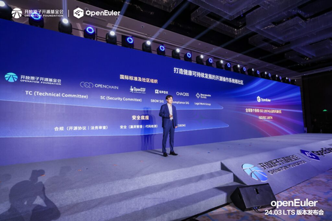

Yesterday marked the official release of openEuler's first AI-native open source operating system, openEuler 24.03 LTS. At the same time, openEuler has also become the first open source community worldwide to achieve [OpenChain ISO 18974](https://openchainproject.org/security-assurance) conformance. This milestone underscores the community's dedication to a secure and trustworthy open source software supply chain. The OpenChain ISO 18974 standard ensures robust security for open source software, fostering the development of reliable solutions.

The development of openEuler 24.03 LTS has been meticulously aligned with this standard, further enhancing the operating system's security and compliance capabilities. This achievement reflects our dedication to upholding the highest standards in open source software development, minimizing risks and vulnerabilities.

Achieving this certification is a significant milestone for openEuler, showcasing the community's emphasis on security and compliance. It is a testament to the hard work and dedication of the entire community and partners. By adhering to international standards, openEuler demonstrates its commitment to creating secure and compliant open-source solutions that users worldwide can trust.

Looking ahead, openEuler will continue prioritizing security, compliance, and innovation, inviting global collaboration for a robust open source future. Thank you for your continued support and trust in openEuler.

For more details, read the full [case study](ttps://openchainproject.org/news/2024/06/06/openeuler-iso-18974-case-study).