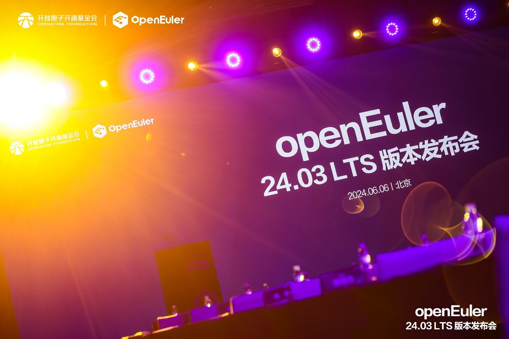
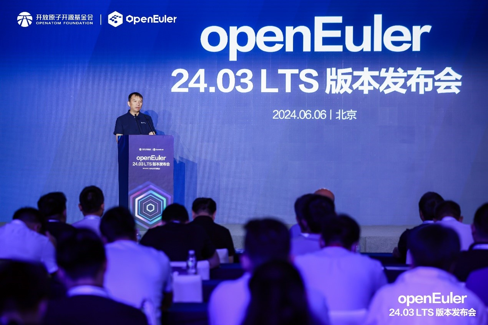
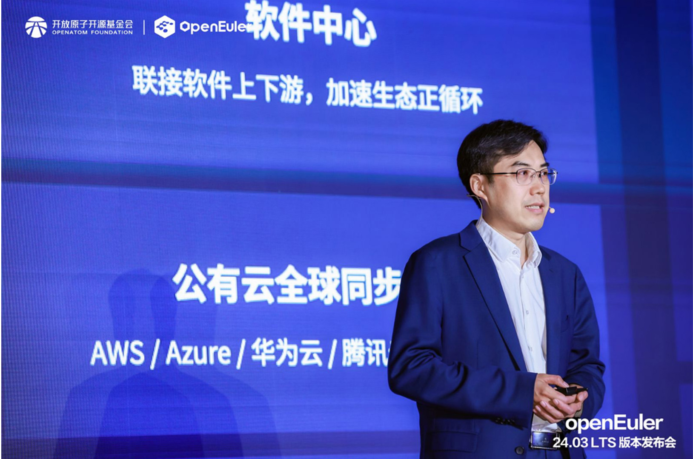
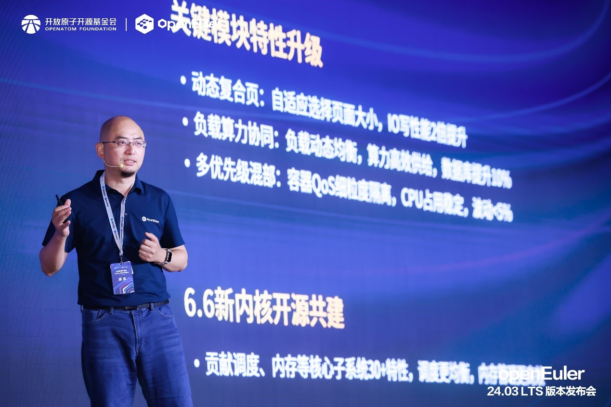
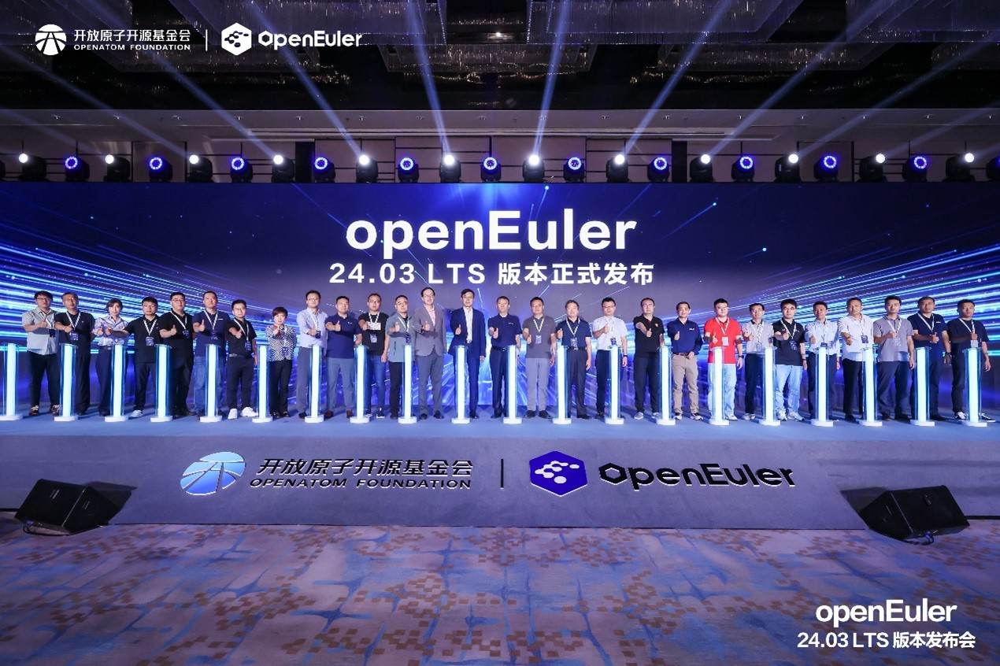

**\[Beijing, China, June 6, 2024\]** – The [release event](https://www.youtube.com/watch?v=4o4kDna1D3w) for openEuler 24.03 LTS, organized by the openEuler community, was successfully held in Beijing. This event brought together top-tier talent from the operating system industry to explore the technological, ecological, and international development of the openEuler community, aiming to build a healthy and sustainable community for open source operating systems. **During the event, [openEuler 24.03 LTS](https://www.openeuler.org/en/download/?version=openEuler%2024.03%20LTS), openEuler's first AI-native open source operating system, was officially released.**

> The rapid development of openEuler demonstrates the power of engaging with, supporting, and contributing to open source for driving technological innovation and industrial growth in operating systems. Looking ahead, the OpenAtom Foundation will keep steering openEuler and other open source projects to align with regional industrial strengths. Additionally, the Foundation will continue to help openEuler achieve global reach.

By Cheng Xiaoming, Chairperson of the OpenAtom Foundation

Over the past four years, the openEuler community has made significant strides. To date, it has attracted 1,500+ enterprise members and 18,800+ developers worldwide, with downloads spanning 2,037 cities in 153 countries, and over 6.8 million installations. According to an IDC report, openEuler's market share in new server operating systems reached 36.8% in 2023. In terms of technology, openEuler's innovation project repositories have grown to 552, with an average of 10 new projects added each month. In terms of ecosystem development, the community harnesses collaborative efforts, with over 30 projects from enterprises and universities contributing to openEuler, stimulating innovation across the entire industry chain.

> openEuler releases a long-term support (LTS) version every two years and an innovation version every six months, making openEuler a stable, secure, and vibrant open source operating system community. Over the past four years, the openEuler Technical Committee has held over 100 meetings, while 100+ SIGs have conducted 2,100+ technical sessions and completed 170,000+ code merge requests. The community has also organized eight technical conferences and nearly a hundred meetups. More than ten global chip manufacturers, over twenty operating system vendors, over a hundred leading industry software suppliers, and over 5,000 developers have participated in the development of openEuler 24.03 LTS.

By Jiang Dayong, Chairperson of the openEuler Committee

## openEuler's first AI-native open source operating system with four major upgrades

AI is ubiquitous in this intelligent era, with foundation models representing a trending direction. openEuler embraces this era by deeply integrating with AI, creating a virtuous cycle between AI and the operating system.

openEuler 24.03 LTS achieves comprehensive upgrades in four major aspects: infrastructure, kernel, intelligent solutions, and versatile applications, providing developers and users with a high-performance, reliable, and flexible development experience.

At the release event, Hu Xinwei, Chairperson of the openEuler Technical Committee, took a deep dive into these four major upgrades.

- **Infrastructure**: EasySoftware, openEuler's software center, has been launched to help users quickly access the rich software ecosystem of the openEuler community. It allows developers to monitor upstream software updates in real time, ensuring features align with upstream developments.
- **Kernel**: Linux kernel 6.6 delivers more balanced CPU scheduling, more efficient memory management, and more flexible resource utilization in virtual scenarios. Additionally, it supports key capabilities such as dynamic compound pages, doubling the write performance.
- **Intelligent solutions**: openEuler 24.03 LTS upgrades the basic AI capabilities to intelligent solutions by integrating oeAware, A-Ops, and A-Tune with the LLM-based interaction platform for intelligent scheduling, operations, and tuning. openEuler now supports a wider range of hardware and covers mainstream models, frameworks, and toolchains. It enables full-stack AI capabilities and supports inference and retrieval algorithms like Faiss and DCN. It is also compatible with popular AI frameworks such as OpenVINO and PyTorch, as well as foundational algorithm libraries like NumPy and ACL.
- **Versatile applications**: openEuler continues to strengthen its capabilities from servers to cloud, edge, and embedded scenarios. In server scenarios, sysSentry can detect 100% of known CPU faults, making systems more reliable; in cloud scenarios, memory tidal scheduling enhances container speed by 80%.

Currently, the Arm, x86, RISC-V, and LoongArch architecture images of openEuler 24.03 LTS are available simultaneously on the community website, at 37 global mirror sites, and through major cloud service providers.

## Exploring the path to prosperity with industry partners

Since its inception, the openEuler community has been dedicated to building a healthy and sustainable community for operating systems.

- In terms of security, openEuler focuses on compliance and supply chain information disclosure while committing to building a comprehensive security governance framework. Currently, openEuler has completed self-certification for the ISO 18974 open source software supply chain security standard initiated by OpenChain, becoming the first open source community to achieve this. This certification signifies that openEuler has reached leading levels in development processes, software supply chain management, risk assessment, and developer security capabilities.
- Since the establishment of the openEuler open source community in December 2022, sustainable development has been a key focus. Among the 500+ innovation projects incubated within the community, over 30 are contributed by different enterprises, universities, and organizations. These contributions have enriched the technological ecosystem of openEuler, driving innovation and development within the community.

The success of an operating system relies on the broad support of software and hardware vendors. openEuler has always aimed to create an operating system that caters to all scenarios and diverse computing power. The community continuously optimizes in continuous support, diverse resources, and system building. At the release event, 15 community partners and experts from JD.com, China Mobile, China Telecom eSurfing Cloud, Unicom Digital Tech, AMD, Phytium, Loongson, Huawei, Intel, Institute of Software of Chinese Academy of Sciences, Hoperun, Inspur, iSoftStone, and OpenInfra Foundation discussed "From General Computing to Intelligent Computing: Enabling All-Scenario Applications in the Intelligent Era," providing direction and suggestions for openEuler's technological development and the establishment of a global open source ecosystem.

## Embarking on a new journey, heading towards new horizons

In the future, openEuler will continue to collaborate with global partners, users, and developers to build openEuler into an international open source collaboration platform.