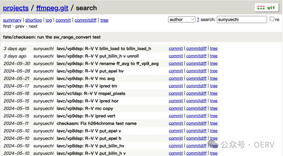

During the ongoing RISC-V Summit Europe 2024 at Munich, openEuler and the Institute of Software, Chinese Academy of Sciences (ISCAS) showcased the latest advancements in openEuler's RISC-V support, notably in the 24.03 LTS release. This release successfully achieves kernel unification for x86, Arm, and RISC-V, bringing RISC-V support up to par with x86 and Arm in terms of release scope and achieving comprehensive software repository coverage "Everything + Epol". This is a huge step forward, and we couldn't be more excited to share it with you.

A special shoutout to our openEuler RISC-V ([OERV](https://www.openeuler.org/en/sig/sig-detail/?name=sig-RISC-V)) team for their substantial contributions to creating a stable RISC-V native compilation and build environment tailored for server scenarios. Their dedication and expertise have led to substantial collaboration and innovation, including:

- Designing multi-stage build schedulers based on RISC-V servers, Docker, and QEMU
- Optimizing build memory and thread allocation strategies for large packages
- Overcoming numerous pipelines, build, and test challenges with the support of various SIGs.

Download:

[https://www.openeuler.org/en/download/?version=openEuler%2024.03%20LTS](https://www.openeuler.org/en/download/?version=openEuler%2024.03%20LTS)

If you find our project attractive but already use another distro, try migrating to openEuler. Here is our migration demonstration:

[https://www.youtube.com/watch?v=w7pIHPq3Nk0](https://www.youtube.com/watch?v=w7pIHPq3Nk0)

## Why This Is Exciting

For all developers working with RISC-V, this release offers a stable and powerful environment packed with features you'll love. From UEFI support to trusted execution environments, openEuler 24.03 LTS has it all.

### Key Highlights

**UEFI Support**: We're proud to be the first community distribution to support UEFI standards on RISC-V, making your boot processes smoother and more secure.

**Hot Patching**: Integrated sysCare allows hot patching on RISC-V, boosting your system's reliability and security.

**Trusted Execution Environment**: Our collaboration with Shanghai Jiao Tong University brings you the Penglai TEE solution for secure communication, key protection, and code authentication on RISC-V.

**RISC-V Kernel Unification Initiative**

To address fragmentation in the RISC-V ecosystem, the Chinese Academy of Sciences Software Institute initiated the "RISC-V Kernel Unification Plan" within our community. This plan aims to maintain a unified operating system baseline. It involves aligning openEuler Kernel 6.6 with RISC-V vendor SDKs and establishing Kernel CI infrastructure. Initial collaborations with leading RISC-V vendors have successfully aligned with this vision, with further integration expected in the 24.03 LTS SP1 release by year-end.

**Upstream Contributions and Ecosystem Building**

During the development of the 24.03 LTS version, the OERV team has enhanced its upstream contributions, particularly in the fields of audio-video and virtualization, to promote the overall development of the RISC-V software ecosystem.

**Audio-Video Optimization**: The OERV team has optimized key codecs (h264, h265, vp8, vp9, and vvc) in ffmpeg, achieving significant performance improvements.

**Virtualization Support**: The team has successfully implemented and verified StratoVirt support on QEMU, with ongoing efforts to expand support for other hypervisors like Kata Containers.

The OERV team is ready to support the upcoming [Sophgo SG2380](https://www.cnx-software.com/2023/10/21/sophgo-sg2380-16-core-sifive-p670-risc-v-processor-20-tops-ai-accelerator/) and JH8110 hardware, aiming to be the first distribution to comprehensively support vector extensions and hardware virtualization on RISC-V.

## Join the OERV Team and Innovate

We invite all developers to join our OERV team. Whether you're a seasoned developer, a chip manufacturer, or just passionate about RISC-V, we welcome your ideas and contributions.

Come be a part of this exciting journey with us and build your world with openEuler 24.03 LTS. Let's accelerate the development of the openEuler RISC-V ecosystem and build a vibrant thriving RISC-V environment together!

More details about our project:

GitHub: https://github.com/openEuler-RISCV

Ways to engage with the team:

Email: [wangjingwei@iscas.ac.cn](mailto:wangjingwei@iscas.ac.cn)

Discord: @OERV

