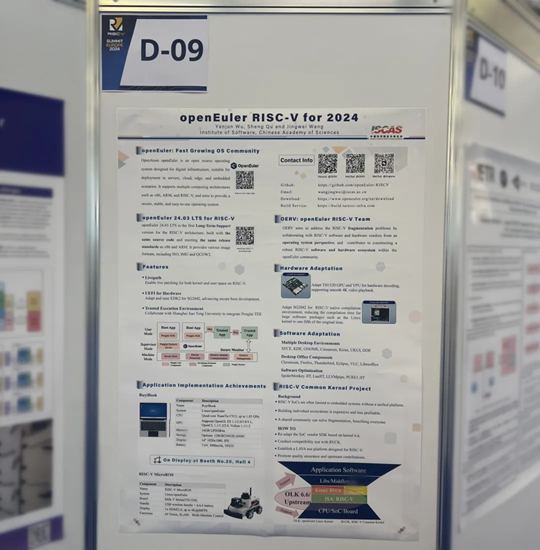
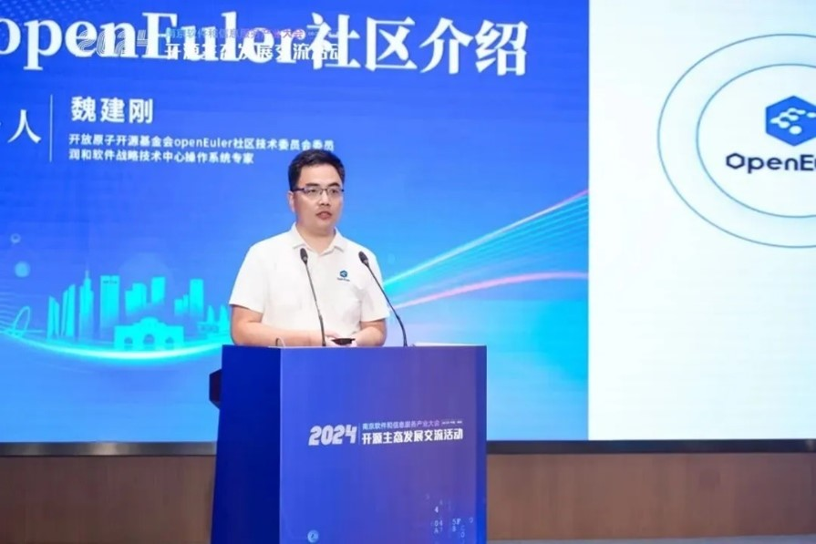
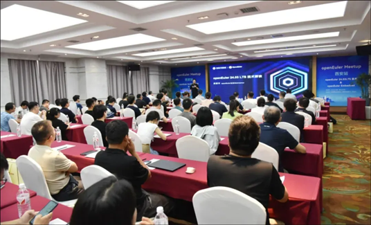
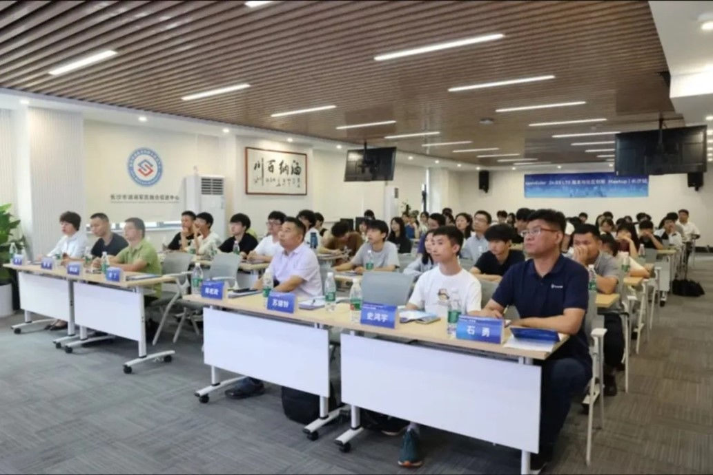
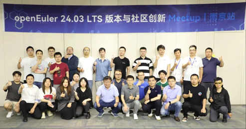
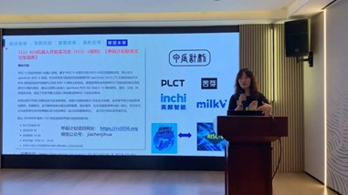
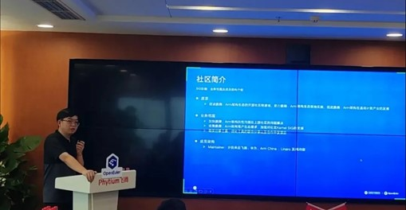

Welcome to the June edition of the openEuler Monthly Bulletin! This month has been bustling with activities from significant feature updates to engaging community events and insightful contributions from members across the globe. Let's dive into the highlights of June and celebrate the collective achievements of our vibrant openEuler community.

## Community Scale

As of June 30, 2024, the openEuler community has surpassed 3.05 million users. Over 19,000 developers have been actively contributing to the community, resulting in a total of 177.2k pull requests and 112.4k issues. The community now includes over 1,600 organization members, with 55 new organizations joining in June.

## Community Highlight

### openEuler 24.03 LTS release event is held in Beijing

On June 6, the [openEuler 24.03 LTS release event](https://www.linkedin.com/pulse/openeuler-2403-lts-first-ai-native-open-source-operating-system-jgrle/?trackingId=qoAM5ojBTpyEEfktF7hN1w%3D%3D) was held in Beijing. The event brought together leading experts in the operating system industry to explore the technical advancements, ecosystem growth, and international development of openEuler, aiming to build a healthy and sustainable open-source community.

During the event, the OpenAtom Foundation and representatives from community partners witnessed the release of [openEuler 24.03 LTS](https://www.openeuler.org/en/download/archive/detail/?version=openEuler%2024.03%20LTS), the community's first AI-native open-source operating system. It achieves comprehensive upgrades in [four major aspects](https://www.youtube.com/watch?v=Nn4IZ0hUoUg&list=PLtDfk9jvMAzgpB6cLVgg2Wk1cMPDKn2YN&index=5): infrastructure, kernel, intelligent solutions, and versatile applications, providing developers and users with a high-performance, reliable, and flexible development experience.

Moreover, 15 community partners and experts from JD.com, China Mobile, China Telecom eSurfing Cloud, Unicom Digital Tech, AMD, Phytium, Loongson, Huawei, Intel, Institute of Software of Chinese Academy of Sciences, Hoperun, Inspur, iSoftStone, and OpenInfra Foundation discussed [how to enable all-scenario applications in this intelligent era](https://www.youtube.com/watch?v=BHUPLsCjhL0&list=PLtDfk9jvMAzgpB6cLVgg2Wk1cMPDKn2YN&index=2). 

### openEuler showcases RISC-V advancements at the RISC-V Summit Europe 2024
The [RISC-V Summit Europe 2024](https://riscv.org/event/risc-v-summit-europe-2024/)  took place in Munich, Germany, from June 24–28. The openEuler RISC-V SIG, led by the Institute of Software, Chinese Academy of Sciences, showcased its latest advancements at the summit. RISC-V architecture has become one of the mainstream architectures in [openEuler 24.03 LTS](https://www.linkedin.com/pulse/openeuler-2403-lts-breaking-ground-native-risc-v-support-openeuler-s6coc/?trackingId=BmHZAJB8S46X0npWD8KJQQ%3D%3D), with its software ecosystem now on par with x86 and Arm.

At the summit, the RISC-V SIG announced the upcoming launch of the RISC-V Common Kernel (RVCK) project. This project aims to address the fragmentation issues within the RISC-V ecosystem for sustainable development.
 

### openEuler shares insights at the 2024 Nanjing Software Conference
From June 24–26, the 2024 Nanjing Software Conference & Industrial Software Supply and Demand Conference took place in Nanjing. Wei Jiangang, Operating System Expert of Hoperun & openEuler Technical Committee Member, attended the conference and shared insights on the operations and development of the openEuler community.
 

### openEuler meetups spark enthusiasm in multiple cities
Since the release of openEuler 24.03 LTS, the openEuler community has been hosting a series of meetups across various cities in China to showcase its new features and technological advancements. These events have drawn industry experts, developers, and users for vibrant discussions and networking.

- openEuler in Xi'an
On June 28, the openEuler meetup held in Xi'an saw over 80 participants from local tech companies, research institutes, universities, and the Xi'an user group. The meetup mainly focused on the openEuler 24.03 LTS, openEuler Embedded, and innovative services based on openEuler.
 

- openEuler in Changsha
Held on June 27, the openEuler Changsha meetup delved into the innovative features, industry applications, and ecosystem development of openEuler 24.03 LTS. It attracted a diverse group of technical experts, developers, and users who engaged in lively discussions.
 

- openEuler in Nanjing
On June 21, the Nanjing meetup brought together over 40 participants from nearly 20 organizations nationwide, centering on AI, embedded, and distributed innovation.

 
- openEuler in Shanghai
On June 22, openEuler's [Compiler](https://www.openeuler.org/en/sig/sig-detail/?name=Compiler), [RISC-V](https://www.openeuler.org/en/sig/sig-detail/?name=sig-RISC-V), and [ROS](https://www.openeuler.org/en/sig/sig-detail/?name=sig-ROS) SIGs and KuYa Technology held an in-person meetup in Shanghai. Wang Xiaoyun, a developer from the openEuler community and an engineer at the Institute of Software, Chinese Academy of Sciences, shared the development journey and future plans of the ROS SIG. She highlighted the significant achievements of openEuler ROS since the release of openEuler 24.03 LTS. Additionally, KuYa Technology announced it would offer 50 dedicated open-source internship positions under [RISC-V Prosperity 2036](https://github.com/rv2036/rv2036-website/blob/main/README.en.md) to support the development and operations of the openEuler ROS SIG.

 
- openEuler in Beijing
On June 21, the [openEuler Arm SIG](https://www.openeuler.org/en/sig/sig-detail/?name=sig-Arm) organized a meetup in Beijing, bringing together experts and industry pioneers in Arm hardware and software ecosystems. The event focused on the latest advancements in Arm software ecosystems, showcasing best practices in typical application scenarios. Discussions also delved into deployment and optimization techniques on Arm servers, as well as future development directions.

 
- openEuler online meetup
On June 19, the [openEuler Migration Meetup](https://www.youtube.com/live/w7pIHPq3Nk0) took place via YouTube. Dr.Xiong Wei and various technical experts from the community provided insights on migrating to openEuler. During the meetup, Ding Jiahui, Senior Engineer of the community, demonstrated a seamless upgrade from CentOS to openEuler. Additionally, community developer Shine Wang shared practical experiences in developing openEuler, offering valuable tips for developers looking to upgrade operating systems and engage in community contributions.

These meetups have not only highlighted the advancements of openEuler 24.03 LTS but also strengthened the community's network, paving the way for further innovation and collaboration.

## Community Governance
### openEuler Committee holds seventh meeting in Beijing
On June 6, the 2023–2024 openEuler Committee convened its seventh meeting in Beijing. Representatives from the Marketing Committee, User Committee, Talent SIG, and OSPO presented reports on the community's operational achievements of the first half of 2024. The meeting also saw discussions for plans and strategies for the second half of 2024.

### openEuler Technical Committee approves the setup of Backup SIG
During its meeting in June, the openEuler Technical Committee approved the formation of the Backup SIG. The Backup SIG aims to build an open backup software ecosystem and seamlessly integrate it into server environments. The SIG seeks to position openEuler as a pivotal platform for incubating open-source backup software, fostering technological development, innovation, and enhancing application compatibility.

## Technical Progress
### openEuler's first AI-native open-source operating system openEuler 24.03 LTS is released
On June 6, [openEuler 24.03 LTS](https://www.openeuler.org/whitepaper/en/openEuler%2024.03%20LTS%20Technical%20White%20Paper.pdf) was officially released, featuring comprehensive upgrades in [infrastructure, kernel, AI solutions, and all-scenario experiences](https://www.linkedin.com/pulse/openeuler-2403-lts-first-ai-native-open-source-operating-system-jgrle/?trackingId=0%2B7HoZeYTQOu%2FJgF4VuDbg%3D%3D), and delivering high-performance, high-reliability, and high-flexibility for developers and users.

[openEuler 24.03 LTS](https://www.openeuler.org/en/download/archive/detail/?version=openEuler%2024.03%20LTS) is now available for Arm, x86, RISC-V, and LoongArch architectures via official website, 37 global mirror sites, and mainstream cloud platforms.

### openEuler 22.03 LTS SP4 is released with advanced features
On June 30, [openEuler 22.03 LTS SP4](https://www.openeuler.org/en/download/?version=openEuler%2022.03%20LTS%20SP4) was launched as an enhanced 22.03 LTS edition. This edition is built on Linux kernel 5.10, tailored for server, cloud-native, edge, and embedded scenarios, with POSIX standard-compliant interfaces. It integrates capabilities such as DSoftBus and KubeEdge+ (an edge-cloud collaboration framework), further enhancing digital infrastructure coordination and facilitating the foundation for IoE.

- sysSentry v1.0.2 is released with openEuler 22.03 LTS SP4
[sysSentry](https://gitee.com/openeuler/sysSentry) v1.0.2, a fault inspection framework designed to proactively detect software and hardware failures, has been launched. This framework aims to minimize incidents by alerting system operators to issues before they escalate into live network failures, thereby enhancing system reliability. sysSentry facilitates background fault inspections, supporting unified management of operating systems, hardware, and more through predictive diagnostics and troubleshooting. All inspection functionalities are integrated as plugins, allowing for flexible customization as needed. This initial release has been packaged as an RPM with [openEuler 22.03 LTS SP4](https://www.openeuler.org/en/download/?version=openEuler%2022.03%20LTS%20SP4).

### Repos for oeAware and MetaGPT have been created in the openEuler community
- oeAware system awareness acceleration service
[oeAware](https://docs.openeuler.org/en/docs/24.03_LTS/docs/oeAware/oeAware_user_guide.html), a plugin framework on openEuler, aims to boost system optimization by dynamically perceiving system behaviors at low loads. Unlike traditional static tuning methods, oeAware divides optimization into three layers–collection, perception, and tuning, aiming to empower users to complete system tuning through a unified interface effortlessly. Currently, repos for oeAware have been created in the openEuler community, featuring lightweight microarchitecture information collection and oeAware is integrated with both openEuler 24.03 LTS and 22.03 LTS SP4 releases.

- MetaGPT AI agent framework
Initiated by KylinSoft and maintained by the [Intelligence SIG](https://www.openeuler.org/en/sig/sig-detail/?name=sig-intelligence), the MetaGPT repo has been created in the openEuler community. MetaGPT serves as a multi-agent framework utilizing standard operating procedures (SOPs) to coordinate multi-agent systems based on LLMs, enabling meta-programming capabilities.
Key features:
  - Stable solutions: SOPs allows for generating more consistent and accurate solutions.
  - Diverse role assignment: Different roles are assigned to LLMs, ensuring comprehensive problem-solving capabilities. MetaGPT simulates a virtual software team with roles like product manager, architect, project manager, engineer, and quality engineer, integrating SOPs into the development process.
  - Enhanced AI agent capabilities: Using meta-programming technology, MetaGPT continuously enhances AI agent capabilities to better understand and execute complex tasks.

### openEuler Embedded makes significant progress in June
In June, openEuler Embedded achieved a major milestone with the release of the 24.03 LTS version. Concurrently, in collaboration with Hoperun, a validation demo was conducted for hybrid deployment of openEuler Embedded and OpenHarmony on the same hardware for different scenarios.

Validation on [Raspberry Pi 4 Model B](https://www.raspberrypi.com/products/raspberry-pi-4-model-b/): One processor core allocated to openEuler Embedded for system management, two processor cores along with resources such as GPU, Wi-Fi, and Bluetooth, allocated to OpenHarmony for human-machine interaction, and one processor core plus GPIO peripheral allocated to real-time operating system for simulated real-time control. Validation scenarios also included openEuler Embedded (2 cores) + 1 SMP RTOS (2 cores) and openEuler Embedded (2 cores) + 2 RTOS (1 core for each).

In terms of device-cloud collaboration, openEuler Embedded supports the combination of [KubeEdge](https://kubeedge.io/) and [iSulad](https://gitee.com/openeuler/iSulad), facilitating communications and container deployment between openEuler Server running Kubernetes management nodes and openEuler Embedded running KubeEdge + iSulad on the [QEMU](https://www.qemu.org/) simulation platform. 

### EventedPLEG is added to iSulad, boosting stability performance by 30%
Developed to meet diverse needs in the CT and IT sectors, openEuler's iSulad container engine is known for its lightweight and high-performance capabilities, ideal for running in resource-constrained environments.

Based on Sandbox API in openEuler 24.03 LTS, iSulad now supports the standard container runtime interface (CRI) v1.29 and EventedPLEG. This upgrade to CRI v1 incorporates the latest upstream features into iSulad, resulting in an approximately 30% performance enhancement in stable conditions.

## Hardware & Software Compatibility
By the end of June 2024, a total of 1,793 software and hardware products were certified as compatible with openEuler. This includes 1,128 applications, 513 hardware components, and 152 OSs, among which, 34 applications, 42 hardware components, and 7 OSs were added to the [compatibility list](https://www.openeuler.org/en/compatibility/) in June.

## Security Bulletin
In June, we published 95 security notices, and patched 184 vulnerabilities (2 critical, 15 high, and 167 others).

The following vulnerabilities have a significant impact and require special attention:
A use-after-free vulnerability was found in OpenSSL. Calling the OpenSSL API SSL_free_buffers function may cause memory to be accessed that was previously freed in some situations. ([CVE-2024-4741](https://www.openeuler.org/en/security/cve/detail/?cveId=CVE-2024-4741&packageName=openssl)) – CVSS 9.8
Affected release:
openEuler 20.03 LTS SP4
openEuler 22.03 LTS SP1
openEuler 22.03 LTS SP3
openEuler 24.03 LTS

GNU Libtasn1 before 4.19.0 has an ETYPE_OK off-by-one array size check that affects asn1_encode_simple_der. ([CVE-2021-46848](https://www.openeuler.org/en/security/cve/detail/?cveId=CVE-2021-46848&packageName=grub2)) – CVSS 9.1
Affected release:
openEuler 20.03 LTS SP4
openEuler 22.03 LTS SP1
openEuler 22.03 LTS SP3
openEuler 24.03 LTS

You can find the [security announcements](https://www.openeuler.org/en/security/security-bulletins/) on the openEuler official website and install the vulnerability patches in time.

## Thank You for Your Support
We hope you found this monthly bulletin informative and insightful as we continue to push boundaries and innovate within the openEuler community. Stay tuned for more exciting developments and updates in the coming months. Thank you for being part of our journey towards building a robust and open ecosystem together.

