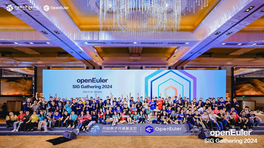
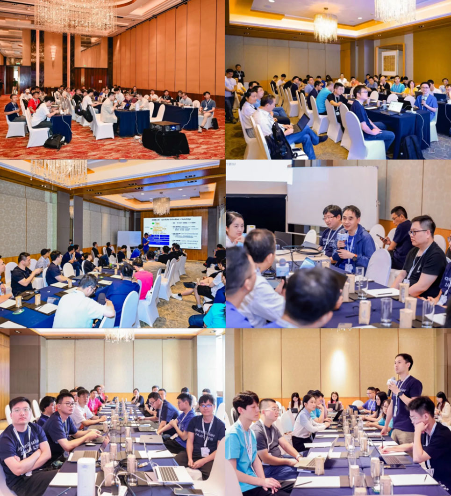
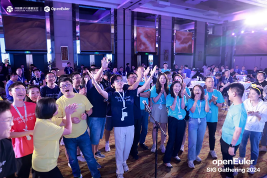
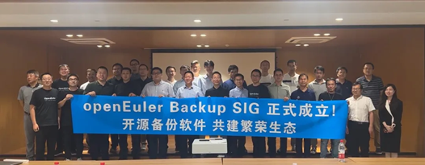
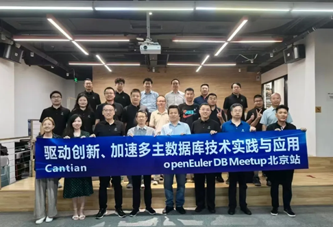
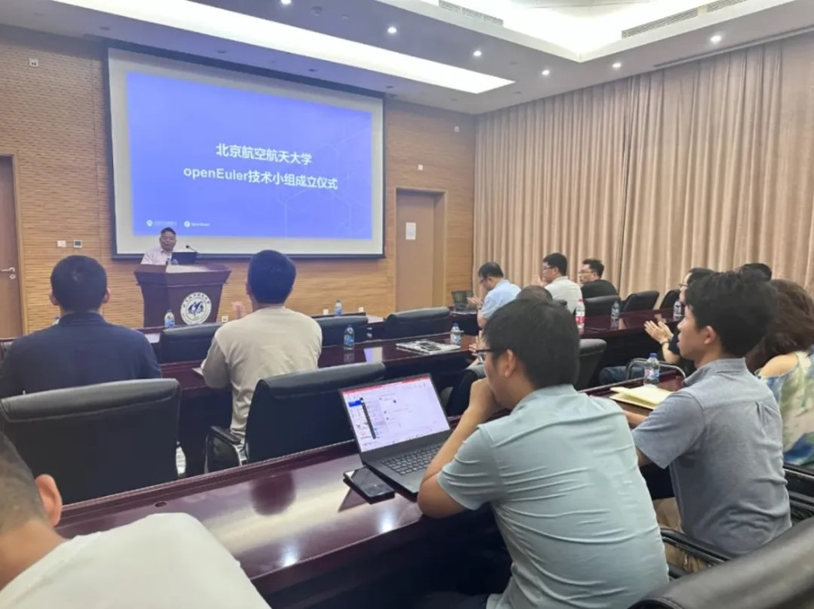
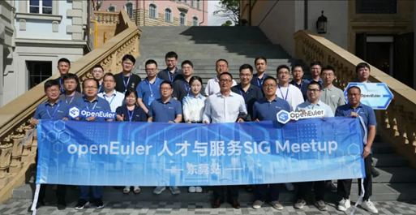
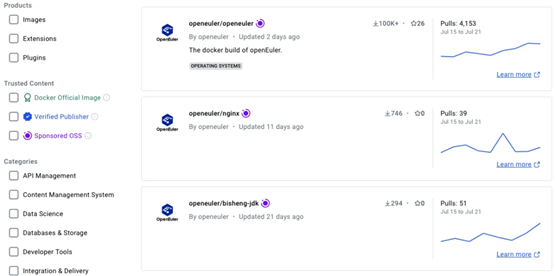
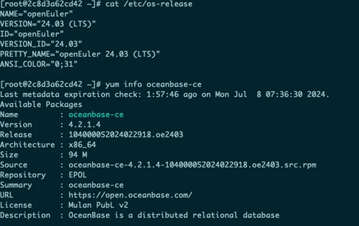

# openEuler Monthly Bulletin – July

Welcome to the July edition of the openEuler Monthly Bulletin! This month has been filled with exciting developments, from major feature enhancements to dynamic community events, and we are eager to highlight the latest progress and accomplishments within the openEuler ecosystem. Let's explore the collective achievements of our vibrant openEuler community!

## Community Scale

As of July 31, 2024, the openEuler community has grown to over 3.15 million users. More than 19,000 developers are actively contributing, with a total of 18.9k PRs and 114.8k issues generated. The community now includes 1,676 organizational members, with 46 new members joining this month. To access the latest data, please visit the [openEuler DATASTAT](https://datastat.openeuler.org/en/overview).

## Community Highlight

### openEuler SIG Gathering held in Beijing

On July 26, the [openEuler SIG Gathering 2024](https://www.openeuler.org/en/interaction/summit-list/sig-gathering-2024/) took place in Beijing.

Key contributors from 108 SIGs gathered to engage in in-depth discussions on openEuler's technological achievements and user experience. The discussions covered [six key topics](https://www.linkedin.com/pulse/openeuler-sig-gathering-2024-wrap-up-innovation-collaboration-zi79c/?trackingId=HSvdRd7%2BTxqiRbuS%2BC2S3g%3D%3D): diversified computing, all-scenario applications, AI-native support, upstream-native support, openEuler-native development, and user experience boost. These discussions led to the formulation of the next development plans and key technical strategies for the openEuler community. This day-long event has shown the openness, inclusiveness, depth, and foresight of the openEuler community.

The openEuler SIG gathering 2024 brought us many [memorable moments](https://www.youtube.com/watch?v=N2laq2NUSyI&list=PLtDfk9jvMAzg3z9ESdCZxVlirplu2qFvs). The openEuler community also organized a relaxed Developer Night that evening, featuring fun-filled games, impressive performances, delicious foods, and awesome swags. Special thanks were given to the producers of the openEuler SIG Gathering 2024 for their efforts, which played a key role in the event's success. Heartfelt gratitude was also extended to the developers of the openEuler community. Their invaluable contributions and enthusiastic participation were crucial to the community's ongoing growth.

### openEuler meetups ignite passion across cities

#### openEuler in Beijing

On July 22, the first openEuler Backup Meetup took place in Beijing. Co-hosted by the [openEuler Backup SIG](https://www.openeuler.org/en/sig/sig-detail/?name=sig-Backup) and [Beijing Innoway](https://www.z-innoway.com/#/home), the event attracted over 40 ecosystem partners and prospective users from fields including database, virtualization, and backup. The meetup focused on sharing innovations in backup software ecosystems and architectures.

The openEuler Backup SIG, established this year, mainly focuses on building an open backup software ecosystem. It brings together users, developers, and partners to advance technology and innovation in the backup field and address challenges such as backup application compatibility.

On July 19, the openEuler DB Meetup took place in Beijing. Over 20 experts and developers from various enterprises and institutions gathered to discuss innovations in multi-active database technology and its future applications in the industry.

On July 10, the openEuler Embedded Meetup was held in Beijing. Technical experts from [the School of Computer Science and Engineering of Beihang University](https://scse.buaa.edu.cn/English/Home.htm), the openEuler community, and other enterprises and organizations gathered to share innovations and practical experiences in the embedded field. Additionally, the openEuler technical group in Beihang University was established during the event.

#### openEuler in Dongguan

On July 18, the openEuler Talent and Service Meetup was held in Dongguan. Over 20 community technical experts gathered to discuss topics such as OS migration, intelligent O&M, and foundation model applications, fostering the development of the community ecosystem and talent.

### openEuler BigData meetup held online

On July 5, the [openEuler BigData SIG](https://www.openeuler.org/en/sig/sig-detail/?name=bigdata) hosted an online meetup. The event brought together technical experts and industry leaders in the big data field to discuss four key topics:

* Big data on AArch64
* UADK's acceleration of big data: key application scenario for Kunpeng servers
* [Bigtop Manager](https://github.com/openeuler-mirror/bigtop-manager): a cloud-native big data cluster management platform
* An efficient solution for Spark Native SQL Native engine

## Community Governance

### IDE SIG established at the openEuler Technical Committee monthly meeting

In the July meeting, the openEuler Technical Committee approved the establishment of the [IDE SIG](https://www.openeuler.org/en/sig/sig-detail/?name=sig-IDE). With the rapid development of smart manufacturing and the growing influence of openEuler, there is a need for an easy-to-use and efficient integrated development environment (IDP) to support rapid and convenient development in embedded systems. The IDE SIG is designed specifically for the openEuler ecosystem, aiming to provide developers with a more efficient and high-quality toolchain solution. This will accelerate service development and iteration processes and promote broader technological applications and innovations in the embedded industry. Developers interested in this SIG are encouraged to get involved.

## Technical Progress

### openEuler container images officially certified by Docker Hub OSS

In July, openEuler container images have been accepted as part of the [Docker-Sponsored OSS](https://hub.docker.com/r/openeuler/openeuler), and the openEuler image repositories will display an OSS badge. This means guaranteed security and reliability.

The openEuler community will continue to update both base and application container images on Docker Hub.

The openEuler 24.03 LTS images for different scenarios are now available on platforms including [Azure](https://portal.azure.com), [AWS](https://aws.amazon.com/marketplace/pp/prodview-rdfglgsng7veo?sr=0-2&ref_=beagle&applicationId=AWSMPContessa), [Alibaba Cloud](https://www.aliyun.com/), [Huawei Cloud](https://marketplace.huaweicloud.com/contents/b295de63-8718-4477-961a-46fdffaad701#productid=OFFI1004941126717046784), [Tencent Cloud](https://market.cloud.tencent.com/products/40910?keyword=open%20euler), [OEPKGS](https://hub.oepkgs.net/account/sign-in?globalSearch=openeuler), [Microsoft Store](https://apps.microsoft.com/store/detail/9PKZ8GN18L5C?cid=DevShareMCLPCS), [Docker Hub](https://hub.docker.com/r/openeuler/openeuler), [Linux Container](https://images.linuxcontainers.org/), and [OrbStack](https://orbstack.dev/download). Developers can easily experience the latest openEuler 24.03 LTS whether they are using Windows, Mac, or Linux.

### OceanBase successfully adapted to openEuler

[OceanBase](https://en.oceanbase.com/) 4.2.1 LTS is now fully compatible with [openEuler 24.03 LTS](https://www.openeuler.org/en/download/?version=openEuler%2024.03%20LTS), with the OceanBase software packages available in the [official openEuler repo](https://repo.openeuler.org/), thanks to the collaborative efforts of both communities. This adaptation provides enterprises with more options as they advance their digital transformation efforts.

### openEuler supports Security Advisory disclosure in CSAF

The Common Security Advisory Framework [(CSAF)](https://oasis-open.github.io/csaf-documentation), an official standard released by the Organization for the Advancement of Structured Information Standards (OASIS), is used for disclosing security advisories in machine-readable formats. CSAF is primarily focused on providing solutions for vulnerabilities and includes five types of documents: CSAF Base, Security Incident Response, Informational Advisory, Security Advisory, and VEX, each suited for different vulnerability disclosure scenarios.

openEuler currently supports disclosures in the Security Advisory format and plans to gradually extend support to historical data and the VEX type. You can download the [CSAF files](https://repo.openeuler.org/security/data/csaf/advisories/) for openEuler now.

### openEuler community establishes signature system

Protecting the security and integrity is crucial for open source software components. openEuler has established a software release signature system based on Public Key Infrastructure (PKI). During the software building phase, digital signatures are automatically added to target files, and [public key certificates](https://www.openeuler.org/en/security/certificate-center/) are embedded in key components. This allows users to activate the signature verification mechanism directly after installing openEuler images, thereby enhancing system security.

### iSulad completes support for CDI

Container engines have become the cornerstone of the cloud-native era with the rapid development of container technology. How to enable containers to use devices like GPUs and NPUs more quickly and conveniently has become a key community focus. The [openEuler Cloud Native SIG](https://www.openeuler.org/en/sig/sig-detail/?name=sig-CloudNative) has implemented the Container Device Interface (CDI) specification in [iSulad v2.1.5](https://docs.openeuler.org/en/docs/24.03_LTS/docs/Container/iSulad_support_for_CDI.html), supporting CDI functionality through the CRI interface. This makes using devices simpler in both the runtime and Kubernetes, standardizes how containers load these devices.

### High-performance storage project FastBlock advances

In July, the [FastBlock](https://github.com/openeuler-mirror/fastblock/blob/master/README.en.md) project, initiated by Unicom Digital Tech and jointly maintained by the [SDS SIG](https://www.openeuler.org/en/sig/sig-detail/?name=sig-SDS), has achieved significant updates and optimizations.

FastBlock is a distributed block storage system designed for all-flash scenarios and addresses the urgent need for low-cost, high-performance block storage in database and virtualization scenarios. In the case of using only standard NVMe media, the latency performance of a three-replica, single-client configuration with iodepth=1 is over five times better than Ceph.

The FastBlock team has completed the following updates and optimizations in July:

* SPDK upgrade: Upgraded SPDK to version 24.05, adapting to API changes and performing regression testing. Added FastBlock bdev-related RPCs to the SPDK source code.
* Performance optimization: With multi-core optimization and uniform distribution of PGs across cores, drivers can nearly reach their maximum performance capacity. Under the same conditions, the cluster's 4K random write performance improved from 170,000 IOPS in June to 420,000 IOPS.
* I/O latency optimization: Resolved latency issues caused by adding OSD ID to OSD logs, optimized RPC data transmission methods, and reduced serialization overhead.
* Issue fixes: Added UUID validity checks, optimized OSD port binding retry mechanisms, memory pool APIs, and CPU binding methods.
* Cluster stability enhancements: Added a cluster **fsid** field to prevent OSDs from different clusters, resolving the issue where OSD monitor clients would encounter bugs when parsing monitor information, leading to exceptions and causing cluster instability.

### UADK undergoes significant update

In July, the User Space Accelerator Development Kit (UADK), developed by [Linaro](https://www.linkedin.com/company/linaro/) and Huawei and maintained by the [AccLib SIG](https://www.openeuler.org/en/sig/sig-detail/?name=sig-AccLib), has achieved a significant update.

UADK provides a unified programming interface to efficiently utilize hardware accelerators and supports Shared Virtual Addressing (SVA) technology. It offers a growing set of high-performance algorithm implementations, including functions such as encryption and compression.

In the latest openEuler 24.03 LTS release, UADK supports both hardware acceleration engines, AArch64 SVE, and Crypto Extension CPU instructions.

The updated UADK supports the following acceleration algorithms:

* Compression algorithms: GZIP, ZLIB, DEFLATE, LZ77\_ZSTD
* Asymmetric cryptography: RSA, DH, ECC (SM2, ECDSA, ECDH, X25519/X448)
* Symmetric cryptography: AES, SM4, DES/3DES
* Digest algorithms: SHA-1, SHA-2, SM3, MD5

### Rust-Shyper hypervisor makes notable strides in development

The [Rust-Shyper](https://github.com/openeuler-mirror/rust_shyper) system, based on the Rust language, aims to deliver a highly reliable, embedded hypervisor. Recently, Rust-Shyper has undergone some new changes:

* Supports CPU virtualization for the RISC-V architecture, enabling multiple vCPUs to run on a single physical CPU, and has successfully simulated the interrupt controller PLIC.
* Supports both passthrough and emulated devices. The system can inject interrupts into virtual machines (VMs) via the simulated PLIC and has virtualized the supervisor binary interface (SBI) to provide a complete SBI environment on the hypervisor.
* Supports tailoring and modifying the device tree to present a unique device view to each VM.

### MICA framework advances efficient multi-OS hybrid deployment

In embedded scenarios, while Linux is widely used, it does not meet all needs, particularly in cases requiring high real-time performance, reliability, and security. To address these requirements, the openEuler Embedded team has introduced the mixed-criticality deployment framework ([MICA](https://www.openeuler.org/en/blog/20231226-MICA/MICA%20Facilitates%20Mixed-Criticality%20Deployments.html)). MICA enables efficient hybrid deployment of multiple operating systems, meeting the diverse functional, real-time, and power consumption needs of embedded systems. Through MICA, it is possible to integrate, manage, and coordinate multiple RTOS capabilities in a SoC.

### Big Data SIG progresses in July

In July, the [Big Data SIG](https://www.openeuler.org/en/sig/sig-detail/?name=bigdata) mainly focused on the following key areas:

* **Apache Bigtop's official support for openEuler**

On July 8, 2024, [Apache Bigtop](https://bigtop.apache.org/) 3.3.0 was released with support for the openEuler operating system. This milestone shows that openEuler has officially become part of Bigtop's big data ecosystem.

* **The development of bigtop-manager**

The [bigtop-manager project](https://github.com/openeuler-mirror/bigtop-manager), a cloud-native big data cluster management platform, has been developed to efficiently manage the big data components supported by Bigtop. The project, maintained and operated by the openEuler Big Data SIG, has now been incorporated into Apache Bigtop as a sub-project.

### Compiler SIG completes multi-version GCC and LLVM plans

The [openEuler Compiler SIG](https://www.openeuler.org/en/sig/sig-detail/?name=Compiler), dedicated to providing a platform for discussing and sharing compiler technology including GCC, LLVM, and OpenJDK, has completed its multi-version plans for GCC and LLVM:

* GCC-14 sub-version toolchain

During the openEuler 24.03 LTS release lifecycle, GCC's main version is 12.3.1. With the support of Compiler SIG, the openEuler 24.09 release will incorporate [GCC-14](https://gcc.gnu.org/gcc-14/), aligning with the latest upstream versions and enabling new features for x86 and Arm architectures. As an important component of the compilation toolchain, the binutils-2.42 has been introduced alongside GCC-14. Currently, the project repository has been established in the openEuler community and is maintained by the Compiler SIG.

* LLVM multi-version plan

[LLVM](https://llvm.org/) has finalized its multi-version plan and established the **llvm-latest** software package repository. Future openEuler versions will maintain the quality and stability of the default LLVM version while also supporting at least one new LLVM version to help developers utilize the latest advancements from the upstream community.

### ROS SIG continues with ROS packages and third-party software adaptation

The [ROS SIG](https://www.openeuler.org/en/sig/sig-detail/?name=sig-ROS) has been maintaining and updating packages for ROS1-noetic and ROS2-humble in the openEuler 24.03 LTS release, including **rosbridge**, **dynamixel-workbench**, and **orge**. The Gazebo ROS simulation software is expected to be adapted into the [openEuler 22.03 SP4](https://www.openeuler.org/en/download/?version=openEuler%2022.03%20LTS%20SP4) soon.

### Embedded SIG progresses in July

Following the release of openEuler 22.03 LTS SP4, the [Embedded SIG](https://www.openeuler.org/en/sig/sig-detail/?name=sig-embedded) has conducted routine upgrades and maintenance, addressing issues found during further testing, and will continue to advance the functionalities.

Key updates include:

* Support for embedded graphics, with preliminary support for Firefox and Chromium browsers
* Updates and enhancements to embedded AI components
* Adaptation of [HiEuler](https://gitee.com/HiEuler/) for [KubeEdge](https://kubeedge.io/)

## Hardware & Software Compatibility

By the end of July 2024, a total of 1,901 software and hardware products were certificated as compatible with openEuler. This includes 1,216 applications, 528 hardware components, and 157 OSs, among which, 88 applications, 15 hardware components, and 5 OSs were added to the [compatibility list](https://www.openeuler.org/en/compatibility/) in July.

## Security Bulletin

In July 2024, the community published 136 security notices and patched 197 vulnerabilities (7 critical, 32 high, and 158 others).

The following vulnerabilities have a significant impact and require special attention:

In the Linux kernel, the following vulnerability has been resolved: the issue of key expiration being overwritten during instantiation. Previously, the expiration time of a key was unconditionally set to permanent upon instantiation, leading to problems with DNS resolution. This was because the expiration time set by user space was overwritten to TIME64\_MAX, effectively disabling further DNS updates. The issue has been fixed by restoring the condition that key\_set\_expiry is only called when the pre-parser specifies a particular expiration time. ([CVE-2024-36031](https://www.openeuler.org/en/security/cve/detail/?cveId=CVE-2024-36031&packageName=kernel)) – CVSS 9.8
Affected release:
openEuler-22.03-LTS-SP3
openEuler-24.03-LTS

adts\_decode\_extradata in libavformat/adtsenc.c in FFmpeg 4.4 does not check the init\_get\_bits return value, which is a necessary step because the second argument to init\_get\_bits can be crafted. ([CVE-2021-38171](https://www.openeuler.org/en/security/cve/detail/?cveId=CVE-2021-38171&packageName=ffmpeg)) – CVSS 9.8
Affected release:
openEuler-20.03-LTS-SP4
openEuler-22.03-LTS-SP1
openEuler-22.03-LTS-SP3
openEuler-22.03-LTS-SP4

You can find the [security announcements](https://www.openeuler.org/en/security/security-bulletins/ ) on the openEuler official website and install the vulnerability patches in time.

## Thank You for Your Support

That's all for this openEuler Monthly Bulletin. Your continuous support and contributions are what make our community thrive. As we look ahead, we are excited to keep pushing the boundaries of open source innovation together. Stay tuned for more exciting news and developments in the coming months.