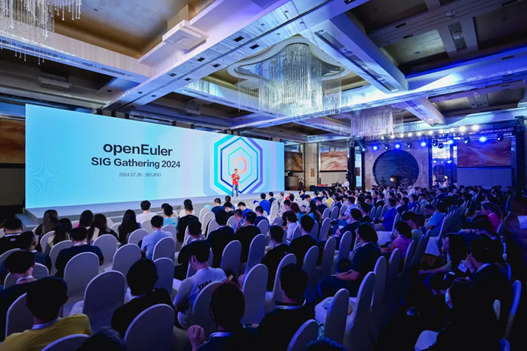
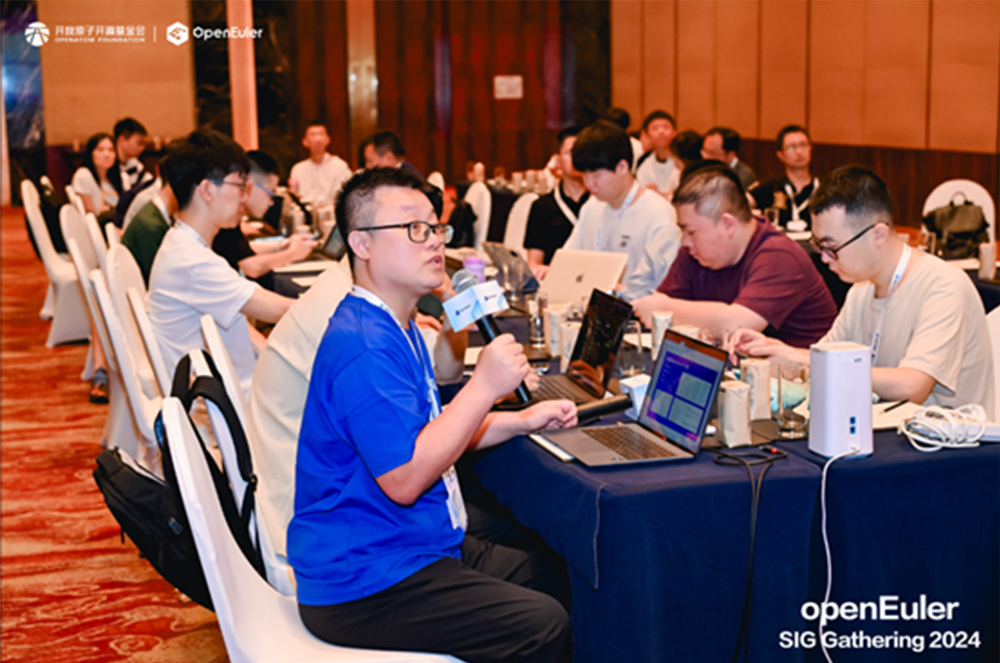
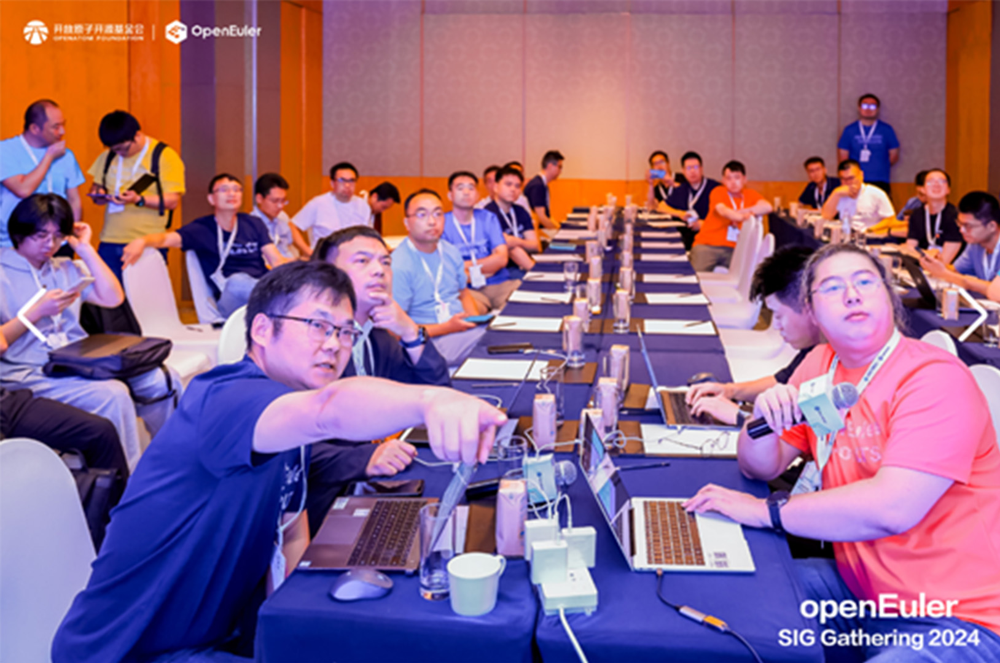
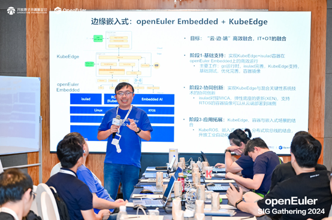
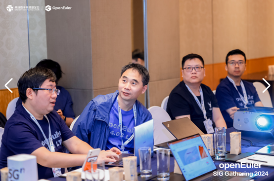
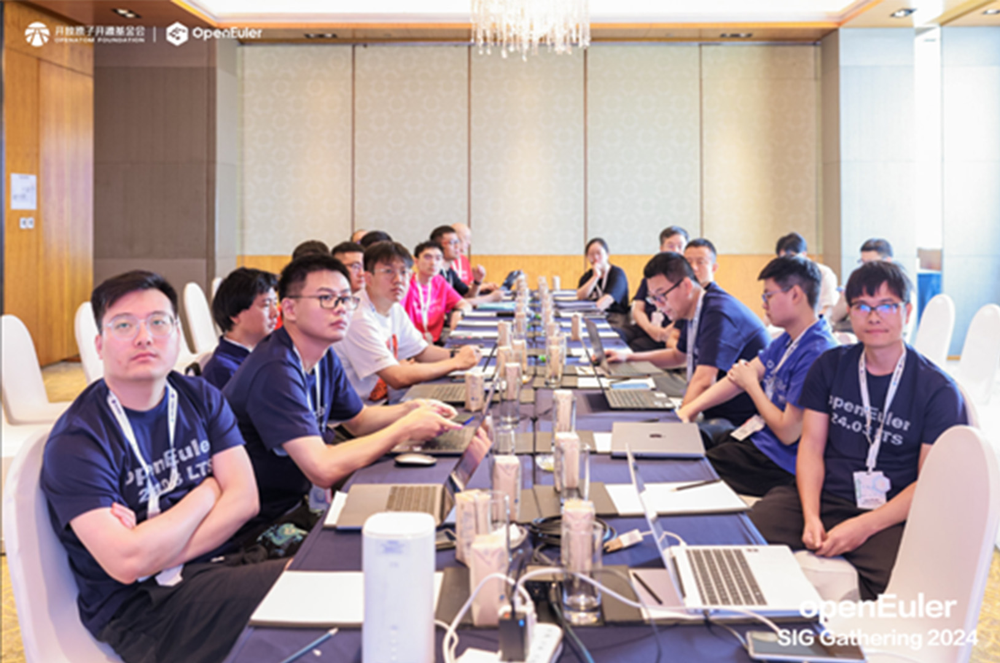
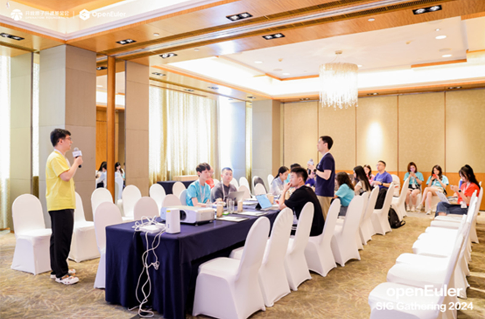
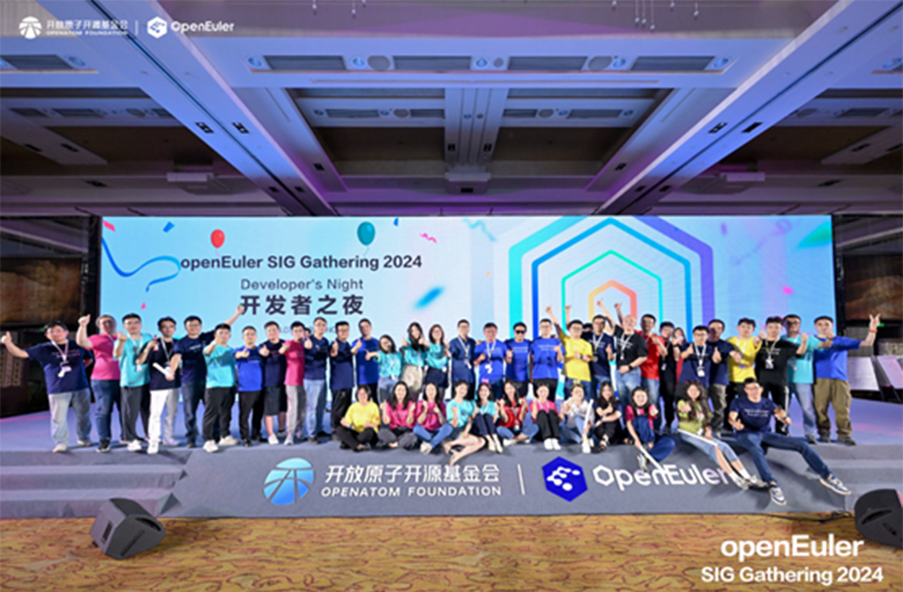

**Beijing, July 26, 2024** — The [openEuler SIG Gathering 2024](https://www.openeuler.org/en/interaction/summit-list/sig-gathering-2024/), held in Beijing, brought together 300 developers from 108 SIGs for a day of intensive discussions, collaborative planning, and community building. The event was a testament to the open-source spirit, showcasing the dedication and innovation that drives the openEuler community forward.

## Event Overview

The gathering began with a welcome session that set an enthusiastic tone for the day. Individual developers, open source developers, and developers from top enterprises convened to discuss the future of openEuler, focusing on our critical planning and major technical solutions for the latter half of 2024 and after. The event's agenda was meticulously crafted to facilitate meaningful exchanges and foster a collaborative environment.

## Key Highlights

- **Diversified Computing**

Discussions led by Kernel SIG, Intel Arch SIG, Arm SIG, and RISC-V SIG focused on enhancing support for mainstream architectures. They shared strategies for optimizing performance and ensuring compatibility across various computing platforms.

- **AI-native Support**

AI SIG, Compiler SIG, and Intelligence SIG presented plans for building cloud-native intelligent containers for openEuler and AI4Compiler. Emphasis was placed on strengthening AI deployment, improving usability, reducing costs, and enhancing accessibility for users and developers.

- **All-scenario Applications**

SIGs such as the Cloud Native SIG, Compiler SIG, Embedded SIG, Compliance SIG, and OPS SIG discussed applications for cloud, data centers, and embedded scenarios. Community-originated projects like KubeOS and KubeMate were highlighted for their potential impact.

- **Native Development with openEuler**

Infra SIG, CICD SIG, and Security SIG focused on tools like openEuler DevStation and the openEuler software center (EasySoftware) aimed at enhancing the developer experience.

- **Upstream-native Support**

Discussions centered on integrating GMEM into the Linux community, OpenStack support for openEuler, and enabling Lustre on openEuler.

- **User Experience Boost**

Infrastructure SIG, Talent and Service SIG, Doc SIG, G11N SIG, and Open Design SIG shared plans to improve community information systems and introduce automation for better message system efficiency.

## Community Spirit

The event also featured a fun fitness session, fostering a sense of teamwork and emphasizing the importance of balancing hard work with enjoyment. The evening reception provided a relaxed atmosphere for networking and entertainment, allowing developers to share stories and experiences in a festive setting.

We extend our heartfelt thanks to all participants for their enthusiastic involvement and invaluable contributions. Your dedication and passion have been instrumental in making this event a success. We look forward to hosting more gatherings like this, where developers can come together to share their insights and work on cutting-edge solutions. We're excited about the future and can't wait to engage in more meaningful discussions with our SIG members.

As we look forward to the future, we invite all open-source enthusiasts to join the openEuler community and our SIGs. Together, we can continue to drive innovation and shape the future of digital infrastructure.