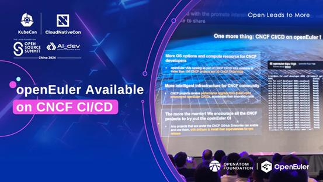
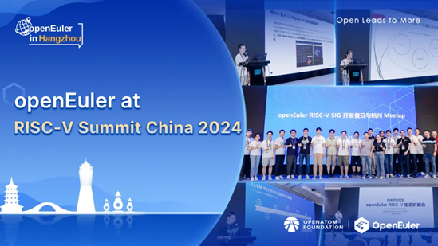

## openEuler Monthly Bulletin – August
Welcome to the August edition of the openEuler Monthly Bulletin! We're excited to share this month's innovative tech updates and a series of vibrant events that kept the community buzzing. Let's dive into the major moments and fresh developments that defined this August!

## Community Scale
As of August 31, 2024, the [**openEuler community**](https://www.openeuler.org/en/)  has grown to over 3.47 million users. More than 19,000 developers are actively contributing, with a total of 185.2k PRs and 114.5k issues generated. The community now includes 1,734 organization members, with 58 new members joining this August. To access the latest data, please visit the [**openEuler DATASTAT**](https://datastat.openeuler.org/en/overview).

## Community Highlight
### openEuler is available on CNCF CI/CD
In August, the [**KubeCon + CloudNativeCon + Open Source Summit + Al_dev China 2024**](https://events.linuxfoundation.org/kubecon-cloudnativecon-open-source-summit-ai-dev-china/) took place in Hong Kong. During the conference, we were thrilled to announce that openEuler is now available to use in [**CNCF**](https://www.cncf.io/) CI/CD, supporting 100+ projects & 20+ TAGs/WGs, thanks to the joint efforts of the [**openEuler Infra SIG**](https://www.openeuler.org/en/sig/sig-detail/?name=Infrastructure)  and the CNCF  infrastructure team. This achievement signifies the successful integration of openEuler's computing resources into CNCF's infrastructure, further strengthening the partnership between both communities.

 

### openEuler actively participates in the RISC-V Summit China 2024
On August 21, the 4th [**RISC-V Summit China**](https://riscv-summit-china.com/en/)  was held in Hangzhou, Zhejiang, where the [**openEuler RISC-V SIG**](https://www.openeuler.org/en/sig/sig-detail/?name=sig-RISC-V)  Developer Day & Hangzhou Meetup, co-hosted by the openEuler community and the [**Institute of Software, Chinese Academy of Sciences**](http://english.is.cas.cn/) , also took place successfully. 
Wang Jingwei, maintainer of the openEuler RISC-V SIG, along with other key project developers, shared insights at the summit into the future plans and technical achievements of [**openEuler 24.03 LTS**](https://www.openeuler.org/en/download/archive/detail/?version=openEuler%2024.03%20LTS)  for RISC-V. Their presentation covered various technological areas including virtualization, cloud native, runtime, toolchains, embedded, and hardware testing.
 

## Community Governance
### Summary of openEuler Technical Committee meeting – August
On August 29, the 6th meeting of the openEuler Technical Committee was held in Zhengzhou, Henan. During the meeting, committee members discussed several topics related to technological innovations and developments of the community, including building a foundational software platform for autonomous driving, updates to Intel's technical roadmap and AI layout, kernel configuration optimization and tiered maintenance, GCC link time optimization, and innovations in epkg software packages. Additionally, the committee reviewed the infrastructure construction and software maintenance strategies of the community.

## Technical Progress
### The repository of the kyclassifier project is established in the openEuler community
The kyclassifier project, initiated by KylinSoft and maintained by the [**openEuler Compatibility Infra SIG**](https://www.openeuler.org/en/sig/sig-detail/?name=sig-Compatibility-Infra) , has successfully established its repository in the openEuler community. kyclassifier is an OS analysis tool that automatically analyzes package layers and categories in mainstream Linux distributions based on various CPU architectures.
Key features of kyclassifier:
- Compatible with multiple architectures such as x86_64, AArch64,**** and LoongArch64
- Support for various input methods including ISO images, local system environments, and system repositories
- Modular design

### The repository of the Apusic's openAMDC memory database project is established in the openEuler community
Approved by the openEuler Technical Committee, the open Advance Memory Data Cache (openAMDC) memory database project, initiated by Apusic Cloud and maintained by the [**Big Data SIG**](https://www.openeuler.org/en/sig/sig-detail/?name=bigdata) , has been open-sourced within the openEuler community.
openAMDC is an open source, high-performance key-value database compatible with RESP v2/v3 protocols. It supports all Redis commands and data structures, providing an alternative to Redis.
The database also supports multi-threaded architectures and efficient cold/hot data switches. In multi-threaded scenarios, openAMDC delivers performance that is two to three times better than Redis 6.0. Its multi-level data switching capabilities expand storage capacity while reducing overall caching costs.

### gala-anteater OS anomaly detection platform built on openEuler is officially open-sourced 
System failures can lead to various issues such as system crashes, data corruption, and service disruptions, greatly affecting user experience and potentially causing significant losses for enterprises. That’s why the [**gala-anteater**](https://docs.openeuler.org/en/docs/23.09/docs/A-Ops/using-gala-anteater.html) , an AI-powered anomaly detection platform built on openEuler, was developed. By integrating multiple detection algorithms, it enables real-time fault detection across diverse scenarios and applications.

### oebuild 0.1 released with openEuler 24.03 LTS
[**oebuild**](https://portrait.gitee.com/openeuler/oebuild/blob/master/README.en.md)  is a tool designed to streamline the building and configuration process for openEuler Embedded. It can automatically generate customized openEuler Embedded distributions.
Key features of oebuild:
- Automatically downloads corresponding dependencies for the build system, such as yocto-meta-openeuler, yocto-poky, and yocto-meta-openembedded
- Creates customized build environment configuration files based on user-selected options such as machine type and functional features
- Uses containers to create an isolated build environment, reducing the risk of host pollution and simplifying system configuration and dependency management
- Initiates the build process for openEuler Embedded images
- Manages compilation environments for different SDKs
- Provides online emulation of qemu images
- Enables online deployment and uninstallation of software packages

## Hardware & Software Compatibility
By the end of August 2024, a total of 2,079 hardware and software products were certificated as compatible with openEuler. This includes 1,364 applications, 554 hardware components, and 161 OSs, among which, 148 applications, 26 hardware components, and 4 OSs were added to the [**compatibility list**](https://www.openeuler.org/en/compatibility/)  in August.

## Security Bulletin
In August 2024, the community published 178 security notices and patched 506 vulnerabilities (13 critical, 73 high, and 420 others).

The following vulnerabilities have a significant impact and require special attention:
**Flatpak is a Linux application sandboxing and distribution framework. Prior to versions 1.14.0 and 1.15.10, a malicious or compromised Flatpak app using persistent directories could access and write files outside of what it would otherwise have access to, which is an attack on integrity and confidentiality.** ([**CVE-2024-42472** ](https://www.openeuler.org/en/security/cve/detail/?cveId=CVE-2024-42472&packageName=flatpak)) – CVSS 10.0
Affected release:
openEuler-20.03-LTS-SP4
openEuler-22.03-LTS-SP1
openEuler-22.03-LTS-SP3
openEuler-22.03-LTS-SP4
openEuler-24.03-LTS

**A security vulnerability has been detected in certain versions of Docker Engine, which could allow an attacker to bypass authorization plugins (AuthZ) under specific circumstances. The base likelihood of this being exploited is low. Using a specially-crafted API request, an Engine API client could make the daemon forward the request or response to an authorization plugin without the body. In certain circumstances, the authorization plugin may allow a request which it would have otherwise denied if the body had been forwarded to it. A security issue was discovered in 2018, where an attacker could bypass AuthZ plugins using a specially crafted API request. This could lead to unauthorized actions, including privilege escalation.** ([**CVE-2024-41110**](https://www.openeuler.org/en/security/cve/detail/?cveId=CVE-2024-41110&packageName=docker) ) – CVSS 9.9
Affected release:
openEuler-20.03-LTS-SP4
openEuler-22.03-LTS-SP1
openEuler-22.03-LTS-SP3
openEuler-22.03-LTS-SP4
openEuler-24.03-LTS

You can find the [**security announcements**](https://www.openeuler.org/en/security/security-bulletins/)  on the openEuler official website and install the vulnerability patches in time.

**Thank You for Your Support**

That's all for this openEuler Monthly Bulletin. We would like to extend our gratitude to all members, developers, and contributors for their support and contributions. 

