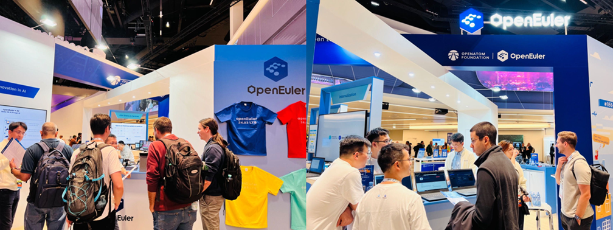

# **openEuler Monthly Bulletin – September**

Welcome to the September edition of the openEuler Monthly Bulletin! We're thrilled to bring you the latest tech advancements, newly released features, and a lineup of exciting community events that energized the month. Here are the major highlights from this September!

## **Community Scale**

As of September 30, 2024, the [openEuler community](https://www.openeuler.org/en/) has grown to over 3.55 million users. More than 20,000 developers are actively contributing, with a total of 189k PRs and 118.4k issues generated. The community now includes 1,775 organization members, with 41 new members joining this September. To access the latest data, please visit the [openEuler DATASTAT](https://datastat.openeuler.org/en/overview).

## **Community Highlight**

### **openEuler makes its third appearance at OSSummit EU 2024**

From September 16 to 19, 2024, the premier open source event, [OSSummit EU 2024](https://www.linkedin.com/pulse/openeuler-ossummit-eu-2024-advancing-open-source-empowering-jidac/?trackingId=J1wE9r1hgbMUjI9pu8PUBA%3D%3D), took place in Vienna, Austria. As a diamond sponsor, openEuler participated in the event for the third consecutive year.

On September 17, Hu Xinwei, Chair of the openEuler Technical Committee, took the main stage with his keynote, where he shared [openEuler's journey of building an open source, sustainable, and scalable operating system](https://www.youtube.com/watch?v=61b-v3hQC18). He highlighted how openEuler is fostering all-scenario innovation and supporting diverse computing architectures, making it easier for developers to embrace a more intelligent, multi-faceted computing world.

At the openEuler Mini Summit during OSSummit, the community engaged with developers worldwide, sharing the latest achievements and discussing cutting-edge technologies in open source operating systems.

The visitors also gathered at the openEuler booth to learn about our innovations in all-scenario computing, AI integration, and diversified hardware support, while enjoying discussions, exploring new ideas, and sharing knowledge.

### **openEuler actively takes part in the OpenAtom Open Source Eco-Conference**

From September 25 to 27, 2024, the OpenAtom Open Source Eco-Conference was held in Beijing. As part of the conference, the openEuler Ecosystem Sub-Forum successfully convened. Several organization members from the community shared their latest achievements and experience based on openEuler, showcasing how the openEuler community is bringing together industry forces to build an innovative and collaborative open source ecosystem.

Additionally, to standardize the talent development system, the OpenAtom Foundation and the openEuler community jointly launched a talent certification system dedicated for openEuler, which has been integrated into the OpenAtom Foundation's open source talent certification framework. This initiative attracted numerous enterprises, fostering the growth and prosperity of the openEuler talent ecosystem.

### **openEuler Embedded Meetup held in Guangzhou**

On September 12, the [openEuler Embedded](https://www.openeuler.org/en/sig/sig-detail/?name=sig-embedded) Meetup took place in Guangzhou, bringing together technical experts from various organizations. The event featured deep discussions on openEuler's embedded technologies, enterprise solutions for industrial applications, and industry-academia collaboration based on openEuler, aiming to foster the development of a more open, innovative, and collaborative embedded ecosystem.

### **openEuler DPU Meetup held in Suzhou**

With the rapid development of cloud computing, big data, and AI, data processing capabilities have become a critical metric for evaluating cloud and data center performance, making data processing unit (DPU) a key for improving computing efficiency and optimizing resource utilization.

In early September, the [openEuler DPU](https://www.openeuler.org/en/sig/sig-detail/?name=sig-DPU) Meetup in Suzhou was successfully held. The event brought together industry experts to share insights and practical experience in the DPU field, fostering collaboration and innovation in computing network while strengthening ecosystem integration to drive industry growth and development.

## **Community Governance**

### **iSulad supports NRI for plugging extensions**

Node resource interface (NRI) is a public interface for managing node resources and serves as a general framework for CRI-compatible container runtime plugging extensions. It provides basic mechanisms for plugins to track container states and to make limited modifications to their configurations.

The new NRI feature in [iSulad](https://gitee.com/openeuler/iSulad/blob/master/README.md) can be used for resource management in Kubernetes environments. By implementing NRI plugins, users can subscribe to container lifecycle events to track resource states and modify container configurations within the scope allowed by the NRI API, based on resource management logic.

### **New open source project repositories created in the openEuler Community in September**

**pkgs-categorizer**

Initiated by UnionTech and maintained by the [openEuler Compatibility Infra SIG](https://www.openeuler.org/en/sig/sig-detail/?name=sig-Compatibility-Infra), leveraging the bidirectional encoder representations from transformers (BERT) LLM, the pkgs-categorizer is designed to support Linux system build by providing tailored software package lists for various scenarios, enabling the creation of custom ISO images for different users.

The pkgs-categorizer processes software packages from repo sources, helping identify their "position" within the operating system. This allows developers to better understand the functional information of each package, aiding in the development and maintenance of Linux distributions.

By the end of September, the architecture design and key functionalities development of the project have been completed, including repo package parsing, layer and classification model implementation, and result output.

**CT-OVAL**

[CT-OVAL](https://gitee.com/openeuler/ct-oval) is a golang-based system security assessment tool, primarily used for evaluating the security of CTyunOS, the Linux operating system developed by eSurfing Cloud.

CT-OVAL offers the following key features:

- Converts CVE data from various sources into corresponding OVAL data and stores it in the database.
- Filters and generates OVAL XML files by platform, time, severity, keywords, and type.
- Cleans and organizes OVAL-related data elements in the database, classifying and categorizing the unified definitions, objects, tests, states, and other data elements.
- Allows users to utilize the standard OpenSCAP tool to batch execute OVAL-defined tests, performs security assessments on target systems based on customized OVAL testing policies, and provides detailed result reports.

**Security-baseline**

Designed to enhance system security, the [security-baseline](https://gitee.com/openeuler/security-baseline) repository, initiated by eSurfing Cloud and maintained by the [openEuler Security Facility SIG](https://www.openeuler.org/en/sig/sig-detail/?name=sig-security-facility), provides essential features like user account configuration, system service hardening, rollback, and detection to ensure compliance with various security baselines.

Developed in Python and distributed in RPM, this easy-to-use tool offers strong cross-platform compatibility. By integrating the strengths of multiple common security hardening tools, it delivers a comprehensive and efficient solution for system security.

Also, the one-click hardening function of security-baseline allows users to secure their systems with minimal effort. This easy operation encompasses all stages of the security hardening process, including detection, backup, and rollback, ensuring both the effectiveness and reliability of system security hardening.

### **Big Data SIG progresses in September**

The [openEuler Big Data SIG](https://www.openeuler.org/en/sig/sig-detail/?name=bigdata) is building a dynamic big data ecosystem within the openEuler community. In September, the Big Data SIG mainly focused on the following key innovative projects:

**openAMDC**

This project is an open source, high-performance key-value memory database compatible with RESP v2/v3 protocols, supporting all Redis commands and data structures. The [openAMDC](https://gitee.com/openeuler/openAMDC/blob/master/README.md) repository has been successfully established, with the initial code uploaded to the dev branch.

**uadk-bigdata**

[uadk-bigdata](https://gitee.com/openeuler/uadk-bigdata/blob/master/README.en.md) aims to develop a full-stack hardware acceleration solution for the big data sector by integrating UADK capabilities with OpenSSL 3.0 and connecting JDK with OpenSSL. The project is now in the process of the design of a decompression adaptation plan for HBase.

### **k8s-install has completed the adaptation to openEuler distributions**

The newly updated [k8s-install](https://docs.openeuler.org/en/docs/20.03_LTS_SP2/docs/thirdparty_migration/k8sinstall.html) not only supports openEuler distributions such as openEuler 24.03 LTS and openEuler 23.09 but also introduces support for two new baselines: Kubernetes 1.29 and 1.25. Additionally, the update features numerous enhancements and bug fixes, along with offline integration installation packages available, significantly improving usability for community developers across various systems.

### **Multi-OS cross-community ecological integration and development**

To explore cross-community ecological integration and development across multiple operating systems, Hoperun has chosen openEuler and OpenHarmony to achieve integration of multiple systems on single hardware, as well as interconnectivity across different hardware and systems. openEuler provides a high-performance, stable, and secure platform for computing, communication, and management, while OpenHarmony offers an intuitive and user-friendly cross-platform interaction experience.

Highlights include:

* openEuler Embedded introduces the mixed-criticality deployment framework [MICA](https://www.openeuler.org/en/blog/20231226-MICA/MICA%20Facilitates%20Mixed-Criticality%20Deployments.html) that facilitates deployment, isolation, and scheduling for both management and real-time domains. This framework has been extended to include an HMI domain through the integration of OpenHarmony.
* Hoperun, in collaboration with the openEuler community, successfully completed the porting and adaptation of the new version of DSoftBus, enabling interconnection between openEuler and OpenHarmony while exploring scenario-based applications and achieving advanced middleware capabilities.

## **Hardware & Software Compatibility**

By the end of September 2024, a total of 2,231 hardware and software products were certificated as compatible with openEuler. This includes 1,500 applications, 569 hardware components, and 162 OSs, among which, 136 applications, 15 hardware components, and 1 OS were added to the [compatibility list](https://www.openeuler.org/en/compatibility/) in September.

## **Security Bulletin**

In September 2024, the community published 134 security notices and patched 261 vulnerabilities (9 critical, 54 high, and 198 others).

The following vulnerabilities have a significant impact and require special attention:

**An issue was discovered in libexpat before 2.6.3. dtdCopy in xmlparse.c can have an integer overflow for nDefaultAtts on 32-bit platforms (where UINT\_MAX equals SIZE\_MAX).** ([CVE-2024-45491](https://www.openeuler.org/en/security/cve/detail/?cveId=CVE-2024-45491&packageName=expat)) – CVSS 9.8

Affected release:

openEuler-20.03-LTS-SP4

openEuler-22.03-LTS-SP1

openEuler-22.03-LTS-SP3

openEuler-22.03-LTS-SP4

openEuler-24.03-LTS

**Vulnerability in core of Apache HTTP Server 2.4.59 and earlier are vulnerably to information disclosure, SSRF or local script execution via backend applications whose response headers are malicious or exploitable. Users are recommended to upgrade to version 2.4.60, which fixes this issue.** ([CVE-2024-38476](https://www.openeuler.org/en/security/cve/detail/?cveId=CVE-2024-38476&packageName=httpd)) – CVSS 9.8

Affected release:

openEuler-20.03-LTS-SP4

openEuler-22.03-LTS-SP1

openEuler-22.03-LTS-SP3

openEuler-22.03-LTS-SP4

openEuler-24.03-LTS

You can find the [security announcements](https://www.openeuler.org/en/security/security-bulletins/) on the openEuler official website and install the vulnerability patches in time.

**Thank You for Your Support**

That's all for this openEuler Monthly Bulletin. We would like to extend our gratitude to all members, developers, and contributors for their support and contributions.