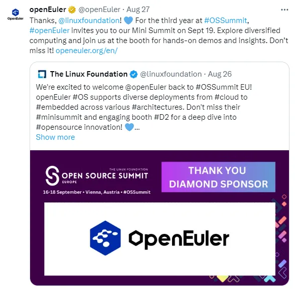
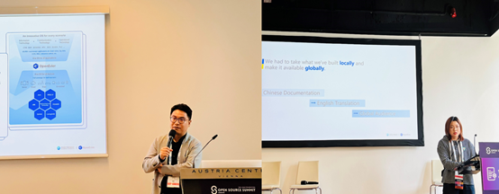
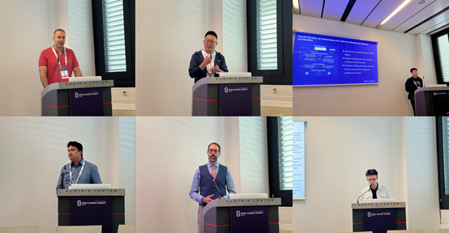

From September 16–19, 2024, openEuler showcased its commitment to open source and AI innovation at OSSummit EU 2024 in Vienna, Austria. For three consecutive years, openEuler has actively participated in OSSummit EU, contributing presentations, hosting discussions, and engaging with the vibrant global open-source communities.

## Keynote: How openEuler Is Powering Tomorrow's AI Infrastructure

On September 17, Hu Xinwei, Chair of the openEuler Technical Committee, took the main stage with his keynote, "[How openEuler Is Powering Tomorrow's AI Infrastructure](https://www.youtube.com/watch?v=61b-v3hQC18)." Hu shared openEuler's journey of building an open source, sustainable, and scalable operating system. He highlighted how openEuler is fostering all-scenario innovation and supporting diverse computing architectures, making it easier for developers to embrace a more intelligent, multi-faceted computing world.

He also talked about openEuler's approach to AI, including how our system leverages AI capabilities to foster hybrid deployment with our mixed criticality system MICA. He further explained that how openEuler isn't just an operating system—but also a platform designed for developers to explore and innovate across different fields and applications.

## Sessions: Open Source Governance and Globalization Efforts

Zheng Zhenyu, our Operations Manager, delved into compliance governance for operating systems in his talk "[Exploration of Compliance Governance Based on Operating Systems](https://www.youtube.com/watch?v=wO2nHhQA_-s)". He covered the overall development process of operating systems, analyzed pain points and challenges in various scenarios, and offered insights and recommendations on improving compliance management for enterprises using open source software.

Helen Liu, our G11N SIG Maintainer and Social Media Operator, explored how openEuler is addressing language barriers in open source documentation in the session "[Tackling Language Barriers in Open Source Docs: A Case Study of openEuler's Globalization Efforts](https://www.youtube.com/watch?v=tj4Zx1FDvSY)". Drawing on her experience in social media operations, she discussed the challenges faced, openEuler's practice, and how AI and social media are helping to enhance accessibility and improve the localization process.

## openEuler Mini Summit: Innovating for a Resilient Computing Infrastructure

Beyond the keynote and sessions, we also held [openEuler's Mini Summit](https://www.youtube.com/watch?v=-Etm_qb-qyw), providing a space for developers from all over the world to dive deeper into the exciting intersection of open source operating systems and AI. It was fantastic to see so many talented minds come together, exchange ideas, and explore what's next for open source OS and AI. Stay tuned with us for more takeaways and replay.

## openEuler Booth: Hands-On Demos and Engaging Discussions

Our booth was buzzing with activity throughout the summit, where we showcased everything from [our community ecosystem](https://www.youtube.com/watch?v=IzDgmESfSXo) and [diversified computing support](https://www.youtube.com/watch?v=1MaqW3jWZtU) to [all-scenario innovation](https://www.youtube.com/watch?v=qzZxdCJfYGU), [AI for OS](https://www.youtube.com/watch?v=qzZxdCJfYGU), [openEuler Copilot System](https://www.youtube.com/watch?v=rwkPzrg5oJQ), and [OSV distros & services](https://www.youtube.com/watch?v=20zgTefaYgo). We also had live demos for hands-on exploration. It was amazing to see developers from different backgrounds connecting with the openEuler team and enjoying the discussions.

## Looking Forward: Let's Keep Innovating Together!

Over the past five years, openEuler has grown into a diverse and vibrant community, thanks to the contributions and dedication of developers worldwide. As we wrap up another successful trip to OSSummit EU, we are pleased to invite you to the openEuler Summit 2024 in Beijing on November 15–16, where industry leaders, innovators, and key stakeholders will gather to explore the future of open-source OSs. See you in Beijing!