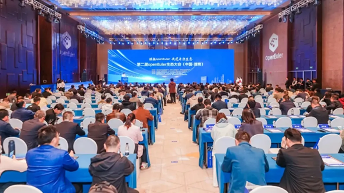
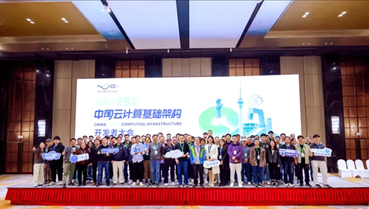
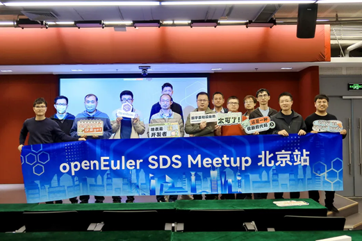
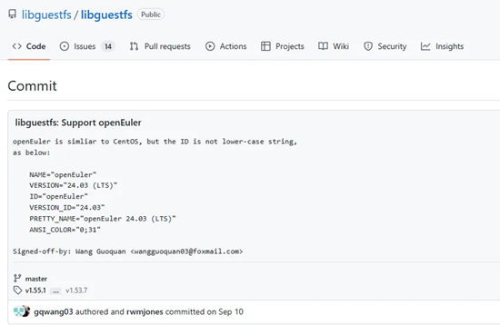

# **openEuler Monthly Bulletin – October**

Welcome to the October edition of the openEuler Monthly Bulletin! We're delighted to bring you an update on the latest advancements, including key activities, project progress, and exciting new features that have marked this month. Dive into the major highlights from October!

## **Community Scale**

As of October 31, 2024, the [openEuler community](https://www.openeuler.org/en/) has grown to over 3.64 million users, with a total of 192.3k PRs and 102.7k issues generated. The community now includes 1,813 organization members, with 38 new members joining this October. To access the latest data, please visit the [openEuler DATASTAT](https://datastat.openeuler.org/en/overview).

## **Community Highlight**

### **The 2nd openEuler Ecosystem Conference successfully held in Hunan**

On October 30, the 2nd openEuler Ecosystem Conference was held in Changsha, Hunan. The conference brought together visionaries from across the supply chain—partners, OS vendors, ecosystem innovation centers, users, and universities—aiming to advancing the openEuler ecosystem. Powered by foundational technologies and a robust ecosystem, our open source industry is poised for remarkable growth.

### **openEuler technical experts shared updates on the community's development at the 5th China Cloud Computing Infrastructure Developer Conference**

On October 19, the 5th China Cloud Computing Infrastructure Developer Conference (CID) was held in Beijing. At the event, openEuler technical experts introduced the recent developments and future plans of the community and engaged in the free discussions with developers on-site.

### **openEuler SDS Meetup held in Beijing**

On October 26, the [openEuler SDS](https://www.openeuler.org/en/sig/sig-detail/?name=sig-SDS) Meetup, co-hosted by the openEuler community and China Unicom Digital Tech, was held in Beijing. The event invited industry experts from different enterprises, including Linaro, Intel, TaoCloud, China Unicom Digital Tech, and Huawei to share valuable insights and practices about distributed storage technologies, covering SPDK, Ceph Crimson, fastblock, high-performance all-flash architecture, and more.

### **openEuler Meetup held in Hangzhou**

On October 25, the openEuler Meetup was held in Hangzhou, focusing on operating system security. The event brought together members from the [openEuler Security Committee](https://www.openeuler.org/en/sig/sig-detail/?name=security-committee) and [Security Facility](https://www.openeuler.org/en/sig/sig-detail/?name=sig-security-facility) SIGs, as well as technical experts from various organizations to share their insights. The highlights included security governance strategies, innovative technologies, and practices of openEuler releases. Also, the openEuler user group in Hangzhou was established during the meetup.

## **Community Governance**

### **Summary of the openEuler Technical Committee meeting – October**

During the meeting, the openEuler Technical Committee approved the creation of the following projects:

* **openSCOW:** Initiated by Peking University and the PKU-Changsha Institute for Computing and Digital Economy, the openSCOW project aims to build a computing center platform for computing networks. By simplifying cluster software deployment and unifying platform management, it lowers user barriers, ensuring easier resource management and accessibility.
* **COMO:**The [COMO project](https://gitee.com/tjopenlab/como#openeuler) is a functional safety middleware developed in C++, which will be maintained by the [openEuler Embedded SIG](https://www.openeuler.org/en/sig/sig-detail/?name=sig-embedded).
* **Livi Web rendering engine:**Managed by the [openEuler Desktop SIG](https://www.openeuler.org/en/sig/sig-detail/?name=Desktop), this project is also planned for future integration into the embedded releases.
* **openHiTLS:** The repository for openHiTLS open source cryptography library will be maintained by the [Security Facility SIG](https://www.openeuler.org/en/sig/sig-detail/?name=sig-security-facility).

Additionally, the committee approved the following changes to the openEuler SIGs:

* The Standard Formulation and Certification SIG is approved to be established for standardization and certification work.
* The Rust SIG is merged into the [Compiler SIG](https://www.openeuler.org/en/sig/sig-detail/?name=Compiler) to enhance the maintenance of Rust-related packages.

## **Technical Progress**

### **OneOS × openEuler: Dual-system AMP solution**

Recently, China Mobile IoT's OneOS, in collaboration with openEuler, launched an innovative dual-system AMP solution. This solution utilizes multiple cores on a single chip to run different operating systems, such as Linux and RTOS, independently. It allows for efficient task allocation and processing, enhances system performance and stability, supports complex computing applications, and reduces hardware costs.

### **Repositories for new open source projects created in October**

* **storprototrace**

Developed by KylinSoft and maintained by the [openEuler Storage SIG](https://www.openeuler.org/en/sig/sig-detail/?name=Storage), [storprototrace](https://gitee.com/openeuler/storprototrace/blob/master/README.en.md) is a latency analysis tool for I/O events entering the iSCSI protocol driver layer based on libbpf. The support for LUN latency statistics will also be incorporated in the following updates. Compared to traditional tools like blktrace, storprototrace offers more precise measurement of I/O latency data at various stages of the iSCSI protocol driver layer. The upcoming LUN support will further enhance the tool's analysis capabilities, helping users optimize performance at different stages of LUN processing more efficiently.

* **glusterfs-dashboard**

Initiated by UnionTech and maintained by the SDS SIG, the [glusterfs-dashboard](https://gitee.com/openeuler/glusterfs-dashboard/blob/master/README.en.md) project aims to provide GlusterFS users with a visualized interface for efficient operations. GlusterFS is a scalable network file system designed for data-intensive tasks such as cloud storage and media streaming. It integrates disk storage resources from multiple servers into a single namespace, enabling efficient resource scheduling and allocation. Since GlusterFS lacks GUIs, glusterfs-dashboard was designed to offer comprehensive interfaces and optimizations.

The innovative and efficient design of glusterfs-dashboard is not merely about replacing command-line operations with UIs, but instead introduces a complete cluster management strategy, covering node and storage device detection, host CRUD operations, volume management, and more. This new tool significantly enhances the efficiency of building and using GlusterFS clusters, while lowering operational and maintenance barriers.

* **ACPO**

[AI-Enabled Compiler-Driven Program Optimization (ACPO)](https://gitee.com/src-openeuler/ACPO/tree/master) project has been created in the openEuler community and is expected to be included in the openEuler 24.03 LTS SP1 release. The ACPO is designed to integrate machine learning (ML) models into compiler frameworks and provides relevant tools to facilitate model usage in compilers.

Key features of ACPO:
	- Includes tools for training, inference, and feature quality control (FQC), simplifying the integration of ML models into compilers.
	- Decouples models from the framework, allowing users to design and train models tailored to specific tasks.
	- Offers a set of standard interfaces, ensuring models be seamlessly adapted for inference within the compiler with matched input/output formats.
	- Provides two adaptation methods—ahead-of-time (AOT) and real-time inference, along with example models.

* **vLLM**

The [vLLM project](https://gitee.com/src-openeuler/vllm), maintained by the [openEuler AI SIG](https://www.openeuler.org/en/sig/sig-detail/?name=ai) and developed by Large Model Systems Organization of UC Berkeley (UCB LMSYS), is an open-sourced high-performance inference framework for LLMs, supporting deployment of LLM inference services on various AI acceleration hardware. openEuler plans to add support for Kunpeng Arm servers and CPU-XPU heterogeneous inference acceleration. vLLM introduces advanced technologies like PagedAttention and dynamic batching for foundation model inference, and will continue to adopt the latest advancements in model acceleration.

* **hbm-predictor**

With the increasing adoption of High Bandwidth Memory (HBM) in SoC packages for HPC/AI and other scenarios, the high failure rate of HBM chips poses challenges such as SoC or system board returns, higher maintenance costs, and reduced customer satisfaction. 

The [hbm-predictor](https://gitee.com/openeuler/hbm-predictor/blob/master/README.en.md) project, initiated by Xiamen Key Laboratory of Intelligent Storage and Computing at Xiamen University, aims to address these issues by achieving the following objectives:
	- HBM failure diagnostic: Analyzes HBM failures at different levels, such as time, space, and environmental conditions, identifies the correlated factors causing HBM failures, and assists in generating features for failure prediction.
	- Multi-level failure predictor: Trains failure predictors at the row, column, bank, and server levels based on input features derived from HBM historical error logs and their cross-level correlations.
	- Dynamic adjustment of prediction and observation windows: Enables flexible window adjustments to account for differences in HBM failure patterns across clusters, HBM generations, and workloads, thereby improving prediction accuracy.
	- Online HBM failure prediction: Deploys pre-trained models for real-time prediction via error events or periodic mechanisms, allowing timely identification and forecasting of potential HBM failures.

### **libguestfs supports openEuler virtual machines**

In Open Source Promotion Plan (OSPP), libguestfs' support for custom configurations on openEuler virtual machines was completed by Wang Guoquan (Gitee ID: wangguoquan) and was merged into the upstream community.

[libguestfs](https://github.com/libguestfs/libguestfs) is tools and a library for accessing and modifying VM disk images. The virt-customize command-line tool from libguestfs-tools can be installed on various Linux distributions and used to customize a VM or disk image by installing packages, editing configuration files, and setting time zones.

The virt-customize command has been enhanced based on openEuler 24.03 LTS, now supporting custom configurations for openEuler VMs in both raw and qcow2 formats.

### **openEuler Copilot System for OS tuning and O&M**

As digital transformation accelerates, enterprise IT architectures face new challenges and opportunities. LLMs are being increasingly integrated into IT infrastructure as they rise. In response, openEuler is evolving towards native intelligence and has launched [openEuler Copilot System](https://www.youtube.com/watch?v=aiA6n2Ozr0M). This platform empowers intelligent tuning and O&M for OSs, further advancing the community's AI-for-OS capabilities.

## **Hardware & Software Compatibility**

By the end of October 2024, a total of 2,291 hardware and software products were certificated as compatible with openEuler. This includes 1,546 applications, 577 hardware components, and 168 OSs, among which, 46 applications, 8 hardware components, and 6 OSs were added to the [compatibility list](https://www.openeuler.org/en/compatibility/)in October.

## **Security Bulletin**

In October 2024, the community published 92 security notices and patched 255 vulnerabilities (10 critical, 64 high, and 181 others).

The following vulnerabilities have a significant impact and require special attention:

**In the Linux kernel, the following vulnerability has been resolved:ipv6: sr: fix invalid unregister error pathThe error path of seg6\_init() is wrong in case CONFIG\_IPV6\_SEG6\_LWTUNNELis not defined. In that case if seg6\_hmac\_init() fails, thegenl\_unregister\_family() isn t called.This issue exist since commit 46738b1317e1 ( ipv6: sr: add option to controllwtunnel support ), and commit 5559cea2d5aa ( ipv6: sr: fix possibleuse-after-free and null-ptr-deref ) replaced unregister\_pernet\_subsys()with genl\_unregister\_family() in this error path.** ([CVE-2024-38612](https://www.openeuler.org/en/security/cve/detail/?cveId=CVE-2024-38612&packageName=kernel)) – CVSS 9.8

Affected release:

openEuler-20.03-LTS-SP4

openEuler-22.03-LTS-SP1

openEuler-22.03-LTS-SP3

openEuler-22.03-LTS-SP4

openEuler-24.03-LTS

**xterm before 375 allows code execution via font ops, e.g., because an OSC 50 response may have Ctrl-g and therefore lead to command execution within the vi line-editing mode of Zsh. NOTE: font ops are not allowed in the xterm default configurations of some Linux distributions.** ([CVE-2022-45063](https://www.openeuler.org/en/security/cve/detail/?cveId=CVE-2022-45063&packageName=xterm)) – CVSS 9.8

Affected release:

openEuler-20.03-LTS-SP4

openEuler-22.03-LTS-SP1

openEuler-22.03-LTS-SP3

openEuler-22.03-LTS-SP4

You can find the [security announcements](https://www.openeuler.org/en/security/security-bulletins/) on the openEuler official website and install the vulnerability patches in time.

## **Thank You for Your Support**

That's all for this openEuler Monthly Bulletin. We would like to extend our gratitude to all members, developers, and contributors for their support and contributions.