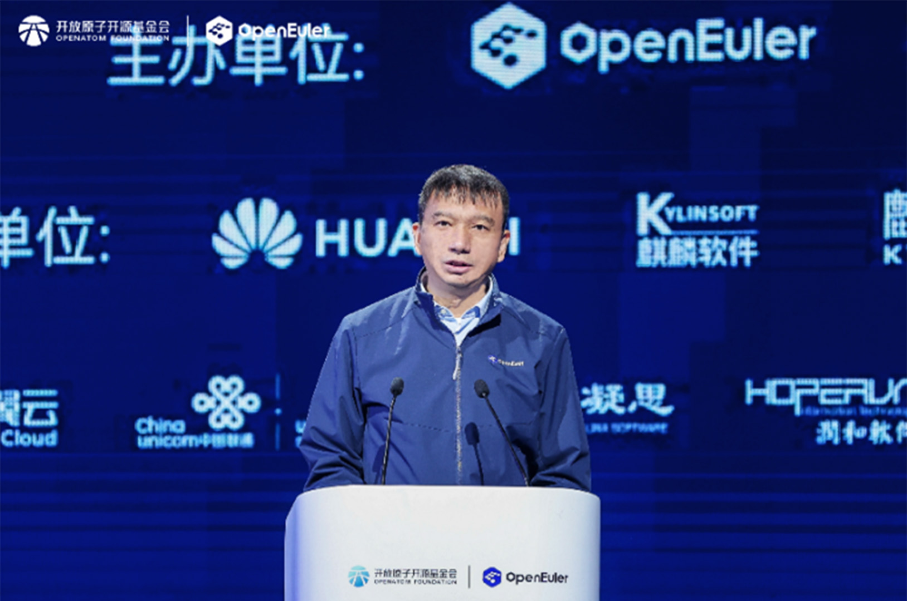
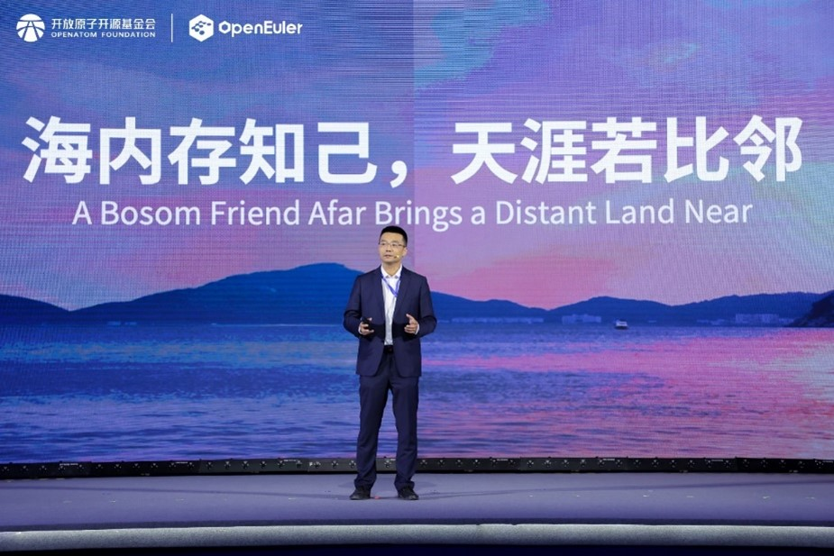
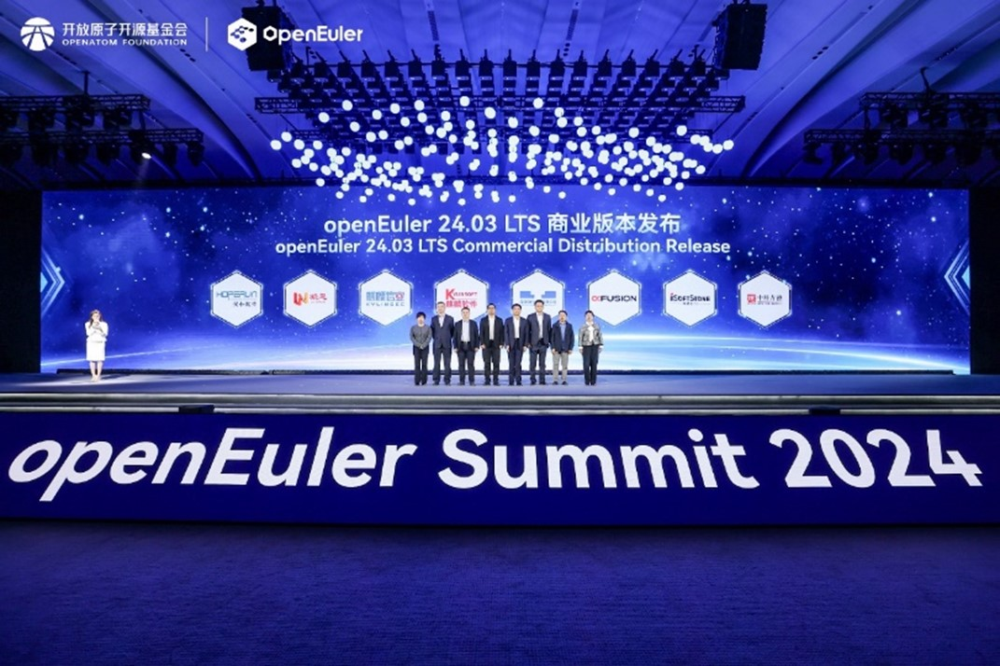
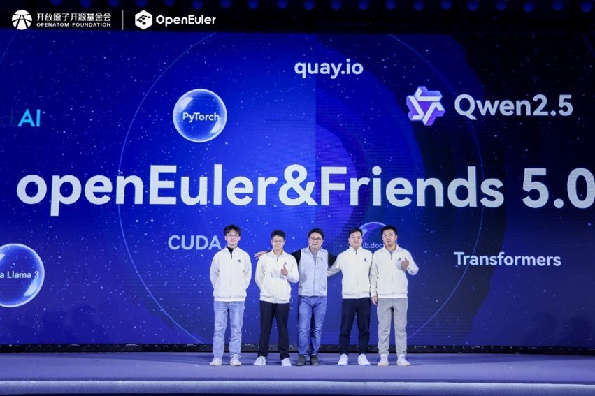
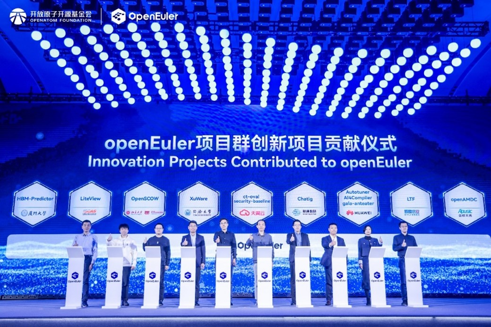

On November 16, the openEuler Summit 2024, themed "Igniting Intelligence Everywhere", wrapped up at ZhongGuanCun International Innovation Center, Beijing. At the event, along with our partners, we aimed to bring together all industry innovations and collaboratively build a new open source ecosystem for the world.

* **Celebrating five years of openEuler: achievements and milestones**

At the event, Mr. Cheng Xiaoming, Chairperson of the OpenAtom Foundation, addressed in his speech that advancing the construction of the operating system ecosystem through an open source approach has become a shared industry consensus. As a flagship project of OpenAtom, openEuler has already achieved significant milestones. **Moving forward, OpenAtom will continue to promote international collaborations, explore opportunities for the globalization of open source projects, and drive openEuler's global reach.**

Mr. Jiang Dayong, Chairperson of the openEuler Committee, remarked that openEuler has evolved from an enterprise-driven project to a thriving community. From striving to build an open source ecosystem to receiving industry recognition, openEuler has accelerated its progress with a community-based resilient operation model. Adhering to the principle of "co-construction, co-governance, and sharing", openEuler fully leverages the strengths of the open source community while working to establish an international open source collaboration platform. Through strategic partnerships, openEuler also aims to expand the global ecosystem and create more opportunities across industries.

Mr. Xiong Wei, Vice Chairperson of the TOC at the OpenAtom Foundation and Executive Director of the openEuler Committee, remarked in his speech that since openEuler was open-sourced five years ago, the community has attracted more than 20,000 contributors and over 1,800 organizations, all making long-term contributions, with total downloads surpassing 3.6 million. With three LTS and seven innovation releases, openEuler has established strong collaborations with dozens of leading global open source foundations to jointly build trustworthy open source community governance standards, providing comprehensive support to over 150 regions and countries.

* **Leading the intelligent transformation with technical innovations**

In the AI-powered era, there is a growing need for a smarter, more user-friendly, and resilient operating system. We are dedicated to advancing openEuler's core kernel technologies, enabling the convergence of general-purpose computing, intelligent computing, and heterogeneous computing to improve diversified computing efficiency. Also, our focus is on enhancing acceleration capabilities based on workload-awareness to support stable model training and outstanding inference performance.

At the event, **several of our partners led the release of commercial distributions based on openEuler 24.03 LTS**, bringing together industry technical innovations and developer expertise. The release marks a significant step in strengthening China's IT infrastructure for the coming years and offers the OS market more openEuler-based alternatives. We are excited about the upcoming release of openEuler 25.03 in March 2025, which will build on the successes of openEuler 24.03 LTS and 24.09, further enhancing our AI capabilities and supporting all-scenario applications.

During the openEuler & Friends 5.0 session, developers showcased examples of AI programming tools and a poster generation application built on openEuler. This demonstrated how our infrastructure, designed to keep pace with the rapid developments of the AI era, leverages capabilities such as real-time monitoring of upstream software, automated package upgrades, and intelligent reviews to enhance collaboration among community developers and improve the efficiency of software package maintenance. With scenario-specific application demos of intelligent computing software packages, we proved how we can support various computing power including CPU, GPU, NPU, and AI libraries. We aim to assist AI developers in building applications across all scenarios and offer a comprehensive hardware and software ecosystem by making openEuler an accessible "OS for AI".

* **Collaborating for a thriving open source ecosystem**

Since 2022, we've welcomed innovative projects from leading enterprises, universities, and research institutions across various industries, expanding the openEuler ecosystem. **At the event, nine organizations, including eSurfing Cloud, China Unicom Digital Tech, Huawei, Kylinsec, Apusic, Institute of Software Chinese Academy of Sciences, Peking University and PKU-Changsha Institute for Computing and Digital Economy, Tongji University, and Xiamen University, signed project contribution agreements with us**, bringing innovations from all sectors to the community.

openEuler is committed to building an international open source collaboration platform and has formed deep partnerships with global foundations, supporting 98% of the world's mainstream open source software. Currently, we have formed technical collaborations with organizations like Linux, OpenInfra, Apache, CNCF, Intel, and openHPC, providing technical support across core industry applications. We have also established strategic partnerships with OpenChain, OpenSSF, and SPDX to enhance the security of the open source software supply chain. With the support of the OpenAtom Foundation, we are joining efforts with OpenChain and CHAOSS to complete trustworthy open source community governance standards. Additionally, together with Intel, we will continue to drive AI innovation and accelerate application development, contributing to the growth of the operating system ecosystem.

**openEuler is also working with international software supply chain security organizations to establish open source security standards. In partnership with the Contransus, a translation community initiated by the OpenAtom Foundation, we have released SPDX 3.0 Chinese version. Also, in collaboration with the China Financial Certification Authority (CFCA), a service platform for secure boot code signing is now launched.**

* **Building a resilient future**

Resilience is a key to openEuler's long-term development. In 2022, we set a clear goal to build an open and secure software supply chain. This year, we have further strengthened the community's governance framework, adhering to global security and compliance standards and optimizing the community health metrics, from development to O&M, truly ensuring resilient, end-to-end community development. In response to the data security needs of the AI era, together with processor vendors and industry partners, we have launched the AI confidential computing solutions. These solutions can quickly build secure computing environments for model training and inference across multiple architectures, ensuring the safety of personal privacy data and enterprise data.

At the event, our community, together with DEKRA, Bureau Veritas, China Mobile Cloud, eSurfing Cloud, China Unicom Cloud, CFCA, SPDX, GCC, TAF, jointly launched the *openEuler Global Resilience Initiative*. The initiative advocates for "strengthening open source supply chain security to elevate development excellence, pursuing innovation in OS security to ensure secure operations, and integrating with upstream vulnerability management ecosystems to achieve reliable O&M".

**We have made significant strides in technology and ecosystem development in the past five years. Throughout our journey, we have always been serving as a solid foundational software platform for industries and a key pillar for China in digital intelligence. In the future, in collaboration with developers all over the world, let's drive continuous innovation and application of foundational software technologies and foster a more open, diversified open source community.**