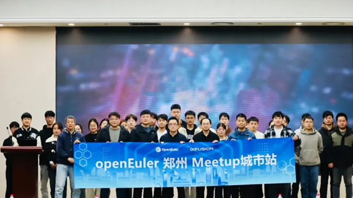

# **openEuler Monthly Bulletin – November**

Welcome to the November edition of the openEuler Monthly Bulletin! In November, the openEuler community reached key milestones, marking exciting activities, significant progress, and new technological developments. Here are the major highlights from this month!

## **Community Scale**

As of November 30, 2024, the [openEuler community](https://www.openeuler.org/en/) has grown to over 3.72 million users, generating a total of 198.9k PRs and 104.4k issues. The community now includes 1,876 organization members, with 63 new members joining this November. To access the latest data, please visit the [openEuler DATASTAT](https://datastat.openeuler.org/en/overview).

## **Community Highlight**

### **Igniting intelligence everywhere: openEuler Summit 2024 successfully concluded**

The [openEuler Summit 2024](https://www.linkedin.com/pulse/highlights-from-openeuler-summit-2024-igniting-intelligence-meiuc/?trackingId=VypPWVZRNmIw0Rt%2BURZMsQ%3D%3D) took place on November 15–16, 2024, at ZhongGuanCun International Innovation Center, Beijing.

The event provided a comprehensive showcase of openEuler's remarkable achievements over the past five years with two-day keynotes, 10+ subforums and sessions, 40+ SIG meetings, and 100+ exhibition booths, highlighting key advancements in technology, ecosystem, collaboration, and globalization. Evolving from an enterprise-driven project to a thriving community that gathers all industry strengths, we have made openEuler a versatile and reliable open source OS platform and we are accelerating this journey towards even greater innovation. 

At the event, in response to the data security needs of the AI era, together with processor vendors and industry partners, openEuler launched the AI confidential computing solutions, ensuring the safety of personal privacy data and enterprise data.

The openEuler & Friends 5.0 session showcased the diverse applications of openEuler's intelligent computing software packages and highlighted its reliable infrastructure. It also demonstrated openEuler's hardware and software ecosystem with ease of use, for being "OS for AI."

With over 2,000 contributors from 43 countries and regions, openEuler has gained native support from dozens of mainstream open source projects and formed deep partnerships with global communities. openEuler is now fully available on global major public clouds and container repositories. This year, at the event, we announced deepened collaboration with three major open source foundations—OpenInfra, CNCF, and OpenHPC. They will offer native support for openEuler, while further accelerating openEuler's globalization. Moving forward, we will strengthen our collaboration with partners to deliver comprehensive service and support for the world.

Also, our community, together with our partners, jointly launched the openEuler Global Resilience Initiative for a secure data ecosystem in the AI era. The initiative advocates for "strengthening open source supply chain security to elevate development excellence, pursuing innovation in OS security to ensure secure operations, and integrating with upstream vulnerability management ecosystems to achieve reliable O&M".

In partnership with [SPDX](https://spdx.dev/), [Contransus](https://www.openatom.org/law/translate)–a translation community initiated by the OpenAtom Foundation, and other organizations, [openEuler released SPDX 3.0 Chinese version](https://www.linkedin.com/posts/openeuler_openeuler-opensource-supplychain-activity-7270005687005380610-CPtr?utm_source=share&utm_medium=member_desktop), enabling millions of Chinese developers to directly engage with the standard and contributing to the enhancement of global software supply chain security.

In the future, the openEuler community will remain committed to driving intelligence, resilience, and globalization, to create an intelligent infrastructure and open source operating system.

### **openEuler Kernel SIG maintainers join the Linux kernel CVE review team**

Several maintainers from the [openEuler Kernel SIG](https://www.openeuler.org/en/sig/Kernel) have joined the Linux kernel CVE review team. Starting from Linux kernel 6.10.7, they have been actively involved in the CVE review work.

As a key contributor to the Linux ecosystem, openEuler will significantly enhance the community's ability to detect and respond to vulnerabilities with its maintainers' CVE review process, further strengthening openEuler's commitment to information security and its regulatory framework.

### **openEuler exceeds 100,000 YouTube subscribers**

openEuler has surpassed 100,000 subscribers on YouTube, with over 6.12 million views and a total watch time exceeding 60,000 hours. [Our YouTube channel](https://www.youtube.com/@openeuler) contains diverse content related to the openEuler ecosystem, like expert speeches, tech discussions, and tutorials. If you're interested, welcome to follow us on YouTube. Every subscriber and like fuels our growth and motivates us to keep improving.

### **It's FOSS releases comprehensive 101 guidance for openEuler**

[It's FOSS](https://itsfoss.com/) is a leading Linux and open source web portal, sharing latest open source news and desktop Linux tutorials. Recently, It's FOSS released a series of detailed guidance on [getting started with the openEuler operating system](https://itsfoss.com/get-started-openeuler). Also, It's FOSS dropped [a review video of openEuler 24.09](https://www.youtube.com/watch?v=JOTFED5QhxA) for developers.

### **openEuler Meetups successfully held across multiple cities**

* **Beijing**

On November 20, the [openEuler Talent and Service SIG](https://www.openeuler.org/en/sig/sig-Talent-and-Service) Meetup took place in Beijing. Nearly 90 faculty members and students from the College of Computer Science at Beijing University of Technology attended the event, where they participated in courses covering everything from openEuler basics to practical applications, along with hands-on demos of the operating system.

* **Zhengzhou**

On November 22, openEuler and xFusion co-hosted a meetup in Zhengzhou. The event focused on enhancing AI capabilities for industries, bringing together experts from various fields of academia and industry to share insights and discuss openEuler's advancements and practical applications in AI.

## **Community Governance**

### **Summary of the openEuler Technical Committee meetings in November**

* **Monthly meeting**

At the November openEuler Technical Committee meeting, the committee members approved the creation of the [openEuler Long SIG](https://www.openeuler.org/en/sig/sig-Long).

The Long SIG focuses on building a heterogeneous converged computing infrastructure, enabling unified access to diverse computing power, heterogeneous converged memory and virtualization, compute allocation, resource prioritization, and flexible migration. The SIG is responsible for maintaining relevant software components within the openEuler community, with the goal of reducing costs, improving efficiency, and enhancing the overall openEuler software ecosystem. In line with this mission, we warmly welcome developers and contributors who are interested in exploring related technologies to join the Long SIG.

* **2023–2024 annual meeting**

On November 16, the openEuler Technical Committee 2023–2024 meeting was held in Beijing. During the meeting, committee members presented their reports on community work for 2024, discussed strategies for optimization, and shared plans and directions for future development.

## **Technical Progress**

### **openEuler DevStation launched for developers**

As openEuler's first workstation tailored to developers, [DevStation](https://repo.openeuler.org/openEuler-24.09/DevStation/) is pre-installed with [VS Code](https://code.visualstudio.com/) to enhance efficiency across the development workflow. By the end of 2024, oeDeploy is expected to be released on DevStation, which will support full-process automation from deployment and coding to compilation, build, and release. With oeDeploy, developers can easily deploy AI and cloud-native software stacks, pull code repositories using oeDevPlugin, compile with [AI4C](https://gitee.com/openeuler/AI4C/blob/master/README.en.md), and invoke [EulerMaker](https://eulermaker.compass-ci.openeuler.openatom.cn/), all of which simplify the software development process and enhance both efficiency and convenience.

### **openEuler introduces the PR review feature**

The openEuler community has launched an AI-powered PR review feature to enhance code quality and reduce the review workload for maintainers and committers.

This feature, based on LLMs, can be activated via the [openEuler CI bot](https://gitee.com/openeuler-ci-bot) and includes the following key functions:

* Code intent extraction: By commenting the **/summary-message** command under a PR, developers can prompt the AI to automatically analyze the changes, extract the code's intent, identify potential issues, and provide optimization suggestions and a PR score for reference.
* Code review and smell detection: By commenting the **/pr-review** command under a PR, developers can prompt the AI to automatically detect code changes. Leveraging the LLM's code analysis capabilities, the AI suggests modifications for unreasonable changes, thereby providing developers with guidance to improve code quality.

### **LFS Server for large file storage**

[LFS Server](https://github.com/opensourceways/BigFiles) is an open source, high-performance large file storage solution developed by openEuler. It supports a variety of file types with a 5 GB file upload limit and no repository size restrictions, offering developers ample storage space. Based on the standard LFS protocol, LFS Server streamlines seamless identity verification, optimizing the file upload and download process to minimize workflow disruptions.

Built using Go, LFS Server is a lightweight and efficient access service that fully supports Git LFS standards. By utilizing object storage, it provides scalable and reliable large file management. With its vast storage capacity and rapid download speeds, LFS Server enables developers to focus on their projects without concerns about large files affecting their repositories.

### **openEuler 24.03 LTS SP1 incorporates openHiTLS**

The cryptographic library is a key component of operating system security, essential for ensuring system security and data integrity. The [openHiTLS](https://gitee.com/src-openeuler/openhitls/blob/master/README.en.md) open source SDK has been officially integrated into openEuler 24.03 LTS SP1. It features a lightweight, customizable architecture that meets the diverse needs of various industries. It supports diverse mainstream cryptographic algorithms and protocols, allowing users to select the most appropriate options for secure data transmission and storage.

### **openEuler Backup SIG progress**

The [openEuler Backup SIG](https://www.openeuler.org/en/sig/sig-Backup) has been actively working on improving the first community release of [open-eBackup](https://gitee.com/openeuler/open-eBackup/blob/master/README.en.md), an open source backup solution that provides E2E backup and recovery capabilities for mainstream database, virtualization, file system, big data, and more applications.

### **openEuler's official website and forum have been optimized for a better user experience**

To improve the developer experience, the openEuler community has rolled out a series of optimizations to its official website and forum:

[**Official website**](https://www.openeuler.org/en/):
* Navigation revamp: The navigation bar has been restructured with added quick links for more efficient access to essential resources.
* Homepage improvements: Frequently accessed sections are now prioritized on the homepage, along with the introduction of a new **Explore openEuler Community** section.

[**Forum**](https://forum.openeuler.org/):
* Simplified interface: The forum's layout has been streamlined, keeping only the essential **Latest**, **Top**, and **Categories** sections for a clearer, more user-friendly experience. Tags are also optimized for clearer topic showcase.
* Language switching: To tackle language barriers, we've added a translation plugin in the top-right corner. The forum now supports both Chinese and English.
* Theme customization: The forum now offers a dark mode option, allowing developers to customize the interface according to their personal preferences.

## **Hardware & Software Compatibility**

By the end of November 2024, a total of 2,438 hardware and software products were certificated as compatible with openEuler. This includes 1,657 applications, 610 hardware components, and 171 OSs, among which, 111 applications, 33 hardware components, and 3 OSs were added to the [compatibility list](https://www.openeuler.org/en/compatibility/) in November.

## **Security Bulletin**

In November 2024, the community published 197 security notices and patched 588 vulnerabilities (19 critical, 191 high, and 378 others).

The following vulnerabilities have a significant impact and require special attention:

**In PHP versions 8.1.\* before 8.1.31, 8.2.\* before 8.2.26, 8.3.\* before 8.3.14, uncontrolled long string inputs to ldap\_escape() function on 32-bit systems can cause an integer overflow, resulting in an out-of-bounds write.** ([CVE-2024-11236](https://www.openeuler.org/en/security/cve/detail/?cveId=CVE-2024-11236&packageName=php)) – CVSS 9.8

Affected release:

openEuler-20.03-LTS-SP4

openEuler-22.03-LTS-SP1

openEuler-22.03-LTS-SP3

openEuler-22.03-LTS-SP4

openEuler-24.03-LTS

**HDF5 library through 1.14.3 has memory corruption in H5A\_\_close resulting in the corruption of the instruction pointer and causing denial of service or potential code execution.** ([CVE-2024-32608](https://www.openeuler.org/en/security/cve/detail/?cveId=CVE-2024-32608&packageName=hdf5)) – CVSS 9.8

Affected release:

openEuler-20.03-LTS-SP4

openEuler-22.03-LTS-SP1

openEuler-22.03-LTS-SP3

openEuler-22.03-LTS-SP4

openEuler-24.03-LTS

You can find the [security announcements](https://www.openeuler.org/en/security/security-bulletins/) on the openEuler official website and install the vulnerability patches in time.

## **Thank You for Your Support**

That's all for this openEuler Monthly Bulletin. We would like to extend our gratitude to all members, developers, and contributors for their support and contributions.