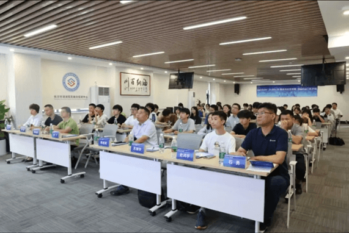
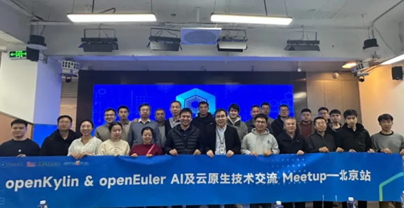
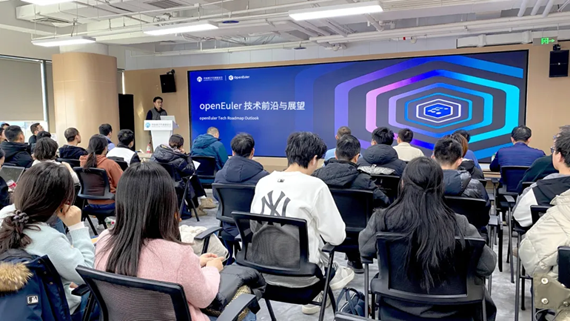
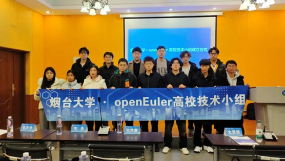
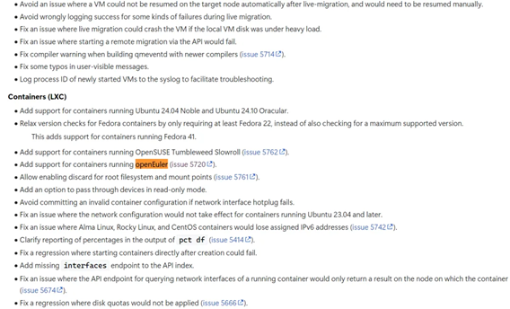
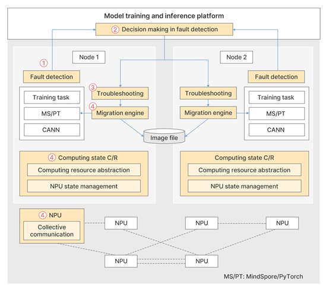

# **openEuler Monthly Bulletin – December**

Welcome to the December edition of the openEuler Monthly Bulletin! As we wrap up 2024, we're excited to share the release updates, the latest technical advancements, and our participation in a range of events. Let's dive into the key updates from the openEuler community in December!

## **Community Scale**

As of December 31, 2024, the [openEuler community](https://www.openeuler.org/en/) has grown to over 3.85 million users. More than 21,000 developers are actively contributing, with a total of 202.8k PRs and 106.6k issues generated. The community now includes 1,944 organization members, with 68 new members joining this December. To access the latest data, please visit the [openEuler DATASTAT](https://datastat.openeuler.org/en/overview).

## **Community Highlight**

### **Happy 5th anniversary to openEuler**

[openEuler turns 5 in December](https://www.youtube.com/watch?v=3gEGkbm8lOY). Since it open-sourced in 2019, openEuler has made significant strides in technological innovation, community development, and global support. Today, it stands as an AI-powered open source operating system, built for digital infrastructure and is versatile across servers, cloud, embedded, and edge environments. As a thriving, collaborative hub, openEuler unites developers worldwide, fostering innovation and creating new possibilities. With robust partnerships across leading global open source foundations and communities, openEuler continues to expand its ecosystem.

Here's to the dedication of all the participants, contributors, and supporters who have helped make openEuler what it is today.

Looking ahead, openEuler will remain humble and committed, delivering cutting-edge innovations with a more open and vibrant community.

### **openEuler 24.03 LTS SP1 has been officially released**

On December 30, 2024, the [openEuler 24.03 LTS SP1](https://www.openeuler.org/en/download/) was officially launched. Based on the Linux kernel 6.6, this release utilizes [EulerMaker](https://eulermaker.compass-ci.openeuler.openatom.cn/) to build images for servers, cloud, and edge environments. The total codebase spans 634 million lines, including 188k lines of kernel code, marking an increase of 58 million lines of code over openEuler 24.03 LTS. This release incorporates advanced features from higher Linux versions, as well as community-driven innovations, such as support for xcall/xint, programmable scheduling, SMC-D, haltpoll, memory management with folios, MPTCP, and on-demand loading with failover support. Try it out at the [Download Center](https://www.openeuler.org/en/download/).

### **openEuler deeply engages in the 2024 OpenAtom Developer Conference with diverse openEuler-specific activities**

On December 20, the 2024 OpenAtom Developer Conference and the first Open Source Technology Academic Conference concluded successfully. As a flagship project of the OpenAtom Foundation, openEuler organized a technical subforum, along with openEuler booth and workshops, providing attendees with a platform for in-depth communication and hands-on experience.

At the conference, openEuler was recognized as "2024 Active Open Source OS Project in China". Also, seven outstanding openEuler developers were awarded as "Outstanding Contributor" and "Star Developer" for their remarkable contributions to the open source community.

### **An openEuler-based paper reported at RTSS 2024**

From December 10 to 12, 2024, the 45th IEEE [Real-Time Systems Symposium (RTSS)](https://2024.rtss.org/conference-program/) was held in York, UK. "[Interference-free Operating System: A 6 Years' Experience in Mitigating Cross-Core Interference in Linux](https://arxiv.org/abs/2412.18104)", a paper based on openEuler, was published at the conference. The paper focuses on enhancing the real-time performance of the operating system kernel and details openEuler's discovery and resolution of multiple real-time issues in the Linux kernel. Notably, it highlights a significant achievement of 1.6× reduction in worst-case response time.

The acceptance of this paper showcases openEuler's outstanding contributions to OS innovation and research, while also demonstrating the close collaboration between openEuler and academic institutions. In the future, the openEuler community will continue to advance the development and collaboration across all areas of operating systems and look forward to more research outcomes.

### **openEuler shares its ROS practices at the ROSCon China 2024**

On December 8, the two-day [ROSCon China 2024](https://www.roscon.cn/2024/en/index.html) took place in Shanghai. The event attracted robotics experts, developers, and enthusiasts worldwide. Maintainers from the [openEuler ROS SIG](https://www.openeuler.org/en/sig/sig-ROS) and [Embedded SIG](https://www.openeuler.org/en/sig/sig-embedded) also shared their development and applications of ROS based on openEuler and RISC-V.

### **openEuler contributors take on key positions in the Linux kernel development community**

Maintainers/Reviewers from each subsystem of the Linux kernel community are responsible for the reliability and stability of code submitted by developers worldwide. Recently, three core contributors from the openEuler community have been added as a [BFQ](https://git.kernel.org/pub/scm/linux/kernel/git/torvalds/linux.git/commit/?id=f55d3b82ac2fe8e12fe784702a7a39ab36b7d4e1) maintainer, a [md/raid](https://patchwork.kernel.org/project/linux-raid/patch/20241108014112.2098079-1-song@kernel.org/) maintainer, and a [UBIFS/UBI](https://git.kernel.org/pub/scm/linux/kernel/git/torvalds/linux.git/commit/?id=eb54235315f4577b035c89a10ca3eb48caab0445) reviewer respectively. They will further strengthen openEuler's influence and drive its continuous development.

### **openEuler thrives in OSPP 2024 with fruitful achievements**

The [Open Source Promotion Plan (OSPP)](https://summer-ospp.ac.cn/) 2024 has come to a successful close in December. This year, the openEuler track contains 95 projects, spanning diverse technical fields and aiming to solve real-world issues. After 4 months of development and integration, 82 students successfully completed their projects and passed evaluations.

We would like to extend our sincere gratitude to all the students and mentors involved and encourage everyone to keep contributing to open source. We also hope more students will join OSPP 2025 to boost their skills, grow with us, and make an impact in the open source ecosystem!

### **openEuler Meetups have been successfully held across multiple cities**

* **Suzhou**

On December 6, an openEuler meetup on RISC-V was held in Suzhou, Jiangsu, focusing on RISC-V. Industry experts from China Mobile, ISCAS, and SpacemiT were brought together to share and discuss cutting-edge RISC-V technologies and practices.

* **Beijing**

On December 12, a meetup focusing on AI and cloud native was held by the openEuler and openKylin communities. In addition to sharing the latest advancements from both communities, the event also addressed the deployment and tuning of AI in real-world scenarios, as well as the efficient development and deployment of cloud-native architectures.

On December 27, an openEuler meetup on open source middleware was jointly organized by Tongtech and the openEuler community, aiming to foster ecosystem growth and drive the development of cloud-native middleware through open source contributions.

* **Yantai**

On December 22, the openEuler and openGauss communities jointly hosted a technical meetup in Yantai, Shandong, discussing operating system and database technologies. During the meetup, the openEuler Jiaodong User Group and the openEuler Technical Group at Yantai University were established.

## **Technical Progress**

### **openEuler now supports oneAPI**

[oneAPI](https://gitee.com/openeuler/intel-oneapi) is an open, standard-based programming model developed by Intel. It is designed to simplify programming across different types of computing architectures, including CPUs, GPUs, FPGAs, and other accelerators. The goal of oneAPI is to provide developers with a unified and cross-architecture programming model for faster application performance, more productivity, and greater innovation.

With the joint efforts of the [openEuler Intel Arch SIG](https://www.openeuler.org/en/sig/sig-Intel-Arch) and [AI SIG](https://www.openeuler.org/en/sig/ai), oneAPI has been successfully integrated into openEuler. Starting from openEuler 24.03 LTS, the later releases of openEuler cover both the oneAPI Base Kit and Runtime container images. From openEuler 24.03 LTS SP1, openEuler natively supports oneAPI's underlying libraries, which include various dependency libraries required for oneAPI, Intel's graphics compiler, OpenCL runtime, and the underlying hardware abstraction layer (Level Zero) for different platforms (x86\_64 and AArch64).

We have also adapted and validated various oneAPI packages for openEuler to fully support different oneAPI programming models. Additionally, we added the official oneAPI DNF/YUM repositories to openEuler, making it simple to install and update all runtime dependencies, development tools, and debugging tools for oneAPI.

### **openEuler now supports OpenVINO**

[OpenVINO](https://gitee.com/openeuler/intel-openvino) is an open source AI toolkit and runtime library designed to optimize deep learning models from various popular frameworks and deliver optimized performance across Intel processors, accelerators, and other hardware platforms such as Arm. Starting from openEuler 24.03 LTS SP1, with the efforts of the [openEuler AI SIG](https://www.openeuler.org/en/sig/ai) and [Intel Arch SIG](https://www.openeuler.org/en/sig/sig-Intel-Arch), openEuler now natively supports OpenVINO, significantly enhancing the computing capabilities.

Key functions are as follows:

* **Conversion and optimization of models:** Open Model Zoo offers hundreds of open source pre-trained models that can be quickly deployed within the OpenVINO runtime framework. OpenVINO enables the conversion of models trained with popular deep learning frameworks like TensorFlow, PyTorch, ONNX, and PaddlePaddle into intermediate representation (IR) format for optimization. For instance, OpenVINO leverages NNCF for model pruning and sparsity compression to reduce model size and boost inference speed. Additionally, OpenVINO provides performance analysis tools to assess model efficiency and pinpoint potential bottlenecks.
* **Hardware acceleration:** The optimized pre-trained models can be deployed across various Intel processors, accelerators, and Arm-based hardware environments, providing service capabilities in local, edge, browser, or cloud environments. Additionally, OpenVINO offers a plugin mechanism, enabling the extension and integration of third-party hardware acceleration capabilities.
* **OpenVINO runtime support:** The OpenVINO inference engine runtime supports cross-hardware and cross-OS compatibility, as well as multiple languages (C, C++, Python, etc.), offering asynchronous inference capabilities to enhance system throughput.
* **OpenVINO GenAI:** As a new branch of OpenVINO, OpenVINO GenAI is a library of pipelines and methods that extend the OpenVINO runtime to work with generative AI models more efficiently and simplify the inference process for generative AI models. It eliminates the complexities of the generation process and minimizes the required lines of code.

### **New progress of the safeguard project**

[safeguard](https://gitee.com/src-openeuler/safeguard/blob/master/README.en.md) is a Linux security service based on eBPF and LSM, designed to intercept and audit processes, files, directories, network activities, and mount operations. Recent progress includes:

* Upgraded the go library and libbpf-1.4.6.
* Completed the adaptation for openEuler 24.03 and merged into the src-openEuler repository.
* Improved interception mechanisms, now supporting the move\_mount hook.
* Reconstructed the logging system.

### **The Chatig repository is created in the openEuler community**

[Chatig](https://gitee.com/openeuler/chatig/blob/master/README.en.md) is an efficient and unified inference gateway, designed to provide developers and enterprises with an OpenAI-compatible API layer, serving as an intermediary between intelligent applications and foundation model services.

With Chatig, developers can easily access foundation model services, empowering intelligent applications as well as efficiently managing and optimizing the deployment and operation of these applications.

Recent additions to Chatig include:

* User management interfaces, such as querying, deleting, and modifying user information
* API\_KEY management, including authentication and invitation
* Support for vLLM and MindIE inference engine models
* Project management interfaces

### **Proxmox Virtual Environment adds support for containers running openEuler**

[Proxmox Virtual Environment (Proxmox VE)](https://pve.proxmox.com/wiki/Roadmap#Proxmox_VE_8.3) is an open source virtualization platform primarily designed for managing the creation, management, and monitoring of virtual machines (VMs) and containers. It integrates KVM (for VMs) and LXC (for containers), offering a unified management interface suitable for deploying and maintaining virtualized environments.

In the latest Proxmox VE 8.3 release, openEuler container templates have been integrated, allowing users to directly launch openEuler 24.09 containers on the Proxmox VE platform.

### **openEuler Download Center has been optimized**

We have optimized the [openEuler Download Center](https://www.openeuler.org/en/download/) by integrating multiple download methods for openEuler. Additional entries have been added, such as **Related Resources** and **Services & Resources**, for developers to easily access and download the version needed. The dedicated section **All Versions** provides developers a quick access to historical versions. The streamlined layout simplifies the search and download process, making it easier to obtain openEuler resources.

### **Latest progress of openEuler SIGs**

* **RISC-V SIG**

Thanks to the [openEuler RISC-V SIG](https://www.openeuler.org/en/sig/sig-RISC-V), RustVMM now supports the RISC-V architecture, expanding the RISC-V virtualization ecosystem. The [Kernel and Virtualization WG](https://lf-rise.atlassian.net/wiki/spaces/HOME/pages/8585810/Kernel+and+Virtualization+WG) of the [RISE Project](https://www.riseproject.ro/en/) has been closely tracking RustVMM's support for RISC-V. In November, the virtualization group of the openEuler RISC-V SIG presented its progress at a SIG regular meeting and was approved to continue maintaining the RustVMM (LK\_03\_014) project.

In the future, the openEuler RISC-V SIG will keep maintaining RustVMM and related packages, promoting openEuler RISC-V as the prior validation platform for the Rust cloud-native software stack and extending RISC-V support to Cloud-Hypervisor, Dragonball, and StratoVirt.

* **Embedded SIG**

In December, the embedded real-time virtual machine, [Zephyr-based Virtual Machine (ZVM)](https://gitee.com/openeuler/zvm/tree/master), developed by Hunan University, has achieved preliminary integration with openEuler Embedded.

### **Introduction of heterogeneous elastic recovery for foundation model training**

As the scale of model training increases, cluster faults have become a growing concern, impacting training efficiency. To address this, the heterogeneous elastic recovery for foundation model training introduces two key core technologies, NPU state C/R and link-free collective communication, which can minimize recovery time and enhance computing resource utilization. For more about these technologies and heterogeneous convergence, welcome to join the [openEuler Long SIG](https://www.openeuler.org/en/sig/sig-Long).

## **Hardware & Software Compatibility**

By the end of December 2024, a total of 59 hardware and software products were certified as compatible with openEuler and added to the [compatibility list](https://www.openeuler.org/en/compatibility/) in December, including 40 applications, 10 hardware components, and 9 OSs.

## **Security Bulletin**

In December 2024, the community published 106 security notices and patched 222 vulnerabilities (22 critical, 92 high, and 108 others).

The following vulnerability has a significant impact and require special attention:

**readline.sh in socat through 1.8.0.1 relies on the /tmp/$USER/stderr2 file.** ([CVE-2024-54661](https://www.openeuler.org/en/security/cve/detail/?cveId=CVE-2024-54661&packageName=socat)) – CVSS 9.8

Affected releases:

openEuler-20.03-LTS-SP4

openEuler-22.03-LTS-SP1

openEuler-22.03-LTS-SP3

openEuler-22.03-LTS-SP4

openEuler-24.03-LTS

You can find the [security announcements](https://www.openeuler.org/en/security/security-bulletins/) on the openEuler official website and install the vulnerability patches in time.

## **Thank You for Your Support**

That's all for this openEuler Monthly Bulletin. We would like to extend our gratitude to all members, developers, and contributors for their support and contributions.