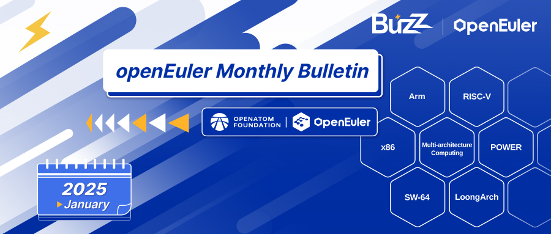
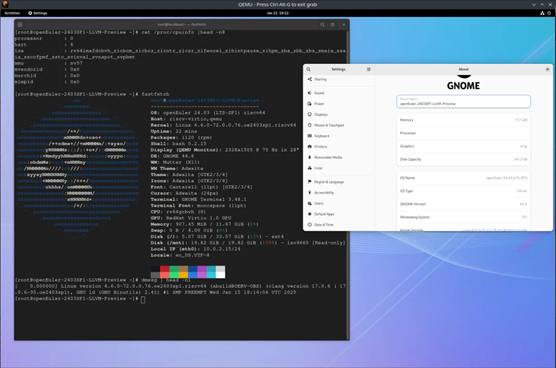
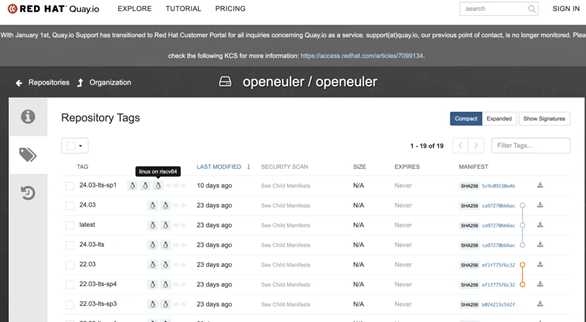

# **openEuler Monthly Bulletin – January**

Welcome to the January edition of the openEuler Monthly Bulletin! We're excited to bring you the latest achievements and progress in the community! Here's what happened in [openEuler](https://www.openeuler.org/en/) this month!

## **Community Scale**

For the latest data, visit [openEuler DATASTAT](https://datastat.openeuler.org/en/overview).

## **Key Technical Progress**

**\[New repository\] He3FS – High-performance POSIX file system**

[He3FS](https://gitee.com/src-openeuler/he3fs/blob/master/README.en.md) is a user space file system based on KV storage, optimized for cloud-native environments.

**Key features:**

* Enables users to efficiently utilize distributed KV storage without modifying the code.
* Implements common FUSE APIs, storing file system metadata and files as key-value pairs in KV storage, and optimizes data access efficiency with a priority-based local queue mechanism.

**Future development:**

* Optimize the local queue feature by splitting hot/cold data to enhance storage efficiency and performance.
* Enrich KV storage compatibility to meet diverse application needs.

**\[New repository\] xLin-SBOM – Automated scan solution for software supply chain security**

[xLin-SBOM](https://gitee.com/openeuler/xlin-sbom/blob/master/README.en.md) can analyze ISO images or each RPM packages to generate standardized software bill of materials (SBOM), enabling developers and enterprises to manage components, ensuring compliance and mitigating open source legal risks.

**Key features:**

* **SBOM generation:** Produces SPDX-compliant SBOMs from deep scans of ISO images and RPMs.
* **Metadata extraction:**Automatically retrieves package metadata (e.g., name, version, architecture, supplier, license, and checksums).
* **Dependency management:**Tracks and manages inter-package dependencies.
* **Linux compatibility:**Supports major Linux distributions with flexible deployment options.
* **License compliance:**Normalizes licenses to SPDX identifiers for compliance checks.

**Application cases:**

* **Compliance check:** Validates dependencies and licenses against open source community standards.
* **Security audit:** Identifies vulnerabilities via SBOMs for timely remediation.

**\[New repository\] sysHAX – LLM-based heterogeneous-converged inference framework**

Developed and maintained by the [AI SIG](https://www.openeuler.org/en/sig/ai),[sysHAX](https://gitee.com/openeuler/sysHAX/blob/master/README.en.md) is designed to accelerate model inference. By optimally integrating CPU and xPU capabilities, it leverages CPU power to reduce computing demands and enhance inference service load capacity.

**Key features:**

* **Scheduling optimization:**Efficiently schedules computing resources for different inference requests and utilizes KV caching across multi-tier caches.
* **KV cache management:**Distributes and transfers KV caches across various storage media.
* **CPU utilization boost:**Offloads decoding processes from CPU and unleashes CPU capabilities based on model properties.

**\[New release\] openEuler-2403SP1-LLVM-Preview**

The openEuler LLVM Parallel Universe Program has released [a preview version for openEuler 24.03 SP1](https://repo.openeuler.openatom.cn/openEuler-preview/openEuler-24.03-SP1-LLVM-Preview/).

**Key updates:**

* Expands software repository coverage to Everything + Epol, aligning with the scope of openEuler's official releases.
* Upgrades RISC-V software baseline to near RVA22 standards, with vector extensions enabled.
* Integrates the mold linker for most package compilations, accelerating system build processes.

**openEuler RISC-V images pushed to multiple platforms**

* The openEuler RISC-V images have been pushed to DockerHub, Quay.io, and OEPKGS, thanks to the [RISC-V SIG](https://www.openeuler.org/en/sig/sig-RISC-V) and [Infra SIG](https://www.openeuler.org/en/sig/Infrastructure).
* Looking ahead, the RISC-V SIG will align with openEuler's cloud-native software ecosystem to advance software-level Docker image support for RISC-V.

## **Hardware & Software Compatibility**

As of January 31, 2025:

* 40 products certified compatible (23 applications from ISVs, 15 hardware components from IHVs, and 2 OSs from OSVs)
* 6 OSs passed the openEuler OSV technical assessment

View more in the [compatibility list](https://www.openeuler.org/en/compatibility/).

## **Security Bulletin**

As of January 31, 2025:

* 89 security notices published
* 222 vulnerabilities patched (1 critical, 56 high, 165 others)

The following vulnerabilities have a significant impact and require special attention:

* [CVE-2024-12084](https://www.openeuler.org/en/security/cve/detail/?cveId=CVE-2024-12084&packageName=rsync)
* [CVE-2024-56732](https://www.openeuler.org/en/security/cve/detail/?cveId=CVE-2024-56732&packageName=harfbuzz)

View the [security announcements](https://www.openeuler.org/en/security/security-bulletins/) on the openEuler official website.

## **Thank You for Your Support**

We extend a warm invitation to all open source enthusiasts to join the openEuler community and become active participants in our 100+ exciting SIGs. Whether you are passionate about contributing code, sharing your expertise, or simply engaging in insightful discussions, there is a place for you within our community.

Stay connected with us or check our project repositories for regular updates to stay abreast of the latest developments and breakthroughs.