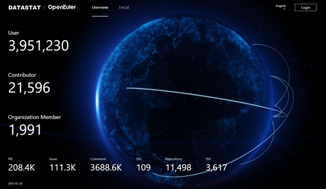
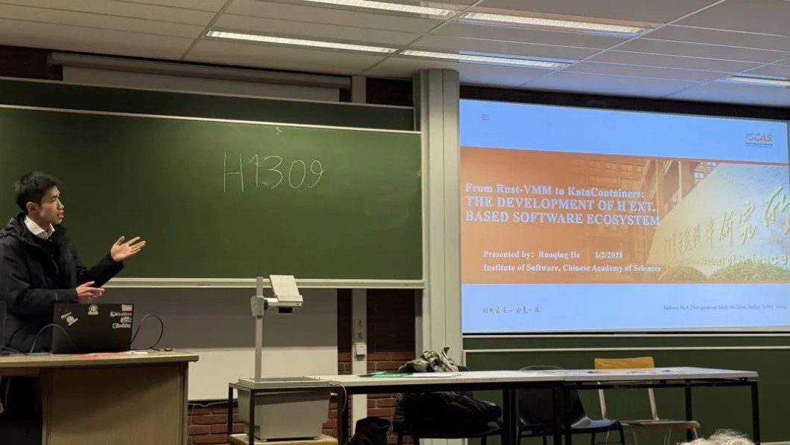
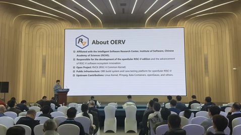

# **openEuler Monthly Bulletin – February**

Welcome to the February edition of the openEuler Monthly Bulletin! We're excited to bring you the updates and events from our community this month.

## **Community Scale**

For the latest data, visit [openEuler DATASTAT](https://datastat.openeuler.org/en/overview).

## **Community Events**

* On February 1, 2025, the [openEuler on RISC-V SIG](https://www.openeuler.org/en/sig/sig-RISC-V) presented at [the Free and Open Source Software Developers' European Meeting (FOSDEM) 2025](https://ftp.fau.de/fosdem/2025/h1309/fosdem-2025-4156-from-rust-vmm-to-katacontainers-the-development-of-h-ext-based-software-ecosystem.mp4), sharing updates on RISC-V virtualization and recent advancements in rust-vmm, Cloud Hypervisor, and Kata Containers.

* From February 27 to 28, 2025, the openEuler on RISC-V SIG participated in both the [RISC-V Tokyo Day](https://www.youtube.com/watch?v=gsd5cEQYuYE) and the China RISC-V Ecosystem Conference, introducing the current development of openEuler on RISC-V, and shared future plans.

* The [openEuler Developer Day 2025 (ODD 2025)](https://www.linkedin.com/events/openeulerdeveloperday20257307929429014425600/) is coming to Hangzhou this April. ODD 2025 is the premier gathering for developers and tech innovators passionate about the future of open source operating systems and foundational software.
Mark April 11 and be the first to experience the latest 25.03 release, connect with fellow developers in our SIG Gathering, and get hands-on with exciting project demos and posters! Stay tuned for further information!

## **Community Governance**

**The first openEuler Committee Meeting this year was held**

On February 21, 2025, the first openEuler Committee Meeting for 2025–2026 was held at the Institute of Software, Chinese Academy of Sciences, in Beijing.

**Key outcomes:**

* Appointed Hu Xinwei as the Chairperson of the openEuler Committee and Maggie Liang as the Chairperson of the Marketing Committee.
* Reviewed and approved the 2025 annual plans of each sub-committee.
* Reviewed the community's five-year achievements in open source.

## **Key Technical Progress**

**openEuler is adapted to the STM32MP257 microprocessor**

Collaborated with [STMicroelectronics](https://www.st.com/content/st_com/en.html) and [MYIR](https://www.myirtech.com/), openEuler has completed the hardware adaptation of the high-performance [STM32MP257](https://www.st.com/en/microcontrollers-microprocessors/stm32mp257.html) microprocessor with the MYD-LD-25x development board.

**Key features of STM32MP257:**

* Dual Cortex-A35 64-bit cores running at up to 1.5 GHz and Cortex-M33 cores running at 400 MHz
* 1.35 TOPS NPU and 3D GPU, supporting H.264 encoding/decoding

The openEuler community will further focus on enhancing the adaptation of ROS2 images, mixed-criticality system images, embedded graphics images, and embedded AI images, with plans to incorporate Time-Sensitive Networking (TSN) support.

**Chatig, incubated in openEuler, is now available on public cloud**

The China Unicom Cloud's AI inference gateway service, [Chatig](https://gitee.com/openeuler/chatig), was incubated in the openEuler community in November 2024 and now available on public cloud.

**Key features:**

* Supports 13 models, including DeepSeek-R1 and DeepSeek-V3.
* Provides multi-model switching, data privacy protection, content review, QoS traffic limiting, and user authentication.
* Offers services via a unified API, allowing users to access model capabilities on demand.

## **Hardware & Software Compatibility**

As of February 28, 2025, 19 products were certified compatible (11 applications from ISVs, 6 hardware components from IHVs, and 2 OSs from OSVs).

View more in the [compatibility list](https://www.openeuler.org/en/compatibility/).

## **Security Bulletin**

As of February 28, 2025:

* 149 security notices published
* 404 vulnerabilities patched (10 critical, 96 high, 298 others)

The following vulnerabilities have a significant impact and require special attention:

* [CVE- 2024-56337](https://www.openeuler.org/en/security/cve/detail/?cveId=CVE-2024-56337&packageName=tomcat)
* [CVE- 2021-28235](https://www.openeuler.org/en/security/cve/detail/?cveId=CVE-2021-28235&packageName=etcd)

View the [security announcements](https://www.openeuler.org/en/security/security-bulletins/) on the openEuler official website.

## **Thank You for Your Support**

We extend a warm invitation to all open source enthusiasts to join the openEuler community. Whether you are passionate about contributing code, sharing your expertise, or simply engaging in insightful discussions, there is a place for you within our community.

Stay connected with us or check our project repositories for regular updates to stay abreast of the latest developments and breakthroughs.