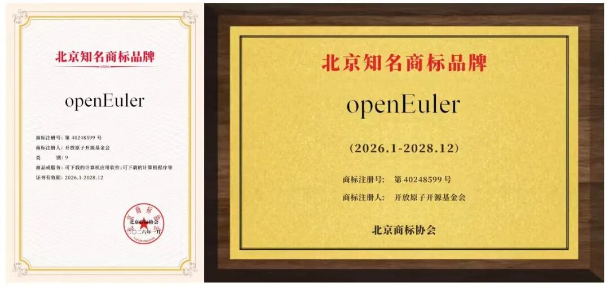

## Overview

In January and February 2026, the OpenAtom openEuler community continued to advance technology, ecosystem development, and security governance.

Key technical progress included further RISC-V enhancements, openYuanrong 0.7.0 for serverless distributed workloads, and end-to-end integration with OpenSSF OSV for standardized, reusable security advisory data. openEuler Embedded added heterogeneous hybrid deployment and completed an end-to-end proof of concept for a compact edge–cloud robotics solution. The openEuler Portal MCP Server also went live, enabling AI assistants to retrieve up-to-date information directly from the website.

The openEuler community continued to expand, with active contributions from developers and member organizations. It published the openEuler 2025 Annual Report, received the 2025 Beijing Famous Trademark Brand recognition, was included in the *2025 Beijing Key Trademark Protection List*, and announced community internship opportunities.

## Community Scale

As of February 28, 2026, the openEuler community had:

- More than 6.31 million users
- More than 26,000 developers
- 2,138 organization members
- 261k pull requests
- 136,400 issues
- More than 4.59 million comments

## Community Events

### openEuler Annual Report 2025 Published

In 2025, openEuler began a new chapter in its growth and evolution. With contributions from more than 2,100 organization members and 24,000 developers, the community continued to expand both its technology portfolio and its open-source ecosystem.

The [annual report](https://www.openeuler.org/en/annual-report/openEuler-annual-report-2025/) reviews the community’s progress over the past year and sets out its direction for the next five years. openEuler will continue to embrace emerging technologies such as SuperPoD and AI while expanding its global reach and collaboration.

### openEuler Recognized as 2025 Beijing Famous Trademark Brand

At the inaugural Beijing Trademark & Brand Gala on January 16, openEuler was recognized as a 2025 Beijing Famous Trademark Brand and added to the second batch of the Beijing Key Trademark Protection List.

The recognition reflects openEuler’s technology development, ecosystem reach, and intellectual property protection practices.

## Key Technical Progress

### openEuler 24.03 LTS SP3 RISC-V Edition Released as a Preview

The openEuler on RISC-V team worked with the ISCAS, ZTE, Alibaba DAMO Academy, SOPHGO, SpacemiT, UltraRISC, and other industry partners to release the [openEuler 24.03 LTS SP3 RISC-V](https://www.openeuler.org/en/download/archive/detail/?version=openEuler%2024.03%20LTS%20SP3) edition.

The release is the first Linux LTS release to support the RVA23 profile and provides initial support for the RISC-V Server Platform specification. It offers separate RVA20 and RVA23 images, adds support for the SpacemiT K3 processor, and is adapted for the DevStation developer workstation.

The toolchain has been upgraded across the stack, including GCC 14.3.1, Binutils 2.42, and LLVM 20. User-space adaptation now covers dozens of components, including Ceph. At the kernel level, the release adopts the unified RVCK codebase and aligns key server features such as ACPI, AIA, IOMMU, and RAS to improve hardware compatibility and system stability.

This release is currently available as a preview for developer testing and feedback. It will later move into the LTS release directory and receive ongoing maintenance throughout its lifecycle.

### openYuanrong 0.7.0 Released

[openYuanrong 0.7.0](https://www.openeuler.org/en/projects/yuanrong/) provides a unified serverless architecture for distributed applications across AI, big data, and microservices.

Its multilingual function APIs bring the simplicity of single-machine programming to distributed application development. Dynamic scheduling and data sharing improve application performance and cluster resource utilization.

### Integration with OpenSSF OSV

openEuler completed end-to-end integration with the OpenSSF Open Source Vulnerabilities (OSV) ecosystem, becoming one of the early Linux distributions to make its security advisories available to widely used open-source security toolchains in a standardized, reusable format. This gives users and ecosystem partners more consistent vulnerability data that can be integrated into practical scanning and remediation workflows.

### Compact Edge-Cloud Robotics PoC

openEuler Embedded and Qinuo completed an end-to-end PoC for a low-cost pet robot built on a compact HiEuler Pi PICO device and veRTC.

The project validated interactive embodied AI capabilities using the IB-Robot middleware stack, with a lightweight edge device working alongside cloud-based intelligence and on-device actuators.

### Heterogeneous Hybrid Deployment Added to openEuler Embedded

The openEuler Embedded mixed-criticality deployment framework (MICA) now supports heterogeneous deployment, unlocking the diverse compute resources available on underlying hardware platforms.

On the HiEuler Pi platform, for example, openEuler Embedded can run on the Arm64 CPU while LiteOS runs on the RISC-V MCU. The framework provides lifecycle management and efficient inter-core communication across the two operating systems, combining compute performance, real-time responsiveness, and software ecosystem support for use cases such as embodied AI.

### openEuler Portal MCP Server Launched

The openEuler website contains extensive information. Finding a specific answer has traditionally required users to navigate multiple pages. The new openEuler Portal MCP Server allows users to ask AI and get real-time information directly from the openEuler website. Currently, it supports queries covering SIGs, CVE security advisories, software packages, downloads, and documentation, with more capabilities under development.

## Container Image Updates

As of February 28, the openEuler community maintained 316 public container images. During January and February, 33 application images were updated based on the openEuler 24.03 LTS SP3 base image. These updates covered AI, cloud, big data, database, storage, and other software categories.

Two new application images were also added:

- `bisheng-jdk:21.0.5`
- `claude-code:2.1.20`

The images are available on [Docker Hub](https://hub.docker.com/u/openeuler).

## Hardware & Software Compatibility

As of February 28, 2026, a total of 2,538 products had passed openEuler hardware and software compatibility evaluation. 85 products were added during January and February: 61 from independent software vendors (ISVs), 21 from independent hardware vendors (IHVs), and 3 from operating system vendors (OSVs).

- [Compatibility list](https://www.openeuler.org/en/compatibility/)

## Security Bulletin

During January and February, the community published 486 security advisories and addressed 392 vulnerabilities (5 critical, 134 high, and 253 in other severity categories).

The following vulnerabilities have significant impacts and require special attention:

#### [CVE-2025-15467 (CVSS 9.8)](https://www.openeuler.org/en/security/cve/detail/?cveId=CVE-2025-15467&packageName=edk2)

**Issue:** Parsing CMS AuthEnvelopedData message with maliciously crafted AEAD parameters can trigger a stack buffer overflow.

**Impact:** A stack buffer overflow may lead to a crash, causing Denial of Service, or potentially remote code execution.

**Affected releases:**

- openEuler 20.03 LTS SP4
- openEuler 22.03 LTS SP4
- openEuler 24.03 LTS
- openEuler 24.03 LTS SP1
- openEuler 24.03 LTS SP2
- openEuler 24.03 LTS SP3

**Security advisories**: [openEuler-SA-2026-1411](https://www.openeuler.org/en/security/security-bulletins/detail/?id=openEuler-SA-2026-1411)

#### [CVE-2026-0884 (CVSS 9.8)](https://www.openeuler.org/en/security/cve/detail/?cveId=CVE-2026-0884&packageName=firefox)

**Issue:** Use-after-free in the JavaScript Engine component. This vulnerability affects Firefox \< 147, Firefox ESR \< 140.7, Thunderbird \< 147, and Thunderbird \< 140.7.

**Affected releases:**

- openEuler 20.03 LTS SP4
- openEuler 22.03 LTS SP3
- openEuler 22.03 LTS SP4
- openEuler 24.03 LTS
- openEuler 24.03 LTS SP1
- openEuler 24.03 LTS SP2
- openEuler 24.03 LTS SP3

**Security advisories**: [openEuler-SA-2026-1285](https://www.openeuler.org/en/security/security-bulletins/detail/?id=openEuler-SA-2026-1285)

## Thank You for Your Support

We extend a warm invitation to all open-source enthusiasts to join the openEuler community. Whether you are passionate about contributing code, sharing your expertise, or simply engaging in insightful discussions, there is a place for you within our community.

Stay connected with us or check our project repositories for regular updates to stay abreast of the latest developments and breakthroughs.

To suggest an addition or share feedback on the monthly bulletin, contact <contact@openeuler.io>.
