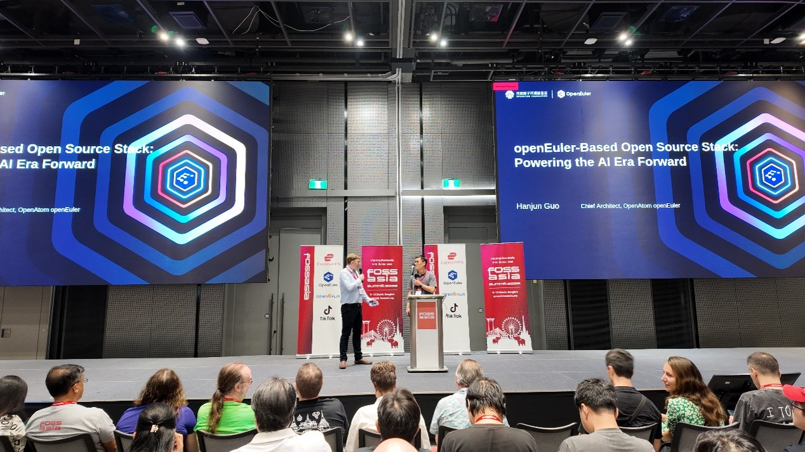
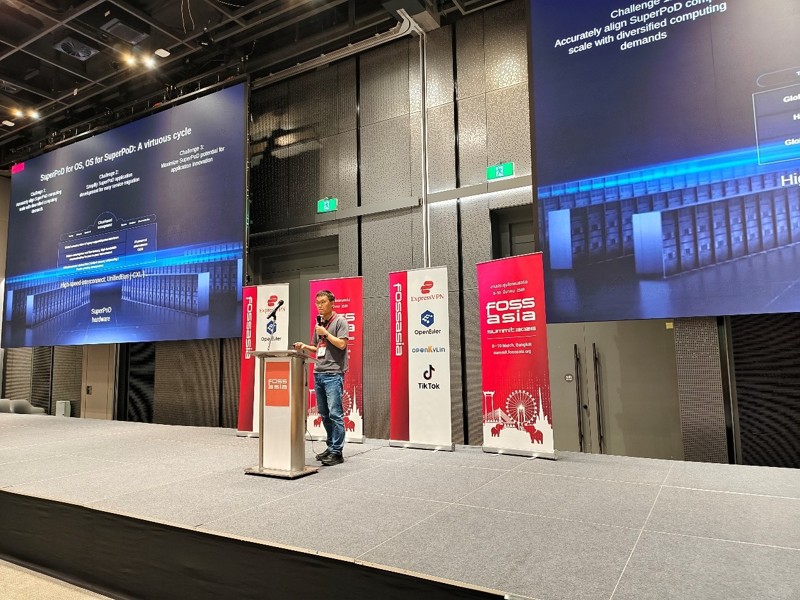
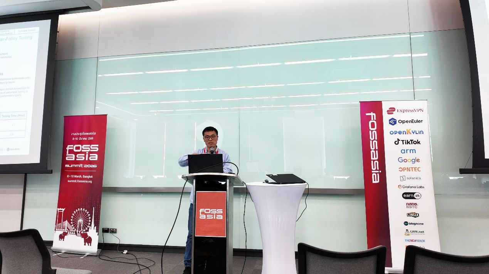
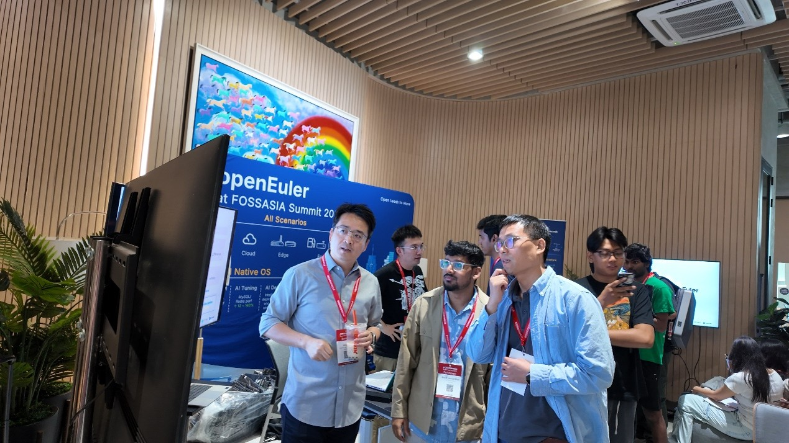
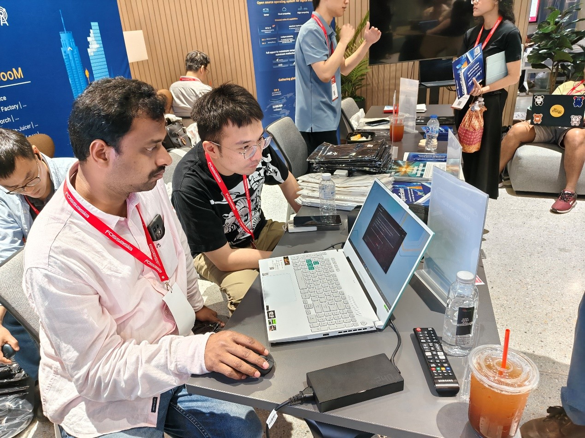
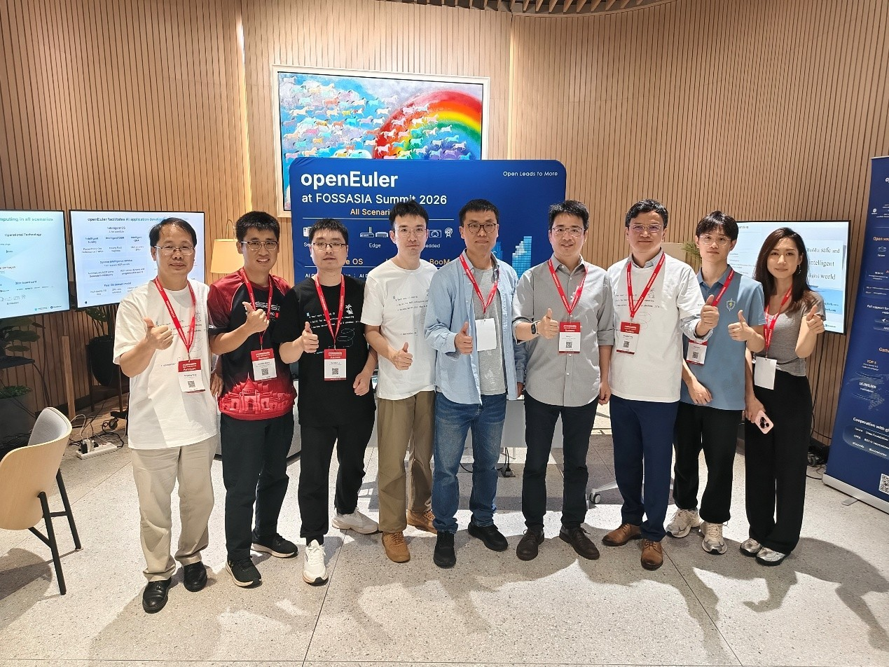

From March 8 to 10, 2026, FOSSASIA Summit 2026, one of Asia's most influential open-source technology conferences, was held in Bangkok, Thailand. Bringing together open-source developers, technology experts, and industry partners from around the world, the summit explored the latest trends and practices in open-source technologies.

As a Platinum Sponsor, OpenAtom openEuler (openEuler) participated in the event together with the Institute of Software Chinese Academy of Sciences (ISCAS) and TongTech. During the summit, openEuler engaged with global IT enterprises and software developers, sharing its latest innovations in AI-era operating systems.

## Keynote: Driving OS Innovation in the AI Era

On March 9, Mr. Guo Hanjun, Maintainer of the openEuler Kernel SIG, delivered a keynote speech titled "openEuler-based Open-Source Stack: Powering the AI Era Forward." He highlighted that, with the continuous evolution of computing architectures, operating systems are facing new challenges and opportunities, and openEuler has introduced a new OS version to keep pace with the AI era and unleash the potential of general-purpose and AI computing.

During the speech, Mr. Guo introduced openEuler's innovations in AI for OS, OS for AI, and full-stack AI capabilities. By deeply integrating system capabilities with AI, openEuler accelerates the deployment of enterprise AI applications and provides developers with a more efficient AI development environment. The keynote also featured openEuler 24.03 LTS SP3, the world's first OS supporting SuperPoD. Based on UnifiedBus, the release breaks the resource boundaries of standalone systems, enables efficient integration of heterogeneous resources, and improves application performance by 30%–50%, attracting significant attention from developers onsite.

## Session: Exploring Full-Stack AI and SuperPoD OS

On March 10, Mr. Guo delivered another speech titled "openEuler AI Exploration: AI Technical Innovation & SuperPoD OS" at the AI session, highlighting Intelligence BooM, openEuler's open-source full-stack AI solution that provides developers with an out-of-the-box AI development experience and enables enterprises to develop AI applications more efficiently. The session also showcased openEuler's advances in heterogeneous computing, including resource partitioning, hybrid workload scheduling, CPU-NPU collaborative computing, and memory pooling, further enhancing AI computing efficiency.

## Exhibition: Innovations in AI and Open-Source Ecosystems

During the summit, the openEuler exhibition area highlighted the latest progress in AI technologies, OS capabilities, developer tools, and open-source ecosystem development. Together with its partners, openEuler presented multiple innovative solutions based on openEuler, attracting developers and enterprise representatives to explore open-source technologies and exchange ideas.

The exhibition area also featured a DevStation experience zone, where developers from around the world explored AI-powered development scenarios and engaged with the openEuler community through hands-on activities.

## Looking Ahead

Through its participation in FOSSASIA Summit 2026, openEuler, together with its ecosystem partners, highlighted its latest innovations for the AI era and strengthened connections with the global open-source community.

Moving forward, openEuler will embrace open collaboration and technological innovation, working with developers and industry partners worldwide to build a thriving open-source ecosystem.

