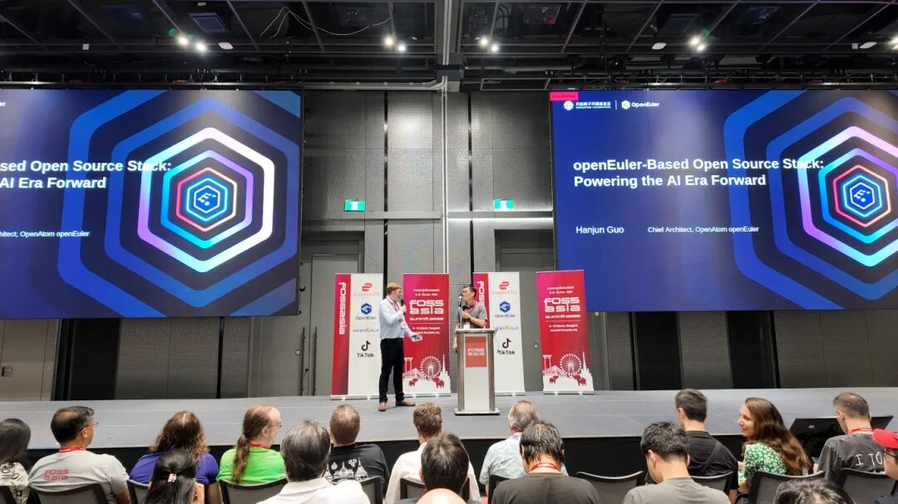
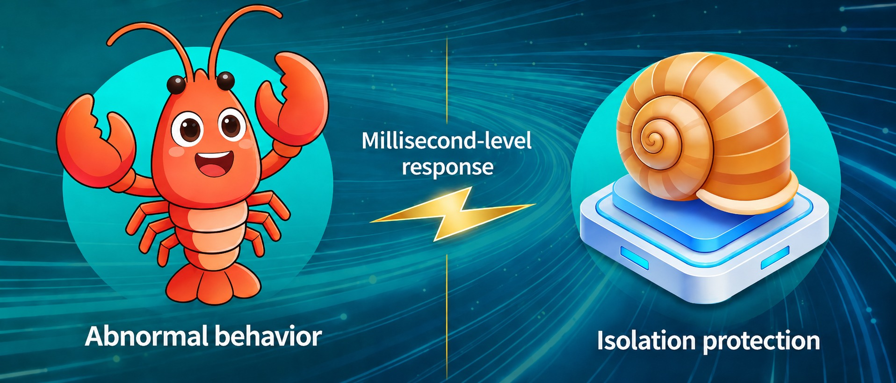

In March 2026, the OpenAtom openEuler community continued to advance technological innovation and ecosystem development, with progress across RISC-V, AI-powered O&M, log analysis, and cloud-native technologies.

The community expanded its ecosystem through the establishment of the Space SIG and participation in FOSSASIA Summit 2026. Meanwhile, openEuler Developer Day 2026 was announced for April 25.

Together with developers and ecosystem partners, openEuler continues to strengthen its open-source ecosystem and enable innovation for the AI era.

## Community Scale

As of March 31, 2026, the openEuler community had:

- More than 6.78 million users

- More than 26,000 developers

- 2,139 organization members

- 268.5k pull requests

- 139.4k issues

- More than 4.74 million comments

For the latest data, visit [openEuler DATASTAT](https://datastat.openeuler.org/en/overview).

## Community Events

### openEuler Space SIG Officially Established

On March 4, the openEuler community officially established the Space SIG with approval from the openEuler Technical Committee. Led by the Beijing Aerospace Microsystem and Information Technology Research Institute together with other organizations, the SIG is the first openEuler community group dedicated to spatial intelligence scenarios, including satellite constellations, deep-space exploration, UAVs, and eVTOLs. It aims to build an open, unified, and intelligent spatial computing ecosystem, providing an open-source software foundation for next-generation spatial applications.

### openEuler Participates in FOSSASIA Summit 2026

From March 8 to 10, FOSSASIA Summit 2026 was held in Bangkok, Thailand. As a Platinum Sponsor, openEuler joined global open-source developers, technology experts, and ecosystem partners at the event, sharing its latest operating system innovations for the AI era and exploring new opportunities for open-source collaboration.

### openEuler Showcases AI Capabilities at KCD Beijing + vLLM 2026

As a key event bringing together cloud-native and AI communities, KCD Beijing + vLLM 2026 was held on March 21. At the event, openEuler showcased its latest AI capabilities, including the DevStation intelligent development desktop and the assistant agent. The showcase attracted attention from developers and highlighted openEuler’s efforts in AI infrastructure and intelligent development.

### openEuler Developer Day 2026 Scheduled

openEuler Developer Day 2026 (ODD 2026) will be held on April 25 in Changsha, bringing together developers to discuss the future of operating systems in the AI era.

The event will focus on key topics including tech requirements, feature planning, and release cycles for future openEuler LTS and innovation releases, as well as exploring new opportunities for open-source collaboration.

## Key Technical Progress

### openEuler 24.03 LTS SP3 RISC-V Enters LTS Maintenance

Following extensive community validation and stability improvements, openEuler 24.03 LTS SP3 RISC-V has officially entered the LTS maintenance phase. As the first LTS release supporting the RVA23 standard, it introduces initial support for the RISC-V server platform specification, enhances server support through RVCK, and adds support for the SpacemiT K3 platform. The community will continue to strengthen RVA23 support, kernel infrastructure, and the RISC-V software ecosystem throughout the LTS lifecycle.

### Agent for Known Issue Analysis Goes Live

In enterprise O&M, troubleshooting often faces two challenges: valuable experience from previously resolved issues is scattered across tickets, internal documents, and engineers’ notes, while system logs are massive, diverse, and difficult to analyze efficiently.

To address these challenges, openEuler launched an agent for known issue analysis in March 2026, enabling intelligent fault diagnosis by combining historical knowledge retrieval and log analysis capabilities.

- **Lightweight knowledge base MCP**

The MCP enables the agent to retrieve historical known issues and match similar cases based on user-reported symptoms or log information. It then generates structured analysis reports covering symptoms, solutions, and verification steps, helping reduce mean time to repair.

- **Log anomaly detection MCP**

Designed for large-scale and complex enterprise logs, the MCP provides high-performance anomaly detection capabilities. It helps the agent identify potential issues from massive log data, improving diagnosis efficiency while reducing analysis costs.

### openEuler CloudNative SIG Introduces Conch

With the rapid growth of AI agent projects such as OpenClaw, running agents directly on hosts or virtual machines introduces new challenges in security, isolation, and reliability. Agents with deep system access may contaminate the runtime environment due to issues such as prompt injection, model hallucination, improper configuration changes, or damaged libraries.

Therefore, the openEuler CloudNative SIG introduced Conch, a next-generation sandbox engine featuring strong isolation, extensibility, and millisecond-level startup. Conch provides a reliable execution foundation for agents, enabling safer and more efficient deployment.

### Witty Assistant Brings AI-Powered O&M to openEuler

openEuler 24.03 LTS SP3 introduces Witty Assistant and an agent for known issue analysis, bringing AI-powered capabilities to enterprise O&M. Together, they help reduce repetitive troubleshooting by reusing historical issue knowledge, automatically analyzing faults, and generating structured diagnosis results, improving O&M efficiency and delivering a smarter maintenance experience.

## Container Image Updates

During March, 35 application images were updated based on the openEuler 24.03 LTS SP3 base image. These updates covered AI, cloud, big data, database, storage, and other software categories.

The images are available on [Docker Hub](https://hub.docker.com/u/openeuler).

## Hardware & Software Compatibility

As of March 31, 2026, a total of 2,603 products had passed openEuler hardware and software compatibility evaluation. 62 products were added during March: 49 from independent software vendors (ISVs), 11 from independent hardware vendors (IHVs), and 2 from operating system vendors (OSVs).

- [Compatibility list](https://www.openeuler.org/en/compatibility/).

## Security Bulletin

During March 2026, the community published 274 security advisories and addressed 65 vulnerabilities (7 critical, 17 high, and 41 in other severity categories).

The following vulnerabilities have a significant impact and require special attention:

#### [*CVE-2026-4698 (CVSS 9.8)*](https://www.openeuler.org/en/security/cve/detail/?cveId=CVE-2026-4698&packageName=thunderbird)

**Synopsis:** This vulnerability affects Firefox \< 149, Firefox ESR \< 115.34, Firefox ESR \< 140.9, Thunderbird \< 149, and Thunderbird \< 140.9.

**Affected releases:**

- openEuler-20.03-LTS-SP4

- openEuler-22.03-LTS-SP4

- openEuler-24.03-LTS

- openEuler-24.03-LTS-SP1

- openEuler-24.03-LTS-SP2

- openEuler-24.03-LTS-SP3

#### [*CVE-2026-2049 (CVSS 9.8)*](https://www.openeuler.org/en/security/cve/detail/?cveId=CVE-2026-2049&packageName=gegl04)

**Synopsis:** GEGL provides infrastructure to do demand based cached non-destructive image editing on larger than RAM buffers. Through babl, it provides support for a wide range of color models and pixel storage formats for input and output.

**Affected releases:**

- openEuler-20.03-LTS-SP4

- openEuler-22.03-LTS-SP3

- openEuler-24.03-LTS

- openEuler-24.03-LTS-SP1

- openEuler-24.03-LTS-SP2

- openEuler-24.03-LTS-SP3

## Thank You for Your Support

We extend a warm invitation to all open-source enthusiasts to join the openEuler community. Whether you are passionate about contributing code, sharing your expertise, or simply engaging in insightful discussions, there is a place for you within our community.

Stay connected with us or check our project repositories for regular updates to stay abreast of the latest developments and breakthroughs.

To suggest an addition or share feedback on the monthly bulletin, contact <contact@openeuler.io>.
