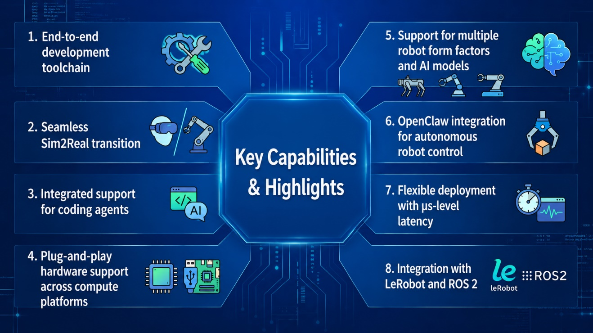

The OpenAtom openEuler community has released openEuler Embedded 26.03, marking a significant step forward in its support for embodied AI.

Built on the openEuler Intelligence BooM open-source stack, the release introduces IB-Robot, an open-source software stack for embodied robotics. This integration makes openEuler Embedded 26.03 the first openEuler release to provide an out-of-the-box OS for embodied AI, delivering end-to-end solutions from hardware to algorithms.

## Key Capabilities & Highlights

### End-to-end development toolchain

openEuler Embedded 26.03 provides an integrated toolchain covering environment setup, simulation and debugging, data recording, one-click deployment, and visualized O&M tools. The streamlined workflow reduces setup and integration work so developers can focus on algorithms and application logic.

### Seamless Sim2Real transition

Bridging the gap between simulation and the physical world is a persistent challenge in embodied AI development, particularly for imitation learning. IB-Robot natively supports simulation tools such as MuJoCo and Gazebo. Policies trained and validated in simulation can run seamlessly on both simulated environments and physical robots using the same code, significantly accelerating the R&D cycle.

### Integrated support for coding agents

The system provides a rich set of agent skills for building, running, committing, and reviewing code. Closely integrated with coding agents, these skills enable end-to-end harness engineering and intelligent development support, significantly streamlining code management and policy refinement.

### Plug-and-play hardware support across compute platforms

The release preintegrates drivers for widely used sensors and actuators including motors, cameras, LiDAR, and audio peripherals. It supports both high-performance central controllers and resource-constrained edge platforms, simplifying hardware bring-up across a broad range of robotics systems.

### Support for multiple robot form factors and AI models

openEuler Embedded 26.03 supports robot configurations including single- and dual-arm manipulators, quadruped robots, and automated guided vehicles (AGVs). It also supports models and policies such as ACT, Pi0.5, and GR00T for real-world tasks including material handling and multi-robot collaboration.

### OpenClaw integration for autonomous robot control

Native integration with OpenClaw extends agent-based interaction and control to intelligent robots. The integration improves precise control of end effectors while enabling more autonomous task interpretation and execution.

### Flexible deployment with μs-level latency

The system offers multiple deployment options for industrial control and collaborative robotics. In real-time control scenarios, it can deliver μs-level response latency, supporting smooth and precise robot motion.

### Integration with LeRobot and ROS 2

IB-Robot connects LeRobot with the broader ROS and ROS 2 open-source ecosystems. Massive open-source robot assets, nodes, and algorithm packages can be migrated to and integrated with openEuler Embedded, helping developers quickly build and extend their robotics capabilities.

openEuler Embedded 26.03 represents a comprehensive evolution for the embodied AI era. With the built-in IB-Robot software stack, it delivers a simplified development experience, powerful cross-environment migration capabilities, and a thriving software and hardware ecosystem — providing a truly out-of-the-box intelligent foundation for cutting-edge robotics algorithm research and commercial deployment.

## Get Started

Try IB-Robot, follow its progress, and contribute to the project.

- [IB-Robot repository](https://gitcode.com/openeuler/IB_Robot)
- [IB-Robot documentation](https://pages.openeuler.openatom.cn/embedded/docs/build/html/master/features/embodied_ai/ib_robot.html)
- [openEuler Embedded 26.03 release images](https://repo.openeuler.org/openEuler-Embedded-26.03/embedded_img)
- SIGs: [Embedded](https://www.openeuler.org/en/sig/sig-embedded) and [ROS](https://www.openeuler.org/en/sig/sig-ROS)
