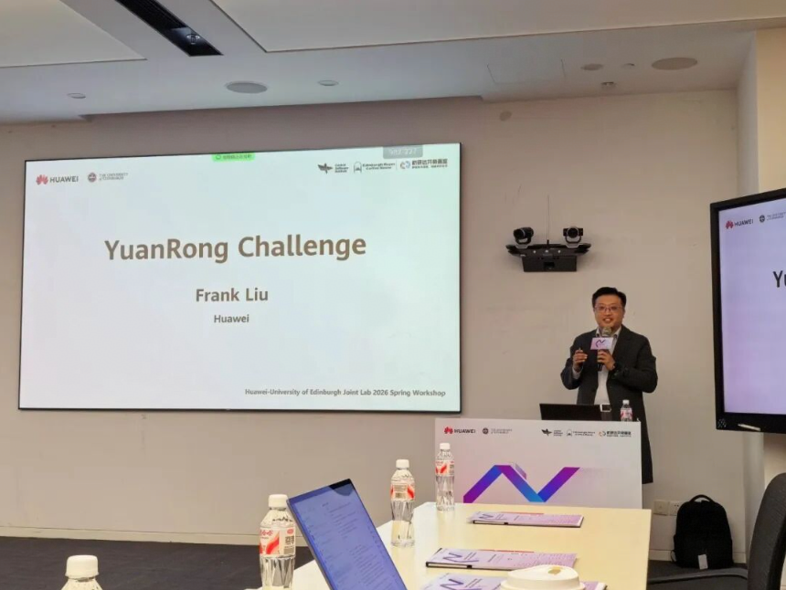
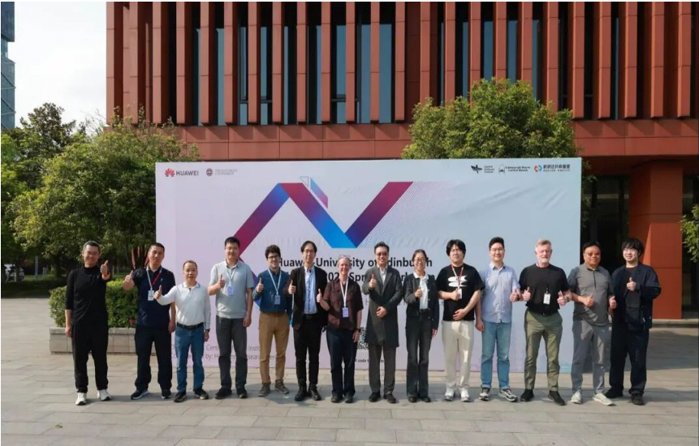

At 14:00 on April 9, the Distributed Computing Forum of the Huawei-University of Edinburgh Joint Lab 2026 Spring Workshop was successfully held. Frank Liu from Huawei’s Parallel Distributed Computing Laboratory shared the latest progress of the open-source project openYuanrong at the forum.

## Latest Progress of openYuanrong

At the end of 2025, openYuanrong was officially open sourced in the OpenAtom openEuler (also known as openEuler) community, marking the project’s transition from Huawei’s internal use to an open ecosystem. In 2026, openYuanrong continued to make breakthroughs in technology implementation and ecosystem construction.

At the workshop, Frank Liu further demonstrated the core achievements of openYuanrong in AI scenarios: foundation model inference instances can be started in seconds, and the access performance of distributed KV cache is improved over 1x. The end-to-end latency of reinforcement learning training and inference task scheduling is reduced by half, and the latency of training and inference parameter synchronization is reduced from minutes to seconds.

### Core Design Concepts

openYuanrong follows the “single-node programming, distributed execution” principle. It is similar to the OS kernel, allowing developers to build distributed applications in the same way as they build single-node applications. openYuanrong supports multiple languages, such as Python, Java, and C++, providing easier distributed development.

### Three Core Components

1.  **Multi-language function runtime**: supports stateless and stateful functions, and implements automatic distributed parallelization with only a few modifications.

2.  **Large-scale distributed scheduling** system: uses a hierarchical scheduling architecture and supports various scheduling policies, such as gang, range, affinity, and topology awareness, to implement elastic scaling and cross-node migration in seconds.

3.  **High-performance distributed shared memory**: provides K/V and stream semantics, and optimizes the memory semantic network based on the multi-level cache mechanism.

## Future Roadmap

openYuanrong will continue to evolve and focus on the following directions:

- Agentic AI/RL: Build a highly reliable and high-performance serverless intelligent agent infrastructure and explore multi-agent reinforcement learning.

- SuperPoD affinity: Leverage new hardware features to optimize scheduling and cache performance. Open-source and co-construction: Welcome global developers to join the community to jointly build a cloud-native future.

\[1\] Official website: <https://docs.openyuanrong.org/en/latest/index.html>

\[2\] Source code address: <https://atomgit.com/openeuler/yuanrong>

\[3\] Technical paper: <https://dl.acm.org/doi/10.1145/3651890.3672216>

\[4\] Feedback: <https://atomgit.com/openeuler/yuanrong/issues>
