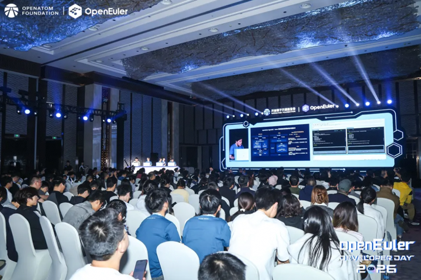
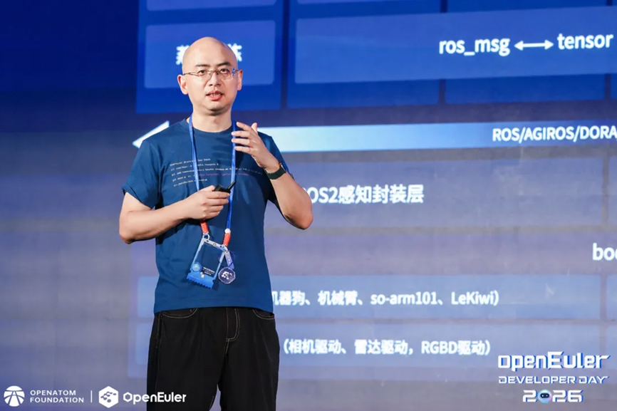
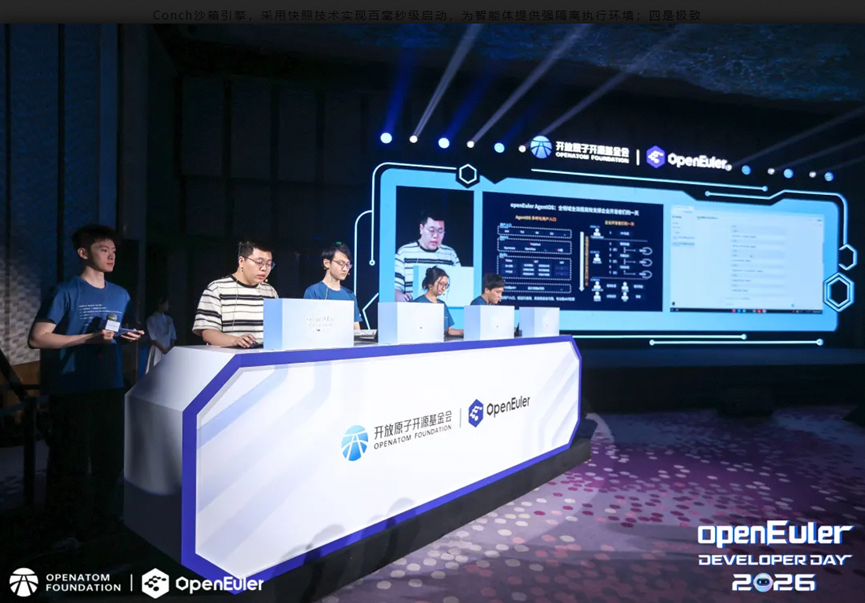

[Changsha, China, April 25, 2026] The openEuler Developer Day 2026, hosted by the OpenAtom openEuler community, successfully convened in Changsha. The event brought together more than 450 community technical experts, developers, contributors, and ecosystem partners. Participants engaged in deep discussions regarding the innovative technological evolution and ecosystem synergy of operating systems facing new demands and scenarios in the AI era.

## Six Years of Extraordinary Growth

Reflecting on six years of rapid development, the openEuler community now boasts over 2,100 corporate members. In 2025, the community welcomed four new corporate contributors: Hygon, AMD, Inspur Cloud, and Digital China. Furthermore, 18 universities have collaborated to establish the Academic & Education Committee. By 2025, cumulative installations of openEuler operating systems exceeded 16 million units, capturing a 57.3% market share in China and solidifying its position as the backbone of China's digital infrastructure.

## Strategic Evolution: From AI-Driven to AgentOS

Looking ahead, openEuler is focusing on two core strategies: AI-enablement and globalization. This includes southbound adaptation for heterogeneous hardware like SuperPoDs and northbound construction of a brand-new agent architecture. Key innovations unveiled include:

 ● openEuler Embedded 26.03: An innovative version featuring the Intelligence BooM incubator, showcasing the IB-Robot full-stack software for embodied intelligence and the EmbodiedClaw out-of-the-box robotic solution.

 ● DevStation Innovative Edition: A developer workstation designed to keep AI software updated and accessible at all times.

 ● AgentOS Evolution: A transition toward a production-grade operating system for the Agent era. It integrates AI technology with system capabilities to provide a secure, efficient, and user-friendly environment, supporting third-party agents like JiuwenClaw.

"By merging AI with core system capabilities, openEuler is evolving into AgentOS—a secure, out-of-the-box, and token-efficient foundation for the next generation of intelligent production."

## Live Demonstrations: The Four Pillars of AgentOS

The event featured live demos highlighting four core capabilities of AgentOS:

 ● Intelligent hub: Supporting multi-modal interactions (Polymind GUI and TUI), it allows rapid integration of professional skill modules with a lightweight memory footprint.

 ● Full-link security: An active defense network built on behavior analysis and eBPF monitoring.

 ● Conch sandbox engine: Utilizing snapshot technology to achieve millisecond-level startup, providing strong isolation for intelligent agents.

 ● Superior token efficiency: Integrated with X-LITE and LMCache, improving Time to First Token (TTFT) and Time Per Output Token (TPOT) by 20%–30%.

 

## Collaborative Technical Roadmap

During the SIG Gathering, over 450 developers from 109 Special Interest Groups (SIGs) discussed eight key technical directions: Kernel & Basic Services, AI Ecosystem & Innovation, SuperPoD Technology, Embodied Intelligence & Embedded, AI-Era Development & Package Management, All-Scenario & Agent Infra, RISC-V, and AI-Enabled Security. These sessions aim to solve technical bottlenecks and accelerate openEuler's application across diverse industries.

Looking ahead, openEuler is committed to bridging the gap between traditional operating systems and the burgeoning AI era. With its strategic evolution toward AgentOS and the continuous refinement of its intelligent ecosystem, the community stands at the threshold of a new frontier. We extend a heartfelt invitation to developers and partners worldwide to join us in this journey. Together, through open collaboration and shared innovation, we will co-build a world-class open-source operating system that powers the intelligent future and benefits every corner of the global digital landscape.
