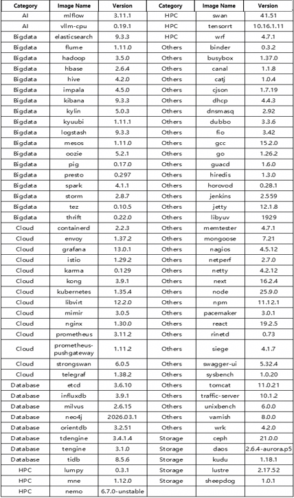

## Overview

In April 2026, the OpenAtom openEuler community (also known as openEuler) continued its steady growth, promoting technological evolution and ecosystem collaboration. As of the end of April, the number of users, developers, and member organizations steadily increased, contributing to the community’s ongoing success.

In terms of operations and ecosystem building, openEuler Developer Day 2026 was successfully held in April, attracting over 450 community technical experts, developers, and ecosystem partners. The event facilitated in-depth discussions on operating system (OS) innovation and AI scenarios, strengthening community consensus and collaboration. Meanwhile, the openYuanrong project appeared at global forums such as QCon, ICLR, and EuroSys, expanding its international influence.

On the technical front, openEuler Embedded 26.03 was officially released, becoming the community’s first out-of-the-box embodied AI OS version. openYuanrong made breakthroughs in large-model inference and distributed KV Cache performance optimization. Intelligent O&M Agent and log analysis capabilities continued to improve, providing efficient and secure software capabilities. The infrastructure SIG also launched a CVE intelligent fixing agent team, significantly shortening the vulnerability fixing cycle.

Overall, the openEuler community is driven by the dual engines of “technology innovation + ecosystem co-construction,” continuously strengthening the open-source OS ecosystem and advancing toward high-quality development.

## Community Scale

As of April 30, 2026, the openEuler community had:

- More than 6.98 million users

- More than 27,000 developers

- 275.4k pull requests (PRs)

- 142.9k issues

- 4901.1k comments

- 2,148 organization members

[openEuler DATASTAT](https://datastat.openeuler.org/en/overview) (as of April 30, 2026)

## Community Events

### openEuler Developer Day 2026 Successfully Held

On April 25, openEuler Developer Day 2026 was successfully held in Changsha. The event was initiated by the openEuler community, with more than 450 community technical experts, developers, contributors, and ecosystem partners gathering to discuss the new requirements, scenarios, and opportunities of OSs in the AI era, and to explore technological innovation, evolution, and ecosystem collaboration.

Beyond a technical event, openEuler Developer Day 2026 is an important milestone in the openEuler community ecosystem. By showcasing the latest technological achievements, sharing industry practices, and promoting community collaboration, the event provides a solid technical foundation and drives innovation for global developers and enterprises. In the future, openEuler will continue to collaborate with developers to build a more open and innovative open-source ecosystem.

### openYuanrong Debuted at the Huawei-University of Edinburgh Joint Lab 2026 Spring Workshop

On April 9, the Distributed Computing Forum of the Huawei-University of Edinburgh Joint Lab 2026 Spring Workshop was successfully held. Frank Liu from Huawei’s Parallel Distributed Computing Laboratory shared the latest progress of the open-source project openYuanrong at the forum.

At the end of 2025, openYuanrong was officially open sourced in the openEuler community, marking the project’s transition from Huawei’s internal use to an open ecosystem. In 2026, openYuanrong continued to make breakthroughs in technology implementation and ecosystem construction.

### Meetup on openEuler AI Era Software Supply Chain Security and O&M Practices Successfully Held in Chengdu

On April 17, the openEuler SBOM & Intelligence SIG Meetup event, jointly hosted by the openEuler community and Beijing Linx Software Co., Ltd. (Linx Software for short), was successfully held at Linx Software’s southwest headquarters in Chengdu. The event focused on strengthening supply chain security and empowering digital and intelligent upgrades. Industry and academic experts gathered to explore how to cope with software supply chain challenges, offering practical insights and technical guidance to build a trustworthy, transparent, and traceable ecosystem.

### openYuanrong Debuted at QCon Global Software Development Conference 2026

On April 18, openYuanrong, an open-source project of the openEuler community, made its debut at the 2026 QCon Global Software Development Conference, held at the Beijing National Convention Center.

At the “AI Native Infrastructure” forum led by Dr. Liang Yi, the openYuanrong architect, Wu Jie, delivered a keynote speech and officially released openYuanrong v0.8.0. This new version is a comprehensive upgrade for Agentic AI scenarios, enhancing support for core capabilities such as agent scheduling, reinforcement learning training-inference collaboration, and inference service caching. The speech also delved into the architectural evolution and key technical practices of openYuanrong in the Agentic AI era.

### openEuler Debuted at the 4th eBPF Developer Conference

On April 18, the 4th eBPF Developer Conference, with the theme of “eBPF + AI: Reshaping System Performance and Security Ecosystem,” was successfully held at Xi’an University of Posts and Telecommunications (XUPT). Technical leaders from renowned enterprises and universities worldwide gathered to discuss the “eBPF + AI” integration and innovation. As a diamond partner, openEuler showcased its core technical achievements, demonstrating its eBPF technical expertise and ecosystem co-building capabilities.

Several openEuler technical experts delivered talks covering scheduling, O&M, and security. All related technology projects are open-sourced in the community.

### openYuanrong Debuted at ICLR (Top AI Academic Conference Worldwide)

From April 23 to 27, openYuanrong made a grand debut at ICLR in Rio de Janeiro, Brazil. The project team set up a dedicated booth and engaged in presentations and “Huawei Night” tech sharing, drawing significant attention from global AI experts.

### Participation of openEuler Embedded SIG in ODD 2026

At the openEuler Developer Day 2026 (ODD 2026) held on April 25, the openEuler Embedded SIG organized a special forum on “Embodied AI & Embedded systems,” focusing on embedded AI, embodied AI, real-time virtualization, aerospace applications, and agent development. This forum showcased the innovation of openEuler Embedded technologies. Topics included satellite digital infrastructure, ZVM real-time OS native virtualization, embodied AI OS exploration, embedded agent automation, and nebula native constellation frameworks, promoting real-time and intelligent convergence and providing a controllable foundation for industrial automation, aerospace, and device intelligence.

Moreover, the openEuler Embedded SIG built an out-of-the-box embodied Claw solution based on IB-Robot, demonstrating robotic arm control capabilities and initiating preliminary co-creation intentions with robot manufacturers such as AGIBOT.

### openEuler Ecosystem Debuted at EuroSys

From April 27 to 30, EuroSys, a top international academic conference for computer systems, was held in Edinburgh, UK. As one of the most influential international academic events in the system software field, EuroSys brings together top scholars and technology enterprises from all over the world to discuss the cutting-edge trends of operating systems and basic software.

openEuler, together with openYuanrong (a distributed serverless computing engine), participated deeply through tutorials, official receptions, and exclusive booths, achieving multi-dimensional ecosystem engagement and expanding influence in Europe.

### Meetup Jointly Held by openEuler and TongTech at China University of Petroleum (East China)

On April 28, openEuler and TongTech jointly held the “Qingzhou & Yunyi: Sailing the Cloud Sea, Soaring to New Heights” meetup in China University of Petroleum (East China). The event focused on cloud-native middleware, data caching technologies, and open-source community practices, fostering technical exchange with students and teachers in universities and cultivating open-source talent.

## Key Technical Progress

### openEuler Embedded 26.03 Officially Released

Based on the openEuler Intelligence BooM open-source stack, openEuler Embedded 26.03 incubated the IB-Robot embodied AI robot software stack. This integration enriches the openEuler ecosystem, marking Embedded 26.03 as the community’s first out-of-the-box embodied AI OS, providing an end-to-end solution from hardware to algorithms to developers and industry partners. In addition, the openEuler Embedded team has launched a series of technical articles on IB-Robot, which will continue to interpret the technical implementation of IB-Robot.

### Intelligent Diagnosis Agent: Ushering in an Intelligent Era for OS Fault Diagnosis

In OS O&M, fault diagnosis is critical for stable service running. However, with growing system scale and hyper-node evolution, traditional diagnosis, relying on human experience, can no longer meet efficiency and large-scale demands.

In this context, the intelligent diagnosis agent emerges. It combines AI and kernel observability, delivering comprehensive automated fault diagnosis for the openEuler ecosystem. This approach fundamentally restructures traditional troubleshooting, ushering in an intelligent era for OS fault diagnosis.

### Quick Start Guide for DeepSeek-V4 on openEuler and vLLM Ascend

On April 24, DeepSeek-V4 was officially released and open sourced with an ultra-long context (millions of tokens). It offers DeepSeek V4-Pro and DeepSeek V4-Flash. The context processing length of the model has been significantly expanded from 128,000 to 1 million, achieving nearly 10-fold capacity improvement. It introduces KV cache sliding window and compression algorithms. This greatly reduces attention computation and memory overhead and better supports agent and coding scenarios through model architecture innovation.

vLLM is an open-source large language model (LLM) inference engine under the PyTorch Foundation, providing users and developers with fast and easy-to-use LLM inference capabilities. vLLM-Ascend provides vLLM support for Ascend. This guide will help you run DeepSeek-V4 on Ascend using openEuler and vLLM Ascend.

### openEuler on RISC-V SIG: Ecosystem Adaptation and Server Platform Progress

On April 25, at the openEuler Developer Day 2026, the RISC-V sub-forum discussed technical progress, ecosystem adaptation, and scenario-specific practice for openEuler on RISC-V.

This sub-forum highlighted the phased achievements of openEuler on RISC-V in system adaptation, kernel capabilities, chip verification, and server scenarios. The topics covered system adaptation and basic capability development of openEuler on the RISC-V architecture, including RVA23 specification adaptation, RISC-V server platform specification adaptation, RVCK kernel maintenance, and hardware boards. Industry partners also shared their progress on openEuler in silicon verification, kernel features, Input-Output Memory Management Unit (IOMMU) or I/O virtualization, standard server platforms, and integrated intelligent computing CPUs.

The openEuler RISC-V SIG plans to further adapt to RISC-V RVA23 and server platform specifications, continue collaborating with community partners to improve the common foundation and expand hardware adaptation for the next-generation RISC-V commercial platforms, and promote the development and implementation of the RISC-V software and hardware ecosystem.

### Intelligent CVE Fixing Agent Team: Multi-Role Collaboration for Automated Vulnerability Fixing

In April, the openEuler infrastructure SIG launched a Common Vulnerabilities and Exposures (CVE) intelligent fixing agent team that breaks down the fixing process into six specialized roles: project manager for overall coordination, architect for solution searching, reviewer for cross-validation, developer for fixing execution, QA for build validation, and O&M engineer for CI monitoring. Each role has a **SKILL.md** file defining responsibilities. The team uses a message-based collaboration mechanism with “build-review” dual verification to improve success rates.

It also features self-optimization. Upon CI build failure, it automatically triggers fixing, analyzes EulerMaker log error patterns, and updates rules, and learns iteratively from historical failures. Currently, full-link automation from CVE issue parsing to PR submission has been achieved in the openEuler community, significantly shortening vulnerability fixing cycles.

Visit [related contribution](https://atomgit.com/openeuler/agent-skills) to view more information.

PRs for CVE fixing are submitted using the **infra_team** account. [QuickIssue](https://quickissue.openeuler.openatom.cn/en/pulls/) allows you to search for **infra_team** and view all the PRs.

If you have any questions about the PRs, please contact infra@openeuler.sh.

## Container Image Updates

Statistical period: April 1–30, 2026

In April, the openEuler community’s public application image library was continuously expanded. As of April 30, 97 upper-layer application images based on openEuler 24.03-LTS-SP3 had been upgraded, including AI, cloud, big data, database, HPC, and other software categories.

## Hardware & Software Compatibility

As of April 30, 2026, 2,655 products have passed the openEuler software and hardware compatibility evaluation, with 52 new products added in April, including 17 products from northbound independent software vendors (ISVs), 33 products from southbound independent hardware vendors (IHVs), and 2 products from operating system vendors (OSVs).

- [Compatibility list](https://www.openeuler.openatom.cn/en/compatibility/)

## Security Bulletin

In April 2026, the community published 334 security notices and patched 72 vulnerabilities (3 critical, 25 high, 44 others).

## Critical Vulnerabilities (Major Impact)

**[CVE-2026-29415](https://www.openeuler.openatom.cn/en/security/cve/detail/?cveId=CVE-2026-29145&packageName=tomcat) (CVSS: 9.1)**

Description: When the soft failure vulnerability is disabled in Apache Tomcat Native, CLIENT_CERT authentication does not fail as expected in some cases. This issue affects Apache Tomcat versions from 11.0.0-M1 to 11.0.18, from 10.1.0-M7 to 10.1.52, and from 9.0.83 to 9.0.115, and Apache Tomcat Native versions from 1.1.23 to 1.1.34, from 1.2.0 to 1.2.39, from 1.3.0 to 1.3.6, and from 2.0.0 to 2.0.13. Users are advised to upgrade to Tomcat Native 1.3.7 or 2.0.14, and Tomcat 11.0.20, 10.1.53, and 9.0.116.

**Affected releases**:

- openEuler-20.03-LTS-SP4

- openEuler-22.03-LTS-SP4

- openEuler-24.03-LTS

- openEuler-24.03-LTS-SP1

- openEuler-24.03-LTS-SP2

- openEuler-24.03-LTS-SP3

**[CVE-2026-33186](https://www.openeuler.openatom.cn/en/security/cve/detail/?cveId=CVE-2026-33186&packageName=kata-containers-go) (CVSS: 9.1)**

Description: Attackers can use this vulnerability to send the raw HTTP/2 frame with the malformed **:path** header directly to the gRPC server. The fix in version 1.79.3 ensures that any request with a **:path** header that does not start with a leading slash is immediately rejected, and a **codes.UnExecuted** error is returned. This prevents such requests from reaching the authorization interceptors or handlers with a non-canonical path string. While upgrading is the most secure and recommended method, users can mitigate the vulnerability using one of the following methods: validating interceptors (recommended for mitigation); infrastructure-level normalization; and/or policy hardening.

**Affected releases**:

- openEuler-20.03-LTS-SP4

- openEuler-22.03-LTS-SP4

- openEuler-24.03-LTS

- openEuler-24.03-LTS-SP1

- openEuler-24.03-LTS-SP2

- openEuler-24.03-LTS-SP3

**[CVE-2026-34743](https://www.openeuler.openatom.cn/en/security/cve/detail/?cveId=CVE-2026-34743&packageName=xz) (CVSS: 9.8)**

Description: XZ Utils provides a general-purpose data-compression library and command-line tools. Before version 5.8.3, if **lzma_index_decoder()** was used to decode an index containing no records, the generated **lzma_index** would be in a state where subsequent calls to **lzma_index_append()** would allocate insufficient memory, leading to a buffer overflow. This issue has been fixed in version 5.8.3.

**Affected releases**:

- openEuler-20.03-LTS-SP4

- openEuler-22.03-LTS-SP4

- openEuler-24.03-LTS

- openEuler-24.03-LTS-SP1

- openEuler-24.03-LTS-SP2

- openEuler-24.03-LTS-SP3

## Vulnerability Protection

The openEuler community regularly fixes vulnerabilities in maintained versions and releases security patches. Users are advised to pay attention to the security advisories on the openEuler official website and install the patches in a timely manner to protect against vulnerabilities.

More information: [OpenEuler Security Advisories](https://www.openeuler.openatom.cn/en/security/security-bulletins/)

## Thank You for Your Support

We extend a warm invitation to all open-source enthusiasts to join the openEuler community. Whether you are passionate about contributing code, sharing your expertise, or simply engaging in insightful discussions, there is a place for you within our community.

Stay connected with us or check our project repositories for regular updates to stay abreast of the latest developments and breakthroughs.

To suggest an addition or share feedback on the monthly bulletin, contact <contact@openeuler.io>.
