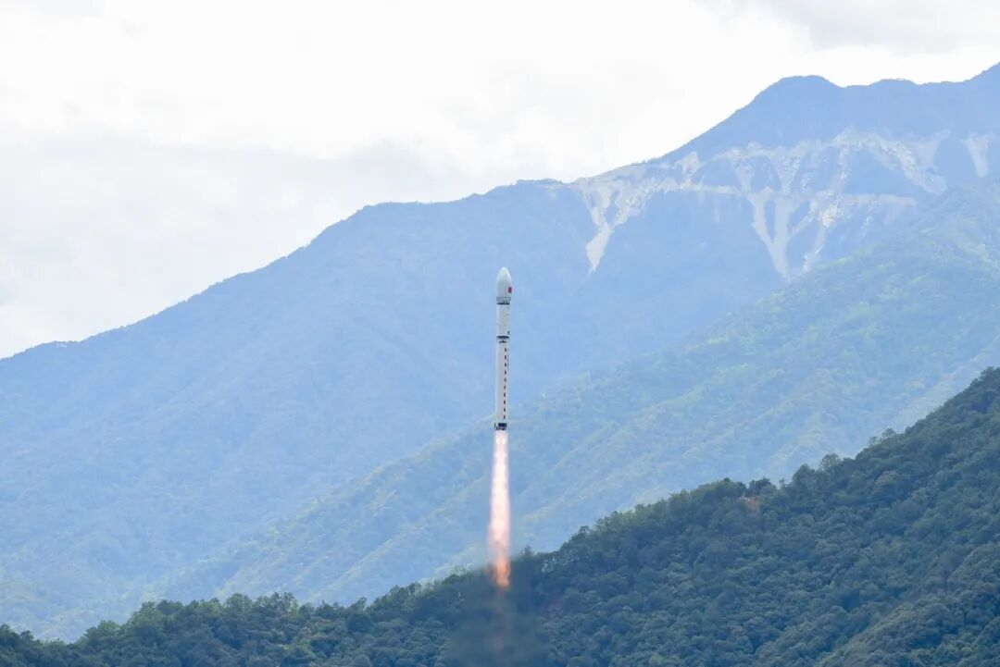
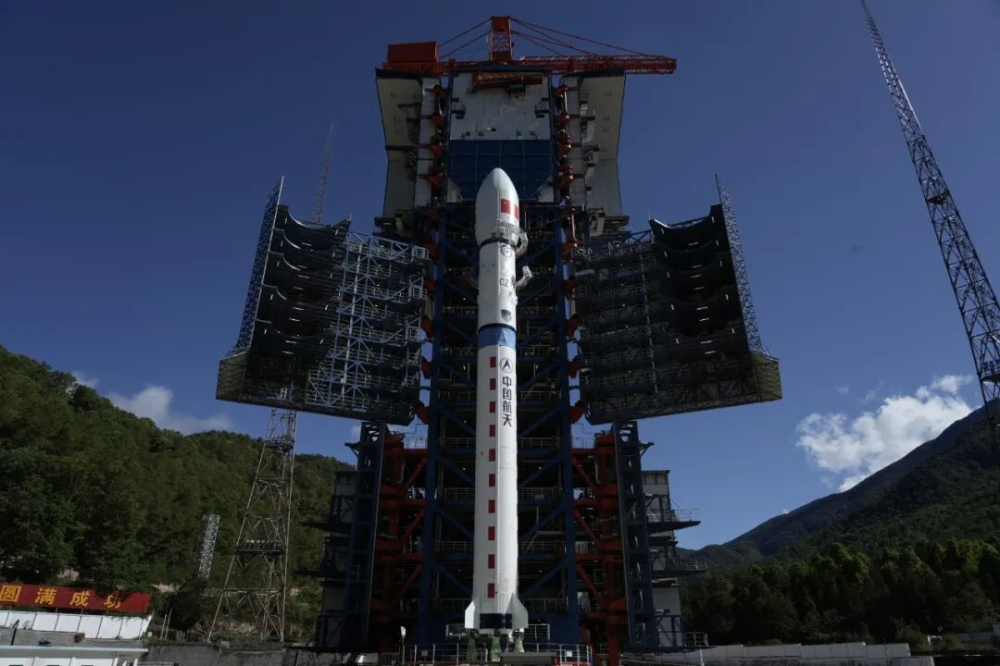

Recently, an openEuler-based space-grade embedded OS was successfully deployed on an experimental satellite and has been operating stably in orbit.

This marks the first in-orbit deployment of an openEuler-based embedded OS in a commercial satellite payload application. The milestone demonstrates the growing maturity of the openEuler ecosystem in supporting highly reliable and real-time space applications, opening new possibilities for open-source innovation in space computing.

## Designed for Space-Grade Reliability

Space environments present unique challenges, including radiation exposure, extreme temperature variations, and limited onboard computing resources. To support long-term and stable satellite operations, onboard OSs must meet demanding requirements for real-time performance, security, reliability, and lightweight deployment.

The openEuler-based space-grade embedded OS addresses these requirements with a set of capabilities designed for challenging space applications.

### Microsecond-Level Response for Real-Time Operations

The system adopts the openEuler mixed-criticality (MICA) deployment framework with a dedicated hard real-time kernel, enabling the separation of real-time and non-real-time workloads.

With task switching and interrupt response times below 15 μs, the system meets the strict timing requirements of satellite attitude control, payload data processing, and onboard management, supporting precise and responsive space operations.

### End-to-End Security for Onboard Data

The system integrates multiple security mechanisms, including kernel and user-space memory isolation, kernel stack overflow protection, and kernel address space layout randomization (KASLR), enhancing the security and reliability of onboard software.

It also supports real-time anomaly collection and ground-based reporting, enabling space-to-ground security monitoring. An onboard data recording capability helps capture system operation information for fault analysis and troubleshooting.

### Reliable Operation in Harsh Space Environments

Through kernel partitioning and protection mechanisms against single-event upsets (SEUs), the system improves resilience against radiation-induced faults in space environments.

Its lightweight design balances resource efficiency and system stability, supporting reliable operation under wide temperature ranges and demanding conditions.

### Flexible Adaptation and On-Orbit Maintenance

The system supports multiple chip platforms, including HiSilicon, Phytium, and Rockchip, enabling deployment across diverse satellite payload scenarios.

With board support packages (BSPs) and telemetry/telecommand components, it supports application installation, updates, removal, and status monitoring while satellites remain in orbit, improving operational flexibility throughout the mission lifecycle.

## Advancing Open-Source Space Computing

The successful deployment of the openEuler-based embedded OS demonstrates how open-source technologies can support the development of reliable software systems for space applications.

### Building a Resilient and Sustainable Software Foundation for Space Applications

Space applications require software systems that can deliver long-term reliability, security, and continuous evolution throughout their lifecycle.

By extending open-source technologies into satellite applications, openEuler helps drive innovation across the onboard software stack and provides a resilient and sustainable foundation for future space computing scenarios.

### Accelerating Space Innovation Through Open Ecosystems

Supported by the global openEuler ecosystem, which spans 178 countries and regions and includes 23k contributors, openEuler provides an open platform for sharing technologies and adaptation capabilities.

A unified software stack helps improve compatibility across different satellite payloads, reduce development barriers, and support more efficient deployment of commercial satellite systems.

### Expanding Space Intelligence Scenarios

The successful deployment lays the foundation for an integrated space-air-ground-edge computing ecosystem, enabling future scenarios such as satellite constellations, onboard AI processing, intelligent scheduling, and space-edge collaboration.

### Strengthening Collaborative Innovation

The deployment reflects collaboration among the openEuler community, research institutions, and industry partners.

Through joint innovation across different domains, this effort demonstrates how open-source collaboration can contribute to the development of software technologies for specialized and demanding application scenarios.

## Continuing to Explore the Future of Space Computing

Moving forward, the openEuler community and its partners will continue advancing space computing through technology innovation, ecosystem development, and application exploration.

**Advancing Space-Oriented Technologies**

Through the openEuler Space SIG and collaboration with research institutions and industry partners, the community will continue exploring technologies such as onboard AI support, distributed task scheduling, and intelligent routing across satellite networks.

**Growing the Space Computing Ecosystem**

The ecosystem will also expand collaboration across chips, servers, payload systems, and applications, providing more resources for space-oriented software development, including satellite applications, AI algorithms, and protocol middleware.

**Expanding Space Computing Applications**

From commercial satellites to deep-space exploration, low-altitude applications, and satellite internet, openEuler-based embedded OSs will continue exploring broader space computing scenarios and contributing to the growth of open-source innovation beyond Earth.
